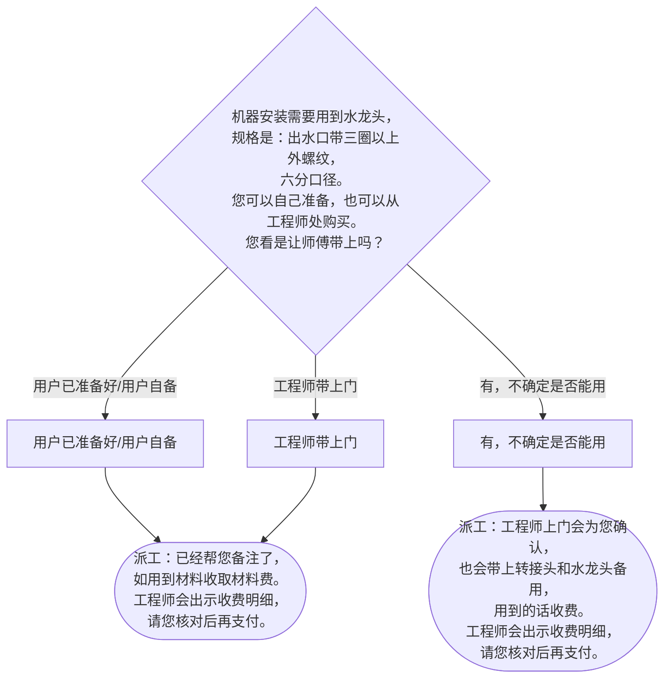

# BSH 洗衣机（含洗干一体机） — 安装引导手册

## 一、文档使用说明

### 执行铁律

1. **严格按步骤顺序执行**，不得跳步、不得自行推断用户未说明的情况
2. **话术原文朗读**，不得改写、不得省略、不得自行补充内容
3. **每步执行前对照 Mermaid 边验证**，确保路径正确

### 执行约定标记

| 标记 | 含义 |
|------|------|
| `【话术】` | 逐字朗读给用户 |
| `【判断】` | 根据用户回答进入分支 |
| `【派工】` | 安排工程师上门 |
| `【备注模板】` | 派工时必须带入系统的申请备注 |
| `【材料确认】` | 确认是否需要工程师带材料 |
| `【提醒】` | 内部信息，不对用户播报 |
| `▶` | 无条件进入下一步 |

---

## 二、安装引导导航树

### Mermaid 源码



### 步骤 ↔ 节点速查表

| 引导步骤 | Mermaid 节点 | 步骤类型 | 预期下一节点 |
|---------|-------------|---------|------------|
| I01 | `WM_01` | 判断（材料确认） | `WM_02` / `WM_03` / `WM_04` |
| I01A | `WM_02` → `WM_05` | 派工 | 结束 |
| I01B | `WM_03` → `WM_06` | 派工 | 结束 |
| I01C | `WM_04` → `WM_05` | 派工 | 结束 |

---

## 三、越界处理协议

### 触发条件

1. 用户产品不是洗衣机/洗干一体机（如壁挂式 → I02）
2. 用户回答无法映射到"已准备好/不确定/工程师带"三个分支
3. 用户询问非安装问题（维修、退换、保修政策）
4. 用户情绪激烈/要求投诉
5. 用户描述属于其他产品安装

### 退出动作

- 属于壁挂式洗衣机 → `【引用】→ BSH_INST_I02_壁挂洗衣机.md`
- 属于其他产品 → 返回索引文件重新分流
- 无法定位 → 转人工客服

### 严禁行为

- 禁止自行报价（水龙头价格仅在用户追问时告知，且参照【提醒】内容）
- 禁止自行编造备注内容
- 禁止跳过材料确认直接派工

---

## 四、引导入口

用户来电表示洗衣机（含洗干一体机）需要安装 → 直接进入 **I01**。

无需额外入口分流（洗衣机安装流程单一入口）。

---

## 五、引导步骤详情

### I01 — 水龙头材料确认

`[节点：WM_01]`

【话术】
> 机器安装需要用到水龙头，规格是：出水口带三圈以上外螺纹，六分口径。您可以自己准备，也可以从工程师处购买。您看是让师傅带上吗？

【判断】

| 条件 | 下一步 | 出口类型 | Mermaid 边验证 |
|------|--------|---------|--------------|
| 用户已准备好 / 用户自备 | → **I01A** 派工 | 派工 | `WM_01 --用户已准备好/用户自备--> WM_02` ✓ |
| 有，不确定是否能用 | → **I01B** 派工 | 派工 | `WM_01 --有，不确定是否能用--> WM_03` ✓ |
| 工程师带上门 | → **I01C** 派工 | 派工 | `WM_01 --工程师带上门--> WM_04` ✓ |
| 其他无法识别 | →【越界退出】 | 越界 | 无对应边 |

---

### I01A — 派工（用户自备水龙头）

`[节点：WM_02 → WM_05]`

【话术】
> 已经帮您备注了，如用到材料收取材料费。工程师会出示收费明细，请您核对后再支付。

【派工】 → 结束

【备注模板】选用：
- `洗衣机安装，带三种水龙头备用；`（通用）

---

### I01B — 派工（水龙头不确定是否能用）

`[节点：WM_03 → WM_06]`

【话术】
> 工程师上门会为您确认，也会带上转接头和水龙头备用，用到的话收费。工程师会出示收费明细，请您核对后再支付。

【派工】 → 结束

【备注模板】选用：
- `洗衣机安装，带三种水龙头备用；`

---

### I01C — 水龙头规格确认（工程师带上门）

`[节点：WM_04]`

【提醒】无需主动向用户提供具体价格。仅当用户追问时告知："有205元、150元和79元三种水龙头，最高不超过205元，您可以根据装修风格来选。"

【话术】
> 好的，我让工程师带上水龙头备用。请问您还需要加长进水管或排水管吗？

（话术待补充——原始 PDF 未提供此追问话术，以上为推荐表述，实际执行以业务确认版本为准）

【判断】

| 条件 | 下一步 | 出口类型 |
|------|--------|---------|
| 不需要加长管 | → **I01C-1** 派工（仅水龙头） | 派工 |
| 需要加长进水管（确认米数） | → **I01C-2** 派工（水龙头+加长管） | 派工 |
| 需要加长进水管+排水管 | → **I01C-2** 派工（水龙头+加长管） | 派工 |
| 用户有4转6转接头需求 | → **I01C-3** 派工（含转接头） | 派工 |
| 其他无法识别 | →【越界退出】 | 越界 |

---

#### I01C-1 — 派工（仅水龙头）

【话术】
> 已经帮您备注了，如用到材料收取材料费。工程师会出示收费明细，请您核对后再支付。

【派工】 → 结束

【备注模板】选用（根据用户选定的价位）：
- `洗衣机安装，带79水龙头；`
- `洗衣机安装，带150水龙头；`
- `洗衣机安装，带205水龙头；`

---

#### I01C-2 — 派工（水龙头 + 加长管）

【话术】
> 已经帮您备注了，如用到材料收取材料费。工程师会出示收费明细，请您核对后再支付。

【派工】 → 结束

【备注模板】选用（x 替换为用户告知的米数）：
- `洗衣机安装，带79水龙头，加长进水管x米，加长排水管；`
- `洗衣机安装，带150水龙头，加长进水管x米，加长排水管；`
- `洗衣机安装，带205水龙头，加长进水管x米，加长排水管；`

---

#### I01C-3 — 派工（含4转6转接头）

【话术】
> 已经帮您备注了，如用到材料收取材料费。工程师会出示收费明细，请您核对后再支付。

【派工】 → 结束

【备注模板】：
- `洗衣机安装，带水龙头，4转6金属转接头，加长进水管x米，加长排水管；`

---

## 附录 A：申请备注模板汇总

| 场景 | 备注模板 |
|------|---------|
| 通用/自备/不确定 | 洗衣机安装，带三种水龙头备用； |
| 带79水龙头 | 洗衣机安装，带79水龙头； |
| 带150水龙头 | 洗衣机安装，带150水龙头； |
| 带205水龙头 | 洗衣机安装，带205水龙头； |
| 79+加长管 | 洗衣机安装，带79水龙头，加长进水管x米，加长排水管； |
| 150+加长管 | 洗衣机安装，带150水龙头，加长进水管x米，加长排水管； |
| 205+加长管 | 洗衣机安装，带205水龙头，加长进水管x米，加长排水管； |
| 4转6+加长管 | 洗衣机安装，带水龙头，4转6金属转接头，加长进水管x米，加长排水管； |

---

## 附录 B：材料费用与短信口径汇总

| 材料 | 规格说明 | 价格 |
|------|---------|------|
| 水龙头 | 出水口带三圈以上外螺纹，六分口径 | 79元 / 150元 / 205元 |
| 加长进水管 | 按米计 | （工程师现场报价） |
| 加长排水管 | — | （工程师现场报价） |
| 4转6金属转接头 | — | （工程师现场报价） |

---

## ASCII 路径图

```
I01 水龙头材料确认
 ├─ 用户已准备好/自备 → I01A【派工】备注：带三种水龙头备用
 ├─ 有，不确定能否用 → I01B【派工】备注：带三种水龙头备用
 └─ 工程师带上门 → I01C 追问加长管需求
     ├─ 不需要加长管 → I01C-1【派工】备注：带XX水龙头
     ├─ 需要加长管 → I01C-2【派工】备注：带XX水龙头+加长管x米
     └─ 需要4转6转接头 → I01C-3【派工】备注：带水龙头+转接头+加长管
```
