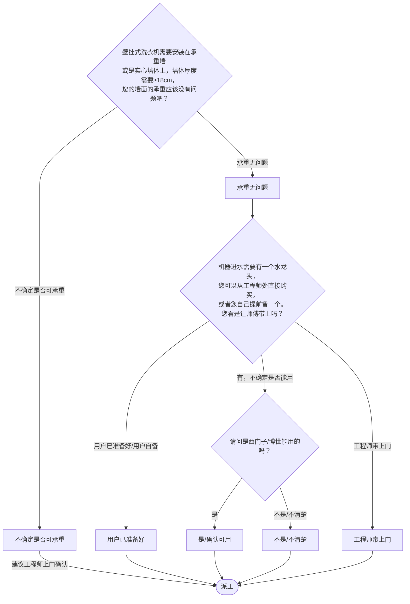

# BSH 壁挂式洗衣机 — 安装引导手册

## 一、文档使用说明

### 执行铁律

1. **严格按步骤顺序执行**，不得跳步、不得自行推断用户未说明的情况
2. **话术原文朗读**，不得改写、不得省略、不得自行补充内容
3. **每步执行前对照 Mermaid 边验证**，确保路径正确

### 执行约定标记

| 标记 | 含义 |
|------|------|
| `【话术】` | 逐字朗读给用户 |
| `【判断】` | 根据用户回答进入分支 |
| `【派工】` | 安排工程师上门 |
| `【备注模板】` | 派工时必须带入系统的申请备注 |
| `【材料确认】` | 确认是否需要工程师带材料 |
| `【提醒】` | 内部信息，不对用户播报 |
| `【发短信】` | 调用阿里云短信接口（品牌→SMS_CODE） |
| `▶` | 无条件进入下一步 |

---

## 二、安装引导导航树

### Mermaid 源码



### 步骤 ↔ 节点速查表

| 引导步骤 | Mermaid 节点 | 步骤类型 | 预期下一节点 |
|---------|-------------|---------|------------|
| I01 | `WWM_01` | 判断（承重墙） | `WWM_02` / `WWM_03` |
| I02 | `WWM_04` | 判断（水龙头） | `WWM_05` / `WWM_06` / `WWM_09` |
| I02A | `WWM_06` | 判断（规格确认） | `WWM_07` / `WWM_08` |

---

## 三、越界处理协议

### 触发条件

1. 用户产品不是壁挂式洗衣机（普通洗衣机 → I01）
2. 用户回答无法映射到当前步骤的任何条件行
3. 用户询问非安装问题（维修、退换、保修）
4. 用户情绪激烈/要求投诉
5. 用户描述属于其他产品安装

### 退出动作

- 属于普通洗衣机 → `【引用】→ BSH_INST_I01_洗衣机.md`
- 属于其他产品 → 返回索引文件重新分流
- 无法定位 → 转人工客服

### 严禁行为

- 禁止自行判断墙体是否承重（由用户确认或工程师上门确认）
- 禁止自行报价（水龙头价格仅在用户追问时告知）
- 禁止跳过承重墙确认

---

## 四、引导入口

用户来电表示壁挂式洗衣机需要安装 → 进入 **I01**。

---

## 五、引导步骤详情

### I01 — 承重墙确认

`[节点：WWM_01]`

【话术】
> 壁挂式洗衣机需要安装在承重墙或是实心墙体上，墙体厚度需要≥18cm，您的墙面的承重应该没有问题吧？

【提醒】特殊墙体无法安装：如保温层墙、大空心砖墙；墙体表面有玻璃、石膏板、木板、凹凸不平的装饰面、保温层材质面、外层大理石、石材空挂面、钢板墙等。

【判断】

| 条件 | 下一步 | 出口类型 | Mermaid 边验证 |
|------|--------|---------|--------------|
| 承重无问题 | → **I02**（水龙头确认） | 继续引导 | `WWM_01 --承重无问题--> WWM_02` ✓ |
| 不确定是否可承重 | → 派工（建议工程师上门确认） | 派工 | `WWM_01 --不确定是否可承重--> WWM_03` ✓ |
| 其他无法识别 | →【越界退出】 | 越界 | 无对应边 |

**分支 — 不确定承重**：

【话术】
> 我为您安排工程师上门。

【派工】 → 结束

---

### I02 — 水龙头材料确认

`[节点：WWM_04]`

【话术】
> 机器进水需要有一个水龙头，您可以从工程师处直接购买，或者您自己提前备一个。您看是让师傅带上吗？

【提醒】水龙头的规格：出水口带三圈以上外螺纹，四分或者六分口径（包装内配有4转2和6转2的转接头，进水管为2分的PE管）。

【判断】

| 条件 | 下一步 | 出口类型 | Mermaid 边验证 |
|------|--------|---------|--------------|
| 用户已准备好 / 用户自备 | → **I02A**（规格确认） | 继续引导 | `WWM_04 --用户已准备好/用户自备--> WWM_05` ✓ |
| 有，不确定是否能用 | → **I02A**（规格确认） | 继续引导 | `WWM_04 --有，不确定是否能用--> WWM_06` ✓ |
| 工程师带上门 | → 派工 | 派工 | `WWM_04 --工程师带上门--> WWM_09` ✓ |
| 其他无法识别 | →【越界退出】 | 越界 | 无对应边 |

**分支 — 用户已准备好**：

【话术】
> 好的，您准备一个西门子/博世能用的就可以了。（也可以这样说：您准备一个规格是出水口带三圈以上外螺纹六分口径的就可以了。）

【派工】 → 结束

**分支 — 工程师带上门**：

【话术】
> 已经帮您备注了，如用到材料收取材料费。工程师会出示收费明细，请您核对后再支付。

【派工】 → 结束

---

### I02A — 水龙头规格确认（用户有但不确定）

`[节点：WWM_06]`

【话术】
> 请问是西门子/博世能用的吗？（也可以这样问：请问规格是出水口带三圈以上外螺纹六分口径的吗？）

【判断】

| 条件 | 下一步 | 出口类型 | Mermaid 边验证 |
|------|--------|---------|--------------|
| 是 / 确认可用 | → 派工 | 派工 | `WWM_06 --是--> WWM_07` ✓ |
| 不是 / 不清楚 | → 派工（工程师带备用） | 派工 | `WWM_06 --不是/不清楚--> WWM_08` ✓ |
| 其他无法识别 | →【越界退出】 | 越界 | 无对应边 |

**分支 — 是**：

【话术】
> 好的，您准备一个西门子/博世能用的就可以了。

【派工】 → 结束

**分支 — 不是/不清楚**：

【话术】
> 建议您从工程师处购买原厂配件，品质更有保障。我们让工程师带水龙头备用，用到的话您支付材料费即可。工程师会出示收费明细，请您核对后支付。

【派工】 → 结束

---

### 【发短信】

| 品牌 | SMS_CODE | 短信内容摘要 |
|------|----------|-------------|
| 西门子 | 49 | 水龙头相关信息 |
| 博世 | 50 | 水龙头相关信息 |

---

## 附录 A：申请备注模板汇总

| 场景 | 备注模板 |
|------|---------|
| 通用/带三种水龙头备用 | `壁挂式洗衣机安装，带三种水龙头备用；` |
| 带79水龙头 | `壁挂式洗衣机安装，带79水龙头；` |
| 带150水龙头 | `壁挂式洗衣机安装，带150水龙头；` |
| 带205水龙头 | `壁挂式洗衣机安装，带205水龙头；` |
| 79+加长管 | `壁挂式洗衣机安装，带79水龙头，加长进水管x米，加长排水管；` |
| 150+加长管 | `壁挂式洗衣机安装，带150水龙头，加长进水管x米，加长排水管；` |
| 205+加长管 | `壁挂式洗衣机安装，带205水龙头，加长进水管x米，加长排水管；` |
| 水龙头+加长管 | `壁挂式洗衣机安装，带水龙头，加长进水管x米，加长排水管；` |

---

## 附录 B：材料费用与短信接口汇总

| 材料 | 规格说明 | 价格 |
|------|---------|------|
| 水龙头 | 出水口带三圈以上外螺纹，四分或六分口径 | 79元 / 150元 / 205元 |
| 加长进水管 | 按米计 | （工程师现场报价） |
| 加长排水管 | — | （工程师现场报价） |

### 短信接口

| 品牌 | SMS_CODE | 短信内容摘要 |
|------|----------|-------------|
| 西门子 | 49 | 水龙头信息 |
| 博世 | 50 | 水龙头信息 |

【提醒】备注：无需主动向用户提供具体价格，如果追问我司水龙头价格的，请告知用户："有205元、150元和79元三种水龙头，最高不超过205元，您可以根据装修风格来选。"

---

## ASCII 路径图

```
I01 承重墙确认
 ├─ 承重无问题 → I02 水龙头材料确认
 │   ├─ 用户已准备好 →【派工】
 │   ├─ 有，不确定能否用 → I02A 规格确认
 │   │   ├─ 是/可用 →【派工】
 │   │   └─ 不是/不清楚 →【派工】带水龙头备用
 │   └─ 工程师带上门 →【派工】
 └─ 不确定是否可承重 →【派工】工程师上门确认
```
