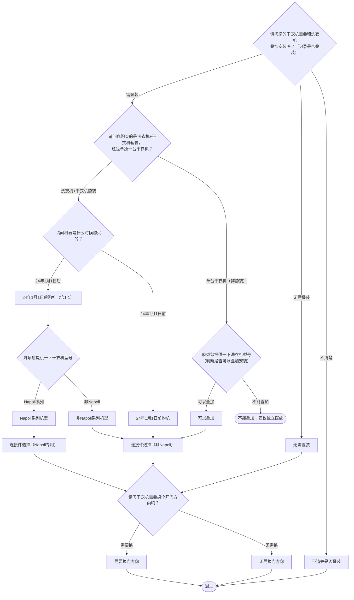

# BSH 烘干机 — 安装引导手册

## 一、文档使用说明

### 执行铁律

1. **严格按步骤顺序执行**，不得跳步、不得自行推断用户未说明的情况
2. **话术原文朗读**，不得改写、不得省略、不得自行补充内容
3. **每步执行前对照 Mermaid 边验证**，确保路径正确

### 执行约定标记

| 标记 | 含义 |
|------|------|
| `【话术】` | 逐字朗读给用户 |
| `【判断】` | 根据用户回答进入分支 |
| `【派工】` | 安排工程师上门 |
| `【备注模板】` | 派工时必须带入系统的申请备注 |
| `【材料确认】` | 确认是否需要工程师带材料 |
| `【提醒】` | 内部信息，不对用户播报 |
| `【发短信】` | 调用阿里云短信接口（品牌→SMS_CODE） |
| `【引用】` | 跨文件跳转 |
| `▶` | 无条件进入下一步 |

---

## 二、安装引导导航树

### Mermaid 源码



### 步骤 ↔ 节点速查表

| 引导步骤 | Mermaid 节点 | 步骤类型 | 预期下一节点 |
|---------|-------------|---------|------------|
| I01 | `DRY_01` | 判断 | `DRY_02` / `DRY_03` / `DRY_18` |
| I02 | `DRY_02` | 判断 | `DRY_04` / `DRY_15` |
| I03 | `DRY_04` | 判断 | `DRY_05`→`DRY_07` / `DRY_06`→`DRY_10` |
| I04 | `DRY_07` | 判断 | `DRY_08`→`DRY_11` / `DRY_09`→`DRY_10` |
| I05 | `DRY_15` | 判断（型号确认） | `DRY_16`→`DRY_10` / `DRY_17` |
| I06 | `DRY_10` / `DRY_11` | 材料确认（连接件） | `DRY_12` |
| I07 | `DRY_12` | 判断（换门方向） | `DRY_13` / `DRY_14` → 派工 |

---

## 三、越界处理协议

### 触发条件

1. 用户产品不是烘干机/干衣机
2. 用户回答无法映射到当前步骤的任何条件行
3. 用户询问非安装问题（维修、退换、保修）
4. 用户情绪激烈/要求投诉
5. 用户描述属于其他产品安装
6. 型号判断无法确认时需向用户或知识老师确认

### 退出动作

- 属于其他产品 → 返回索引文件重新分流
- 无法定位 → 转人工客服

### 严禁行为

- 禁止未确认型号就判断是否可叠加
- 禁止自行编造连接件型号或价格
- 禁止跳过叠装判断直接派工

### 覆盖范围

本文档覆盖烘干机安装的所有场景：叠装/不叠装/不确定、套装/非套装、Napoli/非Napoli、换门/不换门。

---

## 四、引导入口

用户来电表示烘干机/干衣机需要安装 → 进入 **I01**。

---

## 五、引导步骤详情

### I01 — 是否叠加安装

`[节点：DRY_01]`

【话术】
> 您的干衣机需要和洗衣机叠加安装吗？

（记录是否叠装）

【判断】

| 条件 | 下一步 | 出口类型 | Mermaid 边验证 |
|------|--------|---------|--------------|
| 需叠装 | → **I02** | 继续引导 | `DRY_01 --需叠装--> DRY_02` ✓ |
| 无需叠装 | → **I07**（换门方向） | 继续引导 | `DRY_01 --无需叠装--> DRY_03` ✓ |
| 不清楚 | → **I01X** 不确定处理 | 派工 | `DRY_01 --不清楚--> DRY_18` ✓ |
| 其他无法识别 | →【越界退出】 | 越界 | 无对应边 |

---

### I01X — 不确定是否叠装

`[节点：DRY_18]`

【话术】
> 建议您提前确定是否叠加，我们好通知技术员提前备配件（连接件）。如果您不确定的话，到时候可能没法一次给您安装好。

【判断】

| 条件 | 下一步 | 出口类型 | Mermaid 边验证 |
|------|--------|---------|--------------|
| 用户确认叠装 | → **I02** | 继续引导 | — |
| 仍不清楚 | → 派工 | 派工 | `DRY_18 --> DRY_19` ✓ |

【话术】（仍不清楚时）
> 我只能通知技术员看能否带上配件备用，稍后我会给您的手机发一条干衣机安装方式及连接件的短信，您可以点击链接了解一下。到时候技术员联系您的时候，您也可以跟他说明。

【发短信】

| 品牌 | SMS_CODE | 短信内容摘要 |
|------|----------|-------------|
| 西门子 | 339 | 干衣机安装方式及连接件信息 |
| 博世 | 340 | 干衣机安装方式及连接件信息 |

【派工】

---

### I02 — 套装还是单台

`[节点：DRY_02]`

【话术】
> 请问您购买的是洗衣机+干衣机套装，还是单独一台干衣机？

【判断】

| 条件 | 下一步 | 出口类型 | Mermaid 边验证 |
|------|--------|---------|--------------|
| 洗衣机+干衣机（套装） | → **I03** | 继续引导 | `DRY_02 --洗衣机+干衣机套装--> DRY_04` ✓ |
| 单台干衣机（非套装） | → **I05** | 继续引导 | `DRY_02 --单台干衣机--> DRY_15` ✓ |
| 其他无法识别 | →【越界退出】 | 越界 | 无对应边 |

---

### I03 — 购机时间确认（套装路径）

`[节点：DRY_04]`

【话术】
> 请问机器是什么时候购买的？

【判断】

| 条件 | 下一步 | 出口类型 | Mermaid 边验证 |
|------|--------|---------|--------------|
| 24年1月1日后购机（含1.1） | → **I04**（确认型号） | 继续引导 | `DRY_04 --24年1月1日后--> DRY_05` ✓ |
| 24年1月1日前购机 | → **I06**（连接件选择-非Napoli） | 继续引导 | `DRY_04 --24年1月1日前--> DRY_06` ✓ |
| 其他无法识别 | →【越界退出】 | 越界 | 无对应边 |

【提醒】
- **线下门店**：购买套装有赠送连接件的活动，请用户准备电子券或购机凭证。
- **非Napoli**：不过送的连接件是基础款不带抽拉板的，加270元可升级成带抽拉板的。
- **其他授权店铺购机**：请告知购买套装有赠送连接件的活动，请用户准备购机凭证，工程师会根据购机凭证判断是否赠送。不过送的连接件是基础款不带抽拉板的，加270元可升级成带抽拉板的。

---

### I04 — 干衣机型号确认（24年后购机）

`[节点：DRY_07]`

【话术】
> 麻烦您提供一下干衣机型号。

（记录干衣机型号）

【判断】

| 条件 | 下一步 | 出口类型 | Mermaid 边验证 |
|------|--------|---------|--------------|
| Napoli系列机型 | → **I06B**（Napoli连接件） | 继续引导 | `DRY_07 --Napoli系列--> DRY_08` ✓ |
| 非Napoli系列机型 | → **I06A**（普通连接件） | 继续引导 | `DRY_07 --非Napoli--> DRY_09` ✓ |
| 其他无法识别 | →【越界退出】 | 越界 | 无对应边 |

【提醒】Napoli系列型号清单：WQ55M7U80W、WQ55M7U10W、WQ55M7U20W、WQ52F7U20W、WQM755U60W、WQM755U20W、WQM755U50W、WQM755U00W、WQF752U20W

---

### I05 — 洗衣机型号确认（非套装路径）

`[节点：DRY_15]`

【话术】
> 麻烦您提供一下洗衣机型号，我为您确认下是否满足叠装。

（判断是否可以叠加安装。参照叠加条件附录）

【判断】

| 条件 | 下一步 | 出口类型 | Mermaid 边验证 |
|------|--------|---------|--------------|
| 可以叠加 | → **I06A**（连接件选择） | 继续引导 | `DRY_15 --可以叠加--> DRY_16` ✓ |
| 不能叠加 | → 结束（建议独立摆放） | 结束 | `DRY_15 --不能叠加--> DRY_17` ✓ |
| 其他无法识别 | →【越界退出】 | 越界 | 无对应边 |

【话术】（不能叠加时）
> 抱歉，机器无法进行叠加安装，建议您将干衣机独立摆放。

---

### I06A — 连接件选择（非Napoli）

`[节点：DRY_10]`

【话术】
> 叠加安装需要使用连接件，连接件有两种，带抽拉板的519元，不带抽拉板的249元，您看需要哪一种。

（记录带哪种连接件）

【材料确认】

| 选项 | 记录内容 |
|------|---------|
| 带普通连接件 | 249元 |
| 带抽拉板连接件 | 519元 |

【发短信】带抽拉板和不带抽拉板的连接件区别

| 品牌 | SMS_CODE | 短信内容摘要 |
|------|----------|-------------|
| 西门子 | 339 | 干衣机安装方式及连接件信息 |
| 博世 | 340 | 干衣机安装方式及连接件信息 |

▶ 进入 **I07**

---

### I06B — 连接件选择（Napoli专用）

`[节点：DRY_11]`

【材料确认】

| 选项 | 记录内容 |
|------|---------|
| Napoli专用普通连接件 | 17008829（黑灰）或 17008830（白色）【不可升级】 |
| WG56B2B00W+WQ56B2C00W 专用抽拉板连接件 | 17007586（默认送普通款，+270可升级） |
| WGB256B00W+WQB256C00W 专用抽拉板连接件 | 17007416（默认送普通款，+270可升级） |

▶ 进入 **I07**

---

### I07 — 换门方向确认

`[节点：DRY_12]`

【话术】
> 请问干衣机需要换个开门方向吗？

【解释】（如用户询问）
> 出厂默认开门方向是从右往左开，与洗衣机开门方向是一致的，更适合叠装。

【判断】

| 条件 | 下一步 | 出口类型 | Mermaid 边验证 |
|------|--------|---------|--------------|
| 需要换门方向 | → 派工（记录需换门方向，带10039419） | 派工 | `DRY_12 --需要换--> DRY_13` ✓ |
| 无需换门方向 | → 派工 | 派工 | `DRY_12 --无需换--> DRY_14` ✓ |
| 其他无法识别 | →【越界退出】 | 越界 | 无对应边 |

【派工】 → 结束

---

## 附录 A：申请备注模板汇总

### 非Napoli

| 场景 | 备注模板 |
|------|---------|
| 叠加+抽拉款 | `*叠加安装，带抽拉款连接件；` |
| 叠加+普通 | `*叠加安装，带普通连接件；` |
| 不叠加 | `*不叠加；` |
| 不确定+备用 | `*不确定是否叠加，带两种连接件备用；` |

### Napoli

| 场景 | 备注模板 |
|------|---------|
| 换门+叠加 | `*需换门方向，带10039419//叠加安装，带连接件；` |
| 换门+不叠加 | `*需换门方向，带10039419//不叠加；` |
| 不换+不叠加 | `*不换方向，不叠加;` |
| 不换+不确定 | `*不换方向，不确定是否叠加，带连接件备用；` |

---

## 附录 B：材料费用与短信接口汇总

| 材料 | 规格/型号 | 价格 |
|------|---------|------|
| 普通连接件（不带抽拉板） | — | 249元 |
| 抽拉板连接件 | — | 519元 |
| Napoli专用普通连接件 | 17008829（黑灰）/ 17008830（白色） | （随套装赠送/不可升级） |
| WG56B+WQ56B专用抽拉板连接件 | 17007586 | 默认送普通款，+270升级 |
| WGB256B+WQB256C专用抽拉板连接件 | 17007416 | 默认送普通款，+270升级 |
| 换门方向配件 | 10039419 | （派工时带） |

### 短信接口

| 品牌 | SMS_CODE | 短信内容摘要 |
|------|----------|-------------|
| 西门子 | 339 | 干衣机安装方式及连接件信息 |
| 博世 | 340 | 干衣机安装方式及连接件信息 |

---

## 附录 C：叠加安装判断规则

### 基本原则

1. 洗衣机和烘干机均须为本公司产品
2. 超薄机器、无锡生产的机器、12公斤机器不支持叠加
3. 已安装底座的洗衣机不支持叠加
4. Napoli系列干衣机非套装情况下，可叠加到除超薄和12公斤以外的洗衣机上（不保证美观）

### 判断方法

**第一步**：判断两台机器分别属于直面板还是斜面板机型
- 洗衣机：深度590=直面板；深度616/622/641=斜面板
- 干衣机：深度613=直面板；深度641=斜面板

**第二步**：叠加规则（不能斜+直）
- 直+直 ✓
- 斜+斜 ✓
- 直+斜 ✓
- 斜+直 ✗

### 型号速查表（可叠加组合）

| 干衣机型号特征 | 可搭配洗衣机型号特征 |
|--------------|-------------------|
| WTU.. / WQC.. / WT..U.. / WQ..C.. / WQ..U.. | WAU.. / WDU.. / WGC / WM..U.. / WD..U.. / WG..C.. |

| 干衣机型号特征 | **不可**搭配洗衣机型号特征 |
|--------------|-------------------------|
| WTG.. / WTW.. / WTWH.. / WTU..RH.. / WTY.. / WTE.. / WTS.. / WQA.. / WQB.. / WTUM.. / WQE.. | WAE.. / WAN.. / WLK.. / WLM.. / WAX.. / WAG.. / WFC.. / WFD.. / WHA.. / WSD.. / WWD.. / WM..E.. / WM..N.. / WM..L.. / WM..X.. / WS.. / WM..G.. / WD..D.. / WH..A.. / WB23.. / WW.. |

> 不在表格中的型号按直/斜面板规则判断；仍无法确认可与知识老师确认。

---

## ASCII 路径图

```
I01 是否叠加安装？
 ├─ 需叠装 → I02 套装还是单台？
 │   ├─ 套装 → I03 购机时间？
 │   │   ├─ 24年后 → I04 干衣机型号？
 │   │   │   ├─ Napoli → I06B 连接件(Napoli) → I07 换门？→【派工】
 │   │   │   └─ 非Napoli → I06A 连接件(普通) → I07 换门？→【派工】
 │   │   └─ 24年前 → I06A 连接件(普通) → I07 换门？→【派工】
 │   └─ 单台(非套装) → I05 洗衣机型号？
 │       ├─ 可叠加 → I06A 连接件 → I07 换门？→【派工】
 │       └─ 不可叠加 → 建议独立摆放（结束）
 ├─ 无需叠装 → I07 换门？→【派工】
 └─ 不清楚 → I01X 建议确认
     ├─ 确认叠装 → I02
     └─ 仍不清楚 →【派工】带连接件备用 +【发短信】
```
