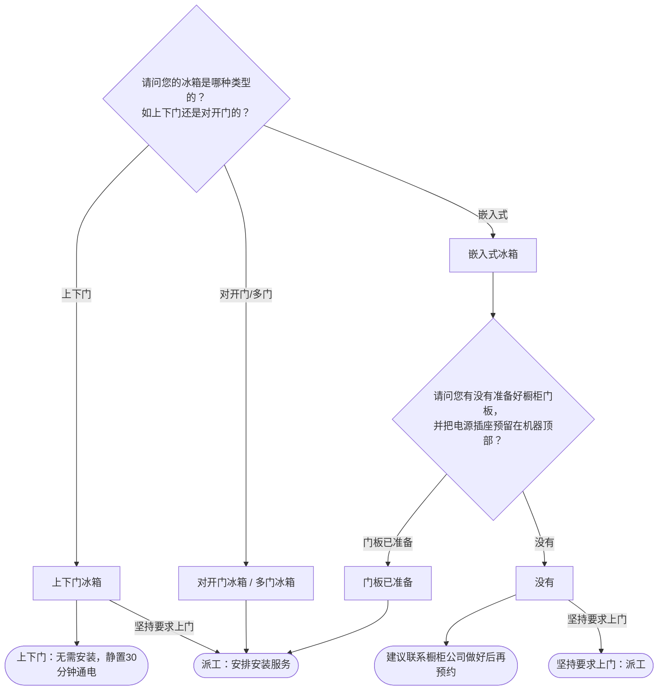

# BSH 冰箱 — 安装引导手册

## 一、文档使用说明

### 执行铁律

1. **严格按步骤顺序执行**，不得跳步、不得自行推断用户未说明的情况
2. **话术原文朗读**，不得改写、不得省略、不得自行补充内容
3. **每步执行前对照 Mermaid 边验证**，确保路径正确

### 执行约定标记

| 标记 | 含义 |
|------|------|
| `【话术】` | 逐字朗读给用户 |
| `【判断】` | 根据用户回答进入分支 |
| `【派工】` | 安排工程师上门 |
| `【备注模板】` | 派工时必须带入系统的申请备注 |
| `【提醒】` | 内部信息，不对用户播报 |
| `【引用】` | 跨文件跳转 |
| `▶` | 无条件进入下一步 |

---

## 二、安装引导导航树

### Mermaid 源码



### 步骤 ↔ 节点速查表

| 引导步骤 | Mermaid 节点 | 步骤类型 | 预期下一节点 |
|---------|-------------|---------|------------|
| I01 | `REF_01` | 判断（冰箱类型） | `REF_02` / `REF_03` / `REF_04` |
| I02 | `REF_07` | 判断（嵌入式准备情况） | `REF_08` / `REF_09` |

---

## 三、越界处理协议

### 触发条件

1. 用户产品不是冰箱（如酒柜 → I12）
2. 用户回答无法映射到当前步骤的任何条件行
3. 用户询问非安装问题（维修、退换、保修）
4. 用户情绪激烈/要求投诉
5. 用户描述属于其他产品安装

### 退出动作

- 属于酒柜 → `【引用】→ BSH_INST_I12_酒柜.md`
- 属于其他产品 → 返回索引文件重新分流
- 无法定位 → 转人工客服

### 严禁行为

- 禁止对上下门冰箱主动派工（无需安装）
- 禁止自行判断嵌入式冰箱的橱柜是否就绪

---

## 四、引导入口

用户来电表示冰箱需要安装 → 进入 **I01**。

---

## 五、引导步骤详情

### I01 — 冰箱类型确认

`[节点：REF_01]`

【话术】
> 请问您的冰箱是哪种类型的？如上下门还是对开门的？

【判断】

| 条件 | 下一步 | 出口类型 | Mermaid 边验证 |
|------|--------|---------|--------------|
| 上下门冰箱 | → **I01A**（无需安装） | 结束/信息咨询 | `REF_01 --上下门--> REF_02` ✓ |
| 对开门冰箱 / 多门冰箱 | → 派工 | 派工 | `REF_01 --对开门/多门--> REF_03` ✓ |
| 嵌入式冰箱 | → **I02**（橱柜确认） | 继续引导 | `REF_01 --嵌入式--> REF_04` ✓ |
| 其他无法识别 | →【越界退出】 | 越界 | 无对应边 |

---

### I01A — 上下门冰箱（无需安装）

`[节点：REF_02]`

【话术】
> 上下门冰箱无需安装，出厂前已经调试好，只需要静置30分钟以上就可以通电使用。

【判断】

| 条件 | 下一步 | 出口类型 | Mermaid 边验证 |
|------|--------|---------|--------------|
| 用户接受 | → 生成信息咨询（结束） | 结束 | `REF_02 --> REF_05` ✓ |
| 坚持要求上门 | → 派工（安排调试服务） | 派工 | `REF_02 --坚持要求上门--> REF_06` ✓ |
| 其他无法识别 | →【越界退出】 | 越界 | 无对应边 |

---

### I01B — 对开门/多门冰箱（直接派工）

`[节点：REF_03]`

【派工】安排安装服务 → 结束

---

### I02 — 嵌入式冰箱橱柜确认

`[节点：REF_07]`

【话术】
> 请问您有没有准备好橱柜门板，并把电源插座预留在机器顶部？

【判断】

| 条件 | 下一步 | 出口类型 | Mermaid 边验证 |
|------|--------|---------|--------------|
| 门板已准备 | → 派工 | 派工 | `REF_07 --门板已准备--> REF_08` ✓ |
| 没有 | → **I02A**（建议暂缓） | 继续引导 | `REF_07 --没有--> REF_09` ✓ |
| 其他无法识别 | →【越界退出】 | 越界 | 无对应边 |

**分支 — 门板已准备**：

【派工】 → 结束

---

### I02A — 嵌入式冰箱建议暂缓

`[节点：REF_09]`

【话术】
> 建议您先联系橱柜公司，做好橱柜和门板后，再来电预约安装。

【判断】

| 条件 | 下一步 | 出口类型 | Mermaid 边验证 |
|------|--------|---------|--------------|
| 用户接受 | → 生成信息咨询（结束） | 结束 | `REF_09 --> REF_10` ✓ |
| 坚持要求上门 | → 派工 | 派工 | `REF_09 --坚持要求上门--> REF_11` ✓ |
| 其他无法识别 | →【越界退出】 | 越界 | 无对应边 |

---

## 附录 A：申请备注模板汇总

| 场景 | 备注模板 |
|------|---------|
| 嵌入式冰箱安装 | `嵌入式冰箱安装，带铰链加强件，连接件` |
| 组合安装 | `组合安装，带连接件、隔热垫` |

---

## 附录 B：材料费用与短信接口汇总

（冰箱安装无特殊材料费和短信接口）

---

## ASCII 路径图

```
I01 冰箱类型确认
 ├─ 上下门 → I01A 无需安装，静置30分钟通电
 │   ├─ 用户接受 → 生成信息咨询（结束）
 │   └─ 坚持要求上门 →【派工】安排调试
 ├─ 对开门/多门 → I01B【派工】安排安装
 └─ 嵌入式 → I02 橱柜门板+电源确认
     ├─ 门板已准备 →【派工】
     └─ 没有 → I02A 建议暂缓
         ├─ 用户接受 → 生成信息咨询（结束）
         └─ 坚持要求上门 →【派工】
```
