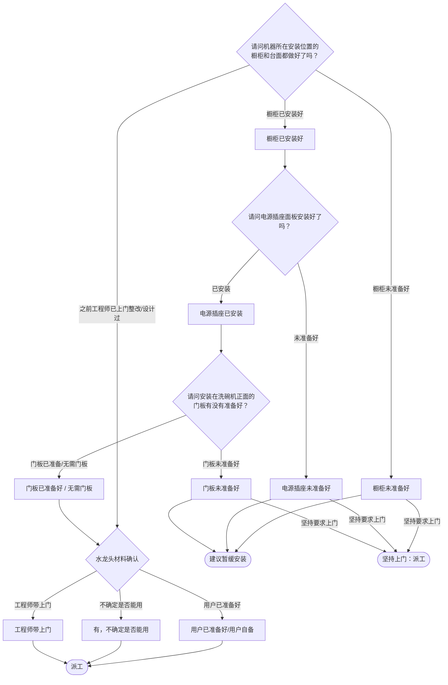

# BSH 洗碗机 — 安装引导手册

## 一、文档使用说明

### 执行铁律

1. **严格按步骤顺序执行**，不得跳步、不得自行推断用户未说明的情况
2. **话术原文朗读**，不得改写、不得省略、不得自行补充内容
3. **每步执行前对照 Mermaid 边验证**，确保路径正确

### 执行约定标记

| 标记 | 含义 |
|------|------|
| `【话术】` | 逐字朗读给用户 |
| `【判断】` | 根据用户回答进入分支 |
| `【派工】` | 安排工程师上门 |
| `【备注模板】` | 派工时必须带入系统的申请备注 |
| `【材料确认】` | 确认是否需要工程师带材料 |
| `【提醒】` | 内部信息，不对用户播报 |
| `【发短信】` | 调用阿里云短信接口（品牌→SMS_CODE） |
| `▶` | 无条件进入下一步 |

---

## 二、安装引导导航树

### Mermaid 源码



### 步骤 ↔ 节点速查表

| 引导步骤 | Mermaid 节点 | 步骤类型 | 预期下一节点 |
|---------|-------------|---------|------------|
| I01 | `DW_01` | 判断（橱柜台面） | `DW_02` / `DW_03` / `DW_10` |
| I02 | `DW_04` | 判断（电源插座） | `DW_05` / `DW_06` |
| I03 | `DW_07` | 判断（门板） | `DW_08` / `DW_09` |
| I04 | `DW_10` | 判断（水龙头） | `DW_11` / `DW_12` / `DW_13` |

---

## 三、越界处理协议

### 触发条件

1. 用户产品不是洗碗机
2. 用户回答无法映射到当前步骤的任何条件行
3. 用户询问非安装问题（维修、退换、保修）
4. 用户情绪激烈/要求投诉
5. 用户描述属于其他产品安装

### 退出动作

- 属于其他产品 → 返回索引文件重新分流
- 无法定位 → 转人工客服

### 严禁行为

- 禁止未确认橱柜/电源/门板就直接派工
- 禁止自行报价
- 禁止跳过任何环境确认步骤

---

## 四、引导入口

用户来电表示洗碗机需要安装 → 进入 **I01**。

---

## 五、引导步骤详情

### I01 — 橱柜台面确认

`[节点：DW_01]`

【话术】
> 请问机器所在安装位置的橱柜和台面都做好了吗？

【判断】

| 条件 | 下一步 | 出口类型 | Mermaid 边验证 |
|------|--------|---------|--------------|
| 橱柜已安装好 | → **I02** | 继续引导 | `DW_01 --橱柜已安装好--> DW_02` ✓ |
| 橱柜未准备好 | → 建议暂缓 | 暂缓/派工 | `DW_01 --橱柜未准备好--> DW_03` ✓ |
| 之前工程师已上门整改或设计过 | → **I04**（水龙头确认） | 继续引导 | `DW_01 --之前工程师已上门--> DW_10` ✓ |
| 其他无法识别 | →【越界退出】 | 越界 | 无对应边 |

**分支 — 橱柜未准备好**：

【话术】
> 如果没有橱柜和台面，洗碗机没有办法固定，建议您等橱柜完成后再预约安装。

【判断】

| 条件 | 下一步 | 出口类型 |
|------|--------|---------|
| 用户接受 | → 生成信息咨询（结束） | 结束 |
| 坚持要求上门 | → 派工 | 派工 |
| 其他无法识别 | →【越界退出】 | 越界 |

【话术】（坚持上门时）
> 稍后我给您发送一条短信，您可以点击链接查看洗碗机具体的安装环境。

【派工】

---

### I02 — 电源插座确认

`[节点：DW_04]`

【话术】
> 请问电源插座面板安装好了吗？

【判断】

| 条件 | 下一步 | 出口类型 | Mermaid 边验证 |
|------|--------|---------|--------------|
| 安装好了 | → **I03** | 继续引导 | `DW_04 --已安装--> DW_05` ✓ |
| 电源插座未准备好 | → 建议暂缓 | 暂缓/派工 | `DW_04 --未准备好--> DW_06` ✓ |
| 其他无法识别 | →【越界退出】 | 越界 | 无对应边 |

**分支 — 未准备好**：

【话术】
> 洗碗机安装需要通水通电，请您先安装好插座后再预约安装。

【判断】

| 条件 | 下一步 | 出口类型 |
|------|--------|---------|
| 用户接受 | → 生成信息咨询（结束） | 结束 |
| 坚持要求上门 | → 派工 | 派工 |
| 其他无法识别 | →【越界退出】 | 越界 |

---

### I03 — 门板确认

`[节点：DW_07]`

【话术】
> 请问安装在洗碗机正面的门板有没有准备好？

【判断】

| 条件 | 下一步 | 出口类型 | Mermaid 边验证 |
|------|--------|---------|--------------|
| 门板已准备好 / 无需门板 | → **I04** | 继续引导 | `DW_07 --门板已准备/无需门板--> DW_08` ✓ |
| 门板未准备好 | → 建议暂缓 | 暂缓/派工 | `DW_07 --门板未准备好--> DW_09` ✓ |
| 其他无法识别 | →【越界退出】 | 越界 | 无对应边 |

**分支 — 门板未准备好**：

【话术】
> 门板没有准备好，机器无法一次性安装完成，建议您等准备好后再预约安装。

【判断】

| 条件 | 下一步 | 出口类型 |
|------|--------|---------|
| 用户接受 | → 生成信息咨询（结束） | 结束 |
| 坚持要求上门 | → 派工 | 派工 |
| 其他无法识别 | →【越界退出】 | 越界 |

【话术】（坚持上门时）
> 稍后我给您发送一条短信，您可以点击链接查看洗碗机具体的安装环境。

---

### I04 — 水龙头材料确认

`[节点：DW_10]`

【话术】
> 机器安装需要用到水龙头，规格是：出水口带三圈以上外螺纹，六分口径。你可以自己准备，也可以从工程师处购买。如需加长水管也可以从工程师处购买，您看需要让师傅带上吗？

【判断】

| 条件 | 下一步 | 出口类型 | Mermaid 边验证 |
|------|--------|---------|--------------|
| 用户已准备好 / 用户自备 | → 派工 | 派工 | `DW_10 --用户已准备好--> DW_11` ✓ |
| 有，不确定是否能用 | → 派工 | 派工 | `DW_10 --不确定是否能用--> DW_12` ✓ |
| 工程师带上门 | → 派工 | 派工 | `DW_10 --工程师带上门--> DW_13` ✓ |
| 其他无法识别 | →【越界退出】 | 越界 | 无对应边 |

**分支 — 用户自备**：

【话术】
> 已经帮您备注了，如用到材料收取材料费。工程师会出示收费明细，请您核对后再支付。

【派工】 → 结束

**分支 — 不确定能否用**：

【话术】
> 工程师上门会为您确认家中水龙头是否能用，也会带上水龙头备用。另外，如需用到加长水管等配件，需要收费。

【派工】 → 结束

**分支 — 工程师带上门**：

【话术】
> 已经帮您备注了，如用到材料收取材料费。工程师会出示收费明细，请您核对后再支付。

【派工】 → 结束

---

## 附录 A：申请备注模板汇总

| 场景 | 备注模板 |
|------|---------|
| 门板已准备//电源已安装 | `门板已准备//电源插座已安装好` |
| 门板已准备//电源已安装//带水龙头备用 | `门板已准备//电源插座已安装好//带水龙头备用` |
| 门板已准备//电源已安装//带水龙头 | `门板已准备//电源插座已安装好//带水龙头` |
| 门板未准备好 | `门板未准备好，BSH建议用户暂缓安装` |
| 电源未准备好 | `电源插座未准备好，BSH建议用户暂缓安装` |
| 门板已准备//电源未准备//坚持上门 | `门板已准备//电源插座未准备好，用户坚持上门//带水龙头` |
| 橱柜未准备好 | `橱柜未准备好，BSH建议用户暂缓安装` |
| 工程师已上门整改/设计 | → 下一步派设计单 |

---

## 附录 B：材料费用与短信接口汇总

| 材料 | 规格说明 | 价格 |
|------|---------|------|
| 水龙头 | 出水口带三圈以上外螺纹，六分口径 | （工程师现场报价） |
| 加长水管 | — | （工程师现场报价） |

（洗碗机安装无短信接口）

---

## ASCII 路径图

```
I01 橱柜台面确认
 ├─ 橱柜已安装好 → I02 电源插座确认
 │   ├─ 已安装 → I03 门板确认
 │   │   ├─ 门板已准备/无需门板 → I04 水龙头确认
 │   │   │   ├─ 用户自备 →【派工】
 │   │   │   ├─ 不确定能否用 →【派工】带水龙头备用
 │   │   │   └─ 工程师带 →【派工】
 │   │   └─ 门板未准备好 → 建议暂缓
 │   │       ├─ 用户接受 → 结束
 │   │       └─ 坚持上门 →【派工】
 │   └─ 未准备好 → 建议暂缓
 │       ├─ 用户接受 → 结束
 │       └─ 坚持上门 →【派工】
 ├─ 橱柜未准备好 → 建议暂缓
 │   ├─ 用户接受 → 结束
 │   └─ 坚持上门 →【派工】
 └─ 之前已上门整改/设计 → I04 水龙头确认 →【派工】
```
