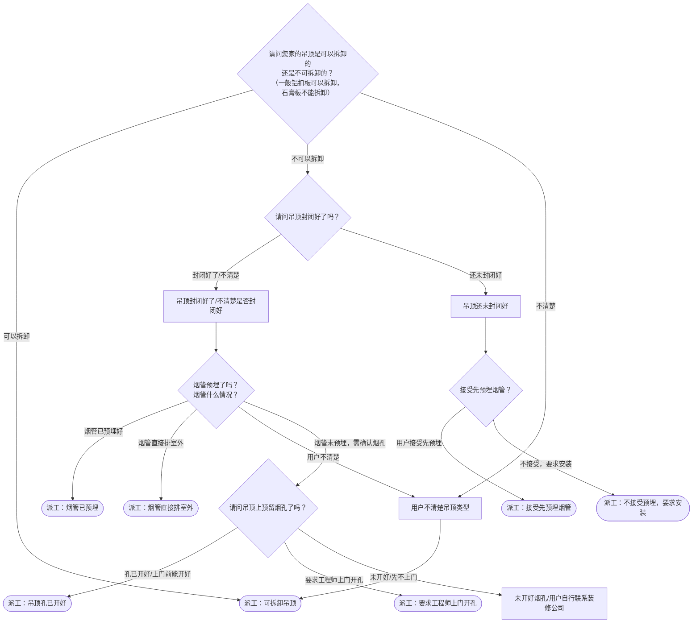

# BSH 油烟机 — 安装引导手册

## 一、文档使用说明

### 执行铁律

1. **严格按步骤顺序执行**，不得跳步、不得自行推断用户未说明的情况
2. **话术原文朗读**，不得改写、不得省略、不得自行补充内容
3. **每步执行前对照 Mermaid 边验证**，确保路径正确

### 执行约定标记

| 标记 | 含义 |
|------|------|
| `【话术】` | 逐字朗读给用户 |
| `【判断】` | 根据用户回答进入分支 |
| `【派工】` | 安排工程师上门 |
| `【备注模板】` | 派工时必须带入系统的申请备注 |
| `【提醒】` | 内部信息，不对用户播报 |
| `▶` | 无条件进入下一步 |

---

## 二、安装引导导航树

### Mermaid 源码



### 步骤 ↔ 节点速查表

| 引导步骤 | Mermaid 节点 | 步骤类型 | 预期下一节点 |
|---------|-------------|---------|------------|
| I01 | `HOOD_01` | 判断（吊顶类型） | `HOOD_02` / `HOOD_03` / `HOOD_09` |
| I02 | `HOOD_03` | 判断（吊顶是否封闭） | `HOOD_04` / `HOOD_05` |
| I03 | `HOOD_06` | 判断（烟管状态） | `HOOD_07` / `HOOD_08` / `HOOD_09` |
| I04 | `HOOD_10` | 判断（吊顶烟孔） | `HOOD_11` / `HOOD_12` / `HOOD_13` |
| I05 | `HOOD_14` | 判断（是否接受先预埋） | `HOOD_15` / `HOOD_16` |

---

## 三、越界处理协议

### 触发条件

1. 用户产品不是油烟机
2. 用户回答无法映射到当前步骤的任何条件行
3. 用户询问非安装问题（维修、清洗、退换）
4. 用户情绪激烈/要求投诉
5. 用户描述属于其他产品安装

### 退出动作

- 属于其他产品 → 返回索引文件重新分流
- 无法定位 → 转人工客服

### 严禁行为

- 禁止未确认吊顶类型就直接派工
- 禁止自行判断吊顶是否可拆卸（由用户确认）
- 禁止跳过烟管状态确认

---

## 四、引导入口

用户来电表示油烟机/抽油烟机需要安装 → 进入 **I01**。

---

## 五、引导步骤详情

### I01 — 吊顶类型确认

`[节点：HOOD_01]`

【话术】
> 请问您家的吊顶是可以拆卸的还是不可拆卸的？（一般铝扣板可以拆卸，石膏板不能拆卸）

【判断】

| 条件 | 下一步 | 出口类型 | Mermaid 边验证 |
|------|--------|---------|--------------|
| 可以拆卸的吊顶 | → 派工 | 派工 | `HOOD_01 --可以拆卸--> HOOD_02` ✓ |
| 不可以拆卸的吊顶 | → **I02** | 继续引导 | `HOOD_01 --不可以拆卸--> HOOD_03` ✓ |
| 用户不清楚 | → **I01X** | 继续引导 | `HOOD_01 --不清楚--> HOOD_09` ✓ |
| 其他无法识别 | →【越界退出】 | 越界 | 无对应边 |

**分支 — 可拆卸吊顶**：

【派工】 → 结束

【备注模板】`可拆卸吊顶`

---

### I01X — 用户不清楚吊顶类型

`[节点：HOOD_09]`

【话术】
> 建议您再确认一下，如果是可以拆的吊顶，吊顶做好后，一次上门就能安装好，吸烟效果也是一样的，这样更节约您的时间。

【判断】

| 条件 | 下一步 | 出口类型 | Mermaid 边验证 |
|------|--------|---------|--------------|
| 用户确认可拆/接受 | → 派工 | 派工 | `HOOD_09 --> HOOD_02` ✓ |
| 用户不接受/坚持上门 | → 派工 | 派工 | — |
| 其他无法识别 | →【越界退出】 | 越界 | 无对应边 |

【派工】（坚持上门时）

【备注模板】`用户不清楚吊顶类型，坚持上门`

---

### I02 — 吊顶是否封闭（不可拆卸路径）

`[节点：HOOD_03]`

【话术】
> 请问吊顶封闭好了吗？

【判断】

| 条件 | 下一步 | 出口类型 | Mermaid 边验证 |
|------|--------|---------|--------------|
| 吊顶封闭好了 / 不清楚是否封闭好 | → **I03**（烟管状态确认） | 继续引导 | `HOOD_03 --封闭好了/不清楚--> HOOD_04` ✓ |
| 吊顶还未封闭好 | → **I05** | 继续引导 | `HOOD_03 --还未封闭好--> HOOD_05` ✓ |
| 其他无法识别 | →【越界退出】 | 越界 | 无对应边 |

---

### I03 — 烟管状态确认（吊顶已封闭路径）

`[节点：HOOD_06]`

【判断】需确认烟管当前状态：

| 条件 | 下一步 | 出口类型 | Mermaid 边验证 |
|------|--------|---------|--------------|
| 烟管已经预埋好 | → 派工 | 派工 | `HOOD_06 --烟管已预埋好--> HOOD_07` ✓ |
| 烟管直接排室外 | → 派工 | 派工 | `HOOD_06 --烟管直接排室外--> HOOD_08` ✓ |
| 烟管未预埋，需确认烟孔 | → **I04**（烟孔确认） | 继续引导 | `HOOD_06 --烟管未预埋，需确认烟孔--> HOOD_10` ✓ |
| 用户不清楚 | → 派工（同不清楚吊顶处理） | 派工 | `HOOD_06 --用户不清楚--> HOOD_09` ✓ |
| 其他无法识别 | →【越界退出】 | 越界 | 无对应边 |

**分支 — 烟管已预埋**：

【派工】

【备注模板】`烟管已预埋`

**分支 — 烟管直接排室外**：

【派工】

【备注模板】`烟管直接排室外`

---

### I04 — 吊顶烟孔确认（吊顶已封闭 + 需判断烟孔）

`[节点：HOOD_10]`

【话术】
> 请问吊顶上预留烟孔了吗？

【判断】

| 条件 | 下一步 | 出口类型 | Mermaid 边验证 |
|------|--------|---------|--------------|
| 吊顶孔已经留好 / 上门前能开好孔 | → 派工 | 派工 | `HOOD_10 --孔已开好--> HOOD_11` ✓ |
| 用户要求工程师上门开孔 | → 派工 | 派工 | `HOOD_10 --要求工程师上门开孔--> HOOD_12` ✓ |
| 未开好烟孔 / 先不上门，用户自行联系装修公司 | → 结束（等用户开好孔后再约） | 结束 | `HOOD_10 --未开好--> HOOD_13` ✓ |
| 其他无法识别 | →【越界退出】 | 越界 | 无对应边 |

**分支 — 孔已开好**：

【派工】

【备注模板】`不可拆卸吊顶，吊顶孔已开好`

**分支 — 要求工程师开孔**：

【派工】

【备注模板】`不可拆卸吊顶，要求工程师上门开孔`

**分支 — 未开好/先不上门**：

【话术】
> 等您开好烟孔，直接通过微信就可以预约上门了。

结束。

---

### I05 — 是否接受先预埋烟管（吊顶未封闭路径）

`[节点：HOOD_14]`

【话术】
> 我为您先安排预埋烟管服务，可能会用到防烟宝，用到收材料费。

【判断】

| 条件 | 下一步 | 出口类型 | Mermaid 边验证 |
|------|--------|---------|--------------|
| 用户接受先预埋烟管 | → 派工 | 派工 | `HOOD_14 --用户接受先预埋--> HOOD_15` ✓ |
| 用户不接受预埋烟管，要求安装 | → 派工 | 派工 | `HOOD_14 --不接受，要求安装--> HOOD_16` ✓ |
| 其他无法识别 | →【越界退出】 | 越界 | 无对应边 |

**分支 — 接受先预埋**：

【派工】

【备注模板】`吊顶不可拆卸且未密封，接受先预埋`

**分支 — 不接受，要求安装**：

【派工】

【备注模板】`吊顶不可拆卸且未密封，不接受先预埋`

---

## 附录 A：申请备注模板汇总

| 场景 | 备注模板 |
|------|---------|
| 可拆卸吊顶 | `可拆卸吊顶` |
| 用户不清楚吊顶类型，坚持上门 | `用户不清楚吊顶类型，坚持上门` |
| 烟管已预埋 | `烟管已预埋` |
| 烟管直接排室外 | `烟管直接排室外` |
| 不可拆卸+孔已开好 | `不可拆卸吊顶，吊顶孔已开好` |
| 不可拆卸+要求工程师开孔 | `不可拆卸吊顶，要求工程师上门开孔` |
| 不可拆卸+未封闭+接受预埋 | `吊顶不可拆卸且未密封，接受先预埋` |
| 不可拆卸+未封闭+不接受预埋 | `吊顶不可拆卸且未密封，不接受先预埋` |

---

## 附录 B：材料费用与短信口径汇总

| 材料 | 说明 | 费用 |
|------|------|------|
| 防烟宝 | 预埋烟管时可能用到 | 材料费（现场收取） |

（油烟机安装无短信口径）

---

## ASCII 路径图

```
I01 吊顶类型确认
 ├─ 可拆卸 →【派工】备注：可拆卸吊顶
 ├─ 不可拆卸 → I02 吊顶是否封闭？
 │   ├─ 封闭好了/不清楚 → I03 烟管状态 + I04 烟孔确认
 │   │   ├─ 烟管已预埋 →【派工】
 │   │   ├─ 直接排室外 →【派工】
 │   │   ├─ 孔已开好 →【派工】
 │   │   ├─ 要求工程师开孔 →【派工】
 │   │   └─ 未开好/先不上门 → 等开好后再约
 │   └─ 未封闭 → I05 是否接受先预埋？
 │       ├─ 接受 →【派工】预埋烟管
 │       └─ 不接受 →【派工】要求直接安装
 └─ 不清楚 → I01X 建议确认
     ├─ 确认可拆 →【派工】
     └─ 坚持上门 →【派工】
```
