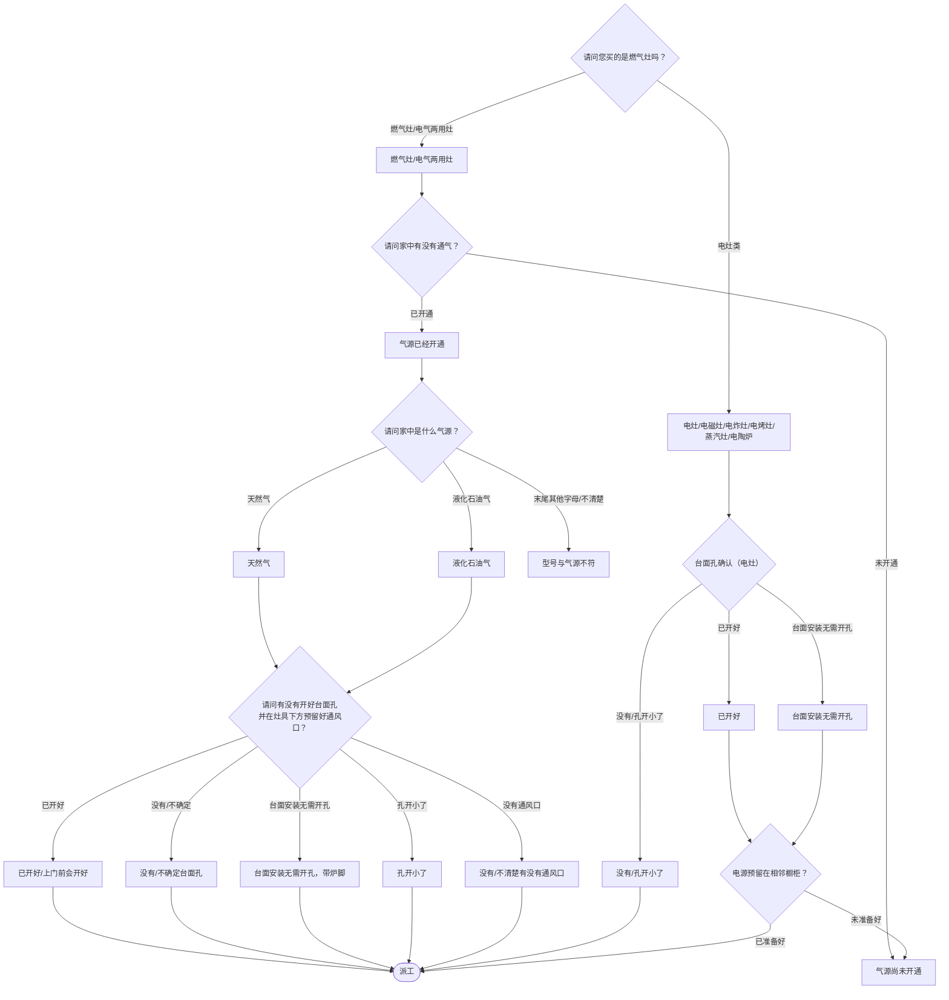

# BSH 灶具 — 安装引导手册

## 一、文档使用说明

### 执行铁律

1. **严格按步骤顺序执行**，不得跳步、不得自行推断用户未说明的情况
2. **话术原文朗读**，不得改写、不得省略、不得自行补充内容
3. **每步执行前对照 Mermaid 边验证**，确保路径正确

### 执行约定标记

| 标记 | 含义 |
|------|------|
| `【话术】` | 逐字朗读给用户 |
| `【判断】` | 根据用户回答进入分支 |
| `【派工】` | 安排工程师上门 |
| `【备注模板】` | 派工时必须带入系统的申请备注 |
| `【材料确认】` | 确认是否需要工程师带材料 |
| `【提醒】` | 内部信息，不对用户播报 |
| `▶` | 无条件进入下一步 |

---

## 二、安装引导导航树

### Mermaid 源码



### 步骤 ↔ 节点速查表

| 引导步骤 | Mermaid 节点 | 步骤类型 | 预期下一节点 |
|---------|-------------|---------|------------|
| I01 | `HOB_01` | 判断（灶具类型） | `HOB_02` / `HOB_03` |
| I02 | `HOB_04` | 判断（是否通气） | `HOB_05` / `HOB_06` |
| I03 | `HOB_07` | 判断（气源类型） | `HOB_08` / `HOB_09` / `HOB_10` |
| I04 | `HOB_11` | 判断（台面孔+通风口） | 多分支 |
| I05 | `HOB_17` | 判断（电灶台面孔） | `HOB_18` / `HOB_19` / `HOB_20` |
| I06 | `HOB_21` | 判断（电源预留） | `HOB_22` / `HOB_06` |

---

## 三、越界处理协议

### 触发条件

1. 用户产品不是灶具
2. 用户回答无法映射到当前步骤的任何条件行
3. 用户询问非安装问题
4. 用户情绪激烈/要求投诉
5. 型号与气源不符，需用户联系商场

### 退出动作

- 属于其他产品 → 返回索引文件重新分流
- 型号与气源不符 → 告知用户联系商场确认是否换机
- 无法定位 → 转人工客服

### 严禁行为

- 禁止对气源不符的灶具安排安装
- 禁止未确认气源就直接派工
- 禁止自行判断气源类型（由用户确认型号末尾字母）

---

## 四、引导入口

用户来电表示灶具需要安装 → 进入 **I01**。

---

## 五、引导步骤详情

### I01 — 灶具类型确认

`[节点：HOB_01]`

【话术】
> 请问您买的是燃气灶吗？

【判断】

| 条件 | 下一步 | 出口类型 | Mermaid 边验证 |
|------|--------|---------|--------------|
| 燃气灶 / 电气两用灶 | → **I02** | 继续引导 | `HOB_01 --燃气灶/电气两用灶--> HOB_02` ✓ |
| 电灶/电磁灶/电炸灶/电烤灶/蒸汽灶/电陶炉 | → **I05** | 继续引导 | `HOB_01 --电灶类--> HOB_03` ✓ |
| 其他无法识别 | →【越界退出】 | 越界 | 无对应边 |

---

### I02 — 是否通气

`[节点：HOB_04]`

【话术】
> 请问家中有没有通气？

【判断】

| 条件 | 下一步 | 出口类型 | Mermaid 边验证 |
|------|--------|---------|--------------|
| 气源已经开通 | → **I03** | 继续引导 | `HOB_04 --已开通--> HOB_05` ✓ |
| 气源尚未开通 | → 建议通气后再约 | 暂缓 | `HOB_04 --未开通--> HOB_06` ✓ |
| 其他无法识别 | →【越界退出】 | 越界 | 无对应边 |

**分支 — 未开通**：

【话术】
> 为了保证机器安装后能及时调试，建议您联系燃气公司将气源开通之后再来电预约安装。

【提醒】
- 用户表示开通燃气需要"三联单"（仅限福州地区华润燃气用户）→ 正常派工，申请备注"三联单字样"
- 深圳用户表示开通燃气需要"绿标" → 直接派工
- 当地需先安装后通气 → 正常派工

---

### I03 — 气源类型确认

`[节点：HOB_07]`

【话术】
> 请问家中是什么气源？

【判断】

| 条件 | 下一步 | 出口类型 | Mermaid 边验证 |
|------|--------|---------|--------------|
| 天然气（型号末尾 MP、MQ、MJ、ML 等） | → **I04** | 继续引导 | `HOB_07 --天然气--> HOB_08` ✓ |
| 液化石油气（型号末尾 MX、MY 等） | → **I04** | 继续引导 | `HOB_07 --液化石油气--> HOB_09` ✓ |
| 末尾是其他字母 / 不清楚气源类型 | → 型号与气源不符处理 | 越界 | `HOB_07 --末尾其他字母/不清楚--> HOB_10` ✓ |
| 其他无法识别 | →【越界退出】 | 越界 | 无对应边 |

**分支 — 型号与气源不符**：

【话术】
> 灶具的气源与家中气源必须一样才能安装使用，为了保证新机的安全性，我们不对新购买的灶具进行气源置换，请您先与商场联系确认是否可以换机。

结束。

---

### I04 — 台面孔与通风口确认（燃气灶）

`[节点：HOB_11]`

【话术】
> 请问有没有开好台面孔并在灶具下方预留好通风口？

【材料确认】

【话术】（确认材料）
> 安装会用到金属波纹管，建议在工程师处购买原厂匹配的管件，品质有保证。

【提醒】
- **天津用户**：机器配了1米长的金属波纹管，不够用的话，可以在上门的工程师处购买。
- **上海地区**：机器配了0.5米的金属波纹管，不够用的话，可以在上门的工程师处购买。
- **其他城市用户**：安装会用到金属波纹管，建议在工程师处购买原厂匹配的管件。

【判断】

| 条件 | 下一步 | 出口类型 | Mermaid 边验证 |
|------|--------|---------|--------------|
| 已开好 / 上门前会开好 | → 派工 | 派工 | `HOB_11 --已开好--> HOB_12` ✓ |
| 没有 / 不确定台面孔是否合适 | → 派工（工程师上门开孔/确认） | 派工 | `HOB_11 --没有/不确定--> HOB_13` ✓ |
| 台面安装无需开孔，带炉脚 | → 派工 | 派工 | `HOB_11 --台面安装无需开孔--> HOB_14` ✓ |
| 孔开小了 | → 派工（工程师上门扩孔/确认） | 派工 | `HOB_11 --孔开小了--> HOB_15` ✓ |
| 没有 / 不清楚有没有通风口 | → 派工（工程师上门开通风口） | 派工 | `HOB_11 --没有通风口--> HOB_16` ✓ |
| 其他无法识别 | →【越界退出】 | 越界 | 无对应边 |

**各分支话术**：

- 没有台面孔："您可以联系橱柜公司开孔，或者我们安排工程师上门确认是否可以提供开孔服务。"
- 孔开小了："您可以联系橱柜公司扩孔，或者我们安排工程师上门确认是否可以提供扩孔服务。"
- 没有通风口："您可以联系橱柜公司开孔，或者我们安排工程师上门确认是否可以提供开孔服务。"

【派工】 → 结束

---

### I05 — 台面孔确认（电灶）

`[节点：HOB_17]`

【话术】
> 请问台面孔开好了吗？

【判断】

| 条件 | 下一步 | 出口类型 | Mermaid 边验证 |
|------|--------|---------|--------------|
| 已开好 / 上门前会开好 | → **I06** | 继续引导 | `HOB_17 --已开好--> HOB_18` ✓ |
| 没有 / 孔开小了 | → 派工（工程师上门确认） | 派工 | `HOB_17 --没有/孔开小了--> HOB_19` ✓ |
| 台面安装无需开孔 | → **I06** | 继续引导 | `HOB_17 --台面安装无需开孔--> HOB_20` ✓ |
| 其他无法识别 | →【越界退出】 | 越界 | 无对应边 |

---

### I06 — 电源预留确认（电灶）

`[节点：HOB_21]`

【话术】
> 机器的电源需要预留在相邻的橱柜中，请问您是否已经准备好了？

【判断】

| 条件 | 下一步 | 出口类型 | Mermaid 边验证 |
|------|--------|---------|--------------|
| 已准备好 | → 派工 | 派工 | `HOB_21 --已准备好--> HOB_22` ✓ |
| 未准备好 | → 建议暂缓 | 暂缓 | `HOB_21 --未准备好--> HOB_06` ✓ |
| 其他无法识别 | →【越界退出】 | 越界 | 无对应边 |

**分支 — 未准备好**：

【话术】
> 建议用户做好之后再来电预约安装。

生成信息咨询 → 结束。

---

## 附录 A：申请备注模板汇总

| 场景 | 备注模板 |
|------|---------|
| 已通气+台面孔与通风孔已开好 | `已通气//带金属波纹管//台面孔与通风孔已开好` |
| 已通气+台面安装带炉脚 | `已通气//带金属波纹管//台面安装，带炉脚` |
| 要求工程师上门开台面孔 | `已通气//带金属波纹管//要求工程师上门开台面孔` |
| 要求工程师上门扩台面孔 | `已通气//带金属波纹管//要求工程师上门扩台面孔` |
| 要求工程师上门开通风口 | `已通气//带金属波纹管//要求工程师上门开通风口` |
| 电灶+台面孔已开好+电源已预留 | `台面孔已开好//电源插座已预留在相邻橱柜` |
| 电灶+电源未预留 | `电源插座未预留在相邻橱柜，BSH建议用户暂缓安装` |
| 要求工程师上门开台面孔（电灶） | `要求工程师上门开台面孔` |
| 要求工程师上门扩台面孔（电灶） | `要求工程师上门扩台面孔` |

---

## 附录 B：材料费用与短信接口汇总

| 材料 | 规格说明 | 价格 |
|------|---------|------|
| 金属波纹管（天津） | 机器配1米，不够可购买 | （工程师现场报价） |
| 金属波纹管（上海） | 机器配0.5米，不够可购买 | （工程师现场报价） |
| 金属波纹管（其他城市） | 需在工程师处购买 | （工程师现场报价） |
| 进气管 | — | （工程师现场报价） |

（灶具安装无短信接口）

---

## ASCII 路径图

```
I01 灶具类型确认
 ├─ 燃气灶/电气两用灶 → I02 是否通气？
 │   ├─ 已通气 → I03 气源类型？
 │   │   ├─ 天然气/液化气 → I04 台面孔+通风口？
 │   │   │   ├─ 已开好 →【派工】带波纹管
 │   │   │   ├─ 没有/不确定 →【派工】工程师开孔
 │   │   │   ├─ 台面安装带炉脚 →【派工】
 │   │   │   ├─ 孔开小了 →【派工】工程师扩孔
 │   │   │   └─ 无通风口 →【派工】工程师开通风口
 │   │   └─ 型号与气源不符 → 联系商场（结束）
 │   └─ 未通气 → 建议通气后再约
 └─ 电灶类 → I05 台面孔？
     ├─ 已开好/无需开孔 → I06 电源预留？
     │   ├─ 已准备好 →【派工】
     │   └─ 未准备好 → 建议暂缓
     └─ 没有/孔开小了 →【派工】工程师开孔/扩孔
```
