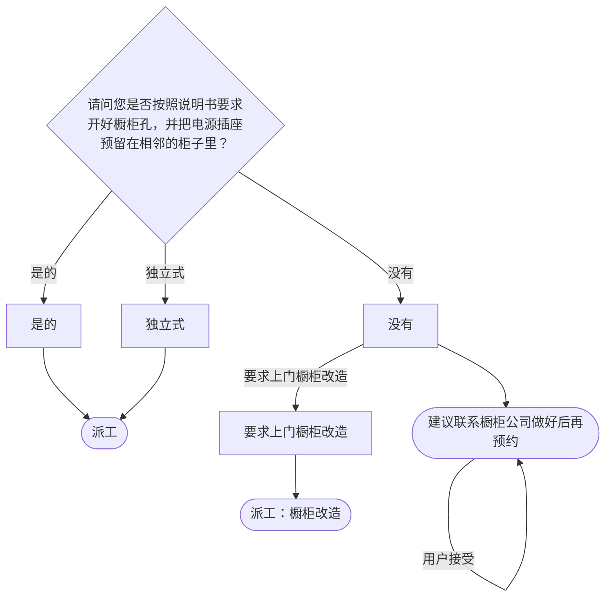

# BSH 消毒柜 — 安装引导手册

## 一、文档使用说明

### 执行铁律

1. **严格按步骤顺序执行**，不得跳步
2. **话术原文朗读**，不得改写
3. **每步执行前对照 Mermaid 边验证**

### 执行约定标记

| 标记 | 含义 |
|------|------|
| `【话术】` | 逐字朗读给用户 |
| `【判断】` | 根据用户回答进入分支 |
| `【派工】` | 安排工程师上门 |
| `【备注模板】` | 派工时必须带入系统的申请备注 |
| `【提醒】` | 内部信息，不对用户播报 |

---

## 二、安装引导导航树

### Mermaid 源码



### 步骤 ↔ 节点速查表

| 引导步骤 | Mermaid 节点 | 步骤类型 | 预期下一节点 |
|---------|-------------|---------|------------|
| I01 | `DSF_01` | 判断（橱柜+电源） | `DSF_02` / `DSF_03` / `DSF_04` |

---

## 三、越界处理协议

### 触发条件

1. 用户产品不是消毒柜
2. 用户回答无法映射到任何条件行
3. 用户询问非安装问题
4. 用户情绪激烈/要求投诉

### 退出动作

- 属于其他产品 → 返回索引文件重新分流
- 无法定位 → 转人工客服

### 严禁行为

- 禁止未确认橱柜就直接派工

---

## 四、引导入口

用户来电表示消毒柜需要安装 → 进入 **I01**。

---

## 五、引导步骤详情

### I01 — 橱柜与电源确认

`[节点：DSF_01]`

【话术】
> 请问您是否按照说明书要求开好橱柜孔，并把电源插座预留在相邻的柜子里？

【判断】

| 条件 | 下一步 | 出口类型 | Mermaid 边验证 |
|------|--------|---------|--------------|
| 是的 | → 派工 | 派工 | `DSF_01 --是的--> DSF_02` ✓ |
| 没有 | → 建议暂缓 | 暂缓/改造 | `DSF_01 --没有--> DSF_03` ✓ |
| 独立式 | → 派工 | 派工 | `DSF_01 --独立式--> DSF_04` ✓ |
| 其他无法识别 | →【越界退出】 | 越界 | 无对应边 |

**分支 — 是的 / 独立式**：

【派工】 → 结束

**分支 — 没有**：

【话术】
> 建议您先联系橱柜公司，做好橱柜之后，再来电预约安装。

【判断】

| 条件 | 下一步 | 出口类型 |
|------|--------|---------|
| 用户接受 | → 生成信息咨询（结束） | 结束 |
| 要求上门橱柜改造 | → 派工（橱柜改造） | 派工 |
| 其他无法识别 | →【越界退出】 | 越界 |

【提醒】用户要求，且在提供改造的城市中的，可以安排橱柜改造服务。请搜索口径：增值服务信息。

【派工】（橱柜改造）→ 结束

---

## 附录 A：申请备注模板汇总

| 场景 | 备注模板 |
|------|---------|
| 橱柜和电源已预留 | （无特殊备注） |
| 橱柜或电源未准备好 | `橱柜或电源插座未准备好，BSH建议用户暂缓安装` |
| 要求工程师上门改造橱柜 | `要求工程师上门改造橱柜` |

---

## 附录 B：材料费用与短信接口汇总

（消毒柜安装无特殊材料费和短信接口）

---

## ASCII 路径图

```
I01 橱柜+电源确认
 ├─ 是的（已准备好）→【派工】
 ├─ 没有 → 建议联系橱柜公司
 │   ├─ 用户接受 → 生成信息咨询（结束）
 │   └─ 要求上门改造 →【派工】橱柜改造
 └─ 独立式 →【派工】
```
