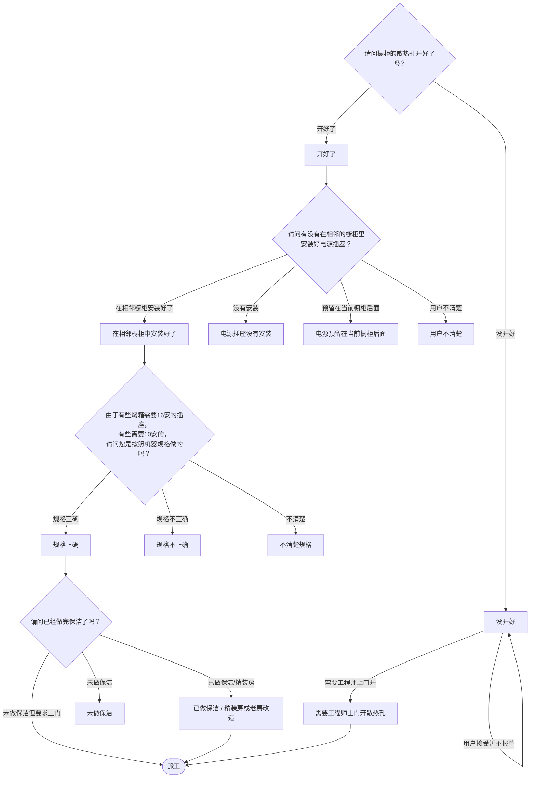

# BSH 烤箱/蒸箱 — 安装引导手册

## 一、文档使用说明

### 执行铁律

1. **严格按步骤顺序执行**，不得跳步
2. **话术原文朗读**，不得改写
3. **每步执行前对照 Mermaid 边验证**

### 执行约定标记

| 标记 | 含义 |
|------|------|
| `【话术】` | 逐字朗读给用户 |
| `【判断】` | 根据用户回答进入分支 |
| `【派工】` | 安排工程师上门 |
| `【备注模板】` | 派工时必须带入系统的申请备注 |
| `【提醒】` | 内部信息，不对用户播报 |
| `【发短信】` | 调用阿里云短信接口（品牌→SMS_CODE） |

---

## 二、安装引导导航树

### Mermaid 源码



### 步骤 ↔ 节点速查表

| 引导步骤 | Mermaid 节点 | 步骤类型 | 预期下一节点 |
|---------|-------------|---------|------------|
| I01 | `OVEN_01` | 判断（散热孔） | `OVEN_02` / `OVEN_03` |
| I02 | `OVEN_04` | 判断（电源插座） | `OVEN_05` / `OVEN_06` / `OVEN_07` / `OVEN_08` |
| I03 | `OVEN_09` | 判断（电源规格） | `OVEN_10` / `OVEN_11` / `OVEN_12` |
| I04 | `OVEN_13` | 判断（保洁） | `OVEN_14` / `OVEN_15` / `OVEN_16` |

---

## 三、越界处理协议

### 触发条件

1. 用户产品不是烤箱/蒸箱/蒸烤一体机
2. 用户回答无法映射到任何条件行
3. 用户询问非安装问题
4. 用户情绪激烈/要求投诉

### 退出动作

- 抽屉蒸箱 → `【引用】→ BSH_INST_I10_抽屉蒸箱.md`
- 属于其他产品 → 返回索引文件重新分流
- 无法定位 → 转人工客服

### 严禁行为

- 禁止未确认散热孔和电源就直接派工
- 禁止自行判断电源规格（需确认型号）

---

## 四、引导入口

用户来电表示烤箱/蒸箱/蒸烤一体机需要安装 → 进入 **I01**。

---

## 五、引导步骤详情

### I01 — 散热孔确认

`[节点：OVEN_01]`

【话术】
> 请问橱柜的散热孔开好了吗？稍后给您发送一条短信，您可以点击链接查看机器具体的安装环境。

【发短信】

| 品牌 | SMS_CODE | 短信内容摘要 |
|------|----------|-------------|
| 西门子（蒸箱） | 115 | 蒸箱安装环境 |
| 博世（蒸箱） | 116 | 蒸箱安装环境 |
| 西门子（烤箱） | 117 | 烤箱安装环境 |
| 博世（烤箱） | 118 | 烤箱安装环境 |

【提醒】什么是散热孔：通风散热，确保空气流通。散热孔深度建议开35毫米，部分型号的图纸散热孔深度为20毫米或40毫米，按图纸上的尺寸开也是可以的。

【判断】

| 条件 | 下一步 | 出口类型 | Mermaid 边验证 |
|------|--------|---------|--------------|
| 开好了 | → **I02** | 继续引导 | `OVEN_01 --开好了--> OVEN_02` ✓ |
| 没开好 | → **I01A**（散热孔处理） | 继续引导 | `OVEN_01 --没开好--> OVEN_03` ✓ |
| 其他无法识别 | →【越界退出】 | 越界 | 无对应边 |

---

### I01A — 散热孔未开好

`[节点：OVEN_03]`

【话术】
> 为了保证安全使用，橱柜后面一定要开好散热孔，您可以联系橱柜公司开孔，工程师也可以提供有偿开孔服务。稍后给您发送一条短信，您可以点击链接查看机器具体的安装环境。

【提醒】工程师开散热孔人工费90元。请搜索口径：增值服务。

【判断】

| 条件 | 下一步 | 出口类型 |
|------|--------|---------|
| 需要工程师上门开（安装时同时开孔） | → 派工 | 派工 |
| 用户接受，暂不报单 | → 结束 | 结束 |
| 其他无法识别 | →【越界退出】 | 越界 |

【话术】（暂不报单时）
> 好的，也提醒您：电源的规格有10安和16安的，请按照机器规格将电源插座安装在相邻的橱柜中。要等插座安装好再预约安装。另外，为防止装修粉尘落入机器导致机器受损，建议保洁之后再安装哦。

---

### I02 — 电源插座确认

`[节点：OVEN_04]`

【话术】
> 请问有没有在相邻的橱柜里安装好电源插座。

【判断】

| 条件 | 下一步 | 出口类型 | Mermaid 边验证 |
|------|--------|---------|--------------|
| 在相邻橱柜中安装好了 | → **I03** | 继续引导 | `OVEN_04 --在相邻橱柜安装好了--> OVEN_05` ✓ |
| 电源插座没有安装 | → 建议暂缓 | 暂缓 | `OVEN_04 --没有安装--> OVEN_06` ✓ |
| 电源预留在当前橱柜后面 | → 建议调整 | 暂缓 | `OVEN_04 --预留在当前橱柜后面--> OVEN_07` ✓ |
| 用户不清楚 | → 建议确认 | 暂缓 | `OVEN_04 --用户不清楚--> OVEN_08` ✓ |
| 其他无法识别 | →【越界退出】 | 越界 | 无对应边 |

**分支 — 没有安装**：

【话术】
> 电源插座需要提前安装好才能通电试机。烤箱电源有16安和10安两种规格，您根据机器型号将插座装好。此外，为防止装修粉尘落入机器导致机器受损，建议家中做完保洁之后再预约安装。

**分支 — 预留在当前橱柜后面**：

【话术】
> 插头安装在机器后背，可能会影响橱柜深度，也不方便通电和断电，建议您还是将插座安装在相邻橱柜里。

**分支 — 不清楚**：

【话术】
> 建议您先确认一下，如果规格不合适的话，请您先联系电工调整一下再为您安装。此外为防止装修粉尘落入机器导致机器受损，建议保洁之后再安装哦。

---

### I03 — 电源规格确认

`[节点：OVEN_09]`

【话术】
> 由于有些烤箱需要16安的插座，有些需要10安的，请问您是按照机器规格做的吗？

【判断】

| 条件 | 下一步 | 出口类型 | Mermaid 边验证 |
|------|--------|---------|--------------|
| 规格正确 | → **I04** | 继续引导 | `OVEN_09 --规格正确--> OVEN_10` ✓ |
| 规格不正确 | → 建议调整 | 暂缓 | `OVEN_09 --规格不正确--> OVEN_11` ✓ |
| 不清楚 | → 建议确认 | 暂缓 | `OVEN_09 --不清楚--> OVEN_12` ✓ |
| 其他无法识别 | →【越界退出】 | 越界 | 无对应边 |

**分支 — 规格不正确**：

【话术】
> 这个规格确实不能安装，请您先联系电工调整哦。此外，为防止装修粉尘落入机器导致机器受损，建议保洁之后再安装哦。

【提醒】如果用户要求上门更换面板，可以安排上门设计服务。

**分支 — 不清楚**：

【提醒】如果用户不知道合适的规格，请询问型号帮助用户确认。
- 【烤箱】目前在售的机器 HB233ABS1W、HB313ABS0W 为10安，其余都是16安。
- 【蒸箱】目前在售的机器都是10安，部分进口机器使用的16安插座。
- 【蒸烤一体机、微蒸烤】目前在售的机器都是16安。

---

### I04 — 保洁确认

`[节点：OVEN_13]`

【话术】
> 请问已经做完保洁了吗？为防止装修粉尘落入机器导致机器受损，建议保洁之后再预约安装。

【判断】

| 条件 | 下一步 | 出口类型 | Mermaid 边验证 |
|------|--------|---------|--------------|
| 已做保洁 / 精装房或老房改造 | → 派工 | 派工 | `OVEN_13 --已做保洁/精装房--> OVEN_14` ✓ |
| 未做保洁 | → 建议做完保洁再约 | 暂缓 | `OVEN_13 --未做保洁--> OVEN_15` ✓ |
| 未做保洁，要求上门 | → 派工 | 派工 | `OVEN_13 --未做保洁但要求上门--> OVEN_16` ✓ |
| 其他无法识别 | →【越界退出】 | 越界 | 无对应边 |

【派工】 → 结束

---

## 附录 A：申请备注模板汇总

| 场景 | 备注模板 |
|------|---------|
| 橱柜孔已开好（标准） | `橱柜孔已开好` |
| 橱柜孔已开好+电源未安装 | `橱柜孔已开好//电源插座未安装好，BSH建议暂缓安装` |
| 橱柜孔已开好+电源在橱柜后面 | `橱柜孔已开好//电源预留在橱柜后面，BSH建议暂缓安装` |
| 橱柜孔已开好+电源规格不正确 | `橱柜孔已开好//电源规格预留不正确，BSH建议暂缓安装` |
| 橱柜孔已开好+不清楚电源规格 | `橱柜孔已开好//不清楚电源预留规格，BSH建议暂缓安装` |

【提醒】安装提醒（可告知用户）：
1. 蒸烤箱工作时需要通风散热，为确保空气流通，橱柜需要开通风槽
2. 根据机器规格将电源插座安装好，预留在相邻橱柜，方便开关电源
3. 为防止装修粉尘落入机器，建议做完保洁再预约安装

---

## 附录 B：材料费用与短信接口汇总

| 材料 | 说明 | 费用 |
|------|------|------|
| 散热孔开孔服务 | 工程师有偿开孔 | 人工费90元 |

### 短信接口

| 品牌 | SMS_CODE | 短信内容摘要 |
|------|----------|-------------|
| 西门子（蒸箱） | 115 | 蒸箱安装环境 |
| 博世（蒸箱） | 116 | 蒸箱安装环境 |
| 西门子（烤箱） | 117 | 烤箱安装环境 |
| 博世（烤箱） | 118 | 烤箱安装环境 |

---

## ASCII 路径图

```
I01 散热孔确认
 ├─ 开好了 → I02 电源插座确认
 │   ├─ 在相邻橱柜安装好 → I03 电源规格确认
 │   │   ├─ 规格正确 → I04 保洁确认
 │   │   │   ├─ 已做保洁/精装房 →【派工】
 │   │   │   ├─ 未做保洁 → 建议做完再约
 │   │   │   └─ 未做保洁但要求上门 →【派工】
 │   │   ├─ 规格不正确 → 建议调整（暂缓）
 │   │   └─ 不清楚 → 建议确认
 │   ├─ 没有安装 → 建议暂缓
 │   ├─ 预留在橱柜后面 → 建议调整
 │   └─ 不清楚 → 建议确认
 └─ 没开好 → I01A
     ├─ 需要工程师开孔 →【派工】
     └─ 用户接受暂不报单 → 结束
```
