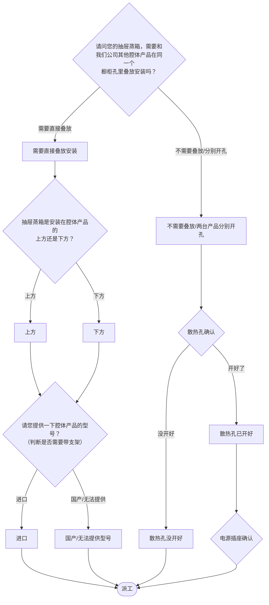

# BSH 抽屉蒸箱 — 安装引导手册

## 一、文档使用说明

### 执行铁律

1. **严格按步骤顺序执行**
2. **话术原文朗读**，不得改写
3. **每步执行前对照 Mermaid 边验证**

### 执行约定标记

| 标记 | 含义 |
|------|------|
| `【话术】` | 逐字朗读给用户 |
| `【判断】` | 根据用户回答进入分支 |
| `【派工】` | 安排工程师上门 |
| `【备注模板】` | 派工时必须带入系统的申请备注 |
| `【提醒】` | 内部信息，不对用户播报 |
| `【发短信】` | 调用阿里云短信接口（品牌→SMS_CODE） |

---

## 二、安装引导导航树

### Mermaid 源码



### 步骤 ↔ 节点速查表

| 引导步骤 | Mermaid 节点 | 步骤类型 | 预期下一节点 |
|---------|-------------|---------|------------|
| I01 | `STD_01` | 判断（是否叠放） | `STD_02` / `STD_03` |
| I02 | `STD_04` | 判断（上方/下方） | `STD_05` / `STD_06` |
| I03 | `STD_07` | 判断（腔体型号） | `STD_08` / `STD_09` |
| I04 | `STD_10` | 判断（散热孔） | `STD_11` / `STD_12` |
| I05 | `STD_13` | 判断（电源插座） | `STD_14` |

---

## 三、越界处理协议

### 触发条件

1. 用户产品不是抽屉蒸箱
2. 用户回答无法映射到任何条件行
3. 用户询问非安装问题
4. 用户情绪激烈/要求投诉
5. 非BSH的腔体产品不可以叠加

### 退出动作

- 属于烤箱/蒸箱 → `【引用】→ BSH_INST_I09_烤箱蒸箱.md`
- 属于其他产品 → 返回索引文件重新分流
- 无法定位 → 转人工客服

### 严禁行为

- 禁止非BSH腔体产品叠加安装
- 禁止未确认型号就判断是否需要支架

---

## 四、引导入口

用户来电表示抽屉蒸箱需要安装 → 进入 **I01**。

---

## 五、引导步骤详情

### I01 — 是否叠放安装

`[节点：STD_01]`

【话术】
> 请问您的抽屉蒸箱，需要和我们公司其他腔体产品在同一个橱柜孔里叠放安装吗？（同一橱柜孔安装两台机器是指：两台机器直接叠放安装中间不加装层板）

【判断】

| 条件 | 下一步 | 出口类型 | Mermaid 边验证 |
|------|--------|---------|--------------|
| 需要直接叠放安装 | → **I02** | 继续引导 | `STD_01 --需要直接叠放--> STD_02` ✓ |
| 不需要叠放 / 两台产品分别开孔 | → **I04**（散热孔确认） | 继续引导 | `STD_01 --不需要叠放/分别开孔--> STD_03` ✓ |
| 其他无法识别 | →【越界退出】 | 越界 | 无对应边 |

---

### I02 — 叠放位置确认

`[节点：STD_04]`

【话术】
> 抽屉蒸箱是安装在腔体产品的上方还是下方？

【提醒】备注：【携带组合安装支架】

【判断】

| 条件 | 下一步 | 出口类型 | Mermaid 边验证 |
|------|--------|---------|--------------|
| 上方 | → **I03** | 继续引导 | `STD_04 --上方--> STD_05` ✓ |
| 下方 | → **I03** | 继续引导 | `STD_04 --下方--> STD_06` ✓ |
| 其他无法识别 | →【越界退出】 | 越界 | 无对应边 |

【提醒】非BSH的腔体不可以叠加。

---

### I03 — 腔体产品型号确认

`[节点：STD_07]`

【话术】
> 请您提供一下腔体产品的型号？

（判断叠加型号是否需要带支架）

【判断】

| 条件 | 下一步 | 出口类型 | Mermaid 边验证 |
|------|--------|---------|--------------|
| 进口 | → 派工（备注：携带组合安装支架） | 派工 | `STD_07 --进口--> STD_08` ✓ |
| 国产 / 无法提供型号 | → 派工（备注：携带组合安装支架） | 派工 | `STD_07 --国产/无法提供--> STD_09` ✓ |
| 其他无法识别 | →【越界退出】 | 越界 | 无对应边 |

【提醒】点击查看《型号清单表》确认是否需要带支架。

【派工】 → 结束

---

### I04 — 散热孔确认（非叠放）

`[节点：STD_10]`

【话术】
> 请问橱柜的散热孔开好了吗？

【提醒】什么是散热孔：通风散热，确保空气流通。散热孔深度建议开35毫米。

【判断】

| 条件 | 下一步 | 出口类型 | Mermaid 边验证 |
|------|--------|---------|--------------|
| 开好了 | → **I05**（电源确认） | 继续引导 | `STD_10 --开好了--> STD_11` ✓ |
| 没开好 | → 派工（工程师开孔） | 派工 | `STD_10 --没开好--> STD_12` ✓ |
| 其他无法识别 | →【越界退出】 | 越界 | 无对应边 |

---

### I05 — 电源插座确认（非叠放）

`[节点：STD_13]`

【话术】
> 请问有没有在相邻的橱柜里安装好电源插座？

【派工】 → 结束

---

## 附录 A：申请备注模板汇总

| 场景 | 备注模板 |
|------|---------|
| 叠放安装+携带支架 | `携带组合安装支架` |
| 非叠放+散热孔已开 | （标准派工） |
| 非叠放+散热孔未开 | `需工程师开散热孔` |

---

## 附录 B：材料费用与短信接口汇总

| 材料 | 说明 |
|------|------|
| 组合安装支架 | 叠放安装时使用 |

### 短信接口

| 品牌 | SMS_CODE | 短信内容摘要 |
|------|----------|-------------|
| 西门子 | 347 | 抽屉蒸箱安装环境 |
| 博世 | 348 | 抽屉蒸箱安装环境 |

---

## ASCII 路径图

```
I01 是否叠放安装？
 ├─ 需要叠放 → I02 上方还是下方？
 │   ├─ 上方 → I03 腔体型号？→【派工】带支架
 │   └─ 下方 → I03 腔体型号？→【派工】带支架
 └─ 不需要叠放 → I04 散热孔确认
     ├─ 开好了 → I05 电源确认 →【派工】
     └─ 没开好 →【派工】工程师开孔
```
