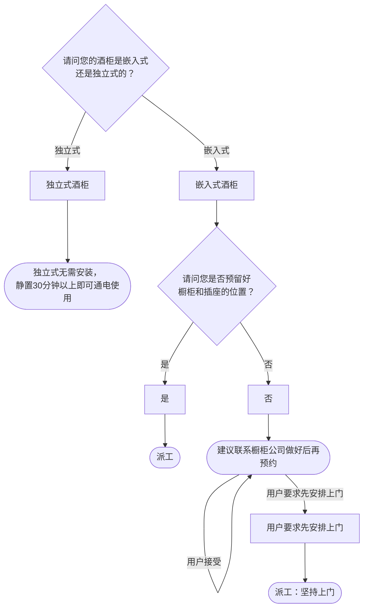

# BSH 酒柜 — 安装引导手册

## 一、文档使用说明

### 执行铁律

1. **严格按步骤顺序执行**，不得跳步
2. **话术原文朗读**，不得改写
3. **每步执行前对照 Mermaid 边验证**

### 执行约定标记

| 标记 | 含义 |
|------|------|
| `【话术】` | 逐字朗读给用户 |
| `【判断】` | 根据用户回答进入分支 |
| `【派工】` | 安排工程师上门 |
| `【备注模板】` | 派工时必须带入系统的申请备注 |
| `【提醒】` | 内部信息，不对用户播报 |

---

## 二、安装引导导航树

### Mermaid 源码



### 步骤 ↔ 节点速查表

| 引导步骤 | Mermaid 节点 | 步骤类型 | 预期下一节点 |
|---------|-------------|---------|------------|
| I01 | `WC_01` | 判断（嵌入/独立） | `WC_02` / `WC_03` |
| I02 | `WC_05` | 判断（橱柜+插座） | `WC_06` / `WC_07` |

---

## 三、越界处理协议

### 触发条件

1. 用户产品不是酒柜
2. 用户回答无法映射到任何条件行
3. 用户询问非安装问题
4. 用户情绪激烈/要求投诉

### 退出动作

- 属于冰箱 → `【引用】→ BSH_INST_I04_冰箱.md`
- 属于其他产品 → 返回索引文件重新分流
- 无法定位 → 转人工客服

---

## 四、引导入口

用户来电表示酒柜需要安装 → 进入 **I01**。

---

## 五、引导步骤详情

### I01 — 酒柜类型确认

`[节点：WC_01]`

【话术】
> 请问您的酒柜是嵌入式还是独立式的？

【判断】

| 条件 | 下一步 | 出口类型 | Mermaid 边验证 |
|------|--------|---------|--------------|
| 独立式 | → 告知无需安装 | 结束 | `WC_01 --独立式--> WC_02` ✓ |
| 嵌入式 | → **I02** | 继续引导 | `WC_01 --嵌入式--> WC_03` ✓ |
| 其他无法识别 | →【越界退出】 | 越界 | 无对应边 |

**分支 — 独立式**：

【话术】
> 独立式酒柜，出厂前已经调试好，只需要静置30分钟以上就可以通电使用。

→ 生成信息咨询（结束）

---

### I02 — 橱柜与插座确认（嵌入式）

`[节点：WC_05]`

【话术】
> 请问您是否预留好橱柜和插座的位置？

【判断】

| 条件 | 下一步 | 出口类型 | Mermaid 边验证 |
|------|--------|---------|--------------|
| 是 | → 派工 | 派工 | `WC_05 --是--> WC_06` ✓ |
| 否 | → 建议暂缓 | 暂缓 | `WC_05 --否--> WC_07` ✓ |
| 其他无法识别 | →【越界退出】 | 越界 | 无对应边 |

**分支 — 是**：

【派工】 → 结束

**分支 — 否**：

【话术】
> 建议您先联系橱柜公司，做好橱柜之后，再来电预约安装。

【判断】

| 条件 | 下一步 | 出口类型 |
|------|--------|---------|
| 用户接受 | → 生成信息咨询（结束） | 结束 |
| 用户要求先安排上门 | → 派工 | 派工 |
| 其他无法识别 | →【越界退出】 | 越界 |

【派工】（用户坚持上门）→ 结束

---

## 附录 A：申请备注模板汇总

| 场景 | 备注模板 |
|------|---------|
| 嵌入式+橱柜已预留 | `嵌入式酒柜安装，橱柜和插座已预留` |
| 嵌入式+橱柜未准备好 | `橱柜或插座未准备好，BSH建议用户暂缓安装` |
| 嵌入式+用户坚持上门 | `橱柜或插座未准备好，用户坚持要求上门` |

---

## 附录 B：材料费用与短信接口汇总

（酒柜安装无特殊材料费和短信接口）

---

## ASCII 路径图

```
I01 酒柜类型确认
 ├─ 独立式 → 无需安装，静置30分钟通电即可（结束）
 └─ 嵌入式 → I02 橱柜+插座确认
     ├─ 是（已预留）→【派工】
     └─ 否 → 建议联系橱柜公司
         ├─ 用户接受 → 生成信息咨询（结束）
         └─ 用户要求先上门 →【派工】
```
