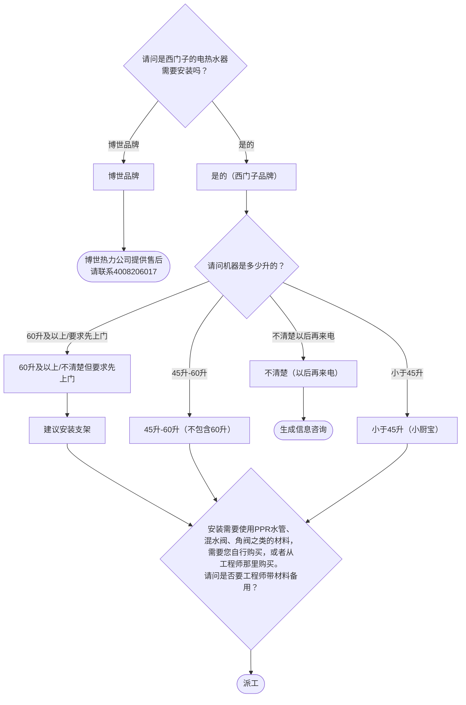

# BSH 电热水器 — 安装引导手册

## 一、文档使用说明

### 执行铁律

1. **严格按步骤顺序执行**，不得跳步
2. **话术原文朗读**，不得改写
3. **每步执行前对照 Mermaid 边验证**

### 执行约定标记

| 标记 | 含义 |
|------|------|
| `【话术】` | 逐字朗读给用户 |
| `【判断】` | 根据用户回答进入分支 |
| `【派工】` | 安排工程师上门 |
| `【备注模板】` | 派工时必须带入系统的申请备注 |
| `【材料确认】` | 确认是否需要工程师带材料 |
| `【提醒】` | 内部信息，不对用户播报 |

---

## 二、安装引导导航树

### Mermaid 源码



### 步骤 ↔ 节点速查表

| 引导步骤 | Mermaid 节点 | 步骤类型 | 预期下一节点 |
|---------|-------------|---------|------------|
| I01 | `WH_01` | 判断（品牌确认） | `WH_02` / `WH_03` |
| I02 | `WH_05` | 判断（容量） | `WH_06` / `WH_07` / `WH_08` / `WH_09` |
| I03 | `WH_12` | 材料确认 | `WH_13` |

---

## 三、越界处理协议

### 触发条件

1. 用户产品不是电热水器
2. 用户回答无法映射到任何条件行
3. 用户询问非安装问题
4. 用户情绪激烈/要求投诉
5. 博世品牌热水器（非西门子服务范围）

### 退出动作

- 博世品牌 → 转至 4008206017（博世热力公司）
- 属于其他产品 → 返回索引文件重新分流
- 无法定位 → 转人工客服

### 严禁行为

- 禁止为博世品牌热水器进行报装/报修
- 禁止未确认容量就判断是否需要支架

---

## 四、引导入口

用户来电表示电热水器需要安装 → 进入 **I01**。

---

## 五、引导步骤详情

### I01 — 品牌确认

`[节点：WH_01]`

【话术】
> 请问是西门子的电热水器需要安装吗？

【判断】

| 条件 | 下一步 | 出口类型 | Mermaid 边验证 |
|------|--------|---------|--------------|
| 是的（西门子品牌） | → **I02** | 继续引导 | `WH_01 --是的--> WH_02` ✓ |
| 博世品牌 | → 转博世热力公司 | 转接 | `WH_01 --博世品牌--> WH_03` ✓ |
| 其他无法识别 | →【越界退出】 | 越界 | 无对应边 |

**分支 — 博世品牌**：

【话术】
> 该产品售后服务由博世热力公司提供，请您联系4008206017，拨打后按"1"即可报装、报修或咨询。

→ 生成信息咨询（结束）

---

### I02 — 容量确认

`[节点：WH_05]`

【话术】
> 请问机器是多少升的？

【判断】

| 条件 | 下一步 | 出口类型 | Mermaid 边验证 |
|------|--------|---------|--------------|
| 60升及以上 / 不清楚但要求先上门 | → 告知支架建议 → **I03** | 继续引导 | `WH_05 --60升及以上/要求先上门--> WH_06` ✓ |
| 45升-60升（不包含60升） | → **I03** | 继续引导 | `WH_05 --45升-60升--> WH_07` ✓ |
| 小于45升（小厨宝） | → **I03** | 继续引导 | `WH_05 --小于45升--> WH_08` ✓ |
| 不清楚（以后再来电） | → 生成信息咨询（结束） | 结束 | `WH_05 --不清楚以后再来电--> WH_09` ✓ |
| 其他无法识别 | →【越界退出】 | 越界 | 无对应边 |

**分支 — 60升及以上**：

【话术】
> 容积大于等于60升的热水器，为了确保安全使用，建议安装支架。工程师上门后会根据实际情况给您更准确的建议，如果使用到材料，会收取材料费。

▶ 进入 **I03**

**分支 — 不清楚（以后再来电）**：

【话术】
> 好的，您确认好了再来电预约安装。

→ 生成信息咨询（结束）

---

### I03 — 材料确认

`[节点：WH_12]`

【话术】
> 安装需要使用PPR水管、混水阀、角阀之类的材料，需要您自行购买，或者从工程师那里购买。请问是否要工程师带材料备用？

【判断】

| 条件 | 下一步 | 出口类型 |
|------|--------|---------|
| 需要工程师带材料 | → 派工（备注带材料） | 派工 |
| 用户自行购买 | → 派工 | 派工 |
| 其他无法识别 | →【越界退出】 | 越界 |

【派工】 → 结束

---

## 附录 A：申请备注模板汇总

| 场景 | 备注模板 |
|------|---------|
| ≥60升+带材料 | `电热水器安装，建议安装支架，带PPR水管、混水阀、角阀备用` |
| ≥60升+用户自备材料 | `电热水器安装，建议安装支架` |
| 45-60升+带材料 | `电热水器安装，带PPR水管、混水阀、角阀备用` |
| 45-60升+用户自备材料 | `电热水器安装` |
| <45升（小厨宝）+带材料 | `小厨宝安装，带PPR水管、混水阀、角阀备用` |
| <45升（小厨宝）+用户自备材料 | `小厨宝安装` |

---

## 附录 B：材料费用与短信接口汇总

| 材料 | 说明 |
|------|------|
| PPR水管 | 热水器安装必需 |
| 混水阀 | 热水器安装必需 |
| 角阀 | 热水器安装必需 |
| 安装支架 | ≥60升建议安装 |

（电热水器安装无短信接口）

---

## ASCII 路径图

```
I01 品牌确认
 ├─ 西门子 → I02 容量确认
 │   ├─ ≥60升/要求先上门 → 建议支架 → I03 材料确认 →【派工】
 │   ├─ 45-60升 → I03 材料确认 →【派工】
 │   ├─ <45升（小厨宝）→ I03 材料确认 →【派工】
 │   └─ 不清楚（以后再来电）→ 生成信息咨询（结束）
 └─ 博世品牌 → 转4008206017博世热力公司（结束）
```
