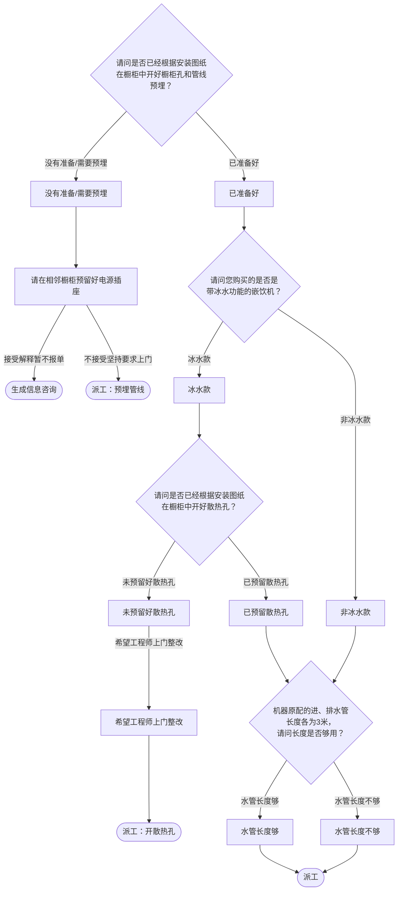

# BSH 净饮机（嵌入式） — 安装引导手册

## 一、文档使用说明

### 执行铁律

1. **严格按步骤顺序执行**，不得跳步
2. **话术原文朗读**，不得改写
3. **每步执行前对照 Mermaid 边验证**

### 执行约定标记

| 标记 | 含义 |
|------|------|
| `【话术】` | 逐字朗读给用户 |
| `【判断】` | 根据用户回答进入分支 |
| `【派工】` | 安排工程师上门 |
| `【备注模板】` | 派工时必须带入系统的申请备注 |
| `【提醒】` | 内部信息，不对用户播报 |

---

## 二、安装引导导航树

### Mermaid 源码



### 步骤 ↔ 节点速查表

| 引导步骤 | Mermaid 节点 | 步骤类型 | 预期下一节点 |
|---------|-------------|---------|------------|
| I01 | `WP_01` | 判断（橱柜孔+管线预埋） | `WP_02` / `WP_03` |
| I02 | `WP_07` | 判断（冰水/非冰水） | `WP_08` / `WP_09` |
| I03 | `WP_10` | 判断（散热孔） | `WP_11` / `WP_12` |
| I04 | `WP_15` | 判断（水管长度） | `WP_16` / `WP_17` |

---

## 三、越界处理协议

### 触发条件

1. 用户产品不是嵌入式净饮机
2. 用户回答无法映射到任何条件行
3. 用户询问非安装问题
4. 用户情绪激烈/要求投诉

### 退出动作

- 属于其他产品 → 返回索引文件重新分流
- 无法定位 → 转人工客服

### 严禁行为

- 禁止冰水款未确认散热孔就派工（会导致过热保护报警）
- 禁止未确认管线预埋就派工

---

## 四、引导入口

用户来电表示净饮机/嵌饮机需要安装 → 进入 **I01**。

---

## 五、引导步骤详情

### I01 — 橱柜孔与管线预埋确认

`[节点：WP_01]`

【话术】
> 请问是否已经根据安装图纸在橱柜中开好橱柜孔和管线预埋？

【判断】

| 条件 | 下一步 | 出口类型 | Mermaid 边验证 |
|------|--------|---------|--------------|
| 已准备好 | → **I02** | 继续引导 | `WP_01 --已准备好--> WP_02` ✓ |
| 没有准备/需要预埋 | → 建议暂缓/派工预埋 | 暂缓/派工 | `WP_01 --没有准备/需要预埋--> WP_03` ✓ |
| 其他无法识别 | →【越界退出】 | 越界 | 无对应边 |

**分支 — 没有准备/需要预埋**：

【话术】
> 请在相邻橱柜预留好电源插座，以方便工程师上门安装完成后为您试机。

【判断】

| 条件 | 下一步 | 出口类型 |
|------|--------|---------|
| 接受解释，暂不报单 | → 生成信息咨询（结束） | 结束 |
| 不接受，坚持要求上门 | → 派工（预埋管线） | 派工 |
| 其他无法识别 | →【越界退出】 | 越界 |

【派工】（预埋管线）→ 结束

---

### I02 — 冰水功能确认

`[节点：WP_07]`

【话术】
> 请问您购买的是否是带冰水功能的嵌饮机？

【提醒】型号中第四个英文字母为C代表带有冰水功能，例如 WS7060BC1C、WBB8060C1C。如用户表示不清楚且不配合确认，请走冰水款通道。

【判断】

| 条件 | 下一步 | 出口类型 | Mermaid 边验证 |
|------|--------|---------|--------------|
| 冰水款 | → **I03**（散热孔确认） | 继续引导 | `WP_07 --冰水款--> WP_08` ✓ |
| 非冰水款 | → **I04**（水管长度确认） | 继续引导 | `WP_07 --非冰水款--> WP_09` ✓ |
| 其他无法识别 | →【越界退出】 | 越界 | 无对应边 |

---

### I03 — 散热孔确认（冰水款）

`[节点：WP_10]`

【话术】
> 请问是否已经根据安装图纸在橱柜中开好散热孔？

【提醒】有冰水功能的嵌饮机，压缩机在制冷过程中，会向周边散发出大量热量。如果没有通风孔对外散热，可能会导致机器过热保护报警，机器将停止冰水功能。因此，没有预留通风孔或者不满足通风要求的，我们无法安装。

【判断】

| 条件 | 下一步 | 出口类型 | Mermaid 边验证 |
|------|--------|---------|--------------|
| 已预留散热孔 | → **I04**（水管长度确认） | 继续引导 | `WP_10 --已预留散热孔--> WP_11` ✓ |
| 未预留好散热孔 | → 建议开孔 | 暂缓/派工 | `WP_10 --未预留好散热孔--> WP_12` ✓ |
| 其他无法识别 | →【越界退出】 | 越界 | 无对应边 |

**分支 — 未预留好散热孔**：

【话术】
> 您可以联系橱柜公司开孔，工程师也可以提供开孔服务。

【判断】

| 条件 | 下一步 | 出口类型 |
|------|--------|---------|
| 希望工程师上门整改 | → 派工（开散热孔） | 派工 |
| 用户自行联系橱柜公司 | → 生成信息咨询（结束） | 结束 |
| 其他无法识别 | →【越界退出】 | 越界 |

【提醒】工程师上门开散热孔免上门费、人工费，如用到通风格栅（装饰用）等材料收取材料费。

【派工】（开散热孔）→ 结束

---

### I04 — 水管长度确认

`[节点：WP_15]`

【话术】
> 机器原配的进、排水管长度各为3米，请问长度是否够用？

【判断】

| 条件 | 下一步 | 出口类型 | Mermaid 边验证 |
|------|--------|---------|--------------|
| 水管长度够 | → 派工 | 派工 | `WP_15 --水管长度够--> WP_16` ✓ |
| 水管长度不够 | → 派工（备注加长水管） | 派工 | `WP_15 --水管长度不够--> WP_17` ✓ |
| 其他无法识别 | →【越界退出】 | 越界 | 无对应边 |

【话术】（确认电源）
> 请在相邻橱柜预留好电源插座，以方便工程师上门安装完成后为您试机。

【派工】 → 结束

---

## 附录 A：申请备注模板汇总

| 场景 | 备注模板 |
|------|---------|
| 管线未预埋，坚持上门 | `管线未预埋，用户坚持要求上门预埋` |
| 冰水款+散热孔已开+水管够 | `冰水款嵌饮机安装，散热孔已开好` |
| 冰水款+散热孔已开+水管不够 | `冰水款嵌饮机安装，散热孔已开好，需加长水管` |
| 冰水款+散热孔未开（工程师整改） | `冰水款嵌饮机，散热孔未开好，需工程师开散热孔` |
| 非冰水款+水管够 | `非冰水款嵌饮机安装` |
| 非冰水款+水管不够 | `非冰水款嵌饮机安装，需加长水管` |

---

## 附录 B：材料费用与短信接口汇总

| 材料 | 说明 | 费用 |
|------|------|------|
| 通风格栅 | 装饰用，开散热孔时可能用到 | 收取材料费 |
| 加长水管 | 原配3米不够时需要 | 收取材料费 |

### 短信接口

（待新增发短信链路，当前版本暂无 SMS_CODE）

---

## 附录 C：冰水款型号识别规则

| 规则 | 说明 |
|------|------|
| 型号第四个英文字母为 `C` | 代表带冰水功能 |
| 示例 | WS7060B**C**1C、WBB8060**C**1C |
| 用户不清楚且不配合确认时 | 按冰水款通道执行（更严格） |

---

## ASCII 路径图

```
I01 橱柜孔+管线预埋确认
 ├─ 已准备好 → I02 冰水功能确认
 │   ├─ 冰水款 → I03 散热孔确认
 │   │   ├─ 已预留散热孔 → I04 水管长度确认
 │   │   │   ├─ 水管够 →【派工】
 │   │   │   └─ 水管不够 →【派工】加长水管
 │   │   └─ 未预留好散热孔 → 建议开孔
 │   │       ├─ 工程师整改 →【派工】开散热孔
 │   │       └─ 用户自行联系 → 生成信息咨询（结束）
 │   └─ 非冰水款 → I04 水管长度确认
 │       ├─ 水管够 →【派工】
 │       └─ 水管不够 →【派工】加长水管
 └─ 没有准备/需要预埋 → 建议暂缓
     ├─ 接受暂不报单 → 生成信息咨询（结束）
     └─ 坚持要求上门 →【派工】预埋管线
```
