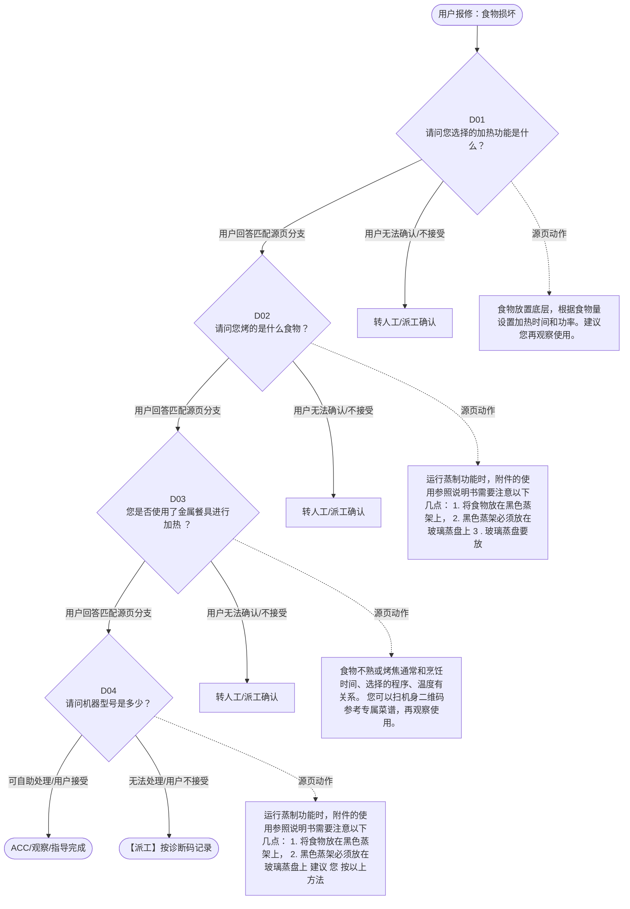

# BSH 微蒸烤 — 食物损坏 诊断手册

**故障编号**：F03 | **节点前缀**：FD | **来源**：PPT Slide 4
**适用诊断码**：`C31000000000`
**转换状态**：自动批处理草案，需按源 PPT 视觉关系复核后生产使用

---

## 一、文档使用说明

### 三条执行铁律

1. **不越界**：只执行本文件定义的诊断步骤；遇到超出范围的问题，执行越界协议（见第三节），不得自行延伸
2. **不编造**：话术原文不得改写、补充或省略；不在本文件中的诊断码不得使用
3. **不跳步**：严格按 D 步骤顺序执行，不得跳过中间步骤直接给出结论

### 执行约定标记表

| 标记 | 含义 |
|------|------|
| `【话术】` | 逐字朗读给用户的诊断引导话术 |
| `【判断】` | 根据用户回答或系统数据触发的条件分支 |
| `【诊断码】` | BSH 标准诊断码 |
| `【派工】` | 安排工程师上门 |
| `【配件】` | 预判所需配件 |
| `【视频】` | 视频辅助标记 |
| `【引用】` | 跨故障树引用跳转 |
| `【解释】` | 向用户解释原理/现象 |
| `【操作指导】` | 指导用户自行操作 |
| `▶` | 无条件进入下一步 |

---

## 二、故障诊断导航树

### Mermaid 源码



### 诊断步骤 ↔ 节点速查表

| 步骤 | 节点 ID | 节点类型 | 简述 |
| --- | --- | --- | --- |
| 入口 | FD_START | 起始 | 用户报修：食物损坏 |
| D01 | FD_D01 | 判断 | FD_D02 / FD_MANUAL01 |
| D02 | FD_D02 | 判断 | FD_D03 / FD_MANUAL02 |
| D03 | FD_D03 | 判断 | FD_D04 / FD_MANUAL03 |
| D04 | FD_D04 | 判断 | FD_ACC / FD_DISPATCH |
| 结束-ACC | FD_ACC | 结束 | 用户接受/观察/指导完成 |
| 结束-派工 | FD_DISPATCH | 派工 | 无法处理或用户不接受 |

---

## 三、越界处理协议

### 触发条件（满足以下任意一条即触发越界）

| # | 触发场景 |
|---|---------|
| 1 | 用户故障描述无法映射到当前诊断树的任何入口分支 |
| 2 | 用户回答无法映射到当前 D 步骤的任何条件行 |
| 3 | 目标跳转节点在 Mermaid 图中无有效连线或仍需视觉确认 |
| 4 | 用户要求提供本文档未包含的信息，如价格、保修政策、投诉升级 |
| 5 | 用户描述涉及焦味、冒烟、漏电、跳闸、进水等安全风险 |
| 6 | 用户要求自行拆机、维修、改线或更换内部零部件 |

### 退出动作

- 若属于其他故障树：执行 `【引用】` 跳转或回到索引重新分流
- 若无法定位：转人工客服
- 若存在安全风险：停止在线指导并安排工程师或人工处理

### 严禁行为

- 严禁自行判断主板、电源板、电机、压缩机等内部零部件级故障
- 严禁改写源 PPT 话术作为确定结论
- 严禁在用户尚未回答当前问题时跳至下一步

### 覆盖范围

本故障树仅覆盖 `食物损坏` 相关诊断。其他故障现象应回到 `CMO` 索引重新分流。

---

## 四、诊断入口

### 故障主诉确认

- 用户描述与 `食物损坏` 相关。
- 命中索引关键词：食物损坏, 烹饪问题, 食物不熟, 烤焦, 优化版, C3100。
- 来源页：Slide 4。

### 入口分支判断

```
用户报修“食物损坏”
│
├── 主诉匹配当前树 → 进入 D01
├── 主诉属于其他故障 → 回到索引执行跨树引用
└── 主诉不明确 → 先追问具体显示/部位/现象
```

---

## 五、诊断步骤详情

### D01 — 请问您选择的加热功能是什么？

**[节点：FD_D01]**

**【话术】**：
> "请问您选择的加热功能是什么？"

**判断表**：

| 条件 | 下一步 | 出口类型 | Mermaid 边验证 |
| --- | --- | --- | --- |
| 用户回答匹配源页下一分支 | D02 | 继续诊断 | FD_D01 → D02（自动草案，待视觉确认） |
| 用户接受解释/操作/观察 | 结束 | ACC | FD_D01 → ACC（待视觉确认） |
| 用户不接受 / 无法操作 / 风险场景 | 派工或转人工 | 派工 | FD_D01 → DISPATCH（待视觉确认） |
| **兜底越界**：其他无法识别的输入 | 越界协议 | 越界 | 无对应 Mermaid 边 |


### D02 — 请问您烤的是什么食物？

**[节点：FD_D02]**

**【话术】**：
> "请问您烤的是什么食物？"

**判断表**：

| 条件 | 下一步 | 出口类型 | Mermaid 边验证 |
| --- | --- | --- | --- |
| 用户回答匹配源页下一分支 | D03 | 继续诊断 | FD_D02 → D03（自动草案，待视觉确认） |
| 用户接受解释/操作/观察 | 结束 | ACC | FD_D02 → ACC（待视觉确认） |
| 用户不接受 / 无法操作 / 风险场景 | 派工或转人工 | 派工 | FD_D02 → DISPATCH（待视觉确认） |
| **兜底越界**：其他无法识别的输入 | 越界协议 | 越界 | 无对应 Mermaid 边 |


### D03 — 您是否使用了金属餐具进行加热 ？

**[节点：FD_D03]**

**【话术】**：
> "您是否使用了金属餐具进行加热 ？"

**判断表**：

| 条件 | 下一步 | 出口类型 | Mermaid 边验证 |
| --- | --- | --- | --- |
| 用户回答匹配源页下一分支 | D04 | 继续诊断 | FD_D03 → D04（自动草案，待视觉确认） |
| 用户接受解释/操作/观察 | 结束 | ACC | FD_D03 → ACC（待视觉确认） |
| 用户不接受 / 无法操作 / 风险场景 | 派工或转人工 | 派工 | FD_D03 → DISPATCH（待视觉确认） |
| **兜底越界**：其他无法识别的输入 | 越界协议 | 越界 | 无对应 Mermaid 边 |


### D04 — 请问机器型号是多少？

**[节点：FD_D04]**

**【话术】**：
> "请问机器型号是多少？"

**判断表**：

| 条件 | 下一步 | 出口类型 | Mermaid 边验证 |
| --- | --- | --- | --- |
| 用户回答匹配源页下一分支 | ACC / 派工 | 继续诊断 | FD_D04 → ACC / 派工（自动草案，待视觉确认） |
| 用户接受解释/操作/观察 | 结束 | ACC | FD_D04 → ACC（待视觉确认） |
| 用户不接受 / 无法操作 / 风险场景 | 派工或转人工 | 派工 | FD_D04 → DISPATCH（待视觉确认） |
| **兜底越界**：其他无法识别的输入 | 越界协议 | 越界 | 无对应 Mermaid 边 |


### 源页动作/结果摘录

- 食物放置底层，根据食物量设置加热时间和功率。建议您再观察使用。
- 运行蒸制功能时，附件的使用参照说明书需要注意以下几点： 1. 将食物放在黑色蒸架上， 2. 黑色蒸架必须放在玻璃蒸盘上 3 . 玻璃蒸盘要放在第三层。 建议您按以上方法，扫描机身二维码参考专属菜谱再试一下。
- 食物不熟或烤焦通常和烹饪时间、选择的程序、温度有关系。 您可以扫机身二维码参考专属菜谱，再观察使用。
- 运行蒸制功能时，附件的使用参照说明书需要注意以下几点： 1. 将食物放在黑色蒸架上， 2. 黑色蒸架必须放在玻璃蒸盘上 建议 您 按以上方法，扫描 机身二维码参考专属菜谱再试一下 。
- 视频：无需
- 食物不熟或烤焦通常和烹饪时间、选择的程序、温度有关系。建议您选择热风 程序 。 也可以 扫机身二维码参考专属菜谱，再观察使用
- 机器主要是上加热管工作，建议烤制薄片状食物，烤架放第三层，同时需要及时查看食物状态，定时翻面，避免食物烤焦或烤不熟。您也可以扫描机身二维码参考专属菜谱，再观察使用。
- 视频 ：视频 1- 无 视频 2- 无
- 提醒： 蒸馒头、包子建议使用自动程序，确保烹饪效果。
- 您可以打开机器门，在机身侧面条形码上可以看到型号。型号以 CO 开头的机器不适合做糕点类烘焙。其它机器食物烤不熟或烤焦通常和烹饪时间、选择的程序、温度有关系。您可以扫机身二维码参考专属菜谱再观察使用。

---

## 附录 A：诊断码汇总表

| 诊断码 | 描述 | 触发步骤 | 备注 |
| --- | --- | --- | --- |
| `C31000000000` | 见源 PPT 相邻文本 | 源页派工/判断节点 | 自动抽取，待人工核对英文/中文描述 |

---

## 附录 B：配件建议汇总表

| 配件名称 | 关联步骤 | 说明 |
| --- | --- | --- |
| 源页未明确 | 派工出口 | 按源 PPT 派工节点记录，待视觉确认 |

---

## 附录 C：跨故障树引用清单

| 引用方向 | 触发条件 | 目标文件 | 目标诊断码 |
| --- | --- | --- | --- |
| 无明确跨树引用 | — | — | — |

---

## 附录 D：源页文本摘录（用于复核）

- Internal
- 烹饪问题 - 食物不熟 / 烤焦 优化版
- C31000000000 Uneven heating / baking result inadequate 加热不均 / 烘烤效果差
- 请问您选择的加热功能是什么？
- 烧烤功能、热风功能、热风烧烤
- 蒸制功能
- 微波功能
- 请问您烤的是什么食物？
- 您是否使用了金属餐具进行加热 ？
- 请问机器型号是多少？
- 2.0 型号
- 糕点类（蛋糕、蛋挞、饼干、曲奇等）
- 烤肉类（牛排、烤鸡翅、烤虾等）
- 1.0 型号
- 非金属餐具
- 金属餐具
- 其它
- 食物放置底层，根据食物量设置加热时间和功率。建议您再观察使用。
- 金属餐具微波是穿透不了的，请您使用玻璃或 者陶瓷餐具进行加热。
- 运行蒸制功能时，附件的使用参照说明书需要注意以下几点： 1. 将食物放在黑色蒸架上， 2. 黑色蒸架必须放在玻璃蒸盘上 3 . 玻璃蒸盘要放在第三层。 建议您按以上方法，扫描机身二维码参考专属菜谱再试一下。
- 食物不熟或烤焦通常和烹饪时间、选择的程序、温度有关系。 您可以扫机身二维码参考专属菜谱，再观察使用。
- 运行蒸制功能时，附件的使用参照说明书需要注意以下几点： 1. 将食物放在黑色蒸架上， 2. 黑色蒸架必须放在玻璃蒸盘上 建议 您 按以上方法，扫描 机身二维码参考专属菜谱再试一下 。
- CP 开头的型号
- CO 开头的型号
- C P 开头的型号
- C O 开头的型号
- 视频：无需
- 机器只有上加热管工作，没有热风功能，不适合做糕点类食材。但可以配合微波功能做一些对上色没有要求的蛋糕。
- 食物不熟或烤焦通常和烹饪时间、选择的程序、温度有关系。建议您选择热风 程序 。 也可以 扫机身二维码参考专属菜谱，再观察使用
- 机器主要是上加热管工作，建议烤制薄片状食物，烤架放第三层，同时需要及时查看食物状态，定时翻面，避免食物烤焦或烤不熟。您也可以扫描机身二维码参考专属菜谱，再观察使用。
- 视频 ：视频 1- 无 视频 2- 无
- 提醒： 蒸馒头、包子建议使用自动程序，确保烹饪效果。
- 您可以打开机器门，在机身侧面条形码上可以看到型号。型号以 CO 开头的机器不适合做糕点类烘焙。其它机器食物烤不熟或烤焦通常和烹饪时间、选择的程序、温度有关系。您可以扫机身二维码参考专属菜谱再观察使用。
- 微蒸烤（三合一）故障树
- Page 5
