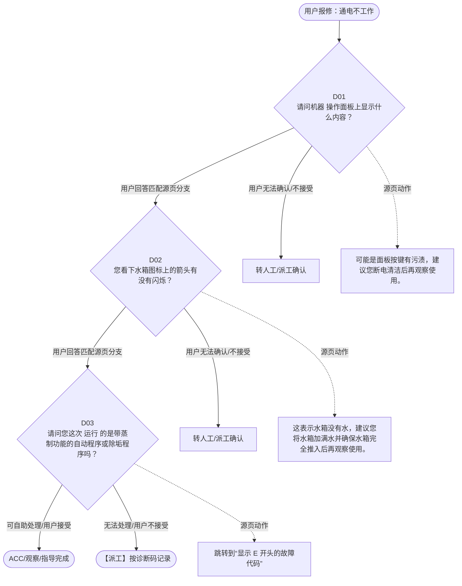

# BSH 微蒸烤 — 通电不工作 诊断手册

**故障编号**：F10 | **节点前缀**：NS4 | **来源**：PPT Slide 11
**适用诊断码**：`130000000000` / `17E000000X37` / `17E000000X13` / `17E000000AG9` / `A30CN4000000`
**转换状态**：自动批处理草案，需按源 PPT 视觉关系复核后生产使用

---

## 一、文档使用说明

### 三条执行铁律

1. **不越界**：只执行本文件定义的诊断步骤；遇到超出范围的问题，执行越界协议（见第三节），不得自行延伸
2. **不编造**：话术原文不得改写、补充或省略；不在本文件中的诊断码不得使用
3. **不跳步**：严格按 D 步骤顺序执行，不得跳过中间步骤直接给出结论

### 执行约定标记表

| 标记 | 含义 |
|------|------|
| `【话术】` | 逐字朗读给用户的诊断引导话术 |
| `【判断】` | 根据用户回答或系统数据触发的条件分支 |
| `【诊断码】` | BSH 标准诊断码 |
| `【派工】` | 安排工程师上门 |
| `【配件】` | 预判所需配件 |
| `【视频】` | 视频辅助标记 |
| `【引用】` | 跨故障树引用跳转 |
| `【解释】` | 向用户解释原理/现象 |
| `【操作指导】` | 指导用户自行操作 |
| `▶` | 无条件进入下一步 |

---

## 二、故障诊断导航树

### Mermaid 源码



### 诊断步骤 ↔ 节点速查表

| 步骤 | 节点 ID | 节点类型 | 简述 |
| --- | --- | --- | --- |
| 入口 | NS4_START | 起始 | 用户报修：通电不工作 |
| D01 | NS4_D01 | 判断 | NS4_D02 / NS4_MANUAL01 |
| D02 | NS4_D02 | 判断 | NS4_D03 / NS4_MANUAL02 |
| D03 | NS4_D03 | 判断 | NS4_ACC / NS4_DISPATCH |
| 结束-ACC | NS4_ACC | 结束 | 用户接受/观察/指导完成 |
| 结束-派工 | NS4_DISPATCH | 派工 | 无法处理或用户不接受 |

---

## 三、越界处理协议

### 触发条件（满足以下任意一条即触发越界）

| # | 触发场景 |
|---|---------|
| 1 | 用户故障描述无法映射到当前诊断树的任何入口分支 |
| 2 | 用户回答无法映射到当前 D 步骤的任何条件行 |
| 3 | 目标跳转节点在 Mermaid 图中无有效连线或仍需视觉确认 |
| 4 | 用户要求提供本文档未包含的信息，如价格、保修政策、投诉升级 |
| 5 | 用户描述涉及焦味、冒烟、漏电、跳闸、进水等安全风险 |
| 6 | 用户要求自行拆机、维修、改线或更换内部零部件 |

### 退出动作

- 若属于其他故障树：执行 `【引用】` 跳转或回到索引重新分流
- 若无法定位：转人工客服
- 若存在安全风险：停止在线指导并安排工程师或人工处理

### 严禁行为

- 严禁自行判断主板、电源板、电机、压缩机等内部零部件级故障
- 严禁改写源 PPT 话术作为确定结论
- 严禁在用户尚未回答当前问题时跳至下一步

### 覆盖范围

本故障树仅覆盖 `通电不工作` 相关诊断。其他故障现象应回到 `CMO` 索引重新分流。

---

## 四、诊断入口

### 故障主诉确认

- 用户描述与 `通电不工作` 相关。
- 命中索引关键词：通电不工作, 显示代码, 图标, 不通电, 显示屏, 有声音的信号问题。
- 来源页：Slide 11。

### 入口分支判断

```
用户报修“通电不工作”
│
├── 主诉匹配当前树 → 进入 D01
├── 主诉属于其他故障 → 回到索引执行跨树引用
└── 主诉不明确 → 先追问具体显示/部位/现象
```

---

## 五、诊断步骤详情

### D01 — 请问机器 操作面板上显示什么内容？

**[节点：NS4_D01]**

**【话术】**：
> "请问机器 操作面板上显示什么内容？"

**判断表**：

| 条件 | 下一步 | 出口类型 | Mermaid 边验证 |
| --- | --- | --- | --- |
| 用户回答匹配源页下一分支 | D02 | 继续诊断 | NS4_D01 → D02（自动草案，待视觉确认） |
| 用户接受解释/操作/观察 | 结束 | ACC | NS4_D01 → ACC（待视觉确认） |
| 用户不接受 / 无法操作 / 风险场景 | 派工或转人工 | 派工 | NS4_D01 → DISPATCH（待视觉确认） |
| **兜底越界**：其他无法识别的输入 | 越界协议 | 越界 | 无对应 Mermaid 边 |


### D02 — 您看下水箱图标上的箭头有没有闪烁？

**[节点：NS4_D02]**

**【话术】**：
> "您看下水箱图标上的箭头有没有闪烁？"

**判断表**：

| 条件 | 下一步 | 出口类型 | Mermaid 边验证 |
| --- | --- | --- | --- |
| 用户回答匹配源页下一分支 | D03 | 继续诊断 | NS4_D02 → D03（自动草案，待视觉确认） |
| 用户接受解释/操作/观察 | 结束 | ACC | NS4_D02 → ACC（待视觉确认） |
| 用户不接受 / 无法操作 / 风险场景 | 派工或转人工 | 派工 | NS4_D02 → DISPATCH（待视觉确认） |
| **兜底越界**：其他无法识别的输入 | 越界协议 | 越界 | 无对应 Mermaid 边 |


### D03 — 请问您这次 运行 的是带蒸制功能的自动程序或除垢程序吗？

**[节点：NS4_D03]**

**【话术】**：
> "请问您这次 运行 的是带蒸制功能的自动程序或除垢程序吗？"

**判断表**：

| 条件 | 下一步 | 出口类型 | Mermaid 边验证 |
| --- | --- | --- | --- |
| 用户回答匹配源页下一分支 | ACC / 派工 | 继续诊断 | NS4_D03 → ACC / 派工（自动草案，待视觉确认） |
| 用户接受解释/操作/观察 | 结束 | ACC | NS4_D03 → ACC（待视觉确认） |
| 用户不接受 / 无法操作 / 风险场景 | 派工或转人工 | 派工 | NS4_D03 → DISPATCH（待视觉确认） |
| **兜底越界**：其他无法识别的输入 | 越界协议 | 越界 | 无对应 Mermaid 边 |


### 源页动作/结果摘录

- 可能是面板按键有污渍，建议您断电清洁后再观察使用。
- 这表示水箱没有水，建议您将水箱加满水并确保水箱完全推入后再观察使用。
- 跳转到“显示 E 开头的故障代码”
- 这是滴水盒满了 , 建议您清空后再观察使用。
- 视频：无需
- 视频：视频 1- 无 视频： 视频 2- 无
- 视频：已有
- 建议您将水箱取出重新摆放。
- 这表示水箱需要加水了，建议您加水后再观察使用。
- 提醒：如提醒除钙或除钙未完成 ，蒸制功能无法使用。 建议完成除钙程序。
- 我为您安排工程师上门检查。

---

## 附录 A：诊断码汇总表

| 诊断码 | 描述 | 触发步骤 | 备注 |
| --- | --- | --- | --- |
| `130000000000` | 见源 PPT 相邻文本 | 源页派工/判断节点 | 自动抽取，待人工核对英文/中文描述 |
| `17E000000X37` | 见源 PPT 相邻文本 | 源页派工/判断节点 | 自动抽取，待人工核对英文/中文描述 |
| `17E000000X13` | 见源 PPT 相邻文本 | 源页派工/判断节点 | 自动抽取，待人工核对英文/中文描述 |
| `17E000000AG9` | 见源 PPT 相邻文本 | 源页派工/判断节点 | 自动抽取，待人工核对英文/中文描述 |
| `A30CN4000000` | 见源 PPT 相邻文本 | 源页派工/判断节点 | 自动抽取，待人工核对英文/中文描述 |

---

## 附录 B：配件建议汇总表

| 配件名称 | 关联步骤 | 说明 |
| --- | --- | --- |
| 源页未明确 | 派工出口 | 按源 PPT 派工节点记录，待视觉确认 |

---

## 附录 C：跨故障树引用清单

| 引用方向 | 触发条件 | 目标文件 | 目标诊断码 |
| --- | --- | --- | --- |
| 本树 → 到“显示 | 源页出现跳转提示 | 待索引映射 | — |

---

## 附录 D：源页文本摘录（用于复核）

- Internal
- 显示代码 / 图标
- 不通电
- 130000000000 Display, audible signal problem 显示屏 / 有声音的信号问题
- 通电不工作
- 请问机器 操作面板上显示什么内容？
- 水箱图 标闪烁
- 17E000000X37 Error: E5005 / E50-05
- 通电 不工作 （不工作 / 不加热 / 加热不足 / 中途停机）
- E0532
- 符号亮起，箭头闪烁
- 其它显示
- 显示童锁
- E5005
- Calc 或
- 烹饪问题 （食物不熟 / 烤焦）
- 可能是面板按键有污渍，建议您断电清洁后再观察使用。
- 这表示水箱没有水，建议您将水箱加满水并确保水箱完全推入后再观察使用。
- 您可以长按童锁键解锁。
- 跳转到“显示 E 开头的故障代码”
- 这是滴水盒满了 , 建议您清空后再观察使用。
- 您看下水箱图标上的箭头有没有闪烁？
- 这是提醒您需要进行除垢操作。请点击 微蒸烤一体机除垢清洁
- 食物不熟
- 蒸汽问题 （门玻璃夹层有蒸汽 / 蒸汽少 / 不出蒸汽）
- 视频：无需
- 蒸汽问题
- 盖板关不上 / 门关不上
- 视频：视频 1- 无 视频： 视频 2- 无
- 不带箭头的符号闪烁
- 视频：已有
- 图标亮起
- 按键问题 （无反应 / 不灵敏）
- 按键无反应
- 建议您将水箱取出重新摆放。
- 程序开始时，会提示用户检测水箱，如水箱有水按下开始键即可。
- 这表示水箱需要加水了，建议您加水后再观察使用。
- 17E000000X13 Error: E0532 / E05-32
- 提醒：如提醒除钙或除钙未完成 ，蒸制功能无法使用。 建议完成除钙程序。
- 积水 / 漏水
- 声音问题
- 水箱有水
- 白色粉末 / 白色物质流出
- 请问您这次 运行 的是带蒸制功能的自动程序或除垢程序吗？
- 自动程序
- 除垢程序
- 其他程序
- 调用自动程序时会提示用户检查水箱水是否加满（无论水箱里的水是否加满），避免出现中途加水的情况。如有水按下开始键即可。
- 运行除垢时机器会提醒用户检查水箱水是否加满（无论水箱里的水是否加满），避免出现中途加水的情况。如有水按下开始键即可。
- 我为您安排工程师上门检查。
- 17E000000AG9 Error: "No water in the pot" 错误 ：“锅里没有水 ”
- Page 4
- A30CN4000000 热水 / 蒸汽问题，无蒸汽产生
