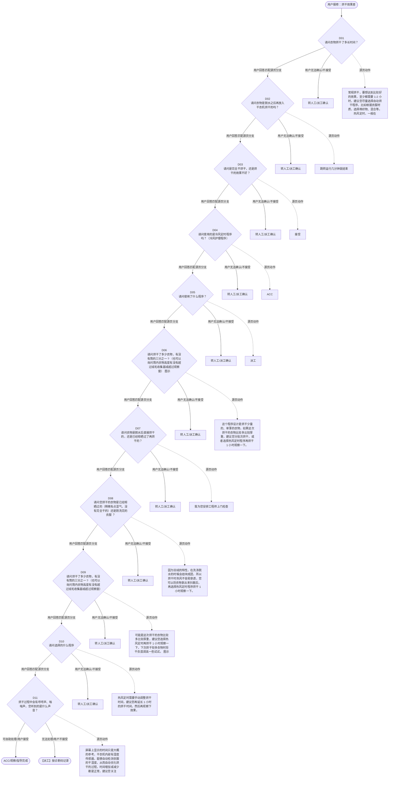

# BSH 干衣机 — 烘干效果差 诊断手册

**故障编号**：F03 | **节点前缀**：DR | **来源**：PPT Slides 4-7
**适用诊断码**：`A23100000000` / `A28300000000` / `140000000000` / `144000000000`
**转换状态**：自动批处理草案，需按源 PPT 视觉关系复核后生产使用

---

## 一、文档使用说明

### 三条执行铁律

1. **不越界**：只执行本文件定义的诊断步骤；遇到超出范围的问题，执行越界协议（见第三节），不得自行延伸
2. **不编造**：话术原文不得改写、补充或省略；不在本文件中的诊断码不得使用
3. **不跳步**：严格按 D 步骤顺序执行，不得跳过中间步骤直接给出结论

### 执行约定标记表

| 标记 | 含义 |
|------|------|
| `【话术】` | 逐字朗读给用户的诊断引导话术 |
| `【判断】` | 根据用户回答或系统数据触发的条件分支 |
| `【诊断码】` | BSH 标准诊断码 |
| `【派工】` | 安排工程师上门 |
| `【配件】` | 预判所需配件 |
| `【视频】` | 视频辅助标记 |
| `【引用】` | 跨故障树引用跳转 |
| `【解释】` | 向用户解释原理/现象 |
| `【操作指导】` | 指导用户自行操作 |
| `▶` | 无条件进入下一步 |

---

## 二、故障诊断导航树

### Mermaid 源码



### 诊断步骤 ↔ 节点速查表

| 步骤 | 节点 ID | 节点类型 | 简述 |
| --- | --- | --- | --- |
| 入口 | DR_START | 起始 | 用户报修：烘干效果差 |
| D01 | DR_D01 | 判断 | DR_D02 / DR_MANUAL01 |
| D02 | DR_D02 | 判断 | DR_D03 / DR_MANUAL02 |
| D03 | DR_D03 | 判断 | DR_D04 / DR_MANUAL03 |
| D04 | DR_D04 | 判断 | DR_D05 / DR_MANUAL04 |
| D05 | DR_D05 | 判断 | DR_D06 / DR_MANUAL05 |
| D06 | DR_D06 | 判断 | DR_D07 / DR_MANUAL06 |
| D07 | DR_D07 | 判断 | DR_D08 / DR_MANUAL07 |
| D08 | DR_D08 | 判断 | DR_D09 / DR_MANUAL08 |
| D09 | DR_D09 | 判断 | DR_D10 / DR_MANUAL09 |
| D10 | DR_D10 | 判断 | DR_D11 / DR_MANUAL10 |
| D11 | DR_D11 | 判断 | DR_ACC / DR_DISPATCH |
| 结束-ACC | DR_ACC | 结束 | 用户接受/观察/指导完成 |
| 结束-派工 | DR_DISPATCH | 派工 | 无法处理或用户不接受 |

---

## 三、越界处理协议

### 触发条件（满足以下任意一条即触发越界）

| # | 触发场景 |
|---|---------|
| 1 | 用户故障描述无法映射到当前诊断树的任何入口分支 |
| 2 | 用户回答无法映射到当前 D 步骤的任何条件行 |
| 3 | 目标跳转节点在 Mermaid 图中无有效连线或仍需视觉确认 |
| 4 | 用户要求提供本文档未包含的信息，如价格、保修政策、投诉升级 |
| 5 | 用户描述涉及焦味、冒烟、漏电、跳闸、进水等安全风险 |
| 6 | 用户要求自行拆机、维修、改线或更换内部零部件 |

### 退出动作

- 若属于其他故障树：执行 `【引用】` 跳转或回到索引重新分流
- 若无法定位：转人工客服
- 若存在安全风险：停止在线指导并安排工程师或人工处理

### 严禁行为

- 严禁自行判断主板、电源板、电机、压缩机等内部零部件级故障
- 严禁改写源 PPT 话术作为确定结论
- 严禁在用户尚未回答当前问题时跳至下一步

### 覆盖范围

本故障树仅覆盖 `烘干效果差` 相关诊断。其他故障现象应回到 `DRY` 索引重新分流。

---

## 四、诊断入口

### 故障主诉确认

- 用户描述与 `烘干效果差` 相关。
- 命中索引关键词：烘干效果差, A2310, 烘干效果不好, 不烘干, 请问衣物烘干了多, 长时间。
- 来源页：Slides 4-7。

### 入口分支判断

```
用户报修“烘干效果差”
│
├── 主诉匹配当前树 → 进入 D01
├── 主诉属于其他故障 → 回到索引执行跨树引用
└── 主诉不明确 → 先追问具体显示/部位/现象
```

---

## 五、诊断步骤详情

### D01 — 请问衣物烘干了多长时间？

**[节点：DR_D01]**

**【话术】**：
> "请问衣物烘干了多长时间？"

**判断表**：

| 条件 | 下一步 | 出口类型 | Mermaid 边验证 |
| --- | --- | --- | --- |
| 用户回答匹配源页下一分支 | D02 | 继续诊断 | DR_D01 → D02（自动草案，待视觉确认） |
| 用户接受解释/操作/观察 | 结束 | ACC | DR_D01 → ACC（待视觉确认） |
| 用户不接受 / 无法操作 / 风险场景 | 派工或转人工 | 派工 | DR_D01 → DISPATCH（待视觉确认） |
| **兜底越界**：其他无法识别的输入 | 越界协议 | 越界 | 无对应 Mermaid 边 |


### D02 — 请问衣物是脱水之后再放入干衣机烘干的吗？

**[节点：DR_D02]**

**【话术】**：
> "请问衣物是脱水之后再放入干衣机烘干的吗？"

**判断表**：

| 条件 | 下一步 | 出口类型 | Mermaid 边验证 |
| --- | --- | --- | --- |
| 用户回答匹配源页下一分支 | D03 | 继续诊断 | DR_D02 → D03（自动草案，待视觉确认） |
| 用户接受解释/操作/观察 | 结束 | ACC | DR_D02 → ACC（待视觉确认） |
| 用户不接受 / 无法操作 / 风险场景 | 派工或转人工 | 派工 | DR_D02 → DISPATCH（待视觉确认） |
| **兜底越界**：其他无法识别的输入 | 越界协议 | 越界 | 无对应 Mermaid 边 |


### D03 — 请问是完全不烘干，还是烘干的效果不好？

**[节点：DR_D03]**

**【话术】**：
> "请问是完全不烘干，还是烘干的效果不好？"

**判断表**：

| 条件 | 下一步 | 出口类型 | Mermaid 边验证 |
| --- | --- | --- | --- |
| 用户回答匹配源页下一分支 | D04 | 继续诊断 | DR_D03 → D04（自动草案，待视觉确认） |
| 用户接受解释/操作/观察 | 结束 | ACC | DR_D03 → ACC（待视觉确认） |
| 用户不接受 / 无法操作 / 风险场景 | 派工或转人工 | 派工 | DR_D03 → DISPATCH（待视觉确认） |
| **兜底越界**：其他无法识别的输入 | 越界协议 | 越界 | 无对应 Mermaid 边 |


### D04 — 请问使用的是冷风定时程序吗？（冷风护理程序）

**[节点：DR_D04]**

**【话术】**：
> "请问使用的是冷风定时程序吗？（冷风护理程序）"

**判断表**：

| 条件 | 下一步 | 出口类型 | Mermaid 边验证 |
| --- | --- | --- | --- |
| 用户回答匹配源页下一分支 | D05 | 继续诊断 | DR_D04 → D05（自动草案，待视觉确认） |
| 用户接受解释/操作/观察 | 结束 | ACC | DR_D04 → ACC（待视觉确认） |
| 用户不接受 / 无法操作 / 风险场景 | 派工或转人工 | 派工 | DR_D04 → DISPATCH（待视觉确认） |
| **兜底越界**：其他无法识别的输入 | 越界协议 | 越界 | 无对应 Mermaid 边 |


### D05 — 请问使用了什么程序？

**[节点：DR_D05]**

**【话术】**：
> "请问使用了什么程序？"

**判断表**：

| 条件 | 下一步 | 出口类型 | Mermaid 边验证 |
| --- | --- | --- | --- |
| 用户回答匹配源页下一分支 | D06 | 继续诊断 | DR_D05 → D06（自动草案，待视觉确认） |
| 用户接受解释/操作/观察 | 结束 | ACC | DR_D05 → ACC（待视觉确认） |
| 用户不接受 / 无法操作 / 风险场景 | 派工或转人工 | 派工 | DR_D05 → DISPATCH（待视觉确认） |
| **兜底越界**：其他无法识别的输入 | 越界协议 | 越界 | 无对应 Mermaid 边 |


### D06 — 请问烘干了多少衣物，有没有筒的三分之一 ? （也可以询问筒内衣物

**[节点：DR_D06]**

**【话术】**：
> "请问烘干了多少衣物，有没有筒的三分之一 ? （也可以询问筒内衣物高度有没有超过绒毛收集器或超过观察窗） 图示"

**判断表**：

| 条件 | 下一步 | 出口类型 | Mermaid 边验证 |
| --- | --- | --- | --- |
| 用户回答匹配源页下一分支 | D07 | 继续诊断 | DR_D06 → D07（自动草案，待视觉确认） |
| 用户接受解释/操作/观察 | 结束 | ACC | DR_D06 → ACC（待视觉确认） |
| 用户不接受 / 无法操作 / 风险场景 | 派工或转人工 | 派工 | DR_D06 → DISPATCH（待视觉确认） |
| **兜底越界**：其他无法识别的输入 | 越界协议 | 越界 | 无对应 Mermaid 边 |


### D07 — 请问衣物是脱水后直接烘干的，还是已经晾晒过了再烘干的？

**[节点：DR_D07]**

**【话术】**：
> "请问衣物是脱水后直接烘干的，还是已经晾晒过了再烘干的？"

**判断表**：

| 条件 | 下一步 | 出口类型 | Mermaid 边验证 |
| --- | --- | --- | --- |
| 用户回答匹配源页下一分支 | D08 | 继续诊断 | DR_D07 → D08（自动草案，待视觉确认） |
| 用户接受解释/操作/观察 | 结束 | ACC | DR_D07 → ACC（待视觉确认） |
| 用户不接受 / 无法操作 / 风险场景 | 派工或转人工 | 派工 | DR_D07 → DISPATCH（待视觉确认） |
| **兜底越界**：其他无法识别的输入 | 越界协议 | 越界 | 无对应 Mermaid 边 |


### D08 — 请问您烘干的衣物是已经晾晒过的（稍微有点湿气，没有完全干的）还是

**[节点：DR_D08]**

**【话术】**：
> "请问您烘干的衣物是已经晾晒过的（稍微有点湿气，没有完全干的）还是刚洗完的衣服 ？"

**判断表**：

| 条件 | 下一步 | 出口类型 | Mermaid 边验证 |
| --- | --- | --- | --- |
| 用户回答匹配源页下一分支 | D09 | 继续诊断 | DR_D08 → D09（自动草案，待视觉确认） |
| 用户接受解释/操作/观察 | 结束 | ACC | DR_D08 → ACC（待视觉确认） |
| 用户不接受 / 无法操作 / 风险场景 | 派工或转人工 | 派工 | DR_D08 → DISPATCH（待视觉确认） |
| **兜底越界**：其他无法识别的输入 | 越界协议 | 越界 | 无对应 Mermaid 边 |


### D09 — 请问烘干了多少衣物，有没有筒的三分之一 ? （也可以询问筒内衣物

**[节点：DR_D09]**

**【话术】**：
> "请问烘干了多少衣物，有没有筒的三分之一 ? （也可以询问筒内衣物高度有没有超过绒毛收集器或超过观察窗）"

**判断表**：

| 条件 | 下一步 | 出口类型 | Mermaid 边验证 |
| --- | --- | --- | --- |
| 用户回答匹配源页下一分支 | D10 | 继续诊断 | DR_D09 → D10（自动草案，待视觉确认） |
| 用户接受解释/操作/观察 | 结束 | ACC | DR_D09 → ACC（待视觉确认） |
| 用户不接受 / 无法操作 / 风险场景 | 派工或转人工 | 派工 | DR_D09 → DISPATCH（待视觉确认） |
| **兜底越界**：其他无法识别的输入 | 越界协议 | 越界 | 无对应 Mermaid 边 |


### D10 — 请问选择的什么程序

**[节点：DR_D10]**

**【话术】**：
> "请问选择的什么程序"

**判断表**：

| 条件 | 下一步 | 出口类型 | Mermaid 边验证 |
| --- | --- | --- | --- |
| 用户回答匹配源页下一分支 | D11 | 继续诊断 | DR_D10 → D11（自动草案，待视觉确认） |
| 用户接受解释/操作/观察 | 结束 | ACC | DR_D10 → ACC（待视觉确认） |
| 用户不接受 / 无法操作 / 风险场景 | 派工或转人工 | 派工 | DR_D10 → DISPATCH（待视觉确认） |
| **兜底越界**：其他无法识别的输入 | 越界协议 | 越界 | 无对应 Mermaid 边 |


### D11 — 烘干过程中会有呼呼声、嗡嗡声，您听到的是什么声音？

**[节点：DR_D11]**

**【话术】**：
> "烘干过程中会有呼呼声、嗡嗡声，您听到的是什么声音？"

**判断表**：

| 条件 | 下一步 | 出口类型 | Mermaid 边验证 |
| --- | --- | --- | --- |
| 用户回答匹配源页下一分支 | ACC / 派工 | 继续诊断 | DR_D11 → ACC / 派工（自动草案，待视觉确认） |
| 用户接受解释/操作/观察 | 结束 | ACC | DR_D11 → ACC（待视觉确认） |
| 用户不接受 / 无法操作 / 风险场景 | 派工或转人工 | 派工 | DR_D11 → DISPATCH（待视觉确认） |
| **兜底越界**：其他无法识别的输入 | 越界协议 | 越界 | 无对应 Mermaid 边 |


### 源页动作/结果摘录

- 常规烘干，要想达到比较好的效果，至少都需要 1-2 小时，建议您尽量选择自动烘干程序，比如根据衣服材质，选择棉织物、混合等。热风定时，一般在自动烘干效果不佳或者想要更高干衣度的情况下作为补充。 【 提醒 】 “冷风定时”是常温，不加热，不能烘干衣服哦。
- 跳转运行几分钟就结束
- 接受
- ACC
- 派工
- 这个程序设计是烘干少量的、单薄的衣物，如果这次烘干的衣物比较多比较厚重，建议您分批次烘干，或者选择热风定时程序再烘干 1 小时观察一下。
- 我为您安排工程师上门检查
- 因为羽绒的特性，在洗涤脱水的时候会结块成团，所以烘干时热风不容易穿透，您可以将衣物拿出来抖散后， 再选择热风定时程序烘干 1 小时观察一下。
- 可能是这次烘干的衣物比较多比较厚重，建议您选择热风定时再烘干 1 小时观察一下，下次烘干较多衣物时将干衣度调高一些试试。 图示
- 热风定时需要手动调整烘干时间，建议您再延长 1 小时的烘干时间，然后再观察下效果。
- 屏幕上显示的时间只是大概的参考，干衣机内部有湿度传感器，能够自动检测衣服的干湿度，从而自动优化烘干的过程，时间增加或减少都是正常，建议您关注一下程序结束后衣服最终的状态是否被烘干。
- 不接受
- 请问烘干了多少衣物，有没有筒的三分之一 ? （也可以询问筒内衣物高度有没有超过绒毛收集器或超过观察窗） 图示
- 我为您安排工程师上门检查。
- 跳转 不烘干
- 筒内门框下方有湿度传感器，会检测衣物湿度调整烘干时间，在筒运转的过程中衣物少或者小件是不容易碰到传感器的，就会默认已经烘干了。建议您多放几件衣物，或者选择热风定时程序再烘干 1 小时观察一下。下次烘干少量衣物时可以选择少量烘，快烘程序。
- 筒内门框下方有湿度传感器，会检测衣物湿度调整烘干时间，半干的衣物含水量不高，所以程序很快就结束了。对于半干或者全干的衣物，建议您选择热风定时程序再烘干 1 小时观察一下。
- 请问烘干了多少衣物，有没有筒的三分之一 ? （也可以询问筒内衣物高度有没有超过绒毛收集器或超过观察窗）
- 筒内门框下方有湿度传感器，会检测衣物湿度调整烘干时间，半干的衣物含水量不高，所以程序很快就结束了。对于半干或者全干的衣物，建议您选择热风定时程序再烘 30 分钟 —1 小时观察一下。
- 建议您可以检查并清洁这三个位置 1 、冷凝水盒中的水是否满了，如果满了需倒掉 2 、检查绒毛收集器，如果毛絮多，需及时清理 3 、检查湿度传感器，如果使用有半年以上，可以用百洁布来回擦拭一下传感器表秒的水垢

---

## 附录 A：诊断码汇总表

| 诊断码 | 描述 | 触发步骤 | 备注 |
| --- | --- | --- | --- |
| `A23100000000` | 见源 PPT 相邻文本 | 源页派工/判断节点 | 自动抽取，待人工核对英文/中文描述 |
| `A28300000000` | 见源 PPT 相邻文本 | 源页派工/判断节点 | 自动抽取，待人工核对英文/中文描述 |
| `140000000000` | 见源 PPT 相邻文本 | 源页派工/判断节点 | 自动抽取，待人工核对英文/中文描述 |
| `144000000000` | 见源 PPT 相邻文本 | 源页派工/判断节点 | 自动抽取，待人工核对英文/中文描述 |

---

## 附录 B：配件建议汇总表

| 配件名称 | 关联步骤 | 说明 |
| --- | --- | --- |
| 源页未明确 | 派工出口 | 按源 PPT 派工节点记录，待视觉确认 |

---

## 附录 C：跨故障树引用清单

| 引用方向 | 触发条件 | 目标文件 | 目标诊断码 |
| --- | --- | --- | --- |
| 本树 → 运行几分钟就结束 | 源页出现跳转提示 | 待索引映射 | — |

---

## 附录 D：源页文本摘录（用于复核）

- A23100000000 -Bad drying result ，烘干效果不好
- 不烘干，烘干效果不好
- 请问衣物烘干了多长时间？
- 烘干几分钟 / 十几分钟 / 不清楚
- 小于 1 小时
- 1~2 小时
- 常规烘干，要想达到比较好的效果，至少都需要 1-2 小时，建议您尽量选择自动烘干程序，比如根据衣服材质，选择棉织物、混合等。热风定时，一般在自动烘干效果不佳或者想要更高干衣度的情况下作为补充。 【 提醒 】 “冷风定时”是常温，不加热，不能烘干衣服哦。
- 跳转运行几分钟就结束
- 请问衣物是脱水之后再放入干衣机烘干的吗？
- 不是
- 接受
- 是
- 同样衣服，同样时间，以前可以烘干，现在不行
- 无热量，不加热
- 请问是完全不烘干，还是烘干的效果不好？
- 衣物没有脱水非常湿润的情况下需要很长时间来烘干，请您将衣物脱水之后在放入干衣机烘干。
- ACC
- 派工
- 1 、完全不烘干 2 、没有热风，不加热
- 效果不好
- 请问使用的是冷风定时程序吗？（冷风护理程序）
- 请问使用了什么程序？
- 其他程序：棉织物，混合，化纤，除菌，被子，床品，浴巾等
- 快烘，少量烘、精细、超柔、运动装、衬衫、冲锋衣
- 蚕丝被
- 热风定时
- 羊毛
- 冷风定时
- 羽绒服
- 羊毛程序是需要手动设置烘干时间的，请您设置时间后再试试。
- 这个程序设计是烘干少量的、单薄的衣物，如果这次烘干的衣物比较多比较厚重，建议您分批次烘干，或者选择热风定时程序再烘干 1 小时观察一下。
- 蚕丝被不是烘干程序，而是给干燥的蚕丝被做个护理，通过热风配合低转速，达到除潮除尘蓬松柔软的效果。和我们定期晒被子是一个意思。
- 我为您安排工程师上门检查
- 冷风程序是去味护理程序（不加热），达不到烘干衣物的效果，您可以选择热风定时程序试试。
- 因为羽绒的特性，在洗涤脱水的时候会结块成团，所以烘干时热风不容易穿透，您可以将衣物拿出来抖散后， 再选择热风定时程序烘干 1 小时观察一下。
- 可能是这次烘干的衣物比较多比较厚重，建议您选择热风定时再烘干 1 小时观察一下，下次烘干较多衣物时将干衣度调高一些试试。 图示
- 热风定时需要手动调整烘干时间，建议您再延长 1 小时的烘干时间，然后再观察下效果。
- 1. 确认衣物和程序是否匹配 2. 运行 P02/C02, 检测风道，水盒 3. 向用户解释
- 请根据客户的描述选择故障现象
- A28300000000 -Time jumps / Program too short ，时间跳跃 / 程序时间太短
- 烘干时间异常：运行几分钟就结束、时间增加或减少
- 运行时间增加或减少 7.3
- 运行几分钟就结束
- 如果冷凝水盒满了或者绒毛收集器内有大量毛絮会导致程序停止，您可以先清理下这两个位置再启动程序。
- 屏幕上显示的时间只是大概的参考，干衣机内部有湿度传感器，能够自动检测衣服的干湿度，从而自动优化烘干的过程，时间增加或减少都是正常，建议您关注一下程序结束后衣服最终的状态是否被烘干。
- 已清理 / 外接排水管排水，绒毛不多
- 定时程序：热风定时、冷风定时 / 护理、羊毛
- 自动程序：棉织物、混合、化纤、除菌、床品等非定时程序
- 定时程序：快烘、快烘 40 、少量，蚕丝被
- 不烘干
- 不接受
- 请问烘干了多少衣物，有没有筒的三分之一 ? （也可以询问筒内衣物高度有没有超过绒毛收集器或超过观察窗） 图示
- 这个程序是需要手动设置烘干时间的，如果没有设置，默认 20 分钟就结束了，请您根据衣物量，厚薄程度设置时间后再试试。 图示
- 我为您安排工程师上门检查。
- 跳转 不烘干
- 未超过
- 超过了
- 提示： 1 、烘干程序分为两类：定时烘干和自动烘干。 【 定时烘干 】 是按照设定的时间来完成程序，烘干过程中湿度传感器不会检测衣物湿度调整时间，其中热风定时、冷风定时、羊毛需要根据衣物量，厚薄情况手动设置时间，快烘，少量烘，蚕丝被无法手动设置，程序已经设定好； 【 自动烘干 】 烘干过程中通过湿度传感器检测衣物湿度不断的调整烘干时间，直到烘干完成。 2 、湿度传感器的原理：湿度传感器即电极，通过检测导电率变化来判断衣物含水量，电极检测是在程序 5 分钟内检测，但是定时程序不会检测。
- 筒内门框下方有湿度传感器，会检测衣物湿度调整烘干时间，在筒运转的过程中衣物少或者小件是不容易碰到传感器的，就会默认已经烘干了。建议您多放几件衣物，或者选择热风定时程序再烘干 1 小时观察一下。下次烘干少量衣物时可以选择少量烘，快烘程序。
- 请问衣物是脱水后直接烘干的，还是已经晾晒过了再烘干的？
- 脱水后立即烘干
- 晾晒过 / 半干衣服
- 筒内门框下方有湿度传感器，会检测衣物湿度调整烘干时间，半干的衣物含水量不高，所以程序很快就结束了。对于半干或者全干的衣物，建议您选择热风定时程序再烘干 1 小时观察一下。
- 请问您烘干的衣物是已经晾晒过的（稍微有点湿气，没有完全干的）还是刚洗完的衣服 ？
- 半干、晾晒过
- 刚洗完的衣服
- 请问烘干了多少衣物，有没有筒的三分之一 ? （也可以询问筒内衣物高度有没有超过绒毛收集器或超过观察窗）
- 筒内门框下方有湿度传感器，会检测衣物湿度调整烘干时间，半干的衣物含水量不高，所以程序很快就结束了。对于半干或者全干的衣物，建议您选择热风定时程序再烘 30 分钟 —1 小时观察一下。
- 请问选择的什么程序
- 定时程序：热风定时、冷风定时、羊毛
- 机器应该没有问题，晾晒过的衣服，或者衣服上只是有点湿气，这种情况下，湿度传感器会识别到衣服已经干了，所以程序会在短时间结束
- 建议您可以检查并清洁这三个位置 1 、冷凝水盒中的水是否满了，如果满了需倒掉 2 、检查绒毛收集器，如果毛絮多，需及时清理 3 、检查湿度传感器，如果使用有半年以上，可以用百洁布来回擦拭一下传感器表秒的水垢
- Internal
- 声音问题
- 140000000000-Noise ，噪音
- 不通电
- 烘干过程中会有呼呼声、嗡嗡声，您听到的是什么声音？
- 通电桶不转
- 不烘干、烘干效果差
- 烘干时间异常、运行几分钟就结束
- 其他声音
- 排水声
- 呼呼声
- 嗡嗡声
- 咔嗒声
- 机器工作时需要通风，会发出呼呼声。请您不用担心。
- 这是机器正常工作的声音，比如风扇、压缩机都会发出类似的声音。
- 冷凝水通过抽水泵抽入到冷凝水盒中，会发出排水声。请您不用担心。
- 我为您安排工程师上门检查机器。
- 冷凝水盒中的过滤器，自动清洁过程中会发出咔嗒声。请您不用担心。
- 异常显示或图标
- 按键无反应 / 不灵敏
- 客户接受
- 客户不接受
- 衣物有褶皱
- 【 话术 】 某些程序或者设置下，为了实现快速烘干（比如选择了提速附加功能），压缩机在程序的部分工作阶段会高速运转，此时可能会产生较大的声音。 提醒： 如果客户对声音比较介意，可建议取消“提速”附加功能再观察一下。（根据衣服量的不同，提速可节省约 1 小时的烘干时间，具体以湿度传感器检测到的结果为准）
- 衣物变形变色
- 漏水
- 144000000000-Humming noise ，嗡嗡声
- Page 6
- 烘干机故障树
