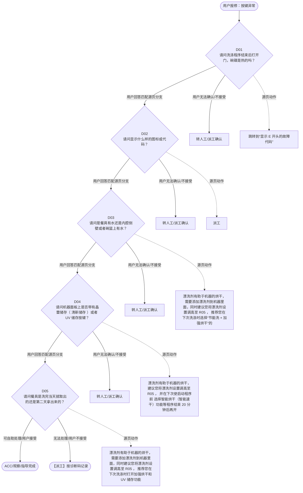

# BSH 洗碗机 — 按键异常 诊断手册

**故障编号**：F05 | **节点前缀**：BT | **来源**：PPT Slide 7
**适用诊断码**：`A23100000000` / `A233C4000000` / `A11000000000`
**转换状态**：自动批处理草案，需按源 PPT 视觉关系复核后生产使用

---

## 一、文档使用说明

### 三条执行铁律

1. **不越界**：只执行本文件定义的诊断步骤；遇到超出范围的问题，执行越界协议（见第三节），不得自行延伸
2. **不编造**：话术原文不得改写、补充或省略；不在本文件中的诊断码不得使用
3. **不跳步**：严格按 D 步骤顺序执行，不得跳过中间步骤直接给出结论

### 执行约定标记表

| 标记 | 含义 |
|------|------|
| `【话术】` | 逐字朗读给用户的诊断引导话术 |
| `【判断】` | 根据用户回答或系统数据触发的条件分支 |
| `【诊断码】` | BSH 标准诊断码 |
| `【派工】` | 安排工程师上门 |
| `【配件】` | 预判所需配件 |
| `【视频】` | 视频辅助标记 |
| `【引用】` | 跨故障树引用跳转 |
| `【解释】` | 向用户解释原理/现象 |
| `【操作指导】` | 指导用户自行操作 |
| `▶` | 无条件进入下一步 |

---

## 二、故障诊断导航树

### Mermaid 源码



### 诊断步骤 ↔ 节点速查表

| 步骤 | 节点 ID | 节点类型 | 简述 |
| --- | --- | --- | --- |
| 入口 | BT_START | 起始 | 用户报修：按键异常 |
| D01 | BT_D01 | 判断 | BT_D02 / BT_MANUAL01 |
| D02 | BT_D02 | 判断 | BT_D03 / BT_MANUAL02 |
| D03 | BT_D03 | 判断 | BT_D04 / BT_MANUAL03 |
| D04 | BT_D04 | 判断 | BT_D05 / BT_MANUAL04 |
| D05 | BT_D05 | 判断 | BT_ACC / BT_DISPATCH |
| 结束-ACC | BT_ACC | 结束 | 用户接受/观察/指导完成 |
| 结束-派工 | BT_DISPATCH | 派工 | 无法处理或用户不接受 |

---

## 三、越界处理协议

### 触发条件（满足以下任意一条即触发越界）

| # | 触发场景 |
|---|---------|
| 1 | 用户故障描述无法映射到当前诊断树的任何入口分支 |
| 2 | 用户回答无法映射到当前 D 步骤的任何条件行 |
| 3 | 目标跳转节点在 Mermaid 图中无有效连线或仍需视觉确认 |
| 4 | 用户要求提供本文档未包含的信息，如价格、保修政策、投诉升级 |
| 5 | 用户描述涉及焦味、冒烟、漏电、跳闸、进水等安全风险 |
| 6 | 用户要求自行拆机、维修、改线或更换内部零部件 |

### 退出动作

- 若属于其他故障树：执行 `【引用】` 跳转或回到索引重新分流
- 若无法定位：转人工客服
- 若存在安全风险：停止在线指导并安排工程师或人工处理

### 严禁行为

- 严禁自行判断主板、电源板、电机、压缩机等内部零部件级故障
- 严禁改写源 PPT 话术作为确定结论
- 严禁在用户尚未回答当前问题时跳至下一步

### 覆盖范围

本故障树仅覆盖 `按键异常` 相关诊断。其他故障现象应回到 `DW2` 索引重新分流。

---

## 四、诊断入口

### 故障主诉确认

- 用户描述与 `按键异常` 相关。
- 命中索引关键词：按键异常, A2310, 烘干效果不好, 烘干问题, 不烘干, 烘干效果差。
- 来源页：Slide 7。

### 入口分支判断

```
用户报修“按键异常”
│
├── 主诉匹配当前树 → 进入 D01
├── 主诉属于其他故障 → 回到索引执行跨树引用
└── 主诉不明确 → 先追问具体显示/部位/现象
```

---

## 五、诊断步骤详情

### D01 — 请问洗涤程序结束后打开门，碗碟是热的吗？

**[节点：BT_D01]**

**【话术】**：
> "请问洗涤程序结束后打开门，碗碟是热的吗？"

**判断表**：

| 条件 | 下一步 | 出口类型 | Mermaid 边验证 |
| --- | --- | --- | --- |
| 用户回答匹配源页下一分支 | D02 | 继续诊断 | BT_D01 → D02（自动草案，待视觉确认） |
| 用户接受解释/操作/观察 | 结束 | ACC | BT_D01 → ACC（待视觉确认） |
| 用户不接受 / 无法操作 / 风险场景 | 派工或转人工 | 派工 | BT_D01 → DISPATCH（待视觉确认） |
| **兜底越界**：其他无法识别的输入 | 越界协议 | 越界 | 无对应 Mermaid 边 |


### D02 — 请问显示什么样的图标或代码？

**[节点：BT_D02]**

**【话术】**：
> "请问显示什么样的图标或代码？"

**判断表**：

| 条件 | 下一步 | 出口类型 | Mermaid 边验证 |
| --- | --- | --- | --- |
| 用户回答匹配源页下一分支 | D03 | 继续诊断 | BT_D02 → D03（自动草案，待视觉确认） |
| 用户接受解释/操作/观察 | 结束 | ACC | BT_D02 → ACC（待视觉确认） |
| 用户不接受 / 无法操作 / 风险场景 | 派工或转人工 | 派工 | BT_D02 → DISPATCH（待视觉确认） |
| **兜底越界**：其他无法识别的输入 | 越界协议 | 越界 | 无对应 Mermaid 边 |


### D03 — 请问是餐具有水还是内腔侧壁或者碗篮上有水？

**[节点：BT_D03]**

**【话术】**：
> "请问是餐具有水还是内腔侧壁或者碗篮上有水？"

**判断表**：

| 条件 | 下一步 | 出口类型 | Mermaid 边验证 |
| --- | --- | --- | --- |
| 用户回答匹配源页下一分支 | D04 | 继续诊断 | BT_D03 → D04（自动草案，待视觉确认） |
| 用户接受解释/操作/观察 | 结束 | ACC | BT_D03 → ACC（待视觉确认） |
| 用户不接受 / 无法操作 / 风险场景 | 派工或转人工 | 派工 | BT_D03 → DISPATCH（待视觉确认） |
| **兜底越界**：其他无法识别的输入 | 越界协议 | 越界 | 无对应 Mermaid 边 |


### D04 — 请问机器面板上是否带有晶蕾储存（ 清新储存 ）或者 UV 储存按

**[节点：BT_D04]**

**【话术】**：
> "请问机器面板上是否带有晶蕾储存（ 清新储存 ）或者 UV 储存按键？"

**判断表**：

| 条件 | 下一步 | 出口类型 | Mermaid 边验证 |
| --- | --- | --- | --- |
| 用户回答匹配源页下一分支 | D05 | 继续诊断 | BT_D04 → D05（自动草案，待视觉确认） |
| 用户接受解释/操作/观察 | 结束 | ACC | BT_D04 → ACC（待视觉确认） |
| 用户不接受 / 无法操作 / 风险场景 | 派工或转人工 | 派工 | BT_D04 → DISPATCH（待视觉确认） |
| **兜底越界**：其他无法识别的输入 | 越界协议 | 越界 | 无对应 Mermaid 边 |


### D05 — 请问餐具是洗完当天就取出的还是第二天拿出来的？

**[节点：BT_D05]**

**【话术】**：
> "请问餐具是洗完当天就取出的还是第二天拿出来的？"

**判断表**：

| 条件 | 下一步 | 出口类型 | Mermaid 边验证 |
| --- | --- | --- | --- |
| 用户回答匹配源页下一分支 | ACC / 派工 | 继续诊断 | BT_D05 → ACC / 派工（自动草案，待视觉确认） |
| 用户接受解释/操作/观察 | 结束 | ACC | BT_D05 → ACC（待视觉确认） |
| 用户不接受 / 无法操作 / 风险场景 | 派工或转人工 | 派工 | BT_D05 → DISPATCH（待视觉确认） |
| **兜底越界**：其他无法识别的输入 | 越界协议 | 越界 | 无对应 Mermaid 边 |


### 源页动作/结果摘录

- 跳转到“显示 E 开头的故障代码”
- 派工
- 漂洗剂有助于机器的烘干，需要添加漂洗剂到机器里面，同时建议您将漂洗剂设置调高至 R05 ， 推荐您在下次洗涤时选择“节能洗 + 加强烘干”的组合程序，同时开启晶蕾储存功能。 同时请注意在摆放餐具时，尽量不要相互接触，并且倾斜一定角度，以防止水存积在餐具底部或者边缝处，红酒杯或玻璃器皿尽量放在上碗栏右侧。
- 漂洗剂有助于机器的烘干，建议您将漂洗剂设置调高至 R05 ， 并在下次使启动程序前 选择智能烘干（智能速干）功能等程序结束 20 分钟后再开门。 同时请注意在摆放餐具时，尽量不要相互接触，并且倾斜一定角度，以防止水存积在餐具底部或者边缝处，红酒杯或玻璃器皿尽量放在上碗栏右侧 。
- 漂洗剂有助于机器的烘干，需要添加漂洗剂到机器里面，同时建议您将漂洗剂设置调高至 R05 ， 推荐您在下次洗涤时打开加强烘干和 UV 储存功能。 同时请注意在摆放餐具时，尽量不要相互接触，并且倾斜一定角度，以防止水存积在餐具底部或者边缝处，红酒杯或玻璃器皿尽量放在上碗栏右侧。
- 漂洗剂有助于机器的烘干，需要添加漂洗剂到机器里面，同时建议您将漂洗剂设置调高至 R05 ， 并在下次启动程序前选择“日常洗 + 加强烘干”的组合程序。等程序结束 20 分钟后再开门，并取出餐具，因机器无存储功能。
- 漂洗剂有助于机器的烘干，需要添加漂洗剂到机器里面，同时建议您将漂洗剂设置调高至 R05 ， 推荐您在下次洗涤时选择“节能洗 / 超净洗 + 加强烘干”的组合程序，等程序结束 20 分钟后再开门，并取出餐具，因机器无存储功能。 同时请注意在摆放餐具时，尽量不要相互接触，并且倾斜一定角度，以防止水存积在餐具底部或者边缝处，红酒杯或玻璃器皿尽量放在上碗栏右侧。
- 漂洗剂有助于机器的烘干，需要添加漂洗剂到机器里面，同时建议您将漂洗剂设置调高至 R05 ， 并在下次启动程序前选择“节能洗 + 晶蕾储存”的组合程序（烘干效果相较于其他程序最优）
- 1. 漂洗 剂有助于机器的烘干，建议您将漂洗剂设置调高至 R05 ， 2. 并 在 下次启动程序 前 选择智能烘干（智能速干）功能 3. 等 程序 结束 20 分钟后再 开门 。
- 漂洗剂有助于机器的烘干，需要添加漂洗剂到机器里面，同时建议您将漂洗剂设置调高至 R05 ， 并在下次启动程序前选择 UV 储存附加功能等程序结束 1 小时以上再开门。
- 提醒 ： 1. 预冲洗、自清洁等程序没有烘干过程，如对餐具烘干有需求，应避免选择此类程序。 2. 超快洗、即时洗、快洗烘以及节能洗 + 加速省时，以上选用程序烘干时间 短（仅开门两分钟），如需达到更好的烘干效果，建议 20 分钟后再取餐具 。 3 . 针对新机，在添加光亮剂、洗碗粉情况下，使用 6-7 次，内壁烘干效果会有改善。原因：新机内壁有油膜。
- 提醒： 1. 1 小时内 UV 储存无法达到很好的烘干存储效果。如用户希望最佳效果，建议等 3-5 小时后再开门。 2. 当用户有存储需求时，不建议使用预冲洗、自清洁程序。 3. 针对新机，在添加光亮剂、洗碗粉情况下，使用 6-7 次，内壁烘干效果会有改善。原因：新机内壁有油膜。
- 提醒 ： 1. 预冲洗、自清洁等程序没有烘干过程，如对餐具烘干有需求，应避免选择此类程序。 2. 如用户表示使用了多效合一洗涤块，请解释“三合一的清洁产品其烘干效果相对较差，建议您使用单独的漂洗剂”。 3. 针对新机，在添加光亮剂、洗碗粉情况下，使用 6-7 次，内壁烘干效果会有改善。原因：新机内壁有油膜
- 提醒 ： 1. 当用户选择：预 冲洗、自 清洁时，以上程序 没有烘干过程 ，无法达到烘干效果。 2. 用户如果 选择 超 快洗、即时洗、快洗烘以及节能洗 + 加速省时 ，以上 选用程序烘干 时间短（开启智能烘干 / 智能速干后仅 开门两分钟），如需达到更好的烘干效果，建议 20 分钟后再取餐具 。
- 提醒 ： 1. 如 用户表示使用了多效合一洗涤块，请解释“三合一的清洁产品其烘干效果相对较差，建议您使用单独的漂洗剂 ”。 2. 不锈钢餐具因其比热容小等原因，烘干效果较差。 3. 塑料 、 硅胶、木制 餐具因为其表面特性或者材料特性，使得其表面水滴不易蒸发，难以达到好的烘干效果。

---

## 附录 A：诊断码汇总表

| 诊断码 | 描述 | 触发步骤 | 备注 |
| --- | --- | --- | --- |
| `A23100000000` | 见源 PPT 相邻文本 | 源页派工/判断节点 | 自动抽取，待人工核对英文/中文描述 |
| `A233C4000000` | 见源 PPT 相邻文本 | 源页派工/判断节点 | 自动抽取，待人工核对英文/中文描述 |
| `A11000000000` | 见源 PPT 相邻文本 | 源页派工/判断节点 | 自动抽取，待人工核对英文/中文描述 |

---

## 附录 B：配件建议汇总表

| 配件名称 | 关联步骤 | 说明 |
| --- | --- | --- |
| 源页未明确 | 派工出口 | 按源 PPT 派工节点记录，待视觉确认 |

---

## 附录 C：跨故障树引用清单

| 引用方向 | 触发条件 | 目标文件 | 目标诊断码 |
| --- | --- | --- | --- |
| 本树 → 到“显示 | 源页出现跳转提示 | 待索引映射 | — |

---

## 附录 D：源页文本摘录（用于复核）

- A23100000000 Bad drying result 烘干效果不好
- Internal
- 烘干问题 —— 不烘干、烘干效果差
- 请问洗涤程序结束后打开门，碗碟是热的吗？
- Bad drying result, appliance heats up (dishes warm)
- 是
- A233C4000000
- 否
- 非故障的原因备注： 冷凝烘干原理 会 导致内腔中出现水滴。空气 中的水分凝结在内壁上，流失并 被排出。 使用多效合一的洗涤剂的干燥性能较差。 未使用漂洗剂或漂洗剂的量设定过低。 由于塑料不能很好地储存热量，所以也不会很好地干燥 。 选择的程序没有烘干阶段或者烘干阶段太短 。 针对新机，在添加光亮剂、洗碗粉情况下，使用 6-7 次，内壁烘干效果会有改善。原因：新机内壁有油膜
- 请问显示什么样的图标或代码？
- 请问是餐具有水还是内腔侧壁或者碗篮上有水？
- 不加热 / 水是冷的
- A11000000000 No heating / Water too cold 不加热
- 跳转到“显示 E 开头的故障代码”
- 派工
- 内腔 侧壁 、 碗篮有水
- 都有水
- 餐具有水
- 带智能开门烘干功能的型号特点：型号中第五位是字母 E
- 提醒 ：也可以通过型号在对比工具查询机器是否带有相关附加功能。
- 请问机器面板上是否带有晶蕾储存（ 清新储存 ）或者 UV 储存按键？
- 请问餐具是洗完当天就取出的还是第二天拿出来的？
- 隔 天取出
- 当天取出
- 有晶蕾存储 （或清新储存）
- 有智能烘干（或智能速干）
- 有 UV 储存
- 有晶 蕾储存 （或清新储存）
- 无晶蕾储存或 UV 储存按键
- 漂洗剂有助于机器的烘干，需要添加漂洗剂到机器里面，同时建议您将漂洗剂设置调高至 R05 ， 推荐您在下次洗涤时选择“节能洗 + 加强烘干”的组合程序，同时开启晶蕾储存功能。 同时请注意在摆放餐具时，尽量不要相互接触，并且倾斜一定角度，以防止水存积在餐具底部或者边缝处，红酒杯或玻璃器皿尽量放在上碗栏右侧。
- 漂洗剂有助于机器的烘干，建议您将漂洗剂设置调高至 R05 ， 并在下次使启动程序前 选择智能烘干（智能速干）功能等程序结束 20 分钟后再开门。 同时请注意在摆放餐具时，尽量不要相互接触，并且倾斜一定角度，以防止水存积在餐具底部或者边缝处，红酒杯或玻璃器皿尽量放在上碗栏右侧 。
- 漂洗剂有助于机器的烘干，需要添加漂洗剂到机器里面，同时建议您将漂洗剂设置调高至 R05 ， 推荐您在下次洗涤时打开加强烘干和 UV 储存功能。 同时请注意在摆放餐具时，尽量不要相互接触，并且倾斜一定角度，以防止水存积在餐具底部或者边缝处，红酒杯或玻璃器皿尽量放在上碗栏右侧。
- 漂洗剂有助于机器的烘干，需要添加漂洗剂到机器里面，同时建议您将漂洗剂设置调高至 R05 ， 并在下次启动程序前选择“日常洗 + 加强烘干”的组合程序。等程序结束 20 分钟后再开门，并取出餐具，因机器无存储功能。
- 漂洗剂有助于机器的烘干，需要添加漂洗剂到机器里面，同时建议您将漂洗剂设置调高至 R05 ， 推荐您在下次洗涤时选择“节能洗 / 超净洗 + 加强烘干”的组合程序，等程序结束 20 分钟后再开门，并取出餐具，因机器无存储功能。 同时请注意在摆放餐具时，尽量不要相互接触，并且倾斜一定角度，以防止水存积在餐具底部或者边缝处，红酒杯或玻璃器皿尽量放在上碗栏右侧。
- 漂洗剂有助于机器的烘干，需要添加漂洗剂到机器里面，同时建议您将漂洗剂设置调高至 R05 ， 并在下次启动程序前选择“节能洗 + 晶蕾储存”的组合程序（烘干效果相较于其他程序最优）
- 1. 漂洗 剂有助于机器的烘干，建议您将漂洗剂设置调高至 R05 ， 2. 并 在 下次启动程序 前 选择智能烘干（智能速干）功能 3. 等 程序 结束 20 分钟后再 开门 。
- 漂洗剂有助于机器的烘干，需要添加漂洗剂到机器里面，同时建议您将漂洗剂设置调高至 R05 ， 并在下次启动程序前选择 UV 储存附加功能等程序结束 1 小时以上再开门。
- 提醒 ： 1. 预冲洗、自清洁等程序没有烘干过程，如对餐具烘干有需求，应避免选择此类程序。 2. 超快洗、即时洗、快洗烘以及节能洗 + 加速省时，以上选用程序烘干时间 短（仅开门两分钟），如需达到更好的烘干效果，建议 20 分钟后再取餐具 。 3 . 针对新机，在添加光亮剂、洗碗粉情况下，使用 6-7 次，内壁烘干效果会有改善。原因：新机内壁有油膜。
- 提醒： 1. 1 小时内 UV 储存无法达到很好的烘干存储效果。如用户希望最佳效果，建议等 3-5 小时后再开门。 2. 当用户有存储需求时，不建议使用预冲洗、自清洁程序。 3. 针对新机，在添加光亮剂、洗碗粉情况下，使用 6-7 次，内壁烘干效果会有改善。原因：新机内壁有油膜。
- 提醒： 1. 当用户选择：超快洗、即时洗、快洗烘、蒸汽烘、节能洗 + 加速省时、节能洗 + 加速省时，以上程序时（虽然能选中晶蕾储存，无实际储存效果），烘干时间短，无法达到最佳烘干效果。 2. 预冲洗、自清洁无烘干功能。 3 、针对新机，在添加光亮剂、洗碗粉情况下，使用 6-7 次，内壁烘干效果会有改善。原因：新机内壁有油 膜
- 提醒 ： 1. 预冲洗、自清洁等程序没有烘干过程，如对餐具烘干有需求，应避免选择此类程序。 2. 如用户表示使用了多效合一洗涤块，请解释“三合一的清洁产品其烘干效果相对较差，建议您使用单独的漂洗剂”。 3. 针对新机，在添加光亮剂、洗碗粉情况下，使用 6-7 次，内壁烘干效果会有改善。原因：新机内壁有油膜
- 提醒 ： 1. 当用户选择：预 冲洗、自 清洁时，以上程序 没有烘干过程 ，无法达到烘干效果。 2. 用户如果 选择 超 快洗、即时洗、快洗烘以及节能洗 + 加速省时 ，以上 选用程序烘干 时间短（开启智能烘干 / 智能速干后仅 开门两分钟），如需达到更好的烘干效果，建议 20 分钟后再取餐具 。
- 提醒： 1. 当 用户选择：超快洗、即时洗、快洗烘、蒸汽烘、节能洗 + 加速省时、节能洗 + 加速省时，静夜洗 + 加速省时，以上程序时，烘干时间短，可能无法达到最佳烘干效果。 2. 预 冲洗、自清洁等程序没有烘干过程，如对餐具烘干有需求，应避免选择此类程序。 3. 不锈钢 、塑料、硅胶、木制餐具因为其表面特性或者材料特性，使得其难以达到好的烘干效果 。
- 提醒： 1. 当用户选择：超快洗、即时洗、快洗烘、蒸汽烘、节能洗 + 加速省时、节能洗 + 加速省时 ，静夜洗 + 加速省时，以上 程序 时，烘干 时间短 ，可能无法 达到最佳烘干效果。 2. 预 冲洗 、自 清洁等程序没有烘干 过程，如对餐具烘干有需求，应避免选择此类程序。 3. 不锈钢、塑料、硅胶、木制 餐具 因为 其表面特性或者材料特性，使得 其难以 达到好的烘干效果。
- 提醒 ： 1. 如 用户表示使用了多效合一洗涤块，请解释“三合一的清洁产品其烘干效果相对较差，建议您使用单独的漂洗剂 ”。 2. 不锈钢餐具因其比热容小等原因，烘干效果较差。 3. 塑料 、 硅胶、木制 餐具因为其表面特性或者材料特性，使得其表面水滴不易蒸发，难以达到好的烘干效果。
- 尽可能不提及：尽管腔体內壁会存在一些冷凝水、但不会滋生细菌。（报告显示餐具及内壁上的除菌效果可以持续96小时且维持99.99%）
