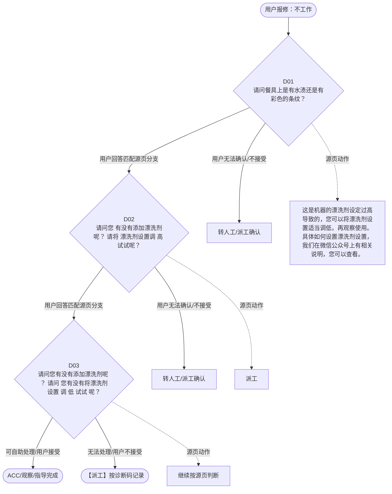

# BSH 洗碗机 — 不工作 诊断手册

**故障编号**：F08 | **节点前缀**：NWK | **来源**：PPT Slide 10
**适用诊断码**：`A32100000000` / `16R900000000` / `A31100000000` / `A50100X08000`
**转换状态**：自动批处理草案，需按源 PPT 视觉关系复核后生产使用

---

## 一、文档使用说明

### 三条执行铁律

1. **不越界**：只执行本文件定义的诊断步骤；遇到超出范围的问题，执行越界协议（见第三节），不得自行延伸
2. **不编造**：话术原文不得改写、补充或省略；不在本文件中的诊断码不得使用
3. **不跳步**：严格按 D 步骤顺序执行，不得跳过中间步骤直接给出结论

### 执行约定标记表

| 标记 | 含义 |
|------|------|
| `【话术】` | 逐字朗读给用户的诊断引导话术 |
| `【判断】` | 根据用户回答或系统数据触发的条件分支 |
| `【诊断码】` | BSH 标准诊断码 |
| `【派工】` | 安排工程师上门 |
| `【配件】` | 预判所需配件 |
| `【视频】` | 视频辅助标记 |
| `【引用】` | 跨故障树引用跳转 |
| `【解释】` | 向用户解释原理/现象 |
| `【操作指导】` | 指导用户自行操作 |
| `▶` | 无条件进入下一步 |

---

## 二、故障诊断导航树

### Mermaid 源码



### 诊断步骤 ↔ 节点速查表

| 步骤 | 节点 ID | 节点类型 | 简述 |
| --- | --- | --- | --- |
| 入口 | NWK_START | 起始 | 用户报修：不工作 |
| D01 | NWK_D01 | 判断 | NWK_D02 / NWK_MANUAL01 |
| D02 | NWK_D02 | 判断 | NWK_D03 / NWK_MANUAL02 |
| D03 | NWK_D03 | 判断 | NWK_ACC / NWK_DISPATCH |
| 结束-ACC | NWK_ACC | 结束 | 用户接受/观察/指导完成 |
| 结束-派工 | NWK_DISPATCH | 派工 | 无法处理或用户不接受 |

---

## 三、越界处理协议

### 触发条件（满足以下任意一条即触发越界）

| # | 触发场景 |
|---|---------|
| 1 | 用户故障描述无法映射到当前诊断树的任何入口分支 |
| 2 | 用户回答无法映射到当前 D 步骤的任何条件行 |
| 3 | 目标跳转节点在 Mermaid 图中无有效连线或仍需视觉确认 |
| 4 | 用户要求提供本文档未包含的信息，如价格、保修政策、投诉升级 |
| 5 | 用户描述涉及焦味、冒烟、漏电、跳闸、进水等安全风险 |
| 6 | 用户要求自行拆机、维修、改线或更换内部零部件 |

### 退出动作

- 若属于其他故障树：执行 `【引用】` 跳转或回到索引重新分流
- 若无法定位：转人工客服
- 若存在安全风险：停止在线指导并安排工程师或人工处理

### 严禁行为

- 严禁自行判断主板、电源板、电机、压缩机等内部零部件级故障
- 严禁改写源 PPT 话术作为确定结论
- 严禁在用户尚未回答当前问题时跳至下一步

### 覆盖范围

本故障树仅覆盖 `不工作` 相关诊断。其他故障现象应回到 `DW2` 索引重新分流。

---

## 四、诊断入口

### 故障主诉确认

- 用户描述与 `不工作` 相关。
- 命中索引关键词：不工作, 洗不, 干净, 水渍, 彩色条纹, A3210。
- 来源页：Slide 10。

### 入口分支判断

```
用户报修“不工作”
│
├── 主诉匹配当前树 → 进入 D01
├── 主诉属于其他故障 → 回到索引执行跨树引用
└── 主诉不明确 → 先追问具体显示/部位/现象
```

---

## 五、诊断步骤详情

### D01 — 请问餐具上是有水渍还是有彩色的条纹？

**[节点：NWK_D01]**

**【话术】**：
> "请问餐具上是有水渍还是有彩色的条纹？"

**判断表**：

| 条件 | 下一步 | 出口类型 | Mermaid 边验证 |
| --- | --- | --- | --- |
| 用户回答匹配源页下一分支 | D02 | 继续诊断 | NWK_D01 → D02（自动草案，待视觉确认） |
| 用户接受解释/操作/观察 | 结束 | ACC | NWK_D01 → ACC（待视觉确认） |
| 用户不接受 / 无法操作 / 风险场景 | 派工或转人工 | 派工 | NWK_D01 → DISPATCH（待视觉确认） |
| **兜底越界**：其他无法识别的输入 | 越界协议 | 越界 | 无对应 Mermaid 边 |


### D02 — 请问您 有没有添加漂洗剂呢？ 请将 漂洗剂设置调 高 试试呢？

**[节点：NWK_D02]**

**【话术】**：
> "请问您 有没有添加漂洗剂呢？ 请将 漂洗剂设置调 高 试试呢？"

**判断表**：

| 条件 | 下一步 | 出口类型 | Mermaid 边验证 |
| --- | --- | --- | --- |
| 用户回答匹配源页下一分支 | D03 | 继续诊断 | NWK_D02 → D03（自动草案，待视觉确认） |
| 用户接受解释/操作/观察 | 结束 | ACC | NWK_D02 → ACC（待视觉确认） |
| 用户不接受 / 无法操作 / 风险场景 | 派工或转人工 | 派工 | NWK_D02 → DISPATCH（待视觉确认） |
| **兜底越界**：其他无法识别的输入 | 越界协议 | 越界 | 无对应 Mermaid 边 |


### D03 — 请问您有没有添加漂洗剂呢 ？ 请问 您有没有将漂洗剂设置 调 低

**[节点：NWK_D03]**

**【话术】**：
> "请问您有没有添加漂洗剂呢 ？ 请问 您有没有将漂洗剂设置 调 低 试试 呢？"

**判断表**：

| 条件 | 下一步 | 出口类型 | Mermaid 边验证 |
| --- | --- | --- | --- |
| 用户回答匹配源页下一分支 | ACC / 派工 | 继续诊断 | NWK_D03 → ACC / 派工（自动草案，待视觉确认） |
| 用户接受解释/操作/观察 | 结束 | ACC | NWK_D03 → ACC（待视觉确认） |
| 用户不接受 / 无法操作 / 风险场景 | 派工或转人工 | 派工 | NWK_D03 → DISPATCH（待视觉确认） |
| **兜底越界**：其他无法识别的输入 | 越界协议 | 越界 | 无对应 Mermaid 边 |


### 源页动作/结果摘录

- 这是机器的漂洗剂设定过高导致的，您可以将漂洗剂设置适当调低，再观察使用。具体如何设置漂洗剂设置，我们在微信公众号上有相关说明，您可以查看。
- 派工

---

## 附录 A：诊断码汇总表

| 诊断码 | 描述 | 触发步骤 | 备注 |
| --- | --- | --- | --- |
| `A32100000000` | 见源 PPT 相邻文本 | 源页派工/判断节点 | 自动抽取，待人工核对英文/中文描述 |
| `16R900000000` | 见源 PPT 相邻文本 | 源页派工/判断节点 | 自动抽取，待人工核对英文/中文描述 |
| `A31100000000` | 见源 PPT 相邻文本 | 源页派工/判断节点 | 自动抽取，待人工核对英文/中文描述 |
| `A50100X08000` | 见源 PPT 相邻文本 | 源页派工/判断节点 | 自动抽取，待人工核对英文/中文描述 |

---

## 附录 B：配件建议汇总表

| 配件名称 | 关联步骤 | 说明 |
| --- | --- | --- |
| 源页未明确 | 派工出口 | 按源 PPT 派工节点记录，待视觉确认 |

---

## 附录 C：跨故障树引用清单

| 引用方向 | 触发条件 | 目标文件 | 目标诊断码 |
| --- | --- | --- | --- |
| 无明确跨树引用 | — | — | — |

---

## 附录 D：源页文本摘录（用于复核）

- 洗不 干净：水渍 / 彩色条纹
- Internal
- A32100000000 Water stains 水渍
- Water stains
- A32100000000
- 请问餐具上是有水渍还是有彩色的条纹？
- Discoloration, rainbow stains
- 16R900000000
- 若用户提及是光亮剂在漏，请先指导用户确认是否为光亮剂泄露 1. 当 机器不工作时，检查光亮剂料盒盖子底部是否有光亮剂在 滴落 2 . 对痕迹检查，用手指触碰是否粘稠，可以闻下是否有光亮剂的刺激性气味
- 彩色条纹
- 水渍
- A31100000000
- 请问您 有没有添加漂洗剂呢？ 请将 漂洗剂设置调 高 试试呢？
- 请问您有没有添加漂洗剂呢 ？ 请问 您有没有将漂洗剂设置 调 低 试试 呢？
- Rinse Aid / Dispenser leak
- Other cleaning result problem
- A50100X08000
- 尝试无效
- 未尝试
- 漂洗剂泄露
- 这是机器的漂洗剂设定过高导致的，您可以将漂洗剂设置适当调低，再观察使用。具体如何设置漂洗剂设置，我们在微信公众号上有相关说明，您可以查看。
- 这可能是餐具摆放时，餐具之间相互接触，导致餐具在烘干后接触点位置有水渍存在。您可以在后期摆放餐具时，避免其接触即可。
- 派工
- 漂洗剂可以有效的帮助将碗碟上的水珠流到腔体内，有助于烘干，避免水珠的产生，您可以尝试将设置调高试试。
- A50100X08000 Rinse Aid / Dispenser leak 冲洗助剂 / 分配器泄漏
- Page 10
- 洗碗机故障树
