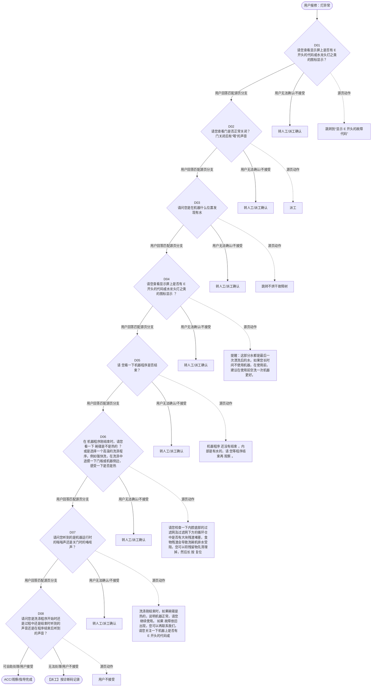

# BSH 洗碗机 — 灯异常 诊断手册

**故障编号**：F11 | **节点前缀**：LT | **来源**：PPT Slides 13-16
**适用诊断码**：`A18000000000` / `A180X3000000` / `A180X2000000` / `A180X4000000` / `A1802E000000` / `A12200000000` / `A23100000000` / `A122X6000000` / `A122X8000000` / `A122X7000000` / `A122X9000000` / `A11000000000` / `A110S2000000` / `A110S1000000` / `140000000000` / `1400000002X1` / `69D000000000` / `148100000000` / `1400000002X3`
**转换状态**：自动批处理草案，需按源 PPT 视觉关系复核后生产使用

---

## 一、文档使用说明

### 三条执行铁律

1. **不越界**：只执行本文件定义的诊断步骤；遇到超出范围的问题，执行越界协议（见第三节），不得自行延伸
2. **不编造**：话术原文不得改写、补充或省略；不在本文件中的诊断码不得使用
3. **不跳步**：严格按 D 步骤顺序执行，不得跳过中间步骤直接给出结论

### 执行约定标记表

| 标记 | 含义 |
|------|------|
| `【话术】` | 逐字朗读给用户的诊断引导话术 |
| `【判断】` | 根据用户回答或系统数据触发的条件分支 |
| `【诊断码】` | BSH 标准诊断码 |
| `【派工】` | 安排工程师上门 |
| `【配件】` | 预判所需配件 |
| `【视频】` | 视频辅助标记 |
| `【引用】` | 跨故障树引用跳转 |
| `【解释】` | 向用户解释原理/现象 |
| `【操作指导】` | 指导用户自行操作 |
| `▶` | 无条件进入下一步 |

---

## 二、故障诊断导航树

### Mermaid 源码



### 诊断步骤 ↔ 节点速查表

| 步骤 | 节点 ID | 节点类型 | 简述 |
| --- | --- | --- | --- |
| 入口 | LT_START | 起始 | 用户报修：灯异常 |
| D01 | LT_D01 | 判断 | LT_D02 / LT_MANUAL01 |
| D02 | LT_D02 | 判断 | LT_D03 / LT_MANUAL02 |
| D03 | LT_D03 | 判断 | LT_D04 / LT_MANUAL03 |
| D04 | LT_D04 | 判断 | LT_D05 / LT_MANUAL04 |
| D05 | LT_D05 | 判断 | LT_D06 / LT_MANUAL05 |
| D06 | LT_D06 | 判断 | LT_D07 / LT_MANUAL06 |
| D07 | LT_D07 | 判断 | LT_D08 / LT_MANUAL07 |
| D08 | LT_D08 | 判断 | LT_ACC / LT_DISPATCH |
| 结束-ACC | LT_ACC | 结束 | 用户接受/观察/指导完成 |
| 结束-派工 | LT_DISPATCH | 派工 | 无法处理或用户不接受 |

---

## 三、越界处理协议

### 触发条件（满足以下任意一条即触发越界）

| # | 触发场景 |
|---|---------|
| 1 | 用户故障描述无法映射到当前诊断树的任何入口分支 |
| 2 | 用户回答无法映射到当前 D 步骤的任何条件行 |
| 3 | 目标跳转节点在 Mermaid 图中无有效连线或仍需视觉确认 |
| 4 | 用户要求提供本文档未包含的信息，如价格、保修政策、投诉升级 |
| 5 | 用户描述涉及焦味、冒烟、漏电、跳闸、进水等安全风险 |
| 6 | 用户要求自行拆机、维修、改线或更换内部零部件 |

### 退出动作

- 若属于其他故障树：执行 `【引用】` 跳转或回到索引重新分流
- 若无法定位：转人工客服
- 若存在安全风险：停止在线指导并安排工程师或人工处理

### 严禁行为

- 严禁自行判断主板、电源板、电机、压缩机等内部零部件级故障
- 严禁改写源 PPT 话术作为确定结论
- 严禁在用户尚未回答当前问题时跳至下一步

### 覆盖范围

本故障树仅覆盖 `灯异常` 相关诊断。其他故障现象应回到 `DW2` 索引重新分流。

---

## 四、诊断入口

### 故障主诉确认

- 用户描述与 `灯异常` 相关。
- 命中索引关键词：灯异常, A1800, 不进水, 请您查看显示屏上, 是否有, 开头的代码或水龙。
- 来源页：Slides 13-16。

### 入口分支判断

```
用户报修“灯异常”
│
├── 主诉匹配当前树 → 进入 D01
├── 主诉属于其他故障 → 回到索引执行跨树引用
└── 主诉不明确 → 先追问具体显示/部位/现象
```

---

## 五、诊断步骤详情

### D01 — 请您查看显示屏上是否有 E 开头的代码或水龙头灯之类的图标显示？

**[节点：LT_D01]**

**【话术】**：
> "请您查看显示屏上是否有 E 开头的代码或水龙头灯之类的图标显示？"

**判断表**：

| 条件 | 下一步 | 出口类型 | Mermaid 边验证 |
| --- | --- | --- | --- |
| 用户回答匹配源页下一分支 | D02 | 继续诊断 | LT_D01 → D02（自动草案，待视觉确认） |
| 用户接受解释/操作/观察 | 结束 | ACC | LT_D01 → ACC（待视觉确认） |
| 用户不接受 / 无法操作 / 风险场景 | 派工或转人工 | 派工 | LT_D01 → DISPATCH（待视觉确认） |
| **兜底越界**：其他无法识别的输入 | 越界协议 | 越界 | 无对应 Mermaid 边 |


### D02 — 请您查看门是否正常关闭？ 门关闭后有“嗒”的声音

**[节点：LT_D02]**

**【话术】**：
> "请您查看门是否正常关闭？ 门关闭后有“嗒”的声音"

**判断表**：

| 条件 | 下一步 | 出口类型 | Mermaid 边验证 |
| --- | --- | --- | --- |
| 用户回答匹配源页下一分支 | D03 | 继续诊断 | LT_D02 → D03（自动草案，待视觉确认） |
| 用户接受解释/操作/观察 | 结束 | ACC | LT_D02 → ACC（待视觉确认） |
| 用户不接受 / 无法操作 / 风险场景 | 派工或转人工 | 派工 | LT_D02 → DISPATCH（待视觉确认） |
| **兜底越界**：其他无法识别的输入 | 越界协议 | 越界 | 无对应 Mermaid 边 |


### D03 — 请问您是在机器什么位置发现有水

**[节点：LT_D03]**

**【话术】**：
> "请问您是在机器什么位置发现有水"

**判断表**：

| 条件 | 下一步 | 出口类型 | Mermaid 边验证 |
| --- | --- | --- | --- |
| 用户回答匹配源页下一分支 | D04 | 继续诊断 | LT_D03 → D04（自动草案，待视觉确认） |
| 用户接受解释/操作/观察 | 结束 | ACC | LT_D03 → ACC（待视觉确认） |
| 用户不接受 / 无法操作 / 风险场景 | 派工或转人工 | 派工 | LT_D03 → DISPATCH（待视觉确认） |
| **兜底越界**：其他无法识别的输入 | 越界协议 | 越界 | 无对应 Mermaid 边 |


### D04 — 请您查看显示屏上是否有 E 开头的代码或水龙头灯之类的图标显示 

**[节点：LT_D04]**

**【话术】**：
> "请您查看显示屏上是否有 E 开头的代码或水龙头灯之类的图标显示 ？"

**判断表**：

| 条件 | 下一步 | 出口类型 | Mermaid 边验证 |
| --- | --- | --- | --- |
| 用户回答匹配源页下一分支 | D05 | 继续诊断 | LT_D04 → D05（自动草案，待视觉确认） |
| 用户接受解释/操作/观察 | 结束 | ACC | LT_D04 → ACC（待视觉确认） |
| 用户不接受 / 无法操作 / 风险场景 | 派工或转人工 | 派工 | LT_D04 → DISPATCH（待视觉确认） |
| **兜底越界**：其他无法识别的输入 | 越界协议 | 越界 | 无对应 Mermaid 边 |


### D05 — 请 您看一下机器程序是否结束？

**[节点：LT_D05]**

**【话术】**：
> "请 您看一下机器程序是否结束？"

**判断表**：

| 条件 | 下一步 | 出口类型 | Mermaid 边验证 |
| --- | --- | --- | --- |
| 用户回答匹配源页下一分支 | D06 | 继续诊断 | LT_D05 → D06（自动草案，待视觉确认） |
| 用户接受解释/操作/观察 | 结束 | ACC | LT_D05 → ACC（待视觉确认） |
| 用户不接受 / 无法操作 / 风险场景 | 派工或转人工 | 派工 | LT_D05 → DISPATCH（待视觉确认） |
| **兜底越界**：其他无法识别的输入 | 越界协议 | 越界 | 无对应 Mermaid 边 |


### D06 — 在 机器程序刚结束时，请您看一下 碗碟是不是热的 ？或是选择一个

**[节点：LT_D06]**

**【话术】**：
> "在 机器程序刚结束时，请您看一下 碗碟是不是热的 ？或是选择一个高温的洗涤程序，例如强快洗，在洗涤中途摸一下门板或机器侧边，感受一下是否是热的？"

**判断表**：

| 条件 | 下一步 | 出口类型 | Mermaid 边验证 |
| --- | --- | --- | --- |
| 用户回答匹配源页下一分支 | D07 | 继续诊断 | LT_D06 → D07（自动草案，待视觉确认） |
| 用户接受解释/操作/观察 | 结束 | ACC | LT_D06 → ACC（待视觉确认） |
| 用户不接受 / 无法操作 / 风险场景 | 派工或转人工 | 派工 | LT_D06 → DISPATCH（待视觉确认） |
| **兜底越界**：其他无法识别的输入 | 越界协议 | 越界 | 无对应 Mermaid 边 |


### D07 — 请问您听到的是机器运行时的嗡嗡声还是关门时的咯吱声？

**[节点：LT_D07]**

**【话术】**：
> "请问您听到的是机器运行时的嗡嗡声还是关门时的咯吱声？"

**判断表**：

| 条件 | 下一步 | 出口类型 | Mermaid 边验证 |
| --- | --- | --- | --- |
| 用户回答匹配源页下一分支 | D08 | 继续诊断 | LT_D07 → D08（自动草案，待视觉确认） |
| 用户接受解释/操作/观察 | 结束 | ACC | LT_D07 → ACC（待视觉确认） |
| 用户不接受 / 无法操作 / 风险场景 | 派工或转人工 | 派工 | LT_D07 → DISPATCH（待视觉确认） |
| **兜底越界**：其他无法识别的输入 | 越界协议 | 越界 | 无对应 Mermaid 边 |


### D08 — 请问您是洗涤程序开始时还是过程中还是结束时听到的声音还是在程序结

**[节点：LT_D08]**

**【话术】**：
> "请问您是洗涤程序开始时还是过程中还是结束时听到的声音还是在程序结束后听到的声音？"

**判断表**：

| 条件 | 下一步 | 出口类型 | Mermaid 边验证 |
| --- | --- | --- | --- |
| 用户回答匹配源页下一分支 | ACC / 派工 | 继续诊断 | LT_D08 → ACC / 派工（自动草案，待视觉确认） |
| 用户接受解释/操作/观察 | 结束 | ACC | LT_D08 → ACC（待视觉确认） |
| 用户不接受 / 无法操作 / 风险场景 | 派工或转人工 | 派工 | LT_D08 → DISPATCH（待视觉确认） |
| **兜底越界**：其他无法识别的输入 | 越界协议 | 越界 | 无对应 Mermaid 边 |


### 源页动作/结果摘录

- 跳转到“显示 E 开头的故障代码”
- 派工
- 跳转不烘干故障树
- 提醒：这部分水都是最后一次漂洗后的水，如果您长时间不使用机器，在使用前，建议在使用前空洗一次机器更好。
- 机器程序 还没有结束 ，内部是有水的，请 您等程序结束再 观察 。
- 请您检查一下内腔底部的过滤网及过滤网下方的循环仓中是否有大块残渣堵塞，食物残渣会导致洗碗机排水受阻，您可以将残留物先清理掉，然后长 按 复位键后关门 ， 把机器内部的水排掉后再使用观察。
- 洗涤刚结束时，如果碗碟是热的，说明机器正常，请您继续使用。 如果 故障依旧出现，您可以再联系我们，请您关注一下机器上是否有 E 开头的代码或图标显示，可以让我们更好的帮您判断机器状态 。
- 用户不接受

---

## 附录 A：诊断码汇总表

| 诊断码 | 描述 | 触发步骤 | 备注 |
| --- | --- | --- | --- |
| `A18000000000` | 见源 PPT 相邻文本 | 源页派工/判断节点 | 自动抽取，待人工核对英文/中文描述 |
| `A180X3000000` | 见源 PPT 相邻文本 | 源页派工/判断节点 | 自动抽取，待人工核对英文/中文描述 |
| `A180X2000000` | 见源 PPT 相邻文本 | 源页派工/判断节点 | 自动抽取，待人工核对英文/中文描述 |
| `A180X4000000` | 见源 PPT 相邻文本 | 源页派工/判断节点 | 自动抽取，待人工核对英文/中文描述 |
| `A1802E000000` | 见源 PPT 相邻文本 | 源页派工/判断节点 | 自动抽取，待人工核对英文/中文描述 |
| `A12200000000` | 见源 PPT 相邻文本 | 源页派工/判断节点 | 自动抽取，待人工核对英文/中文描述 |
| `A23100000000` | 见源 PPT 相邻文本 | 源页派工/判断节点 | 自动抽取，待人工核对英文/中文描述 |
| `A122X6000000` | 见源 PPT 相邻文本 | 源页派工/判断节点 | 自动抽取，待人工核对英文/中文描述 |
| `A122X8000000` | 见源 PPT 相邻文本 | 源页派工/判断节点 | 自动抽取，待人工核对英文/中文描述 |
| `A122X7000000` | 见源 PPT 相邻文本 | 源页派工/判断节点 | 自动抽取，待人工核对英文/中文描述 |
| `A122X9000000` | 见源 PPT 相邻文本 | 源页派工/判断节点 | 自动抽取，待人工核对英文/中文描述 |
| `A11000000000` | 见源 PPT 相邻文本 | 源页派工/判断节点 | 自动抽取，待人工核对英文/中文描述 |
| `A110S2000000` | 见源 PPT 相邻文本 | 源页派工/判断节点 | 自动抽取，待人工核对英文/中文描述 |
| `A110S1000000` | 见源 PPT 相邻文本 | 源页派工/判断节点 | 自动抽取，待人工核对英文/中文描述 |
| `140000000000` | 见源 PPT 相邻文本 | 源页派工/判断节点 | 自动抽取，待人工核对英文/中文描述 |
| `1400000002X1` | 见源 PPT 相邻文本 | 源页派工/判断节点 | 自动抽取，待人工核对英文/中文描述 |
| `69D000000000` | 见源 PPT 相邻文本 | 源页派工/判断节点 | 自动抽取，待人工核对英文/中文描述 |
| `148100000000` | 见源 PPT 相邻文本 | 源页派工/判断节点 | 自动抽取，待人工核对英文/中文描述 |
| `1400000002X3` | 见源 PPT 相邻文本 | 源页派工/判断节点 | 自动抽取，待人工核对英文/中文描述 |

---

## 附录 B：配件建议汇总表

| 配件名称 | 关联步骤 | 说明 |
| --- | --- | --- |
| 源页未明确 | 派工出口 | 按源 PPT 派工节点记录，待视觉确认 |

---

## 附录 C：跨故障树引用清单

| 引用方向 | 触发条件 | 目标文件 | 目标诊断码 |
| --- | --- | --- | --- |
| 本树 → 到“显示 | 源页出现跳转提示 | 待索引映射 | — |
| 本树 → 不烘干故障树 | 源页出现跳转提示 | 待索引映射 | — |

---

## 附录 D：源页文本摘录（用于复核）

- Water not running in
- A18000000000 Water not running in 不进水
- Internal
- 不进水
- A18000000000
- 请您查看显示屏上是否有 E 开头的代码或水龙头灯之类的图标显示？
- Water not running in, water inlet not checked
- A180X3000000
- 是
- 否
- 这种 情况 可能是 机器进水堵塞导致 ，您可以检查一下： 1 、请检查水龙头 是否打开 ；（水龙头顺时针拧是关闭，逆时针拧是打开） 2 、检查进水 管路是否通畅，有没有受到挤压 ;
- 跳转到“显示 E 开头的故障代码”
- Water not running in, water inlet checked
- A180X2000000
- 检查进水有问题
- 检查无问题
- 电话解决
- 请您查看门是否正常关闭？ 门关闭后有“嗒”的声音
- A180X4000000
- A1802E000000
- Water not running in, water inlet checked, door locked
- Water not running in, water tap and hose checked, door does not close properly
- A1802E000000 Water not running in, water tap and hose checked, door does not close properly 水没有流入，水龙头和软管被检查，门没有正确关闭
- 派工
- 请您长 按复位键重置机器，断开电源线 2 分钟后再重新连接，检查 机器是否可以正常 运行。
- Water not running in, inlet checked, door locked, no reset done
- A180 C000000 6
- Water not running in, inlet checked, door locked, reset done
- A180 C 5 000000
- 不会操作或故障依旧
- 正常运行
- A180C 5 000000 Water not running in, inlet checked, door locked, no reset done 水 未流入，入口已检查，门已锁定，未复位
- Page 14
- 洗碗机故障树
- Not draining / water in the appliance
- 不排水 / 机器内部有水
- A12200000000 Not draining / water in the appliance 不排水，设备内积水
- A12200000000
- 请问您是在机器什么位置发现有水
- Bad drying result
- A23100000000
- 新 机内部、侧边水板有水
- 滤 网下方有水
- 内腔侧板 / 碗篮 / 碗碟有水
- 内腔底部一层水
- 内部有水短信
- 滤 网下方的水是用于平衡压差，避免排水管内的水回流至机器 内，同时也可以防止 下水管 的异味传到机器内的作用，类似于家中下水管的 U 形弯一样。 这部分水一般 不超过滤网表面 ， 在 下次工作之前 ， 残留的水 会先 被 排掉，然后再进水工作 。请您放心使用。
- 请您查看显示屏上是否有 E 开头的代码或水龙头灯之类的图标显示 ？
- 新机出厂前 会进行 功能性 测试 ， 所以机器内部会有水 。您 可以在 使用前 任选一个程序 空洗 一次即可 。
- 跳转不烘干故障树
- 有
- 没有
- 提醒：这部分水都是最后一次漂洗后的水，如果您长时间不使用机器，在使用前，建议在使用前空洗一次机器更好。
- 请 您看一下机器程序是否结束？
- A122X6000000
- Not draining, water outlet not checked
- 程序已结束
- 程序未结束
- 机器程序 还没有结束 ，内部是有水的，请 您等程序结束再 观察 。
- 请您检查一下内腔底部的过滤网及过滤网下方的循环仓中是否有大块残渣堵塞，食物残渣会导致洗碗机排水受阻，您可以将残留物先清理掉，然后长 按 复位键后关门 ， 把机器内部的水排掉后再使用观察。
- Not draining, water outlet checked, during manual draining, pump is audible and water level decreases
- Not draining, water outlet checked, during manual draining, pump is not audible and water level does not decrease
- Not draining, water outlet checked, during manual draining, pump is audible but water level does not decrease
- A122X8000000
- 泵工作，但水未排出
- A122X7000000
- 故障解决
- 泵不工作，水未排出
- A122X9000000
- A122X8000000 Not draining, water outlet checked, during manual draining, pump is audible but water level does not decreasease 未排水，检查出水口，在手动排水过程中，可以听到泵的声音，但水位没有下降
- 请用户检查排水泵盖子 是否松动或缺失，请安装后再次按复位键进行强排
- 用户不会，或故障依旧
- Page 15
- 不加热 / 水是凉的
- No heating / Water too cold
- A11000000000
- A11000000000 No heating / Water too cold 不加热
- 在 机器程序刚结束时，请您看一下 碗碟是不是热的 ？或是选择一个高温的洗涤程序，例如强快洗，在洗涤中途摸一下门板或机器侧边，感受一下是否是热的？
- A110S2000000
- No heating during drying
- A110S1000000
- No heating during washing
- 不热
- 热
- 洗涤刚结束时，如果碗碟是热的，说明机器正常，请您继续使用。 如果 故障依旧出现，您可以再联系我们，请您关注一下机器上是否有 E 开头的代码或图标显示，可以让我们更好的帮您判断机器状态 。
- A110S1000000 No heating during washing 洗涤过程中不加热
- Page 16
- 异响（ 嗡嗡的声音 / 泵排水的声音）
- 140000000000 Noise 噪音
- Noise
- 140000000000
- 请问您听到的是机器运行时的嗡嗡声还是关门时的咯吱声？
- 开门的声音
- / 其他声音
- 泵工作的声音
- 请问您是洗涤程序开始时还是过程中还是结束时听到的声音还是在程序结束后听到的声音？
- Noise at the beginning of the programme
- Noise at the end of the programm (while drying)
- Noise when opening/closing the door
- 1400000002X1
- 69D000000000
- 148100000000
- 1400000002X3
- 开始时
- 结束后
- 中途
- Repetitive noises during the programme
- 1. 可能由安装引起，不会影响机器的功能。 2. 可能是排水泵 堵塞 或排水泵 盖 松动，请检查。
- 程序还未结束，机器在一些时间会进行排水，您会听到泵运转的声音，请您放心使用。 还有可能是以下原因，请自行排查 喷淋臂撞击餐具的声音 餐具较少时，水柱喷射到内壁的声音 餐具摆放太近或未固定 排水泵堵塞或排水泵盖子松动。
- 69D000000000 Noise when opening/closing the door 打开 / 关闭车门时发出噪音
- 1400000002X3 Noise at the end of the programm (while drying) 程序结束时的噪音（干燥时）
- 用户不接受
- 1400000002X1 Noise at the beginning of the programme 开始时的噪音
- 148100000000 Repetitive noises during the programme 程序中噪音
- Page 18
