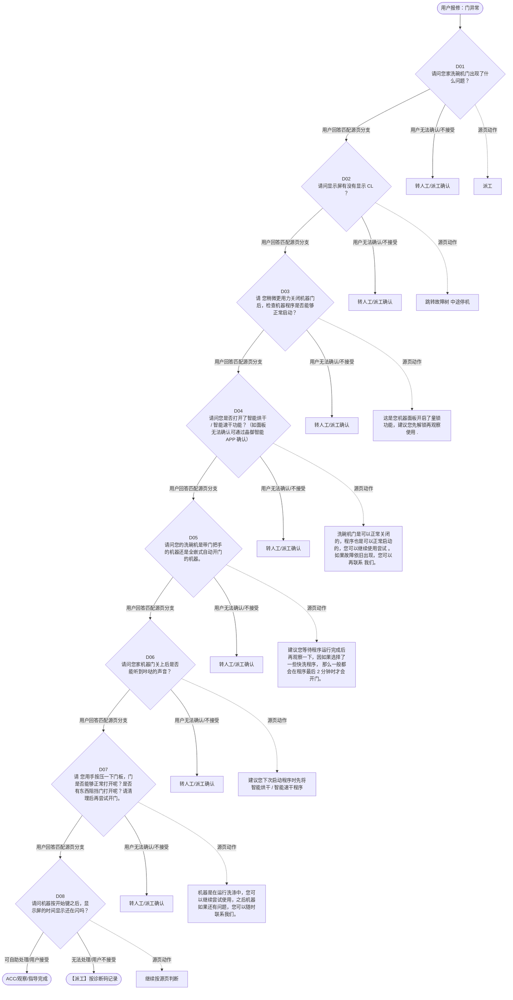

# BSH 洗碗机 — 门异常 诊断手册

**故障编号**：F12 | **节点前缀**：DO | **来源**：PPT Slide 17
**适用诊断码**：`690200000000` / `6902I7000000` / `16B400XQ3000` / `6902R3000000` / `693000000000` / `160100112000` / `6902Y4000000` / `698A00000000` / `690100000000` / `17E000000Y42` / `6902Y5000000` / `694200000000`
**转换状态**：自动批处理草案，需按源 PPT 视觉关系复核后生产使用

---

## 一、文档使用说明

### 三条执行铁律

1. **不越界**：只执行本文件定义的诊断步骤；遇到超出范围的问题，执行越界协议（见第三节），不得自行延伸
2. **不编造**：话术原文不得改写、补充或省略；不在本文件中的诊断码不得使用
3. **不跳步**：严格按 D 步骤顺序执行，不得跳过中间步骤直接给出结论

### 执行约定标记表

| 标记 | 含义 |
|------|------|
| `【话术】` | 逐字朗读给用户的诊断引导话术 |
| `【判断】` | 根据用户回答或系统数据触发的条件分支 |
| `【诊断码】` | BSH 标准诊断码 |
| `【派工】` | 安排工程师上门 |
| `【配件】` | 预判所需配件 |
| `【视频】` | 视频辅助标记 |
| `【引用】` | 跨故障树引用跳转 |
| `【解释】` | 向用户解释原理/现象 |
| `【操作指导】` | 指导用户自行操作 |
| `▶` | 无条件进入下一步 |

---

## 二、故障诊断导航树

### Mermaid 源码



### 诊断步骤 ↔ 节点速查表

| 步骤 | 节点 ID | 节点类型 | 简述 |
| --- | --- | --- | --- |
| 入口 | DO_START | 起始 | 用户报修：门异常 |
| D01 | DO_D01 | 判断 | DO_D02 / DO_MANUAL01 |
| D02 | DO_D02 | 判断 | DO_D03 / DO_MANUAL02 |
| D03 | DO_D03 | 判断 | DO_D04 / DO_MANUAL03 |
| D04 | DO_D04 | 判断 | DO_D05 / DO_MANUAL04 |
| D05 | DO_D05 | 判断 | DO_D06 / DO_MANUAL05 |
| D06 | DO_D06 | 判断 | DO_D07 / DO_MANUAL06 |
| D07 | DO_D07 | 判断 | DO_D08 / DO_MANUAL07 |
| D08 | DO_D08 | 判断 | DO_ACC / DO_DISPATCH |
| 结束-ACC | DO_ACC | 结束 | 用户接受/观察/指导完成 |
| 结束-派工 | DO_DISPATCH | 派工 | 无法处理或用户不接受 |

---

## 三、越界处理协议

### 触发条件（满足以下任意一条即触发越界）

| # | 触发场景 |
|---|---------|
| 1 | 用户故障描述无法映射到当前诊断树的任何入口分支 |
| 2 | 用户回答无法映射到当前 D 步骤的任何条件行 |
| 3 | 目标跳转节点在 Mermaid 图中无有效连线或仍需视觉确认 |
| 4 | 用户要求提供本文档未包含的信息，如价格、保修政策、投诉升级 |
| 5 | 用户描述涉及焦味、冒烟、漏电、跳闸、进水等安全风险 |
| 6 | 用户要求自行拆机、维修、改线或更换内部零部件 |

### 退出动作

- 若属于其他故障树：执行 `【引用】` 跳转或回到索引重新分流
- 若无法定位：转人工客服
- 若存在安全风险：停止在线指导并安排工程师或人工处理

### 严禁行为

- 严禁自行判断主板、电源板、电机、压缩机等内部零部件级故障
- 严禁改写源 PPT 话术作为确定结论
- 严禁在用户尚未回答当前问题时跳至下一步

### 覆盖范围

本故障树仅覆盖 `门异常` 相关诊断。其他故障现象应回到 `DW2` 索引重新分流。

---

## 四、诊断入口

### 故障主诉确认

- 用户描述与 `门异常` 相关。
- 命中索引关键词：门异常, 门问题, 门出现故障, 门关不上, 门打不开, 封条掉落。
- 来源页：Slide 17。

### 入口分支判断

```
用户报修“门异常”
│
├── 主诉匹配当前树 → 进入 D01
├── 主诉属于其他故障 → 回到索引执行跨树引用
└── 主诉不明确 → 先追问具体显示/部位/现象
```

---

## 五、诊断步骤详情

### D01 — 请问您家洗碗机门出现了什么问题？

**[节点：DO_D01]**

**【话术】**：
> "请问您家洗碗机门出现了什么问题？"

**判断表**：

| 条件 | 下一步 | 出口类型 | Mermaid 边验证 |
| --- | --- | --- | --- |
| 用户回答匹配源页下一分支 | D02 | 继续诊断 | DO_D01 → D02（自动草案，待视觉确认） |
| 用户接受解释/操作/观察 | 结束 | ACC | DO_D01 → ACC（待视觉确认） |
| 用户不接受 / 无法操作 / 风险场景 | 派工或转人工 | 派工 | DO_D01 → DISPATCH（待视觉确认） |
| **兜底越界**：其他无法识别的输入 | 越界协议 | 越界 | 无对应 Mermaid 边 |


### D02 — 请问显示屏有没有显示 CL ？

**[节点：DO_D02]**

**【话术】**：
> "请问显示屏有没有显示 CL ？"

**判断表**：

| 条件 | 下一步 | 出口类型 | Mermaid 边验证 |
| --- | --- | --- | --- |
| 用户回答匹配源页下一分支 | D03 | 继续诊断 | DO_D02 → D03（自动草案，待视觉确认） |
| 用户接受解释/操作/观察 | 结束 | ACC | DO_D02 → ACC（待视觉确认） |
| 用户不接受 / 无法操作 / 风险场景 | 派工或转人工 | 派工 | DO_D02 → DISPATCH（待视觉确认） |
| **兜底越界**：其他无法识别的输入 | 越界协议 | 越界 | 无对应 Mermaid 边 |


### D03 — 请 您稍微更用力关闭机器门后，检查机器程序是否能够正常启动？

**[节点：DO_D03]**

**【话术】**：
> "请 您稍微更用力关闭机器门后，检查机器程序是否能够正常启动？"

**判断表**：

| 条件 | 下一步 | 出口类型 | Mermaid 边验证 |
| --- | --- | --- | --- |
| 用户回答匹配源页下一分支 | D04 | 继续诊断 | DO_D03 → D04（自动草案，待视觉确认） |
| 用户接受解释/操作/观察 | 结束 | ACC | DO_D03 → ACC（待视觉确认） |
| 用户不接受 / 无法操作 / 风险场景 | 派工或转人工 | 派工 | DO_D03 → DISPATCH（待视觉确认） |
| **兜底越界**：其他无法识别的输入 | 越界协议 | 越界 | 无对应 Mermaid 边 |


### D04 — 请问您是否打开了智能烘干 / 智能速干功能？（如面板无法确认可通

**[节点：DO_D04]**

**【话术】**：
> "请问您是否打开了智能烘干 / 智能速干功能？（如面板无法确认可通过晶御智能 APP 确认）"

**判断表**：

| 条件 | 下一步 | 出口类型 | Mermaid 边验证 |
| --- | --- | --- | --- |
| 用户回答匹配源页下一分支 | D05 | 继续诊断 | DO_D04 → D05（自动草案，待视觉确认） |
| 用户接受解释/操作/观察 | 结束 | ACC | DO_D04 → ACC（待视觉确认） |
| 用户不接受 / 无法操作 / 风险场景 | 派工或转人工 | 派工 | DO_D04 → DISPATCH（待视觉确认） |
| **兜底越界**：其他无法识别的输入 | 越界协议 | 越界 | 无对应 Mermaid 边 |


### D05 — 请问您的洗碗机是带门把手的机器还是全嵌式自动开门的机器。

**[节点：DO_D05]**

**【话术】**：
> "请问您的洗碗机是带门把手的机器还是全嵌式自动开门的机器。"

**判断表**：

| 条件 | 下一步 | 出口类型 | Mermaid 边验证 |
| --- | --- | --- | --- |
| 用户回答匹配源页下一分支 | D06 | 继续诊断 | DO_D05 → D06（自动草案，待视觉确认） |
| 用户接受解释/操作/观察 | 结束 | ACC | DO_D05 → ACC（待视觉确认） |
| 用户不接受 / 无法操作 / 风险场景 | 派工或转人工 | 派工 | DO_D05 → DISPATCH（待视觉确认） |
| **兜底越界**：其他无法识别的输入 | 越界协议 | 越界 | 无对应 Mermaid 边 |


### D06 — 请问您家机器门关上后是否能听到咔哒的声音？

**[节点：DO_D06]**

**【话术】**：
> "请问您家机器门关上后是否能听到咔哒的声音？"

**判断表**：

| 条件 | 下一步 | 出口类型 | Mermaid 边验证 |
| --- | --- | --- | --- |
| 用户回答匹配源页下一分支 | D07 | 继续诊断 | DO_D06 → D07（自动草案，待视觉确认） |
| 用户接受解释/操作/观察 | 结束 | ACC | DO_D06 → ACC（待视觉确认） |
| 用户不接受 / 无法操作 / 风险场景 | 派工或转人工 | 派工 | DO_D06 → DISPATCH（待视觉确认） |
| **兜底越界**：其他无法识别的输入 | 越界协议 | 越界 | 无对应 Mermaid 边 |


### D07 — 请 您用手按压一下门板，门是否能够正常打开呢？是否有东西阻挡门打

**[节点：DO_D07]**

**【话术】**：
> "请 您用手按压一下门板，门是否能够正常打开呢？是否有东西阻挡门打开呢？请清理后再尝试开门。"

**判断表**：

| 条件 | 下一步 | 出口类型 | Mermaid 边验证 |
| --- | --- | --- | --- |
| 用户回答匹配源页下一分支 | D08 | 继续诊断 | DO_D07 → D08（自动草案，待视觉确认） |
| 用户接受解释/操作/观察 | 结束 | ACC | DO_D07 → ACC（待视觉确认） |
| 用户不接受 / 无法操作 / 风险场景 | 派工或转人工 | 派工 | DO_D07 → DISPATCH（待视觉确认） |
| **兜底越界**：其他无法识别的输入 | 越界协议 | 越界 | 无对应 Mermaid 边 |


### D08 — 请问机器按开始键之后，显示屏的时间显示还在闪吗？

**[节点：DO_D08]**

**【话术】**：
> "请问机器按开始键之后，显示屏的时间显示还在闪吗？"

**判断表**：

| 条件 | 下一步 | 出口类型 | Mermaid 边验证 |
| --- | --- | --- | --- |
| 用户回答匹配源页下一分支 | ACC / 派工 | 继续诊断 | DO_D08 → ACC / 派工（自动草案，待视觉确认） |
| 用户接受解释/操作/观察 | 结束 | ACC | DO_D08 → ACC（待视觉确认） |
| 用户不接受 / 无法操作 / 风险场景 | 派工或转人工 | 派工 | DO_D08 → DISPATCH（待视觉确认） |
| **兜底越界**：其他无法识别的输入 | 越界协议 | 越界 | 无对应 Mermaid 边 |


### 源页动作/结果摘录

- 派工
- 跳转故障树 中途停机
- 这是您机器面板开启了童锁功能，建议您先解锁再观察使用 .
- 洗碗机门是可以正常关闭的，程序也是可以正常启动的，您可以继续使用尝试 。如果故障依旧出现，您可以再联系 我们。
- 建议您等待程序运行完成后再观察一下，因如果选择了一些快洗程序， 那么一般都会在程序最后 2 分钟时才会 开门。
- 建议您下次启动程序时先将智能烘干 / 智能速干程序
- 机器是在运行洗涤中，您可以继续尝试使用，之后机器如果还有问题，您可以随时联系我们。

---

## 附录 A：诊断码汇总表

| 诊断码 | 描述 | 触发步骤 | 备注 |
| --- | --- | --- | --- |
| `690200000000` | 见源 PPT 相邻文本 | 源页派工/判断节点 | 自动抽取，待人工核对英文/中文描述 |
| `6902I7000000` | 见源 PPT 相邻文本 | 源页派工/判断节点 | 自动抽取，待人工核对英文/中文描述 |
| `16B400XQ3000` | 见源 PPT 相邻文本 | 源页派工/判断节点 | 自动抽取，待人工核对英文/中文描述 |
| `6902R3000000` | 见源 PPT 相邻文本 | 源页派工/判断节点 | 自动抽取，待人工核对英文/中文描述 |
| `693000000000` | 见源 PPT 相邻文本 | 源页派工/判断节点 | 自动抽取，待人工核对英文/中文描述 |
| `160100112000` | 见源 PPT 相邻文本 | 源页派工/判断节点 | 自动抽取，待人工核对英文/中文描述 |
| `6902Y4000000` | 见源 PPT 相邻文本 | 源页派工/判断节点 | 自动抽取，待人工核对英文/中文描述 |
| `698A00000000` | 见源 PPT 相邻文本 | 源页派工/判断节点 | 自动抽取，待人工核对英文/中文描述 |
| `690100000000` | 见源 PPT 相邻文本 | 源页派工/判断节点 | 自动抽取，待人工核对英文/中文描述 |
| `17E000000Y42` | 见源 PPT 相邻文本 | 源页派工/判断节点 | 自动抽取，待人工核对英文/中文描述 |
| `6902Y5000000` | 见源 PPT 相邻文本 | 源页派工/判断节点 | 自动抽取，待人工核对英文/中文描述 |
| `694200000000` | 见源 PPT 相邻文本 | 源页派工/判断节点 | 自动抽取，待人工核对英文/中文描述 |

---

## 附录 B：配件建议汇总表

| 配件名称 | 关联步骤 | 说明 |
| --- | --- | --- |
| 源页未明确 | 派工出口 | 按源 PPT 派工节点记录，待视觉确认 |

---

## 附录 C：跨故障树引用清单

| 引用方向 | 触发条件 | 目标文件 | 目标诊断码 |
| --- | --- | --- | --- |
| 本树 → 故障树 | 源页出现跳转提示 | 待索引映射 | — |

---

## 附录 D：源页文本摘录（用于复核）

- 690200000000 Door problem 门问题
- Door problem
- Internal
- 门出现故障（门关不上 / 门打不开 / 封条掉落 / 无法自动开门 ）
- 690200000000
- 带智能开门烘干功能的型号特点：型号中第五位是字母 E
- 请问您家洗碗机门出现了什么问题？
- Part missing, decorative stripes on door
- Mechanical damage door (Dishwashers)
- Door does not remain closed / opens
- Door does not close properly
- Door blocked (cannot be opened)
- 6902I7000000
- 16B400XQ3000 Part missing, decorative stripes on door 零件缺失，车门上有装饰条
- 6902R3000000
- 16B400XQ3000
- 693000000000
- 160100112000
- 6902Y4000000
- 698A00000000
- 带智能烘干的机器无法自动开门
- Door falls down
- 门掉落
- 中途停机
- 门关不上
- 门的白色封条掉落
- 门打不开
- 门板损坏
- 690100000000
- 请问显示屏有没有显示 CL ？
- 请 您稍微更用力关闭机器门后，检查机器程序是否能够正常启动？
- 派工
- 请问您是否打开了智能烘干 / 智能速干功能？（如面板无法确认可通过晶御智能 APP 确认）
- 跳转故障树 中途停机
- CL, child lock
- 698A00000000 Door falls down 门掉落
- 160100112000 Mechanical damage door (Dishwashers) 机械损坏门（洗碗机）
- 17E000000Y42
- 这是您机器面板开启了童锁功能，建议您先解锁再观察使用 .
- 没有
- 有
- 不可以
- 可以
- 请问您的洗碗机是带门把手的机器还是全嵌式自动开门的机器。
- 已打开
- 未打开
- 请问您家机器门关上后是否能听到咔哒的声音？
- 洗碗机门是可以正常关闭的，程序也是可以正常启动的，您可以继续使用尝试 。如果故障依旧出现，您可以再联系 我们。
- 提醒：童锁开启 / 关闭方法：按住童锁图标对应按键 4 秒即可。 童 锁作用：避免儿童误触碰。
- 建议您等待程序运行完成后再观察一下，因如果选择了一些快洗程序， 那么一般都会在程序最后 2 分钟时才会 开门。
- 建议您下次启动程序时先将智能烘干 / 智能速干程序
- Door does not lock
- 关门能听到 咔哒声
- 6902Y5000000
- 不带门把手
- 带门把手
- 关门听不到咔哒声
- 洗碗机开门是需要稍微用一些力量的，请您再用力开门尝试。
- 请 您用手按压一下门板，门是否能够正常打开呢？是否有东西阻挡门打开呢？请清理后再尝试开门。
- 请问机器按开始键之后，显示屏的时间显示还在闪吗？
- 6902Y5000000 Door does not lock 门不上锁
- 按开始后 时间不闪烁
- 按开始后时间闪烁
- 能
- 不能打开
- 不能
- 提醒： 1 、大部分的程序都会在程序最后 20 分钟时，自动开门。但如果用户选择了一些快洗程序，如超快洗、即时洗、加速省时等，那么一般都会在程序最后 2 分钟时才会开门（达不到刚才提及的烘干效果）。如果选择了节能洗，一般会在程序最后 60 分钟开门。 2 、如果用户提前关上门，直到程序时间结束，门不会再打开。
- 洗碗机开门是需要一些力量的，您后期继续正常使用即可。
- 您看 一下洗碗机顶部有没有凸出的塑料片（儿童锁） 。
- 电话解决
- 机器是在运行洗涤中，您可以继续尝试使用，之后机器如果还有问题，您可以随时联系我们。
- 6902Y4000000 Door blocked (cannot be opened) 门打不开
- 无儿童锁
- 有儿童锁
- 可能您开启了儿童锁，面对机器，将塑料片轻轻向右推（可以推到推不动为止），保持该动作，门就可以被拉开了。
- Page 19
- 洗碗机故障树
- Door does not open properly
- 694200000000
