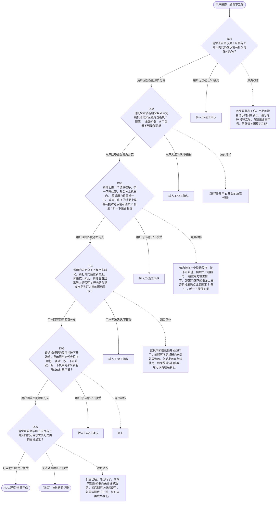

# BSH 洗碗机 — 通电不工作 诊断手册

**故障编号**：F02 | **节点前缀**：NS | **来源**：PPT Slide 4
**适用诊断码**：`11A200000000` / `693000000000` / `6902Y5000000` / `160100XH1000` / `69C100000000` / `6902R3000000`
**转换状态**：自动批处理草案，需按源 PPT 视觉关系复核后生产使用

---

## 一、文档使用说明

### 三条执行铁律

1. **不越界**：只执行本文件定义的诊断步骤；遇到超出范围的问题，执行越界协议（见第三节），不得自行延伸
2. **不编造**：话术原文不得改写、补充或省略；不在本文件中的诊断码不得使用
3. **不跳步**：严格按 D 步骤顺序执行，不得跳过中间步骤直接给出结论

### 执行约定标记表

| 标记 | 含义 |
|------|------|
| `【话术】` | 逐字朗读给用户的诊断引导话术 |
| `【判断】` | 根据用户回答或系统数据触发的条件分支 |
| `【诊断码】` | BSH 标准诊断码 |
| `【派工】` | 安排工程师上门 |
| `【配件】` | 预判所需配件 |
| `【视频】` | 视频辅助标记 |
| `【引用】` | 跨故障树引用跳转 |
| `【解释】` | 向用户解释原理/现象 |
| `【操作指导】` | 指导用户自行操作 |
| `▶` | 无条件进入下一步 |

---

## 二、故障诊断导航树

### Mermaid 源码



### 诊断步骤 ↔ 节点速查表

| 步骤 | 节点 ID | 节点类型 | 简述 |
| --- | --- | --- | --- |
| 入口 | NS_START | 起始 | 用户报修：通电不工作 |
| D01 | NS_D01 | 判断 | NS_D02 / NS_MANUAL01 |
| D02 | NS_D02 | 判断 | NS_D03 / NS_MANUAL02 |
| D03 | NS_D03 | 判断 | NS_D04 / NS_MANUAL03 |
| D04 | NS_D04 | 判断 | NS_D05 / NS_MANUAL04 |
| D05 | NS_D05 | 判断 | NS_D06 / NS_MANUAL05 |
| D06 | NS_D06 | 判断 | NS_ACC / NS_DISPATCH |
| 结束-ACC | NS_ACC | 结束 | 用户接受/观察/指导完成 |
| 结束-派工 | NS_DISPATCH | 派工 | 无法处理或用户不接受 |

---

## 三、越界处理协议

### 触发条件（满足以下任意一条即触发越界）

| # | 触发场景 |
|---|---------|
| 1 | 用户故障描述无法映射到当前诊断树的任何入口分支 |
| 2 | 用户回答无法映射到当前 D 步骤的任何条件行 |
| 3 | 目标跳转节点在 Mermaid 图中无有效连线或仍需视觉确认 |
| 4 | 用户要求提供本文档未包含的信息，如价格、保修政策、投诉升级 |
| 5 | 用户描述涉及焦味、冒烟、漏电、跳闸、进水等安全风险 |
| 6 | 用户要求自行拆机、维修、改线或更换内部零部件 |

### 退出动作

- 若属于其他故障树：执行 `【引用】` 跳转或回到索引重新分流
- 若无法定位：转人工客服
- 若存在安全风险：停止在线指导并安排工程师或人工处理

### 严禁行为

- 严禁自行判断主板、电源板、电机、压缩机等内部零部件级故障
- 严禁改写源 PPT 话术作为确定结论
- 严禁在用户尚未回答当前问题时跳至下一步

### 覆盖范围

本故障树仅覆盖 `通电不工作` 相关诊断。其他故障现象应回到 `DW` 索引重新分流。

---

## 四、诊断入口

### 故障主诉确认

- 用户描述与 `通电不工作` 相关。
- 命中索引关键词：通电不工作, 通电, 不工作, A2000, 通电但不启动, 请您查看显示屏上。
- 来源页：Slide 4。

### 入口分支判断

```
用户报修“通电不工作”
│
├── 主诉匹配当前树 → 进入 D01
├── 主诉属于其他故障 → 回到索引执行跨树引用
└── 主诉不明确 → 先追问具体显示/部位/现象
```

---

## 五、诊断步骤详情

### D01 — 请您查看显示屏上是否有 E 开头的代码显示或有什么灯在闪烁吗？

**[节点：NS_D01]**

**【话术】**：
> "请您查看显示屏上是否有 E 开头的代码显示或有什么灯在闪烁吗？"

**判断表**：

| 条件 | 下一步 | 出口类型 | Mermaid 边验证 |
| --- | --- | --- | --- |
| 用户回答匹配源页下一分支 | D02 | 继续诊断 | NS_D01 → D02（自动草案，待视觉确认） |
| 用户接受解释/操作/观察 | 结束 | ACC | NS_D01 → ACC（待视觉确认） |
| 用户不接受 / 无法操作 / 风险场景 | 派工或转人工 | 派工 | NS_D01 → DISPATCH（待视觉确认） |
| **兜底越界**：其他无法识别的输入 | 越界协议 | 越界 | 无对应 Mermaid 边 |


### D02 — 请问您家洗碗机是全嵌式洗碗机还是非全嵌的洗碗机？ 提醒 ： 全嵌

**[节点：NS_D02]**

**【话术】**：
> "请问您家洗碗机是全嵌式洗碗机还是非全嵌的洗碗机？ 提醒 ： 全嵌机器，关门后看不到操作面板"

**判断表**：

| 条件 | 下一步 | 出口类型 | Mermaid 边验证 |
| --- | --- | --- | --- |
| 用户回答匹配源页下一分支 | D03 | 继续诊断 | NS_D02 → D03（自动草案，待视觉确认） |
| 用户接受解释/操作/观察 | 结束 | ACC | NS_D02 → ACC（待视觉确认） |
| 用户不接受 / 无法操作 / 风险场景 | 派工或转人工 | 派工 | NS_D02 → DISPATCH（待视觉确认） |
| **兜底越界**：其他无法识别的输入 | 越界协议 | 越界 | 无对应 Mermaid 边 |


### D03 — 请您切换一个洗涤程序，按一下开始键，然后关上机器门， 稍微用力往

**[节点：NS_D03]**

**【话术】**：
> "请您切换一个洗涤程序，按一下开始键，然后关上机器门， 稍微用力往里推一下。 观察门底下的地面上是否有投射光点或者图案？ 备注：听一下是否有嘎达的声音，并且机器内部有开始运行的声音了"

**判断表**：

| 条件 | 下一步 | 出口类型 | Mermaid 边验证 |
| --- | --- | --- | --- |
| 用户回答匹配源页下一分支 | D04 | 继续诊断 | NS_D03 → D04（自动草案，待视觉确认） |
| 用户接受解释/操作/观察 | 结束 | ACC | NS_D03 → ACC（待视觉确认） |
| 用户不接受 / 无法操作 / 风险场景 | 派工或转人工 | 派工 | NS_D03 → DISPATCH（待视觉确认） |
| **兜底越界**：其他无法识别的输入 | 越界协议 | 越界 | 无对应 Mermaid 边 |


### D04 — 说明门未完全关上程序未启动，请打开门后重新关上，如果依旧如此，请

**[节点：NS_D04]**

**【话术】**：
> "说明门未完全关上程序未启动，请打开门后重新关上，如果依旧如此，请您查看显示屏上是否有 E 开头的代码或水龙头灯之类的图标显示？"

**判断表**：

| 条件 | 下一步 | 出口类型 | Mermaid 边验证 |
| --- | --- | --- | --- |
| 用户回答匹配源页下一分支 | D05 | 继续诊断 | NS_D04 → D05（自动草案，待视觉确认） |
| 用户接受解释/操作/观察 | 结束 | ACC | NS_D04 → ACC（待视觉确认） |
| 用户不接受 / 无法操作 / 风险场景 | 派工或转人工 | 派工 | NS_D04 → DISPATCH（待视觉确认） |
| **兜底越界**：其他无法识别的输入 | 越界协议 | 越界 | 无对应 Mermaid 边 |


### D05 — 请选择想要的程序并按下开始键，显示屏常亮代表程序运行。 备注：按

**[节点：NS_D05]**

**【话术】**：
> "请选择想要的程序并按下开始键，显示屏常亮代表程序运行。 备注：按一下开始键，听一下机器内部是否有开始运行的声音？"

**判断表**：

| 条件 | 下一步 | 出口类型 | Mermaid 边验证 |
| --- | --- | --- | --- |
| 用户回答匹配源页下一分支 | D06 | 继续诊断 | NS_D05 → D06（自动草案，待视觉确认） |
| 用户接受解释/操作/观察 | 结束 | ACC | NS_D05 → ACC（待视觉确认） |
| 用户不接受 / 无法操作 / 风险场景 | 派工或转人工 | 派工 | NS_D05 → DISPATCH（待视觉确认） |
| **兜底越界**：其他无法识别的输入 | 越界协议 | 越界 | 无对应 Mermaid 边 |


### D06 — 请您查看显示屏上是否有 E 开头的代码或水龙头灯之类的图标显示？

**[节点：NS_D06]**

**【话术】**：
> "请您查看显示屏上是否有 E 开头的代码或水龙头灯之类的图标显示？"

**判断表**：

| 条件 | 下一步 | 出口类型 | Mermaid 边验证 |
| --- | --- | --- | --- |
| 用户回答匹配源页下一分支 | ACC / 派工 | 继续诊断 | NS_D06 → ACC / 派工（自动草案，待视觉确认） |
| 用户接受解释/操作/观察 | 结束 | ACC | NS_D06 → ACC（待视觉确认） |
| 用户不接受 / 无法操作 / 风险场景 | 派工或转人工 | 派工 | NS_D06 → DISPATCH（待视觉确认） |
| **兜底越界**：其他无法识别的输入 | 越界协议 | 越界 | 无对应 Mermaid 边 |


### 源页动作/结果摘录

- 如果是首次工作，产品可能会进水时间比较长，请等待 10 分钟之后，观察是否有声音，另外请关闭预约功能。
- 跳转到“显示 E 开头的故障代码”
- 请您切换一个洗涤程序，按一下开始键，然后关上机器门， 稍微用力往里推一下。 观察门底下的地面上是否有投射光点或者图案？ 备注：听一下是否有嘎达的声音，并且机器内部有开始运行的声音了
- 这说明机器已经开始运行了。前期可能是机器门未关好导致的。您后期可以继续使用，如果故障依旧出现，您可以再联系我们。
- 派工
- 机器已经开始运行了。前期可能是机器门未关好导致的。您后期可以继续使用，如果故障依旧出现，您可以再联系我们。

---

## 附录 A：诊断码汇总表

| 诊断码 | 描述 | 触发步骤 | 备注 |
| --- | --- | --- | --- |
| `11A200000000` | 见源 PPT 相邻文本 | 源页派工/判断节点 | 自动抽取，待人工核对英文/中文描述 |
| `693000000000` | 见源 PPT 相邻文本 | 源页派工/判断节点 | 自动抽取，待人工核对英文/中文描述 |
| `6902Y5000000` | 见源 PPT 相邻文本 | 源页派工/判断节点 | 自动抽取，待人工核对英文/中文描述 |
| `160100XH1000` | 见源 PPT 相邻文本 | 源页派工/判断节点 | 自动抽取，待人工核对英文/中文描述 |
| `69C100000000` | 见源 PPT 相邻文本 | 源页派工/判断节点 | 自动抽取，待人工核对英文/中文描述 |
| `6902R3000000` | 见源 PPT 相邻文本 | 源页派工/判断节点 | 自动抽取，待人工核对英文/中文描述 |

---

## 附录 B：配件建议汇总表

| 配件名称 | 关联步骤 | 说明 |
| --- | --- | --- |
| 源页未明确 | 派工出口 | 按源 PPT 派工节点记录，待视觉确认 |

---

## 附录 C：跨故障树引用清单

| 引用方向 | 触发条件 | 目标文件 | 目标诊断码 |
| --- | --- | --- | --- |
| 本树 → 到“显示 | 源页出现跳转提示 | 待索引映射 | — |

---

## 附录 D：源页文本摘录（用于复核）

- 通电 不工作
- Internal
- 11A200000000 Power supply available but no start function 通电但不启动
- 请您查看显示屏上是否有 E 开头的代码显示或有什么灯在闪烁吗？
- 如果是首次工作，产品可能会进水时间比较长，请等待 10 分钟之后，观察是否有声音，另外请关闭预约功能。
- 是
- 否
- 请问您家洗碗机是全嵌式洗碗机还是非全嵌的洗碗机？ 提醒 ： 全嵌机器，关门后看不到操作面板
- 跳转到“显示 E 开头的故障代码”
- 全嵌
- 非全嵌
- 请您切换一个洗涤程序，按一下开始键，然后关上机器门， 稍微用力往里推一下。 观察门底下的地面上是否有投射光点或者图案？ 备注：听一下是否有嘎达的声音，并且机器内部有开始运行的声音了
- 请您关闭机器门，然后尝试是否可以切换选择机器一个其他的程序。
- Door does not close properly
- 693000000000
- Door does not lock
- Timelight / Infolight not working
- 程序无法切换
- 程序可以切换
- 6902Y5000000
- 光点不亮
- 光点长亮
- 光点闪烁 / 没有机器运行的声音
- 160100XH1000
- 这一般是机器门未关好导致情况，请您再重新打开门，再稍微用力关一下门，看一下机器程序是否能够切换 。
- 这说明机器已经开始运行了。前期可能是机器门未关好导致的。您后期可以继续使用，如果故障依旧出现，您可以再联系我们。
- 说明门未完全关上程序未启动，请打开门后重新关上，如果依旧如此，请您查看显示屏上是否有 E 开头的代码或水龙头灯之类的图标显示？
- 说明没有选择程序或上个程序已经运行结束。请选择想要的程序并按下开始键后关门。
- 160100XH1000 Timelight / Infolight not working 时间灯 / 信息灯不工作
- 程序依然无法切换
- 69C100000000
- 尝试，故障依旧
- 请选择想要的程序并按下开始键，显示屏常亮代表程序运行。 备注：按一下开始键，听一下机器内部是否有开始运行的声音？
- 派工
- 6902Y5000000 Door does not lock 门不上锁
- Door does not remain closed / opens
- 程序开始运行
- 中途停机
- 6902R3000000
- 机器已经开始运行了。前期可能是机器门未关好导致的。您后期可以继续使用，如果故障依旧出现，您可以再联系我们。
- 请您查看显示屏上是否有 E 开头的代码或水龙头灯之类的图标显示？
- 6902R3000000 Door does not remain closed / opens 门未保持关闭 / 打开状态
- 洗碗机故障树
- Page 6
