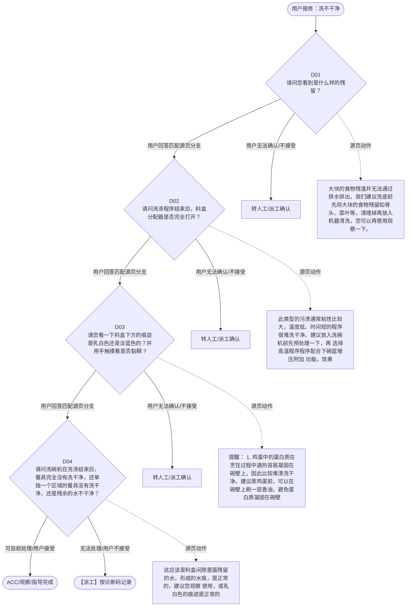

# BSH 洗碗机 — 洗不干净 诊断手册

**故障编号**：F06 | **节点前缀**：PC | **来源**：PPT Slide 8
**适用诊断码**：`A34100000000` / `A50100X08000` / `A2C3C9000000` / `A31100000000` / `A2C100000000`
**转换状态**：自动批处理草案，需按源 PPT 视觉关系复核后生产使用

---

## 一、文档使用说明

### 三条执行铁律

1. **不越界**：只执行本文件定义的诊断步骤；遇到超出范围的问题，执行越界协议（见第三节），不得自行延伸
2. **不编造**：话术原文不得改写、补充或省略；不在本文件中的诊断码不得使用
3. **不跳步**：严格按 D 步骤顺序执行，不得跳过中间步骤直接给出结论

### 执行约定标记表

| 标记 | 含义 |
|------|------|
| `【话术】` | 逐字朗读给用户的诊断引导话术 |
| `【判断】` | 根据用户回答或系统数据触发的条件分支 |
| `【诊断码】` | BSH 标准诊断码 |
| `【派工】` | 安排工程师上门 |
| `【配件】` | 预判所需配件 |
| `【视频】` | 视频辅助标记 |
| `【引用】` | 跨故障树引用跳转 |
| `【解释】` | 向用户解释原理/现象 |
| `【操作指导】` | 指导用户自行操作 |
| `▶` | 无条件进入下一步 |

---

## 二、故障诊断导航树

### Mermaid 源码



### 诊断步骤 ↔ 节点速查表

| 步骤 | 节点 ID | 节点类型 | 简述 |
| --- | --- | --- | --- |
| 入口 | PC_START | 起始 | 用户报修：洗不干净 |
| D01 | PC_D01 | 判断 | PC_D02 / PC_MANUAL01 |
| D02 | PC_D02 | 判断 | PC_D03 / PC_MANUAL02 |
| D03 | PC_D03 | 判断 | PC_D04 / PC_MANUAL03 |
| D04 | PC_D04 | 判断 | PC_ACC / PC_DISPATCH |
| 结束-ACC | PC_ACC | 结束 | 用户接受/观察/指导完成 |
| 结束-派工 | PC_DISPATCH | 派工 | 无法处理或用户不接受 |

---

## 三、越界处理协议

### 触发条件（满足以下任意一条即触发越界）

| # | 触发场景 |
|---|---------|
| 1 | 用户故障描述无法映射到当前诊断树的任何入口分支 |
| 2 | 用户回答无法映射到当前 D 步骤的任何条件行 |
| 3 | 目标跳转节点在 Mermaid 图中无有效连线或仍需视觉确认 |
| 4 | 用户要求提供本文档未包含的信息，如价格、保修政策、投诉升级 |
| 5 | 用户描述涉及焦味、冒烟、漏电、跳闸、进水等安全风险 |
| 6 | 用户要求自行拆机、维修、改线或更换内部零部件 |

### 退出动作

- 若属于其他故障树：执行 `【引用】` 跳转或回到索引重新分流
- 若无法定位：转人工客服
- 若存在安全风险：停止在线指导并安排工程师或人工处理

### 严禁行为

- 严禁自行判断主板、电源板、电机、压缩机等内部零部件级故障
- 严禁改写源 PPT 话术作为确定结论
- 严禁在用户尚未回答当前问题时跳至下一步

### 覆盖范围

本故障树仅覆盖 `洗不干净` 相关诊断。其他故障现象应回到 `DW` 索引重新分流。

---

## 四、诊断入口

### 故障主诉确认

- 用户描述与 `洗不干净` 相关。
- 命中索引关键词：洗不干净, 洗涤用品, 食物残渣, 油渍残留, 光亮剂泄漏, A3410。
- 来源页：Slide 8。

### 入口分支判断

```
用户报修“洗不干净”
│
├── 主诉匹配当前树 → 进入 D01
├── 主诉属于其他故障 → 回到索引执行跨树引用
└── 主诉不明确 → 先追问具体显示/部位/现象
```

---

## 五、诊断步骤详情

### D01 — 请问您看到是什么样的残留？

**[节点：PC_D01]**

**【话术】**：
> "请问您看到是什么样的残留？"

**判断表**：

| 条件 | 下一步 | 出口类型 | Mermaid 边验证 |
| --- | --- | --- | --- |
| 用户回答匹配源页下一分支 | D02 | 继续诊断 | PC_D01 → D02（自动草案，待视觉确认） |
| 用户接受解释/操作/观察 | 结束 | ACC | PC_D01 → ACC（待视觉确认） |
| 用户不接受 / 无法操作 / 风险场景 | 派工或转人工 | 派工 | PC_D01 → DISPATCH（待视觉确认） |
| **兜底越界**：其他无法识别的输入 | 越界协议 | 越界 | 无对应 Mermaid 边 |


### D02 — 请问洗涤程序结束后，料盒分配器是否完全打开？

**[节点：PC_D02]**

**【话术】**：
> "请问洗涤程序结束后，料盒分配器是否完全打开？"

**判断表**：

| 条件 | 下一步 | 出口类型 | Mermaid 边验证 |
| --- | --- | --- | --- |
| 用户回答匹配源页下一分支 | D03 | 继续诊断 | PC_D02 → D03（自动草案，待视觉确认） |
| 用户接受解释/操作/观察 | 结束 | ACC | PC_D02 → ACC（待视觉确认） |
| 用户不接受 / 无法操作 / 风险场景 | 派工或转人工 | 派工 | PC_D02 → DISPATCH（待视觉确认） |
| **兜底越界**：其他无法识别的输入 | 越界协议 | 越界 | 无对应 Mermaid 边 |


### D03 — 请您看一下料盒下方的痕迹是乳白色还是淡蓝色的？并用手触摸看是否黏

**[节点：PC_D03]**

**【话术】**：
> "请您看一下料盒下方的痕迹是乳白色还是淡蓝色的？并用手触摸看是否黏稠 ?"

**判断表**：

| 条件 | 下一步 | 出口类型 | Mermaid 边验证 |
| --- | --- | --- | --- |
| 用户回答匹配源页下一分支 | D04 | 继续诊断 | PC_D03 → D04（自动草案，待视觉确认） |
| 用户接受解释/操作/观察 | 结束 | ACC | PC_D03 → ACC（待视觉确认） |
| 用户不接受 / 无法操作 / 风险场景 | 派工或转人工 | 派工 | PC_D03 → DISPATCH（待视觉确认） |
| **兜底越界**：其他无法识别的输入 | 越界协议 | 越界 | 无对应 Mermaid 边 |


### D04 — 请问洗碗机在洗涤结束后，餐具完全没有洗干净，还单独一个区域的餐具

**[节点：PC_D04]**

**【话术】**：
> "请问洗碗机在洗涤结束后，餐具完全没有洗干净，还单独一个区域的餐具没有洗干净，还是残余的水不干净？"

**判断表**：

| 条件 | 下一步 | 出口类型 | Mermaid 边验证 |
| --- | --- | --- | --- |
| 用户回答匹配源页下一分支 | ACC / 派工 | 继续诊断 | PC_D04 → ACC / 派工（自动草案，待视觉确认） |
| 用户接受解释/操作/观察 | 结束 | ACC | PC_D04 → ACC（待视觉确认） |
| 用户不接受 / 无法操作 / 风险场景 | 派工或转人工 | 派工 | PC_D04 → DISPATCH（待视觉确认） |
| **兜底越界**：其他无法识别的输入 | 越界协议 | 越界 | 无对应 Mermaid 边 |


### 源页动作/结果摘录

- 大块的食物残渣并无法通过排水排出，我们建议洗底前先将大块的食物残留如骨头、菜叶等，清理掉再放入机器清洗，您可以再使用观察一下。
- 此类型的污渍通常粘性比较大，温度低、时间短的程序很难洗干净。建议放入洗碗机前先预处理一下，再 选择高温程序程序配合下碗篮增压附加 功能，效果会更好。
- 提醒： 1. 鸡蛋中的蛋白质在烹饪过程中遇热容易凝固在碗壁上，因此比较难清洗干净。建议蒸鸡蛋前，可以在碗壁上刷一层香油，避免蛋白质凝固在碗壁上。 2. 如机器有涡流喷嘴，带三叉戟功能的下喷淋臂，建议可以将重油污的餐具放在该位置。指导用户连接上晶御智能后，开启“精控强洗”并设定区域和洗涤强度。
- 这应该是料盒间隙里面残留的水，形成的水痕，是正常的，建议您观察 使用，或乳白色的痕迹是正常的
- 派工
- 选择的洗涤程序不合适，如“超快洗”，洗涤温度过低或时间过短，洗涤块可能没有办法充分溶解。建议您重新选择程序，例如日常洗，或更换洗涤用品再试一下。
- 可能是洗涤用品受潮，或长时间没有使用，导致其溶解性变差，建议您购买新的洗涤用品试一下。同时提醒您，洗涤时间较短的程序，洗涤块可能没有办法充分溶解，建议您 “日常洗”“节能洗”。
- 这可能是餐具互相之间被遮挡，如果餐具较多且脏污程度高，建议选择洗涤时间长一些的程序，如日常洗、智能洗等。
- 提醒：如机器有涡流喷嘴，带 旋转喷淋臂 功能的下喷淋臂，建议可以将重油污的餐具放在该位置。指导用户连接上晶御智能后，开启“加强洗”并设定区域 ( 选择“强力” ) 和洗涤强度。
- 如果调整无效 / 客户不接受派工

---

## 附录 A：诊断码汇总表

| 诊断码 | 描述 | 触发步骤 | 备注 |
| --- | --- | --- | --- |
| `A34100000000` | 见源 PPT 相邻文本 | 源页派工/判断节点 | 自动抽取，待人工核对英文/中文描述 |
| `A50100X08000` | 见源 PPT 相邻文本 | 源页派工/判断节点 | 自动抽取，待人工核对英文/中文描述 |
| `A2C3C9000000` | 见源 PPT 相邻文本 | 源页派工/判断节点 | 自动抽取，待人工核对英文/中文描述 |
| `A31100000000` | 见源 PPT 相邻文本 | 源页派工/判断节点 | 自动抽取，待人工核对英文/中文描述 |
| `A2C100000000` | 见源 PPT 相邻文本 | 源页派工/判断节点 | 自动抽取，待人工核对英文/中文描述 |

---

## 附录 B：配件建议汇总表

| 配件名称 | 关联步骤 | 说明 |
| --- | --- | --- |
| 源页未明确 | 派工出口 | 按源 PPT 派工节点记录，待视觉确认 |

---

## 附录 C：跨故障树引用清单

| 引用方向 | 触发条件 | 目标文件 | 目标诊断码 |
| --- | --- | --- | --- |
| 无明确跨树引用 | — | — | — |

---

## 附录 D：源页文本摘录（用于复核）

- 洗不干净：洗涤用品 / 食物残渣、油渍残留 / 光亮剂泄漏
- Internal
- A34100000000 Food remnants on utensils 餐具上的食物残渣
- Food remnants on utensils
- 洗不干净主要与使用相关，实际无故障： 喷淋臂堵塞或过滤装置脏污。 餐具摆放不当。餐具挡住了喷淋臂，或是挡住了料盒的盖子打开。餐具过载并叠放导致水无法冲刷到。 选择的洗涤程序不合适。洗涤程序的温度过低或时间太短。 餐具预清洁过度。水浊度传感器选择了一个较弱的力度。 顽固的污垢无法完全清除 。 请 使用 12 套以上餐具专用洗碗块
- 请问您看到是什么样的残留？
- A50100X08000
- 滤网处食物残渣
- 碗碟上有油污 , 食物残渣未冲洗掉
- 光亮剂泄露
- 鸡蛋羹，锅底烧焦的残留物
- 洗涤用品残留：洗碗块 / 洗碗粉残留 / 漂洗剂
- 大块的食物残渣并无法通过排水排出，我们建议洗底前先将大块的食物残留如骨头、菜叶等，清理掉再放入机器清洗，您可以再使用观察一下。
- 请问洗涤程序结束后，料盒分配器是否完全打开？
- 请您看一下料盒下方的痕迹是乳白色还是淡蓝色的？并用手触摸看是否黏稠 ?
- 请问洗碗机在洗涤结束后，餐具完全没有洗干净，还单独一个区域的餐具没有洗干净，还是残余的水不干净？
- 此类型的污渍通常粘性比较大，温度低、时间短的程序很难洗干净。建议放入洗碗机前先预处理一下，再 选择高温程序程序配合下碗篮增压附加 功能，效果会更好。
- Other cleaning result problem
- Detergent lid does not open
- Detergent does not dissolve (Lid opened)
- A2C3C9000000
- A31100000000
- A2C100000000
- 提醒：如已经发现有堵塞的情况，可指导清理滤网或排水泵。
- 淡蓝色且粘稠
- 料盒已打开，餐具或腔体底部有残留
- 提醒： 1. 鸡蛋中的蛋白质在烹饪过程中遇热容易凝固在碗壁上，因此比较难清洗干净。建议蒸鸡蛋前，可以在碗壁上刷一层香油，避免蛋白质凝固在碗壁上。 2. 如机器有涡流喷嘴，带三叉戟功能的下喷淋臂，建议可以将重油污的餐具放在该位置。指导用户连接上晶御智能后，开启“精控强洗”并设定区域和洗涤强度。
- 乳白色且不粘稠
- 料盒未打开
- 料盒已打开，且内部有残留
- 某一层或某一区域餐具有残渣
- 这应该是料盒间隙里面残留的水，形成的水痕，是正常的，建议您观察 使用，或乳白色的痕迹是正常的
- 所有餐具均未洗干净
- 派工
- 选择的洗涤程序不合适，如“超快洗”，洗涤温度过低或时间过短，洗涤块可能没有办法充分溶解。建议您重新选择程序，例如日常洗，或更换洗涤用品再试一下。
- 可能是放洗碗粉 / 洗涤块的料盒的盖子没有正常弹开，您可以将上层碗篮中靠近料盒的餐具移动一下，确保添加槽盖子能正常弹开。
- 可能是洗涤用品受潮，或长时间没有使用，导致其溶解性变差，建议您购买新的洗涤用品试一下。同时提醒您，洗涤时间较短的程序，洗涤块可能没有办法充分溶解，建议您 “日常洗”“节能洗”。
- 残余的水不干净
- 这可能是餐具互相之间被遮挡，或是 喷淋臂 被堵塞，导致餐具没有被完全冲刷到。请您取下喷淋臂，看一下喷淋臂是否有脏堵，同时餐具放置时将脏面倾斜向下，且不能相互接触或叠放，这样才能确保机器的洗涤效果。 是否又高又窄的餐具摆在角落中，水柱喷射力度不大，可能会洗不干净。
- 可能是餐具重油污或洗涤剂量不足，洗碗机无法清除全部的油污。请您根据餐具脏污程度增减洗涤剂用量，或者对餐具进行预处理。 还可能是您家的水硬度较高，产生了水垢，请您使用洗碗盐并正确设置水硬度值，在必要时及时使用除垢剂清理洗碗机。
- 这可能是餐具互相之间被遮挡，如果餐具较多且脏污程度高，建议选择洗涤时间长一些的程序，如日常洗、智能洗等。
- 提醒： 预冲洗程序：只是冲去未干掉的部分餐具脏污； 超快洗程序：只适用于脏污程度较低餐具；
- 请确保洗涤盒打开后，洗涤块可以自由脱落
- 提醒：如机器有涡流喷嘴，带 旋转喷淋臂 功能的下喷淋臂，建议可以将重油污的餐具放在该位置。指导用户连接上晶御智能后，开启“加强洗”并设定区域 ( 选择“强力” ) 和洗涤强度。
- 如果调整无效 / 客户不接受派工
- Page 8
- 洗碗机故障树
