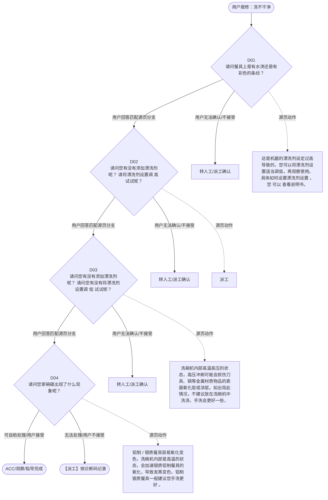

# BSH 洗碗机 — 洗不干净 诊断手册

**故障编号**：F08 | **节点前缀**：PC2 | **来源**：PPT Slides 10-12
**适用诊断码**：`A32100000000` / `16R900000000` / `A50100X08000` / `A31100000000` / `A38100000000` / `A36000000000`
**转换状态**：自动批处理草案，需按源 PPT 视觉关系复核后生产使用

---

## 一、文档使用说明

### 三条执行铁律

1. **不越界**：只执行本文件定义的诊断步骤；遇到超出范围的问题，执行越界协议（见第三节），不得自行延伸
2. **不编造**：话术原文不得改写、补充或省略；不在本文件中的诊断码不得使用
3. **不跳步**：严格按 D 步骤顺序执行，不得跳过中间步骤直接给出结论

### 执行约定标记表

| 标记 | 含义 |
|------|------|
| `【话术】` | 逐字朗读给用户的诊断引导话术 |
| `【判断】` | 根据用户回答或系统数据触发的条件分支 |
| `【诊断码】` | BSH 标准诊断码 |
| `【派工】` | 安排工程师上门 |
| `【配件】` | 预判所需配件 |
| `【视频】` | 视频辅助标记 |
| `【引用】` | 跨故障树引用跳转 |
| `【解释】` | 向用户解释原理/现象 |
| `【操作指导】` | 指导用户自行操作 |
| `▶` | 无条件进入下一步 |

---

## 二、故障诊断导航树

### Mermaid 源码



### 诊断步骤 ↔ 节点速查表

| 步骤 | 节点 ID | 节点类型 | 简述 |
| --- | --- | --- | --- |
| 入口 | PC2_START | 起始 | 用户报修：洗不干净 |
| D01 | PC2_D01 | 判断 | PC2_D02 / PC2_MANUAL01 |
| D02 | PC2_D02 | 判断 | PC2_D03 / PC2_MANUAL02 |
| D03 | PC2_D03 | 判断 | PC2_D04 / PC2_MANUAL03 |
| D04 | PC2_D04 | 判断 | PC2_ACC / PC2_DISPATCH |
| 结束-ACC | PC2_ACC | 结束 | 用户接受/观察/指导完成 |
| 结束-派工 | PC2_DISPATCH | 派工 | 无法处理或用户不接受 |

---

## 三、越界处理协议

### 触发条件（满足以下任意一条即触发越界）

| # | 触发场景 |
|---|---------|
| 1 | 用户故障描述无法映射到当前诊断树的任何入口分支 |
| 2 | 用户回答无法映射到当前 D 步骤的任何条件行 |
| 3 | 目标跳转节点在 Mermaid 图中无有效连线或仍需视觉确认 |
| 4 | 用户要求提供本文档未包含的信息，如价格、保修政策、投诉升级 |
| 5 | 用户描述涉及焦味、冒烟、漏电、跳闸、进水等安全风险 |
| 6 | 用户要求自行拆机、维修、改线或更换内部零部件 |

### 退出动作

- 若属于其他故障树：执行 `【引用】` 跳转或回到索引重新分流
- 若无法定位：转人工客服
- 若存在安全风险：停止在线指导并安排工程师或人工处理

### 严禁行为

- 严禁自行判断主板、电源板、电机、压缩机等内部零部件级故障
- 严禁改写源 PPT 话术作为确定结论
- 严禁在用户尚未回答当前问题时跳至下一步

### 覆盖范围

本故障树仅覆盖 `洗不干净` 相关诊断。其他故障现象应回到 `DW` 索引重新分流。

---

## 四、诊断入口

### 故障主诉确认

- 用户描述与 `洗不干净` 相关。
- 命中索引关键词：洗不干净, 水渍, 彩色条纹, 漏液, A3210, 请问餐具上是有水。
- 来源页：Slides 10-12。

### 入口分支判断

```
用户报修“洗不干净”
│
├── 主诉匹配当前树 → 进入 D01
├── 主诉属于其他故障 → 回到索引执行跨树引用
└── 主诉不明确 → 先追问具体显示/部位/现象
```

---

## 五、诊断步骤详情

### D01 — 请问餐具上是有水渍还是有彩色的条纹？

**[节点：PC2_D01]**

**【话术】**：
> "请问餐具上是有水渍还是有彩色的条纹？"

**判断表**：

| 条件 | 下一步 | 出口类型 | Mermaid 边验证 |
| --- | --- | --- | --- |
| 用户回答匹配源页下一分支 | D02 | 继续诊断 | PC2_D01 → D02（自动草案，待视觉确认） |
| 用户接受解释/操作/观察 | 结束 | ACC | PC2_D01 → ACC（待视觉确认） |
| 用户不接受 / 无法操作 / 风险场景 | 派工或转人工 | 派工 | PC2_D01 → DISPATCH（待视觉确认） |
| **兜底越界**：其他无法识别的输入 | 越界协议 | 越界 | 无对应 Mermaid 边 |


### D02 — 请问您有没有添加漂洗剂呢？ 请将漂洗剂设置调 高 试试呢？

**[节点：PC2_D02]**

**【话术】**：
> "请问您有没有添加漂洗剂呢？ 请将漂洗剂设置调 高 试试呢？"

**判断表**：

| 条件 | 下一步 | 出口类型 | Mermaid 边验证 |
| --- | --- | --- | --- |
| 用户回答匹配源页下一分支 | D03 | 继续诊断 | PC2_D02 → D03（自动草案，待视觉确认） |
| 用户接受解释/操作/观察 | 结束 | ACC | PC2_D02 → ACC（待视觉确认） |
| 用户不接受 / 无法操作 / 风险场景 | 派工或转人工 | 派工 | PC2_D02 → DISPATCH（待视觉确认） |
| **兜底越界**：其他无法识别的输入 | 越界协议 | 越界 | 无对应 Mermaid 边 |


### D03 — 请问您有没有添加漂洗剂呢？ 请问您有没有将漂洗剂设置调 低 试试

**[节点：PC2_D03]**

**【话术】**：
> "请问您有没有添加漂洗剂呢？ 请问您有没有将漂洗剂设置调 低 试试呢？"

**判断表**：

| 条件 | 下一步 | 出口类型 | Mermaid 边验证 |
| --- | --- | --- | --- |
| 用户回答匹配源页下一分支 | D04 | 继续诊断 | PC2_D03 → D04（自动草案，待视觉确认） |
| 用户接受解释/操作/观察 | 结束 | ACC | PC2_D03 → ACC（待视觉确认） |
| 用户不接受 / 无法操作 / 风险场景 | 派工或转人工 | 派工 | PC2_D03 → DISPATCH（待视觉确认） |
| **兜底越界**：其他无法识别的输入 | 越界协议 | 越界 | 无对应 Mermaid 边 |


### D04 — 请问您家碗碟出现了什么现象呢？

**[节点：PC2_D04]**

**【话术】**：
> "请问您家碗碟出现了什么现象呢？"

**判断表**：

| 条件 | 下一步 | 出口类型 | Mermaid 边验证 |
| --- | --- | --- | --- |
| 用户回答匹配源页下一分支 | ACC / 派工 | 继续诊断 | PC2_D04 → ACC / 派工（自动草案，待视觉确认） |
| 用户接受解释/操作/观察 | 结束 | ACC | PC2_D04 → ACC（待视觉确认） |
| 用户不接受 / 无法操作 / 风险场景 | 派工或转人工 | 派工 | PC2_D04 → DISPATCH（待视觉确认） |
| **兜底越界**：其他无法识别的输入 | 越界协议 | 越界 | 无对应 Mermaid 边 |


### 源页动作/结果摘录

- 这是机器的漂洗剂设定过高导致的，您可以将漂洗剂设置适当调低，再观察使用。具体如何设置漂洗剂设置 ，您 可以 查看说明书。
- 派工
- 洗碗机内部高温高压的状态，高压冲刷可能会损伤刀具、锅等金属材质物品的表面氧化层或涂层。如出现此情况，不建议放在洗碗机中洗涤，手洗会更好一些，具体情况您可以咨询锅具厂家 。尤其是铁制品。
- 铝制 / 银质餐具容易氧化变色，洗碗机内部是高温的状态，会加速银质铝制餐具的氧化，导致发黑变色，铝制银质餐具一般建议您手洗更好 。
- 洗碗机内部高温高压的状态，高压冲刷可能会使不粘锅图层掉落，就和我们不粘锅不能用金属锅铲炒菜是一样的。一般不建议放在洗碗机中洗涤，手洗会更好一些，具体情况您可以咨询锅具厂家。
- 用户接受解释
- 洗涤玻璃餐具时建议选择专门的洗涤程序， 例如晶柔洗或精致洗。 请您确认餐具是否适合机涤，因为洗碗机工作时长时间的高温状态，有的餐具是不适合洗碗机洗涤的；长时间的高温以及使用的清洁剂产品可能会导致餐具产生腐蚀。
- 好的。同时提醒您，由于使用的清洁剂产品长时间的高温可能会导致对玻璃餐具产生腐蚀，因此洗涤玻璃餐具时建议选择专门的洗涤程序， 例如晶柔洗或精致洗。

---

## 附录 A：诊断码汇总表

| 诊断码 | 描述 | 触发步骤 | 备注 |
| --- | --- | --- | --- |
| `A32100000000` | 见源 PPT 相邻文本 | 源页派工/判断节点 | 自动抽取，待人工核对英文/中文描述 |
| `16R900000000` | 见源 PPT 相邻文本 | 源页派工/判断节点 | 自动抽取，待人工核对英文/中文描述 |
| `A50100X08000` | 见源 PPT 相邻文本 | 源页派工/判断节点 | 自动抽取，待人工核对英文/中文描述 |
| `A31100000000` | 见源 PPT 相邻文本 | 源页派工/判断节点 | 自动抽取，待人工核对英文/中文描述 |
| `A38100000000` | 见源 PPT 相邻文本 | 源页派工/判断节点 | 自动抽取，待人工核对英文/中文描述 |
| `A36000000000` | 见源 PPT 相邻文本 | 源页派工/判断节点 | 自动抽取，待人工核对英文/中文描述 |

---

## 附录 B：配件建议汇总表

| 配件名称 | 关联步骤 | 说明 |
| --- | --- | --- |
| 源页未明确 | 派工出口 | 按源 PPT 派工节点记录，待视觉确认 |

---

## 附录 C：跨故障树引用清单

| 引用方向 | 触发条件 | 目标文件 | 目标诊断码 |
| --- | --- | --- | --- |
| 无明确跨树引用 | — | — | — |

---

## 附录 D：源页文本摘录（用于复核）

- 洗不干净：水渍 / 彩色条纹 / 漏液
- Internal
- A32100000000 Water stains 水渍
- Water stains
- A32100000000
- 请问餐具上是有水渍还是有彩色的条纹？
- Discoloration, rainbow stains
- 若用户提及是光亮剂在漏，请先指导用户确认是否为光亮剂泄露 1. 当机器不工作时，检查光亮剂料盒盖子底部是否有光亮剂在滴落 2. 对痕迹检查，用手指触碰是否粘稠，可以闻下是否有光亮剂的刺激性气味
- 16R900000000
- 彩色条纹
- 水渍
- 请问您有没有添加漂洗剂呢？ 请将漂洗剂设置调 高 试试呢？
- 请问您有没有添加漂洗剂呢？ 请问您有没有将漂洗剂设置调 低 试试呢？
- Rinse Aid / Dispenser leak
- Other cleaning result problem
- A50100X08000
- 尝试无效
- 未尝试
- A31100000000
- 漂洗剂泄露
- 这是机器的漂洗剂设定过高导致的，您可以将漂洗剂设置适当调低，再观察使用。具体如何设置漂洗剂设置 ，您 可以 查看说明书。
- 这可能是餐具摆放时，餐具之间相互接触，导致餐具在烘干后接触点位置有水渍存在。您可以在后期摆放餐具时，避免其接触即可。
- 派工
- 漂洗剂可以有效的帮助将碗碟上的水珠流到腔体内，有助于烘干，避免水珠的产生，您可以尝试将设置调高试试。
- A50100X08000 Rinse Aid / Dispenser leak 冲洗助剂 / 分配器泄漏
- Page 10
- 洗碗机故障树
- 洗不干净：餐具变色 / 染色
- A31100000000 Other cleaning result problem 其他清洁结果问题
- 备注： 餐具的防锈性不够。其中，刀片往往受到更严重的影响。 如果餐具与生锈的物品一起清洗，也可能生锈。 洗涤水中的含盐量过高。
- 请问您家碗碟出现了什么现象呢？
- Rust, cutlery
- A38100000000
- 涂层掉落
- 染色
- 变色 / 发黑
- 餐具生锈
- 洗碗机内部高温高压的状态，高压冲刷可能会损伤刀具、锅等金属材质物品的表面氧化层或涂层。如出现此情况，不建议放在洗碗机中洗涤，手洗会更好一些，具体情况您可以咨询锅具厂家 。尤其是铁制品。
- 铝制 / 银质餐具容易氧化变色，洗碗机内部是高温的状态，会加速银质铝制餐具的氧化，导致发黑变色，铝制银质餐具一般建议您手洗更好 。
- 餐具的颜色可能是来自于食物残渣中的色素（例如，卷心菜，芹菜等）等化学物质导致的。蔬菜或自来水中的有色物质是无害的，您可以放心。在后期使用时，可以提前将餐具的蔬菜类残渣，提前清理，再放入洗碗机洗涤。
- 洗碗机内部高温高压的状态，高压冲刷可能会使不粘锅图层掉落，就和我们不粘锅不能用金属锅铲炒菜是一样的。一般不建议放在洗碗机中洗涤，手洗会更好一些，具体情况您可以咨询锅具厂家。
- Page 11
- 洗不干净：玻璃杯有雾状
- A36000000000 Cloudy glasses 玻璃浑浊
- Cloudy glasses
- A36000000000
- 可能是水质过硬产生的钙质沉淀 ，请您在餐具中倒一些食用醋，尝试将水垢祛除。在 下次使用前，在盐仓中添加足量的洗碗盐，已避免再次出现餐具起雾的问题 。 ( 根据水硬度调节水硬度设置 )
- 用户接受解释
- 非钙质沉积物，餐具表面有磨损
- 洗涤玻璃餐具时建议选择专门的洗涤程序， 例如晶柔洗或精致洗。 请您确认餐具是否适合机涤，因为洗碗机工作时长时间的高温状态，有的餐具是不适合洗碗机洗涤的；长时间的高温以及使用的清洁剂产品可能会导致餐具产生腐蚀。
- 好的。同时提醒您，由于使用的清洁剂产品长时间的高温可能会导致对玻璃餐具产生腐蚀，因此洗涤玻璃餐具时建议选择专门的洗涤程序， 例如晶柔洗或精致洗。
- Page 12
