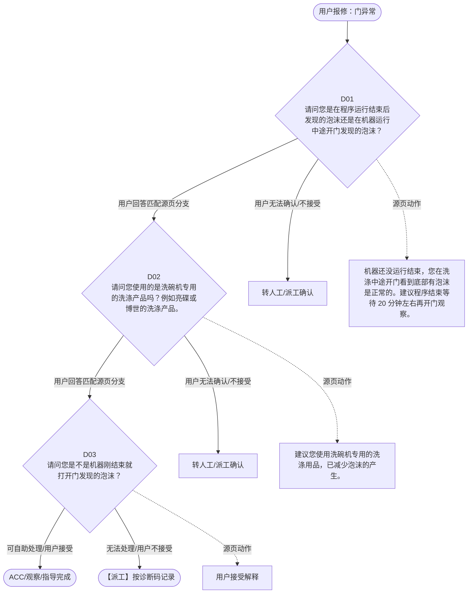

# BSH 洗碗机 — 门异常 诊断手册

**故障编号**：F17 | **节点前缀**：DO3 | **来源**：PPT Slide 24
**适用诊断码**：`A31100000000`
**转换状态**：自动批处理草案，需按源 PPT 视觉关系复核后生产使用

---

## 一、文档使用说明

### 三条执行铁律

1. **不越界**：只执行本文件定义的诊断步骤；遇到超出范围的问题，执行越界协议（见第三节），不得自行延伸
2. **不编造**：话术原文不得改写、补充或省略；不在本文件中的诊断码不得使用
3. **不跳步**：严格按 D 步骤顺序执行，不得跳过中间步骤直接给出结论

### 执行约定标记表

| 标记 | 含义 |
|------|------|
| `【话术】` | 逐字朗读给用户的诊断引导话术 |
| `【判断】` | 根据用户回答或系统数据触发的条件分支 |
| `【诊断码】` | BSH 标准诊断码 |
| `【派工】` | 安排工程师上门 |
| `【配件】` | 预判所需配件 |
| `【视频】` | 视频辅助标记 |
| `【引用】` | 跨故障树引用跳转 |
| `【解释】` | 向用户解释原理/现象 |
| `【操作指导】` | 指导用户自行操作 |
| `▶` | 无条件进入下一步 |

---

## 二、故障诊断导航树

### Mermaid 源码



### 诊断步骤 ↔ 节点速查表

| 步骤 | 节点 ID | 节点类型 | 简述 |
| --- | --- | --- | --- |
| 入口 | DO3_START | 起始 | 用户报修：门异常 |
| D01 | DO3_D01 | 判断 | DO3_D02 / DO3_MANUAL01 |
| D02 | DO3_D02 | 判断 | DO3_D03 / DO3_MANUAL02 |
| D03 | DO3_D03 | 判断 | DO3_ACC / DO3_DISPATCH |
| 结束-ACC | DO3_ACC | 结束 | 用户接受/观察/指导完成 |
| 结束-派工 | DO3_DISPATCH | 派工 | 无法处理或用户不接受 |

---

## 三、越界处理协议

### 触发条件（满足以下任意一条即触发越界）

| # | 触发场景 |
|---|---------|
| 1 | 用户故障描述无法映射到当前诊断树的任何入口分支 |
| 2 | 用户回答无法映射到当前 D 步骤的任何条件行 |
| 3 | 目标跳转节点在 Mermaid 图中无有效连线或仍需视觉确认 |
| 4 | 用户要求提供本文档未包含的信息，如价格、保修政策、投诉升级 |
| 5 | 用户描述涉及焦味、冒烟、漏电、跳闸、进水等安全风险 |
| 6 | 用户要求自行拆机、维修、改线或更换内部零部件 |

### 退出动作

- 若属于其他故障树：执行 `【引用】` 跳转或回到索引重新分流
- 若无法定位：转人工客服
- 若存在安全风险：停止在线指导并安排工程师或人工处理

### 严禁行为

- 严禁自行判断主板、电源板、电机、压缩机等内部零部件级故障
- 严禁改写源 PPT 话术作为确定结论
- 严禁在用户尚未回答当前问题时跳至下一步

### 覆盖范围

本故障树仅覆盖 `门异常` 相关诊断。其他故障现象应回到 `DW` 索引重新分流。

---

## 四、诊断入口

### 故障主诉确认

- 用户描述与 `门异常` 相关。
- 命中索引关键词：门异常, 其他清洁结果问题, A3110, 请问您是在程序运, 行结束后发现的泡, 沫还是在机器运行。
- 来源页：Slide 24。

### 入口分支判断

```
用户报修“门异常”
│
├── 主诉匹配当前树 → 进入 D01
├── 主诉属于其他故障 → 回到索引执行跨树引用
└── 主诉不明确 → 先追问具体显示/部位/现象
```

---

## 五、诊断步骤详情

### D01 — 请问您是在程序运行结束后发现的泡沫还是在机器运行中途开门发现的泡

**[节点：DO3_D01]**

**【话术】**：
> "请问您是在程序运行结束后发现的泡沫还是在机器运行中途开门发现的泡沫？"

**判断表**：

| 条件 | 下一步 | 出口类型 | Mermaid 边验证 |
| --- | --- | --- | --- |
| 用户回答匹配源页下一分支 | D02 | 继续诊断 | DO3_D01 → D02（自动草案，待视觉确认） |
| 用户接受解释/操作/观察 | 结束 | ACC | DO3_D01 → ACC（待视觉确认） |
| 用户不接受 / 无法操作 / 风险场景 | 派工或转人工 | 派工 | DO3_D01 → DISPATCH（待视觉确认） |
| **兜底越界**：其他无法识别的输入 | 越界协议 | 越界 | 无对应 Mermaid 边 |


### D02 — 请问您使用的是洗碗机专用的洗涤产品吗？例如亮碟或博世的洗涤产品。

**[节点：DO3_D02]**

**【话术】**：
> "请问您使用的是洗碗机专用的洗涤产品吗？例如亮碟或博世的洗涤产品。"

**判断表**：

| 条件 | 下一步 | 出口类型 | Mermaid 边验证 |
| --- | --- | --- | --- |
| 用户回答匹配源页下一分支 | D03 | 继续诊断 | DO3_D02 → D03（自动草案，待视觉确认） |
| 用户接受解释/操作/观察 | 结束 | ACC | DO3_D02 → ACC（待视觉确认） |
| 用户不接受 / 无法操作 / 风险场景 | 派工或转人工 | 派工 | DO3_D02 → DISPATCH（待视觉确认） |
| **兜底越界**：其他无法识别的输入 | 越界协议 | 越界 | 无对应 Mermaid 边 |


### D03 — 请问您是不是机器刚结束就打开门发现的泡沫？

**[节点：DO3_D03]**

**【话术】**：
> "请问您是不是机器刚结束就打开门发现的泡沫？"

**判断表**：

| 条件 | 下一步 | 出口类型 | Mermaid 边验证 |
| --- | --- | --- | --- |
| 用户回答匹配源页下一分支 | ACC / 派工 | 继续诊断 | DO3_D03 → ACC / 派工（自动草案，待视觉确认） |
| 用户接受解释/操作/观察 | 结束 | ACC | DO3_D03 → ACC（待视觉确认） |
| 用户不接受 / 无法操作 / 风险场景 | 派工或转人工 | 派工 | DO3_D03 → DISPATCH（待视觉确认） |
| **兜底越界**：其他无法识别的输入 | 越界协议 | 越界 | 无对应 Mermaid 边 |


### 源页动作/结果摘录

- 机器还没运行结束，您在洗涤中途开门看到底部有泡沫是正常的。建议程序结束等待 20 分钟左右再开门观察。
- 建议您使用洗碗机专用的洗涤用品，已减少泡沫的产生。
- 用户接受解释
- 好的。建议程序结束等待 20 分钟左右再开门观察。
- 建议用户根据使用经验，减少洗涤剂用量，并适当调低光亮剂设定。

---

## 附录 A：诊断码汇总表

| 诊断码 | 描述 | 触发步骤 | 备注 |
| --- | --- | --- | --- |
| `A31100000000` | 见源 PPT 相邻文本 | 源页派工/判断节点 | 自动抽取，待人工核对英文/中文描述 |

---

## 附录 B：配件建议汇总表

| 配件名称 | 关联步骤 | 说明 |
| --- | --- | --- |
| 源页未明确 | 派工出口 | 按源 PPT 派工节点记录，待视觉确认 |

---

## 附录 C：跨故障树引用清单

| 引用方向 | 触发条件 | 目标文件 | 目标诊断码 |
| --- | --- | --- | --- |
| 无明确跨树引用 | — | — | — |

---

## 附录 D：源页文本摘录（用于复核）

- Internal
- 其他清洁结果问题
- A31100000000
- A31100000000 Other cleaning result problem 其他清洁结果问题
- 请问您是在程序运行结束后发现的泡沫还是在机器运行中途开门发现的泡沫？
- 中途开门
- 程序结束后
- 请问您使用的是洗碗机专用的洗涤产品吗？例如亮碟或博世的洗涤产品。
- 机器还没运行结束，您在洗涤中途开门看到底部有泡沫是正常的。建议程序结束等待 20 分钟左右再开门观察。
- 非洗碗机专用洗涤产品
- 洗碗机专用洗涤产品
- 可能是洗涤剂，或选择的程序洗涤时间短的原因，您可以选用时间更长的程序（例如，节能洗）或适当减少洗涤用品的用量，尝试使用。
- 建议您使用洗碗机专用的洗涤用品，已减少泡沫的产生。
- 尝试切换程序故障依旧
- 用户接受解释
- 好的。建议程序结束等待 20 分钟左右再开门观察。
- 请问您是不是机器刚结束就打开门发现的泡沫？
- 程序结束就开门
- 等待 20 分钟还有泡沫
- 程序刚结束，内部用于提高烘干效果的漂洗剂仍会保持泡泡的形状，等待 20 分钟左右，温度降低，泡泡会自行消失的。这是机器的正常现象，请您放心使用。
- 建议用户根据使用经验，减少洗涤剂用量，并适当调低光亮剂设定。
- Page 13
- 洗碗机故障树
