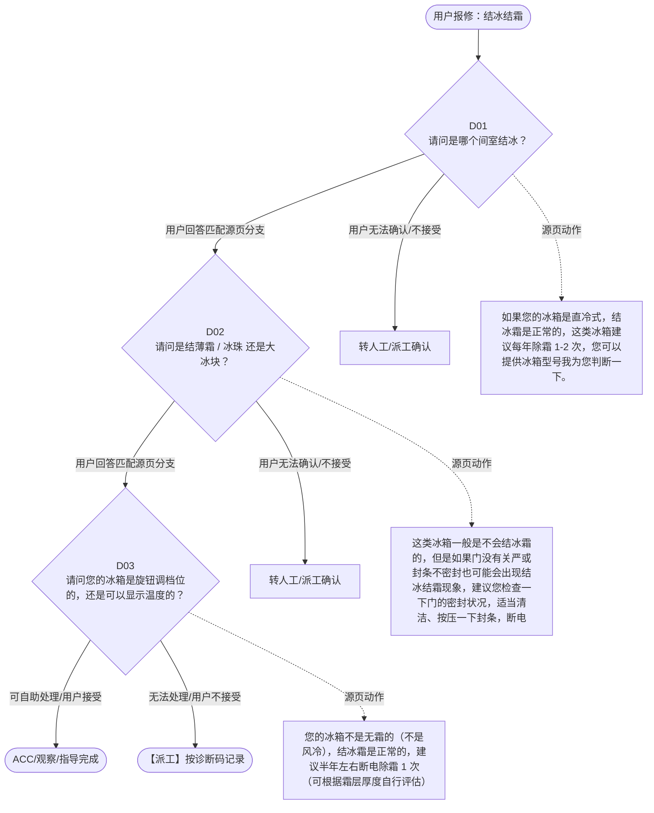

# BSH 普通冰箱 — 结冰结霜 诊断手册

**故障编号**：F06 | **节点前缀**：IF | **来源**：PPT Slide 8
**适用诊断码**：`B42000000000` / `B420001ZI000` / `B420001Z1000` / `B420001Z2000`
**转换状态**：自动批处理草案，需按源 PPT 视觉关系复核后生产使用

---

## 一、文档使用说明

### 三条执行铁律

1. **不越界**：只执行本文件定义的诊断步骤；遇到超出范围的问题，执行越界协议（见第三节），不得自行延伸
2. **不编造**：话术原文不得改写、补充或省略；不在本文件中的诊断码不得使用
3. **不跳步**：严格按 D 步骤顺序执行，不得跳过中间步骤直接给出结论

### 执行约定标记表

| 标记 | 含义 |
|------|------|
| `【话术】` | 逐字朗读给用户的诊断引导话术 |
| `【判断】` | 根据用户回答或系统数据触发的条件分支 |
| `【诊断码】` | BSH 标准诊断码 |
| `【派工】` | 安排工程师上门 |
| `【配件】` | 预判所需配件 |
| `【视频】` | 视频辅助标记 |
| `【引用】` | 跨故障树引用跳转 |
| `【解释】` | 向用户解释原理/现象 |
| `【操作指导】` | 指导用户自行操作 |
| `▶` | 无条件进入下一步 |

---

## 二、故障诊断导航树

### Mermaid 源码



### 诊断步骤 ↔ 节点速查表

| 步骤 | 节点 ID | 节点类型 | 简述 |
| --- | --- | --- | --- |
| 入口 | IF_START | 起始 | 用户报修：结冰结霜 |
| D01 | IF_D01 | 判断 | IF_D02 / IF_MANUAL01 |
| D02 | IF_D02 | 判断 | IF_D03 / IF_MANUAL02 |
| D03 | IF_D03 | 判断 | IF_ACC / IF_DISPATCH |
| 结束-ACC | IF_ACC | 结束 | 用户接受/观察/指导完成 |
| 结束-派工 | IF_DISPATCH | 派工 | 无法处理或用户不接受 |

---

## 三、越界处理协议

### 触发条件（满足以下任意一条即触发越界）

| # | 触发场景 |
|---|---------|
| 1 | 用户故障描述无法映射到当前诊断树的任何入口分支 |
| 2 | 用户回答无法映射到当前 D 步骤的任何条件行 |
| 3 | 目标跳转节点在 Mermaid 图中无有效连线或仍需视觉确认 |
| 4 | 用户要求提供本文档未包含的信息，如价格、保修政策、投诉升级 |
| 5 | 用户描述涉及焦味、冒烟、漏电、跳闸、进水等安全风险 |
| 6 | 用户要求自行拆机、维修、改线或更换内部零部件 |

### 退出动作

- 若属于其他故障树：执行 `【引用】` 跳转或回到索引重新分流
- 若无法定位：转人工客服
- 若存在安全风险：停止在线指导并安排工程师或人工处理

### 严禁行为

- 严禁自行判断主板、电源板、电机、压缩机等内部零部件级故障
- 严禁改写源 PPT 话术作为确定结论
- 严禁在用户尚未回答当前问题时跳至下一步

### 覆盖范围

本故障树仅覆盖 `结冰结霜` 相关诊断。其他故障现象应回到 `FR` 索引重新分流。

---

## 四、诊断入口

### 故障主诉确认

- 用户描述与 `结冰结霜` 相关。
- 命中索引关键词：结冰结霜, 结冰, 结霜, B4200, 请问是哪个间室结, 操作。
- 来源页：Slide 8。

### 入口分支判断

```
用户报修“结冰结霜”
│
├── 主诉匹配当前树 → 进入 D01
├── 主诉属于其他故障 → 回到索引执行跨树引用
└── 主诉不明确 → 先追问具体显示/部位/现象
```

---

## 五、诊断步骤详情

### D01 — 请问是哪个间室结冰？

**[节点：IF_D01]**

**【话术】**：
> "请问是哪个间室结冰？"

**判断表**：

| 条件 | 下一步 | 出口类型 | Mermaid 边验证 |
| --- | --- | --- | --- |
| 用户回答匹配源页下一分支 | D02 | 继续诊断 | IF_D01 → D02（自动草案，待视觉确认） |
| 用户接受解释/操作/观察 | 结束 | ACC | IF_D01 → ACC（待视觉确认） |
| 用户不接受 / 无法操作 / 风险场景 | 派工或转人工 | 派工 | IF_D01 → DISPATCH（待视觉确认） |
| **兜底越界**：其他无法识别的输入 | 越界协议 | 越界 | 无对应 Mermaid 边 |


### D02 — 请问是结薄霜 / 冰珠 还是大冰块？

**[节点：IF_D02]**

**【话术】**：
> "请问是结薄霜 / 冰珠 还是大冰块？"

**判断表**：

| 条件 | 下一步 | 出口类型 | Mermaid 边验证 |
| --- | --- | --- | --- |
| 用户回答匹配源页下一分支 | D03 | 继续诊断 | IF_D02 → D03（自动草案，待视觉确认） |
| 用户接受解释/操作/观察 | 结束 | ACC | IF_D02 → ACC（待视觉确认） |
| 用户不接受 / 无法操作 / 风险场景 | 派工或转人工 | 派工 | IF_D02 → DISPATCH（待视觉确认） |
| **兜底越界**：其他无法识别的输入 | 越界协议 | 越界 | 无对应 Mermaid 边 |


### D03 — 请问您的冰箱是旋钮调档位的，还是可以显示温度的？

**[节点：IF_D03]**

**【话术】**：
> "请问您的冰箱是旋钮调档位的，还是可以显示温度的？"

**判断表**：

| 条件 | 下一步 | 出口类型 | Mermaid 边验证 |
| --- | --- | --- | --- |
| 用户回答匹配源页下一分支 | ACC / 派工 | 继续诊断 | IF_D03 → ACC / 派工（自动草案，待视觉确认） |
| 用户接受解释/操作/观察 | 结束 | ACC | IF_D03 → ACC（待视觉确认） |
| 用户不接受 / 无法操作 / 风险场景 | 派工或转人工 | 派工 | IF_D03 → DISPATCH（待视觉确认） |
| **兜底越界**：其他无法识别的输入 | 越界协议 | 越界 | 无对应 Mermaid 边 |


### 源页动作/结果摘录

- 如果您的冰箱是直冷式，结冰霜是正常的，这类冰箱建议每年除霜 1-2 次，您可以提供冰箱型号我为您判断一下。
- 这类冰箱一般是不会结冰霜的，但是如果门没有关严或封条不密封也可能会出现结冰结霜现象，建议您检查一下门的密封状况，适当清洁、按压一下封条，断电除霜再观察一下
- 您的冰箱不是无霜的（不是风冷），结冰霜是正常的，建议半年左右断电除霜 1 次（可根据霜层厚度自行评估）
- 快速结冰霜主要还是与封条不密封或者门没有关严有关，建议您检查一下门的密封状况，适当清洁、按压一下封条，断电除霜再观察一下
- 建议您先断电除霜，如果后部有排水孔，除完霜之后您也可以将排水孔疏通一下
- 建议您断电除霜后再观察使用。如果中间是冻鲜室，温度低于 0 度以下，结冰是正常现象。
- 建议您先断电除霜，再疏通一下排水孔后使用观察
- 接受
- 不接受
- 派工
- ACC
- 提醒： [ 型号中有 “D”] ：中间室是 冻鲜 室，温度通常在 -6~-10℃ ，结冰是正常现象，如结冰厚可断电除霜。 [ 型号中有 “C”] ：中间室是 冷鲜 室，建议您断电除霜后再观察使用； [ 型号中有 “N”] ：查询说明书判断是 冻鲜 室还是 冷鲜 室。
- 提醒：如果是机械冰箱，建议将挡位保持在 3 挡观察，并确认档位旁的“速冻”按钮已关闭

---

## 附录 A：诊断码汇总表

| 诊断码 | 描述 | 触发步骤 | 备注 |
| --- | --- | --- | --- |
| `B42000000000` | 见源 PPT 相邻文本 | 源页派工/判断节点 | 自动抽取，待人工核对英文/中文描述 |
| `B420001ZI000` | 见源 PPT 相邻文本 | 源页派工/判断节点 | 自动抽取，待人工核对英文/中文描述 |
| `B420001Z1000` | 见源 PPT 相邻文本 | 源页派工/判断节点 | 自动抽取，待人工核对英文/中文描述 |
| `B420001Z2000` | 见源 PPT 相邻文本 | 源页派工/判断节点 | 自动抽取，待人工核对英文/中文描述 |

---

## 附录 B：配件建议汇总表

| 配件名称 | 关联步骤 | 说明 |
| --- | --- | --- |
| 源页未明确 | 派工出口 | 按源 PPT 派工节点记录，待视觉确认 |

---

## 附录 C：跨故障树引用清单

| 引用方向 | 触发条件 | 目标文件 | 目标诊断码 |
| --- | --- | --- | --- |
| 无明确跨树引用 | — | — | — |

---

## 附录 D：源页文本摘录（用于复核）

- 结冰、结霜
- B42000000000 Ice formation 结冰
- 请问是哪个间室结冰？
- 操作：根据型号查询 派 或说明书，派中 无霜技术栏显示为无霜则代表为风冷冰箱 ; 或者查看说明书清洁与维护章节“除霜”
- 冷冻室
- 中间室
- 冷藏室
- 如果您的冰箱是直冷式，结冰霜是正常的，这类冰箱建议每年除霜 1-2 次，您可以提供冰箱型号我为您判断一下。
- 请问是结薄霜 / 冰珠 还是大冰块？
- 请问您的冰箱是旋钮调档位的，还是可以显示温度的？
- 除霜后很快又结上
- 无霜冰箱
- 大冰块 大冰块 + 积水
- 可以显示温度
- 旋钮调节
- 薄霜 / 冰珠
- 直冷、有霜冰箱
- 这类冰箱一般是不会结冰霜的，但是如果门没有关严或封条不密封也可能会出现结冰结霜现象，建议您检查一下门的密封状况，适当清洁、按压一下封条，断电除霜再观察一下
- 您的冰箱不是无霜的（不是风冷），结冰霜是正常的，建议半年左右断电除霜 1 次（可根据霜层厚度自行评估）
- 快速结冰霜主要还是与封条不密封或者门没有关严有关，建议您检查一下门的密封状况，适当清洁、按压一下封条，断电除霜再观察一下
- 通常冷藏室内部后壁有制冷部件（蒸发器），制冷时，后壁的温度会低于零度，箱内的水汽遇冷后，会在后壁结成薄霜或冰珠，停止制冷后会融化，顺着后壁的排水孔流下。这是正常的
- 建议您先断电除霜，如果后部有排水孔，除完霜之后您也可以将排水孔疏通一下
- 建议您断电除霜后再观察使用。如果中间是冻鲜室，温度低于 0 度以下，结冰是正常现象。
- 建议您先断电除霜，再疏通一下排水孔后使用观察
- 接受
- 不接受
- 派工
- ACC
- B420001ZI000 Ice formation freezer compartment 冷冻室结冰
- 提醒： [ 型号中有 “D”] ：中间室是 冻鲜 室，温度通常在 -6~-10℃ ，结冰是正常现象，如结冰厚可断电除霜。 [ 型号中有 “C”] ：中间室是 冷鲜 室，建议您断电除霜后再观察使用； [ 型号中有 “N”] ：查询说明书判断是 冻鲜 室还是 冷鲜 室。
- 提醒：如果是机械冰箱，建议将挡位保持在 3 挡观察，并确认档位旁的“速冻”按钮已关闭
- B420001Z1000 Ice formation Cool-fresh (Chiller) compartment 零度室、变温室结冰
- B420001Z2000 Ice formation in refrigerator compartment 冷藏室结冰
- Page 6
- 普通冰箱故障树 _1.0
