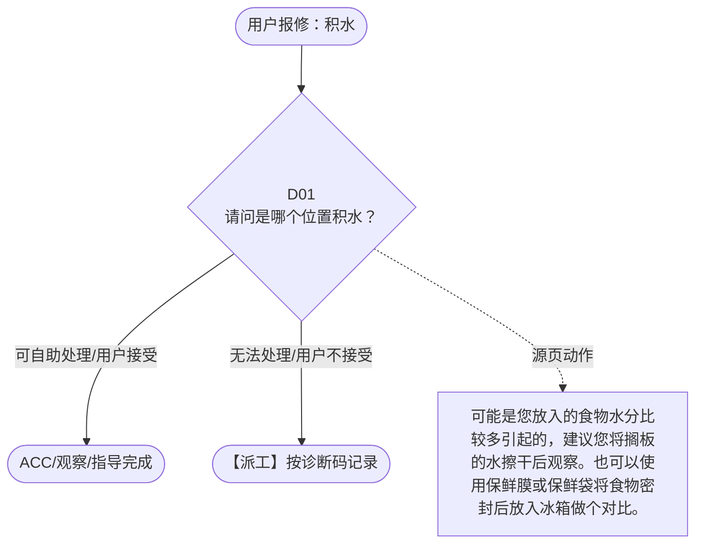

# BSH 普通冰箱 — 积水 诊断手册

**故障编号**：F16 | **节点前缀**：WA | **来源**：PPT Slide 18
**适用诊断码**：`A12200000000`
**转换状态**：自动批处理草案，需按源 PPT 视觉关系复核后生产使用

---

## 一、文档使用说明

### 三条执行铁律

1. **不越界**：只执行本文件定义的诊断步骤；遇到超出范围的问题，执行越界协议（见第三节），不得自行延伸
2. **不编造**：话术原文不得改写、补充或省略；不在本文件中的诊断码不得使用
3. **不跳步**：严格按 D 步骤顺序执行，不得跳过中间步骤直接给出结论

### 执行约定标记表

| 标记 | 含义 |
|------|------|
| `【话术】` | 逐字朗读给用户的诊断引导话术 |
| `【判断】` | 根据用户回答或系统数据触发的条件分支 |
| `【诊断码】` | BSH 标准诊断码 |
| `【派工】` | 安排工程师上门 |
| `【配件】` | 预判所需配件 |
| `【视频】` | 视频辅助标记 |
| `【引用】` | 跨故障树引用跳转 |
| `【解释】` | 向用户解释原理/现象 |
| `【操作指导】` | 指导用户自行操作 |
| `▶` | 无条件进入下一步 |

---

## 二、故障诊断导航树

### Mermaid 源码



### 诊断步骤 ↔ 节点速查表

| 步骤 | 节点 ID | 节点类型 | 简述 |
| --- | --- | --- | --- |
| 入口 | WA_START | 起始 | 用户报修：积水 |
| D01 | WA_D01 | 判断 | WA_ACC / WA_DISPATCH |
| 结束-ACC | WA_ACC | 结束 | 用户接受/观察/指导完成 |
| 结束-派工 | WA_DISPATCH | 派工 | 无法处理或用户不接受 |

---

## 三、越界处理协议

### 触发条件（满足以下任意一条即触发越界）

| # | 触发场景 |
|---|---------|
| 1 | 用户故障描述无法映射到当前诊断树的任何入口分支 |
| 2 | 用户回答无法映射到当前 D 步骤的任何条件行 |
| 3 | 目标跳转节点在 Mermaid 图中无有效连线或仍需视觉确认 |
| 4 | 用户要求提供本文档未包含的信息，如价格、保修政策、投诉升级 |
| 5 | 用户描述涉及焦味、冒烟、漏电、跳闸、进水等安全风险 |
| 6 | 用户要求自行拆机、维修、改线或更换内部零部件 |

### 退出动作

- 若属于其他故障树：执行 `【引用】` 跳转或回到索引重新分流
- 若无法定位：转人工客服
- 若存在安全风险：停止在线指导并安排工程师或人工处理

### 严禁行为

- 严禁自行判断主板、电源板、电机、压缩机等内部零部件级故障
- 严禁改写源 PPT 话术作为确定结论
- 严禁在用户尚未回答当前问题时跳至下一步

### 覆盖范围

本故障树仅覆盖 `积水` 相关诊断。其他故障现象应回到 `FR` 索引重新分流。

---

## 四、诊断入口

### 故障主诉确认

- 用户描述与 `积水` 相关。
- 命中索引关键词：积水, A1220, 不排水, 设备内积水, 请问是哪个位置积, 搁板有水。
- 来源页：Slide 18。

### 入口分支判断

```
用户报修“积水”
│
├── 主诉匹配当前树 → 进入 D01
├── 主诉属于其他故障 → 回到索引执行跨树引用
└── 主诉不明确 → 先追问具体显示/部位/现象
```

---

## 五、诊断步骤详情

### D01 — 请问是哪个位置积水？

**[节点：WA_D01]**

**【话术】**：
> "请问是哪个位置积水？"

**判断表**：

| 条件 | 下一步 | 出口类型 | Mermaid 边验证 |
| --- | --- | --- | --- |
| 用户回答匹配源页下一分支 | ACC / 派工 | 继续诊断 | WA_D01 → ACC / 派工（自动草案，待视觉确认） |
| 用户接受解释/操作/观察 | 结束 | ACC | WA_D01 → ACC（待视觉确认） |
| 用户不接受 / 无法操作 / 风险场景 | 派工或转人工 | 派工 | WA_D01 → DISPATCH（待视觉确认） |
| **兜底越界**：其他无法识别的输入 | 越界协议 | 越界 | 无对应 Mermaid 边 |


### 源页动作/结果摘录

- 可能是您放入的食物水分比较多引起的，建议您将搁板的水擦干后观察。也可以使用保鲜膜或保鲜袋将食物密封后放入冰箱做个对比。
- 冰箱的冷藏有排水孔，可能孔堵了，需要疏通一下。您可以检查一下冰箱冷藏内胆后壁靠下的位置是否有这么一个排水孔，如果有，您可以关注一下 undefined 家电微信公众号，输入“排水孔”三个字会出来一个链接，点击链接可以查看疏通视频。
- 部分中间室有排水孔，可能孔堵了，需要疏通一下。您可以检查一下冰箱冷藏内胆后壁靠下的位置是否有这么一个排水孔，如果有，您可以关注一下 undefined 家电微信公众号，输入“排水孔”三个字会出来一个链接，点击链接可以查看疏通视频。
- 用户不接受 / 无排水孔 / 已清理无效
- 用户接受
- 用户不接受
- 派工
- ACC
- 视频已有
- 视频：无需
- 提醒： 如客户反馈：无法疏通或疏通管只能插入不到 10cm ，建议客户在方便的时候，将冰箱整体断电除霜后再疏通尝试（整体除霜时间可能需要 4 小时左右）

---

## 附录 A：诊断码汇总表

| 诊断码 | 描述 | 触发步骤 | 备注 |
| --- | --- | --- | --- |
| `A12200000000` | 见源 PPT 相邻文本 | 源页派工/判断节点 | 自动抽取，待人工核对英文/中文描述 |

---

## 附录 B：配件建议汇总表

| 配件名称 | 关联步骤 | 说明 |
| --- | --- | --- |
| 源页未明确 | 派工出口 | 按源 PPT 派工节点记录，待视觉确认 |

---

## 附录 C：跨故障树引用清单

| 引用方向 | 触发条件 | 目标文件 | 目标诊断码 |
| --- | --- | --- | --- |
| 无明确跨树引用 | — | — | — |

---

## 附录 D：源页文本摘录（用于复核）

- 积水
- A12200000000 Not draining / water in the appliance 不排水，设备内积水
- 请问是哪个位置积水？
- 搁板有水
- 中间室积水
- 冷藏室底部积水
- 可能是您放入的食物水分比较多引起的，建议您将搁板的水擦干后观察。也可以使用保鲜膜或保鲜袋将食物密封后放入冰箱做个对比。
- 冰箱的冷藏有排水孔，可能孔堵了，需要疏通一下。您可以检查一下冰箱冷藏内胆后壁靠下的位置是否有这么一个排水孔，如果有，您可以关注一下 undefined 家电微信公众号，输入“排水孔”三个字会出来一个链接，点击链接可以查看疏通视频。
- 部分中间室有排水孔，可能孔堵了，需要疏通一下。您可以检查一下冰箱冷藏内胆后壁靠下的位置是否有这么一个排水孔，如果有，您可以关注一下 undefined 家电微信公众号，输入“排水孔”三个字会出来一个链接，点击链接可以查看疏通视频。
- 底部积水
- 用户不接受 / 无排水孔 / 已清理无效
- 用户接受
- 用户不接受
- A12200000000 Not draining / water in the appliance
- 派工
- ACC
- 视频已有
- 视频：无需
- 提醒： 如客户反馈：无法疏通或疏通管只能插入不到 10cm ，建议客户在方便的时候，将冰箱整体断电除霜后再疏通尝试（整体除霜时间可能需要 4 小时左右）
- 要求在线指导： 操作方法 : 首先拔掉冰箱电源，开门静置 30 分钟，准备一根长度大于 1 米的塑料软管（废弃充电线、网线等均可，直径小于 8 毫米），将软管插入排水孔进行疏通，疏通后，倒入 200 毫升清水检测是否已疏通。
