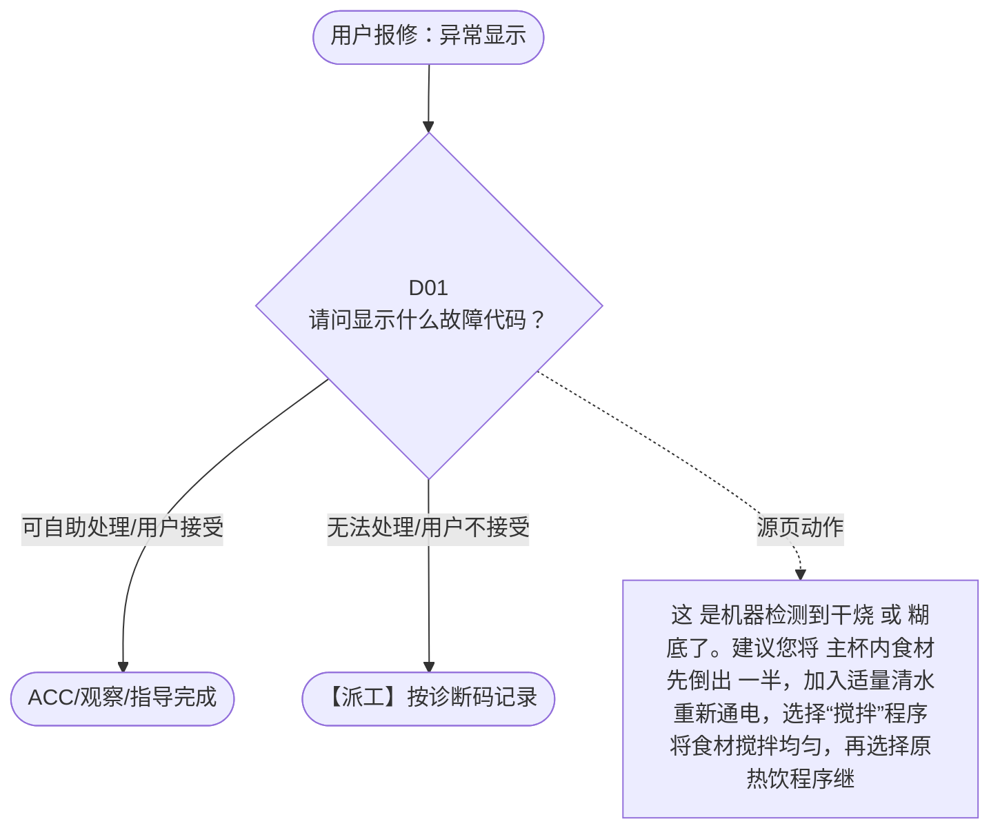

# BSH 加热破壁机 — 异常显示 诊断手册

**故障编号**：F02 | **节点前缀**：DA | **来源**：PPT Slide 4
**适用诊断码**：`17E000000000` / `17E000000E05` / `17E000000E01` / `17E000000E04` / `17E000000E06` / `17E000000E03`
**转换状态**：自动批处理草案，需按源 PPT 视觉关系复核后生产使用

---

## 一、文档使用说明

### 三条执行铁律

1. **不越界**：只执行本文件定义的诊断步骤；遇到超出范围的问题，执行越界协议（见第三节），不得自行延伸
2. **不编造**：话术原文不得改写、补充或省略；不在本文件中的诊断码不得使用
3. **不跳步**：严格按 D 步骤顺序执行，不得跳过中间步骤直接给出结论

### 执行约定标记表

| 标记 | 含义 |
|------|------|
| `【话术】` | 逐字朗读给用户的诊断引导话术 |
| `【判断】` | 根据用户回答或系统数据触发的条件分支 |
| `【诊断码】` | BSH 标准诊断码 |
| `【派工】` | 安排工程师上门 |
| `【配件】` | 预判所需配件 |
| `【视频】` | 视频辅助标记 |
| `【引用】` | 跨故障树引用跳转 |
| `【解释】` | 向用户解释原理/现象 |
| `【操作指导】` | 指导用户自行操作 |
| `▶` | 无条件进入下一步 |

---

## 二、故障诊断导航树

### Mermaid 源码



### 诊断步骤 ↔ 节点速查表

| 步骤 | 节点 ID | 节点类型 | 简述 |
| --- | --- | --- | --- |
| 入口 | DA_START | 起始 | 用户报修：异常显示 |
| D01 | DA_D01 | 判断 | DA_ACC / DA_DISPATCH |
| 结束-ACC | DA_ACC | 结束 | 用户接受/观察/指导完成 |
| 结束-派工 | DA_DISPATCH | 派工 | 无法处理或用户不接受 |

---

## 三、越界处理协议

### 触发条件（满足以下任意一条即触发越界）

| # | 触发场景 |
|---|---------|
| 1 | 用户故障描述无法映射到当前诊断树的任何入口分支 |
| 2 | 用户回答无法映射到当前 D 步骤的任何条件行 |
| 3 | 目标跳转节点在 Mermaid 图中无有效连线或仍需视觉确认 |
| 4 | 用户要求提供本文档未包含的信息，如价格、保修政策、投诉升级 |
| 5 | 用户描述涉及焦味、冒烟、漏电、跳闸、进水等安全风险 |
| 6 | 用户要求自行拆机、维修、改线或更换内部零部件 |

### 退出动作

- 若属于其他故障树：执行 `【引用】` 跳转或回到索引重新分流
- 若无法定位：转人工客服
- 若存在安全风险：停止在线指导并安排工程师或人工处理

### 严禁行为

- 严禁自行判断主板、电源板、电机、压缩机等内部零部件级故障
- 严禁改写源 PPT 话术作为确定结论
- 严禁在用户尚未回答当前问题时跳至下一步

### 覆盖范围

本故障树仅覆盖 `异常显示` 相关诊断。其他故障现象应回到 `HB` 索引重新分流。

---

## 四、诊断入口

### 故障主诉确认

- 用户描述与 `异常显示` 相关。
- 命中索引关键词：异常显示, E0000, 错误代码, 不工作, 请问显示什么故障, 代码。
- 来源页：Slide 4。

### 入口分支判断

```
用户报修“异常显示”
│
├── 主诉匹配当前树 → 进入 D01
├── 主诉属于其他故障 → 回到索引执行跨树引用
└── 主诉不明确 → 先追问具体显示/部位/现象
```

---

## 五、诊断步骤详情

### D01 — 请问显示什么故障代码？

**[节点：DA_D01]**

**【话术】**：
> "请问显示什么故障代码？"

**判断表**：

| 条件 | 下一步 | 出口类型 | Mermaid 边验证 |
| --- | --- | --- | --- |
| 用户回答匹配源页下一分支 | ACC / 派工 | 继续诊断 | DA_D01 → ACC / 派工（自动草案，待视觉确认） |
| 用户接受解释/操作/观察 | 结束 | ACC | DA_D01 → ACC（待视觉确认） |
| 用户不接受 / 无法操作 / 风险场景 | 派工或转人工 | 派工 | DA_D01 → DISPATCH（待视觉确认） |
| **兜底越界**：其他无法识别的输入 | 越界协议 | 越界 | 无对应 Mermaid 边 |


### 源页动作/结果摘录

- 这 是机器检测到干烧 或 糊底了。建议您将 主杯内食材先倒出 一半，加入适量清水重新通电，选择“搅拌”程序将食材搅拌均匀，再选择原热饮程序继续工作。
- 可能 是料理杯 未装到指定位置，建议您将电源插头拔掉，等待 5 秒后重新安装主杯，盖好杯盖，通电试机。同时提醒您机器需放在平整硬质的台面上。
- 建议 您将电源插头拔掉，等待 5 秒后重新安装主杯并通电试机 。
- 可能是料理杯未装到指定位置，建议您将电源插头拔掉，等待 5 秒后重新安装主杯并通电试机。
- 这是机器自动触发了过热保护（长时间连续使用工作，电机发热会自动保护）建议等机器冷却后在再使用。同时也请您检查一下是否有食材（如黄豆、鱼头类）卡在刀座下方 。
- 提醒 ：如用户比较 着急，可建议 使用一些辅助工具风扇等以加速冷却时间。
- 提醒 ： 1. 热饮程序包括 豆浆 、 米糊 、 浓汤 、 玉米汁 2. 制作热饮时， 食材和水的 比率为 1:10 ，建议食 材尽量不要漫过刀座平坦的部分 ，可建议参照 说明书上的 量。 3. 牛奶 是比较容易糊底的材料。如果想放牛奶，可以加热完成后再添加并且搅拌 一下。
- 建议您再观察 使用。
- 用户接受重新加热

---

## 附录 A：诊断码汇总表

| 诊断码 | 描述 | 触发步骤 | 备注 |
| --- | --- | --- | --- |
| `17E000000000` | 见源 PPT 相邻文本 | 源页派工/判断节点 | 自动抽取，待人工核对英文/中文描述 |
| `17E000000E05` | 见源 PPT 相邻文本 | 源页派工/判断节点 | 自动抽取，待人工核对英文/中文描述 |
| `17E000000E01` | 见源 PPT 相邻文本 | 源页派工/判断节点 | 自动抽取，待人工核对英文/中文描述 |
| `17E000000E04` | 见源 PPT 相邻文本 | 源页派工/判断节点 | 自动抽取，待人工核对英文/中文描述 |
| `17E000000E06` | 见源 PPT 相邻文本 | 源页派工/判断节点 | 自动抽取，待人工核对英文/中文描述 |
| `17E000000E03` | 见源 PPT 相邻文本 | 源页派工/判断节点 | 自动抽取，待人工核对英文/中文描述 |

---

## 附录 B：配件建议汇总表

| 配件名称 | 关联步骤 | 说明 |
| --- | --- | --- |
| 源页未明确 | 派工出口 | 按源 PPT 派工节点记录，待视觉确认 |

---

## 附录 C：跨故障树引用清单

| 引用方向 | 触发条件 | 目标文件 | 目标诊断码 |
| --- | --- | --- | --- |
| 无明确跨树引用 | — | — | — |

---

## 附录 D：源页文本摘录（用于复核）

- 17E000000000 Error code / error display / signal 错误代码
- 不工作
- 请问显示什么故障代码？
- 报警 / 故障代码
- 食物溢出
- E05
- E06/- - - -
- E01 / E02
- E03
- E04
- 食物糊底
- 声音问题
- 这 是机器检测到干烧 或 糊底了。建议您将 主杯内食材先倒出 一半，加入适量清水重新通电，选择“搅拌”程序将食材搅拌均匀，再选择原热饮程序继续工作。
- 可能 是料理杯 未装到指定位置，建议您将电源插头拔掉，等待 5 秒后重新安装主杯，盖好杯盖，通电试机。同时提醒您机器需放在平整硬质的台面上。
- 建议 您将电源插头拔掉，等待 5 秒后重新安装主杯并通电试机 。
- 可能是料理杯未装到指定位置，建议您将电源插头拔掉，等待 5 秒后重新安装主杯并通电试机。
- 这是机器自动触发了过热保护（长时间连续使用工作，电机发热会自动保护）建议等机器冷却后在再使用。同时也请您检查一下是否有食材（如黄豆、鱼头类）卡在刀座下方 。
- 烘干问题
- 提醒 ：可能原因是 电脑板 死机。
- 提醒 ：如用户比较 着急，可建议 使用一些辅助工具风扇等以加速冷却时间。
- 提醒 ： 1. 热饮程序包括 豆浆 、 米糊 、 浓汤 、 玉米汁 2. 制作热饮时， 食材和水的 比率为 1:10 ，建议食 材尽量不要漫过刀座平坦的部分 ，可建议参照 说明书上的 量。 3. 牛奶 是比较容易糊底的材料。如果想放牛奶，可以加热完成后再添加并且搅拌 一下。
- 寄整机 换 主 杯 / 电源模块 0120
- 寄整机 电源 模块 -0120
- 17E000000E05
- 使用的研磨杯
- 重新安装料理杯
- 寄整机 换电机 0118/ 电源模块 0120
- 17E000000E01
- 安装研磨杯时，需将上面 的对位点（三角形镭雕印记）与搅拌刀座上的锁紧标记（三角形的形状）对齐，重新将搅拌刀座安装到主机上（搅拌刀座的三角形标记要与主机机壳上的三角形标记 对齐
- 建议您再观察 使用。
- 17E000000E04
- 用户接受重新加热
- 已发现糊底
- 寄整机 换主杯 / 电源模块 -0120
- 请您将主杯内食材盛出，再加入清水和清洁剂浸泡一段时间后进行清洁。
- 17E000000E06
- 17E000000E03
- 寄整机 换料理杯 / 电源模块
