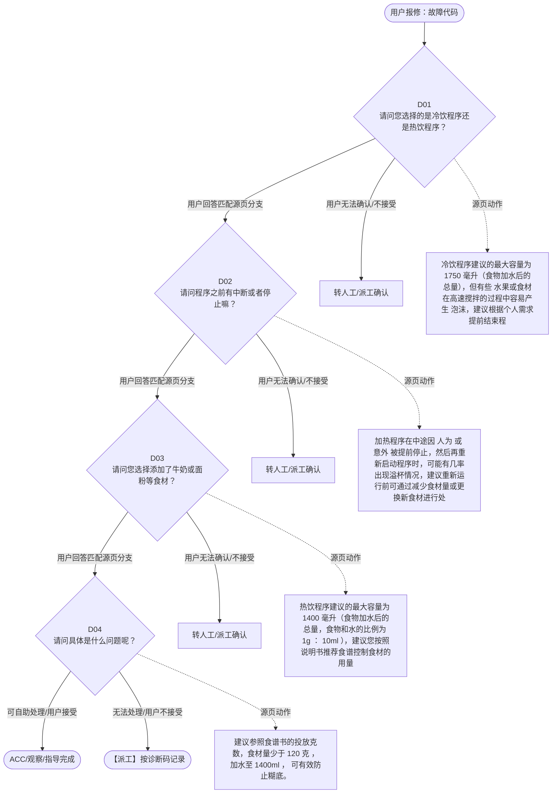

# BSH 加热破壁机 — 故障代码 诊断手册

**故障编号**：F03 | **节点前缀**：EC | **来源**：PPT Slides 5-8
**适用诊断码**：`A300M8000000` / `A50100000000` / `A300M7000000` / `A30000000000` / `140000000000` / `A23100000000`
**转换状态**：自动批处理草案，需按源 PPT 视觉关系复核后生产使用

---

## 一、文档使用说明

### 三条执行铁律

1. **不越界**：只执行本文件定义的诊断步骤；遇到超出范围的问题，执行越界协议（见第三节），不得自行延伸
2. **不编造**：话术原文不得改写、补充或省略；不在本文件中的诊断码不得使用
3. **不跳步**：严格按 D 步骤顺序执行，不得跳过中间步骤直接给出结论

### 执行约定标记表

| 标记 | 含义 |
|------|------|
| `【话术】` | 逐字朗读给用户的诊断引导话术 |
| `【判断】` | 根据用户回答或系统数据触发的条件分支 |
| `【诊断码】` | BSH 标准诊断码 |
| `【派工】` | 安排工程师上门 |
| `【配件】` | 预判所需配件 |
| `【视频】` | 视频辅助标记 |
| `【引用】` | 跨故障树引用跳转 |
| `【解释】` | 向用户解释原理/现象 |
| `【操作指导】` | 指导用户自行操作 |
| `▶` | 无条件进入下一步 |

---

## 二、故障诊断导航树

### Mermaid 源码



### 诊断步骤 ↔ 节点速查表

| 步骤 | 节点 ID | 节点类型 | 简述 |
| --- | --- | --- | --- |
| 入口 | EC_START | 起始 | 用户报修：故障代码 |
| D01 | EC_D01 | 判断 | EC_D02 / EC_MANUAL01 |
| D02 | EC_D02 | 判断 | EC_D03 / EC_MANUAL02 |
| D03 | EC_D03 | 判断 | EC_D04 / EC_MANUAL03 |
| D04 | EC_D04 | 判断 | EC_ACC / EC_DISPATCH |
| 结束-ACC | EC_ACC | 结束 | 用户接受/观察/指导完成 |
| 结束-派工 | EC_DISPATCH | 派工 | 无法处理或用户不接受 |

---

## 三、越界处理协议

### 触发条件（满足以下任意一条即触发越界）

| # | 触发场景 |
|---|---------|
| 1 | 用户故障描述无法映射到当前诊断树的任何入口分支 |
| 2 | 用户回答无法映射到当前 D 步骤的任何条件行 |
| 3 | 目标跳转节点在 Mermaid 图中无有效连线或仍需视觉确认 |
| 4 | 用户要求提供本文档未包含的信息，如价格、保修政策、投诉升级 |
| 5 | 用户描述涉及焦味、冒烟、漏电、跳闸、进水等安全风险 |
| 6 | 用户要求自行拆机、维修、改线或更换内部零部件 |

### 退出动作

- 若属于其他故障树：执行 `【引用】` 跳转或回到索引重新分流
- 若无法定位：转人工客服
- 若存在安全风险：停止在线指导并安排工程师或人工处理

### 严禁行为

- 严禁自行判断主板、电源板、电机、压缩机等内部零部件级故障
- 严禁改写源 PPT 话术作为确定结论
- 严禁在用户尚未回答当前问题时跳至下一步

### 覆盖范围

本故障树仅覆盖 `故障代码` 相关诊断。其他故障现象应回到 `HB` 索引重新分流。

---

## 四、诊断入口

### 故障主诉确认

- 用户描述与 `故障代码` 相关。
- 命中索引关键词：故障代码, A300, M8000, 结果问题, 煮过头了, 不工作。
- 来源页：Slides 5-8。

### 入口分支判断

```
用户报修“故障代码”
│
├── 主诉匹配当前树 → 进入 D01
├── 主诉属于其他故障 → 回到索引执行跨树引用
└── 主诉不明确 → 先追问具体显示/部位/现象
```

---

## 五、诊断步骤详情

### D01 — 请问您选择的是冷饮程序还是热饮程序？

**[节点：EC_D01]**

**【话术】**：
> "请问您选择的是冷饮程序还是热饮程序？"

**判断表**：

| 条件 | 下一步 | 出口类型 | Mermaid 边验证 |
| --- | --- | --- | --- |
| 用户回答匹配源页下一分支 | D02 | 继续诊断 | EC_D01 → D02（自动草案，待视觉确认） |
| 用户接受解释/操作/观察 | 结束 | ACC | EC_D01 → ACC（待视觉确认） |
| 用户不接受 / 无法操作 / 风险场景 | 派工或转人工 | 派工 | EC_D01 → DISPATCH（待视觉确认） |
| **兜底越界**：其他无法识别的输入 | 越界协议 | 越界 | 无对应 Mermaid 边 |


### D02 — 请问程序之前有中断或者停止嘛？

**[节点：EC_D02]**

**【话术】**：
> "请问程序之前有中断或者停止嘛？"

**判断表**：

| 条件 | 下一步 | 出口类型 | Mermaid 边验证 |
| --- | --- | --- | --- |
| 用户回答匹配源页下一分支 | D03 | 继续诊断 | EC_D02 → D03（自动草案，待视觉确认） |
| 用户接受解释/操作/观察 | 结束 | ACC | EC_D02 → ACC（待视觉确认） |
| 用户不接受 / 无法操作 / 风险场景 | 派工或转人工 | 派工 | EC_D02 → DISPATCH（待视觉确认） |
| **兜底越界**：其他无法识别的输入 | 越界协议 | 越界 | 无对应 Mermaid 边 |


### D03 — 请问您选择添加了牛奶或面粉等食材？

**[节点：EC_D03]**

**【话术】**：
> "请问您选择添加了牛奶或面粉等食材？"

**判断表**：

| 条件 | 下一步 | 出口类型 | Mermaid 边验证 |
| --- | --- | --- | --- |
| 用户回答匹配源页下一分支 | D04 | 继续诊断 | EC_D03 → D04（自动草案，待视觉确认） |
| 用户接受解释/操作/观察 | 结束 | ACC | EC_D03 → ACC（待视觉确认） |
| 用户不接受 / 无法操作 / 风险场景 | 派工或转人工 | 派工 | EC_D03 → DISPATCH（待视觉确认） |
| **兜底越界**：其他无法识别的输入 | 越界协议 | 越界 | 无对应 Mermaid 边 |


### D04 — 请问具体是什么问题呢？

**[节点：EC_D04]**

**【话术】**：
> "请问具体是什么问题呢？"

**判断表**：

| 条件 | 下一步 | 出口类型 | Mermaid 边验证 |
| --- | --- | --- | --- |
| 用户回答匹配源页下一分支 | ACC / 派工 | 继续诊断 | EC_D04 → ACC / 派工（自动草案，待视觉确认） |
| 用户接受解释/操作/观察 | 结束 | ACC | EC_D04 → ACC（待视觉确认） |
| 用户不接受 / 无法操作 / 风险场景 | 派工或转人工 | 派工 | EC_D04 → DISPATCH（待视觉确认） |
| **兜底越界**：其他无法识别的输入 | 越界协议 | 越界 | 无对应 Mermaid 边 |


### 源页动作/结果摘录

- 冷饮程序建议的最大容量为 1750 毫升（食物加水后的总量），但有些 水果或食材在高速搅拌的过程中容易产生 泡沫，建议根据个人需求提前结束程序。
- 加热程序在中途因 人为 或 意外 被提前停止，然后再重新启动程序时，可能有几率出现溢杯情况，建议重新运行前可通过减少食材量或更换新食材进行处理后再重新运行程序。
- 热饮程序建议的最大容量为 1400 毫升（食物加水后的总量，食物和水的比例为 1g ： 10ml ），建议您按照说明书推荐食谱控制食材的用量（通常食材少于 120g ），或将部分食材倒出并将加料盖锁扣到位后，重新启动观察使用。
- 建议参照食谱书的投放克数，食材量少于 120 克 ，加水至 1400ml ， 可有效防止糊底。
- 热饮 食谱加热前建议不要添加 牛奶 。 牛奶 是比较容易糊底的材料。如果想放牛奶，可以加热完成后再添加并且搅拌一下哦 。
- 选择 转速档位越高、食材越大越硬时均会使产品工作声音增大。我们的产品在保证食材达到 95%~99 % 的破壁率的前提下，通过很多优化手段减小产品的工作 声音 ， 保证提供 给您最好的食物料理效果 。 建议您再观察使用。
- 不接受解释
- 这是 正常现象，因为玻璃是热的 不 良导体，在发热盘烘干表面水渍后无法将玻璃杯内壁全部水渍变成水蒸汽进行气化排出，主要依靠搅拌 刀 的高速转动搅拌空气 ， 将底部水渍朝杯盖处吹出 。 建议先将主杯内水全部倒出后将杯盖中间的投料盖取下方便机器排出水蒸气，再使用烘干功能进行烘干，并在结束后使用干布对玻璃杯内壁上半部分和杯盖内壁进行清洁防止凝露。

---

## 附录 A：诊断码汇总表

| 诊断码 | 描述 | 触发步骤 | 备注 |
| --- | --- | --- | --- |
| `A300M8000000` | 见源 PPT 相邻文本 | 源页派工/判断节点 | 自动抽取，待人工核对英文/中文描述 |
| `A50100000000` | 见源 PPT 相邻文本 | 源页派工/判断节点 | 自动抽取，待人工核对英文/中文描述 |
| `A300M7000000` | 见源 PPT 相邻文本 | 源页派工/判断节点 | 自动抽取，待人工核对英文/中文描述 |
| `A30000000000` | 见源 PPT 相邻文本 | 源页派工/判断节点 | 自动抽取，待人工核对英文/中文描述 |
| `140000000000` | 见源 PPT 相邻文本 | 源页派工/判断节点 | 自动抽取，待人工核对英文/中文描述 |
| `A23100000000` | 见源 PPT 相邻文本 | 源页派工/判断节点 | 自动抽取，待人工核对英文/中文描述 |

---

## 附录 B：配件建议汇总表

| 配件名称 | 关联步骤 | 说明 |
| --- | --- | --- |
| 源页未明确 | 派工出口 | 按源 PPT 派工节点记录，待视觉确认 |

---

## 附录 C：跨故障树引用清单

| 引用方向 | 触发条件 | 目标文件 | 目标诊断码 |
| --- | --- | --- | --- |
| 无明确跨树引用 | — | — | — |

---

## 附录 D：源页文本摘录（用于复核）

- A300M8000000 Result problem, overcooked 结果问题，煮过头了
- 不工作
- 请问您选择的是冷饮程序还是热饮程序？
- 报警 / 故障代码
- 冷饮程序 ： 果汁 / 奶昔 / 冰沙 / 辅食 热饮 程序 ： 豆浆 / 米糊 / 浓汤 / 米 糊
- 食物溢出
- 食物糊底
- A50100000000
- 声音问题
- 冷饮程序
- 热饮程序
- 烘干问题
- 请问程序之前有中断或者停止嘛？
- 冷饮程序建议的最大容量为 1750 毫升（食物加水后的总量），但有些 水果或食材在高速搅拌的过程中容易产生 泡沫，建议根据个人需求提前结束程序。
- 有些果蔬质地较软，比较容易起泡沫，例如西红柿、橙子、苹果，哈密瓜，西瓜，火龙果，圣女果，龙眼，蓝 莓等
- 中途停止 / 二次加热
- 正常运行未中断
- 加热程序在中途因 人为 或 意外 被提前停止，然后再重新启动程序时，可能有几率出现溢杯情况，建议重新运行前可通过减少食材量或更换新食材进行处理后再重新运行程序。
- 热饮程序建议的最大容量为 1400 毫升（食物加水后的总量，食物和水的比例为 1g ： 10ml ），建议您按照说明书推荐食谱控制食材的用量（通常食材少于 120g ），或将部分食材倒出并将加料盖锁扣到位后，重新启动观察使用。
- 提醒 ：部分批次的型号的冷饮程序程序默认 10 档 (120 秒 ) ， 已 更改冷饮程序默认为 4 档（ 60 秒） 涉及型号及 FD ： MMB512WCN(FD 0111 及以后的批次 ) MMB 311WCN(FD 0203 及以后的批次 ) / MMB573SCN(FD 0205 及以后的批次 )
- A300M7000000 Result problem, meal burnt 结果问题，食物烧焦
- 请问您选择添加了牛奶或面粉等食材？
- A30000000000
- 面粉、淀粉等
- 牛奶
- 其他食材
- 建议参照食谱书的投放克数，食材量少于 120 克 ，加水至 1400ml ， 可有效防止糊底。
- 热饮 食谱加热前建议不要添加 牛奶 。 牛奶 是比较容易糊底的材料。如果想放牛奶，可以加热完成后再添加并且搅拌一下哦 。
- 对于面粉，淀粉，糖较多的食材在熬煮时容易变稠导致糊底，请酌情适量添加（总食材量与水比例应大于 1 ： 10 ）
- 选择 转速档位越高、食材越大越硬时均会使产品工作声音增大。我们的产品在保证食材达到 95%~99 % 的破壁率的前提下，通过很多优化手段减小产品的工作 声音 ， 保证提供 给您最好的食物料理效果 。 建议您再观察使用。
- 140000000000 Noise 噪音
- 140000000000
- 不接受解释
- 我为您登记服务。
- 寄整机 可能是电机问题
- A23100000000 Bad drying result 烘干效果不好
- 请问具体是什么问题呢？
- 烘干结束后内壁有水珠
- 烘干后发热盘发黄发黑
- 这是 正常现象，因为玻璃是热的 不 良导体，在发热盘烘干表面水渍后无法将玻璃杯内壁全部水渍变成水蒸汽进行气化排出，主要依靠搅拌 刀 的高速转动搅拌空气 ， 将底部水渍朝杯盖处吹出 。 建议先将主杯内水全部倒出后将杯盖中间的投料盖取下方便机器排出水蒸气，再使用烘干功能进行烘干，并在结束后使用干布对玻璃杯内壁上半部分和杯盖内壁进行清洁防止凝露。
- 发热盘表面为食品级不锈钢材质，高温加热后可能出现变色现象，属于正常现象，水渍或食物染色也容易导致发热盘表面颜色变黄，可使用白醋或柠檬酸兑温水（ 40-60 度）浸泡主杯 5-10 分钟 。
- 提醒 ： 此方法也可以用于养颜杯去除自来水垢
