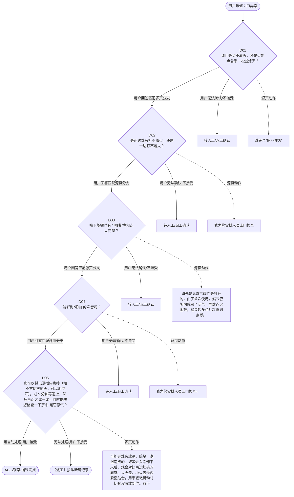

# BSH 燃气灶 — 门异常 诊断手册

**故障编号**：F01 | **节点前缀**：DO | **来源**：PPT Slide 2
**适用诊断码**：`C2X120000000` / `C2X100000000` / `111100000000`
**转换状态**：自动批处理草案，需按源 PPT 视觉关系复核后生产使用

---

## 一、文档使用说明

### 三条执行铁律

1. **不越界**：只执行本文件定义的诊断步骤；遇到超出范围的问题，执行越界协议（见第三节），不得自行延伸
2. **不编造**：话术原文不得改写、补充或省略；不在本文件中的诊断码不得使用
3. **不跳步**：严格按 D 步骤顺序执行，不得跳过中间步骤直接给出结论

### 执行约定标记表

| 标记 | 含义 |
|------|------|
| `【话术】` | 逐字朗读给用户的诊断引导话术 |
| `【判断】` | 根据用户回答或系统数据触发的条件分支 |
| `【诊断码】` | BSH 标准诊断码 |
| `【派工】` | 安排工程师上门 |
| `【配件】` | 预判所需配件 |
| `【视频】` | 视频辅助标记 |
| `【引用】` | 跨故障树引用跳转 |
| `【解释】` | 向用户解释原理/现象 |
| `【操作指导】` | 指导用户自行操作 |
| `▶` | 无条件进入下一步 |

---

## 二、故障诊断导航树

### Mermaid 源码



### 诊断步骤 ↔ 节点速查表

| 步骤 | 节点 ID | 节点类型 | 简述 |
| --- | --- | --- | --- |
| 入口 | DO_START | 起始 | 用户报修：门异常 |
| D01 | DO_D01 | 判断 | DO_D02 / DO_MANUAL01 |
| D02 | DO_D02 | 判断 | DO_D03 / DO_MANUAL02 |
| D03 | DO_D03 | 判断 | DO_D04 / DO_MANUAL03 |
| D04 | DO_D04 | 判断 | DO_D05 / DO_MANUAL04 |
| D05 | DO_D05 | 判断 | DO_ACC / DO_DISPATCH |
| 结束-ACC | DO_ACC | 结束 | 用户接受/观察/指导完成 |
| 结束-派工 | DO_DISPATCH | 派工 | 无法处理或用户不接受 |

---

## 三、越界处理协议

### 触发条件（满足以下任意一条即触发越界）

| # | 触发场景 |
|---|---------|
| 1 | 用户故障描述无法映射到当前诊断树的任何入口分支 |
| 2 | 用户回答无法映射到当前 D 步骤的任何条件行 |
| 3 | 目标跳转节点在 Mermaid 图中无有效连线或仍需视觉确认 |
| 4 | 用户要求提供本文档未包含的信息，如价格、保修政策、投诉升级 |
| 5 | 用户描述涉及焦味、冒烟、漏电、跳闸、进水等安全风险 |
| 6 | 用户要求自行拆机、维修、改线或更换内部零部件 |

### 退出动作

- 若属于其他故障树：执行 `【引用】` 跳转或回到索引重新分流
- 若无法定位：转人工客服
- 若存在安全风险：停止在线指导并安排工程师或人工处理

### 严禁行为

- 严禁自行判断主板、电源板、电机、压缩机等内部零部件级故障
- 严禁改写源 PPT 话术作为确定结论
- 严禁在用户尚未回答当前问题时跳至下一步

### 覆盖范围

本故障树仅覆盖 `门异常` 相关诊断。其他故障现象应回到 `HOB` 索引重新分流。

---

## 四、诊断入口

### 故障主诉确认

- 用户描述与 `门异常` 相关。
- 命中索引关键词：门异常, 不点火, 点不着火, 点火困难, 适用于, 系列燃气灶。
- 来源页：Slide 2。

### 入口分支判断

```
用户报修“门异常”
│
├── 主诉匹配当前树 → 进入 D01
├── 主诉属于其他故障 → 回到索引执行跨树引用
└── 主诉不明确 → 先追问具体显示/部位/现象
```

---

## 五、诊断步骤详情

### D01 — 请问是点不着火，还是火能点着手一松就熄灭？

**[节点：DO_D01]**

**【话术】**：
> "请问是点不着火，还是火能点着手一松就熄灭？"

**判断表**：

| 条件 | 下一步 | 出口类型 | Mermaid 边验证 |
| --- | --- | --- | --- |
| 用户回答匹配源页下一分支 | D02 | 继续诊断 | DO_D01 → D02（自动草案，待视觉确认） |
| 用户接受解释/操作/观察 | 结束 | ACC | DO_D01 → ACC（待视觉确认） |
| 用户不接受 / 无法操作 / 风险场景 | 派工或转人工 | 派工 | DO_D01 → DISPATCH（待视觉确认） |
| **兜底越界**：其他无法识别的输入 | 越界协议 | 越界 | 无对应 Mermaid 边 |


### D02 — 是两边灶头打不着火，还是一边打不着火？

**[节点：DO_D02]**

**【话术】**：
> "是两边灶头打不着火，还是一边打不着火？"

**判断表**：

| 条件 | 下一步 | 出口类型 | Mermaid 边验证 |
| --- | --- | --- | --- |
| 用户回答匹配源页下一分支 | D03 | 继续诊断 | DO_D02 → D03（自动草案，待视觉确认） |
| 用户接受解释/操作/观察 | 结束 | ACC | DO_D02 → ACC（待视觉确认） |
| 用户不接受 / 无法操作 / 风险场景 | 派工或转人工 | 派工 | DO_D02 → DISPATCH（待视觉确认） |
| **兜底越界**：其他无法识别的输入 | 越界协议 | 越界 | 无对应 Mermaid 边 |


### D03 — 按下旋钮时有 ” 啪啪”声和点火花吗？

**[节点：DO_D03]**

**【话术】**：
> "按下旋钮时有 ” 啪啪”声和点火花吗？"

**判断表**：

| 条件 | 下一步 | 出口类型 | Mermaid 边验证 |
| --- | --- | --- | --- |
| 用户回答匹配源页下一分支 | D04 | 继续诊断 | DO_D03 → D04（自动草案，待视觉确认） |
| 用户接受解释/操作/观察 | 结束 | ACC | DO_D03 → ACC（待视觉确认） |
| 用户不接受 / 无法操作 / 风险场景 | 派工或转人工 | 派工 | DO_D03 → DISPATCH（待视觉确认） |
| **兜底越界**：其他无法识别的输入 | 越界协议 | 越界 | 无对应 Mermaid 边 |


### D04 — 能听到“啪啪”的声音吗？

**[节点：DO_D04]**

**【话术】**：
> "能听到“啪啪”的声音吗？"

**判断表**：

| 条件 | 下一步 | 出口类型 | Mermaid 边验证 |
| --- | --- | --- | --- |
| 用户回答匹配源页下一分支 | D05 | 继续诊断 | DO_D04 → D05（自动草案，待视觉确认） |
| 用户接受解释/操作/观察 | 结束 | ACC | DO_D04 → ACC（待视觉确认） |
| 用户不接受 / 无法操作 / 风险场景 | 派工或转人工 | 派工 | DO_D04 → DISPATCH（待视觉确认） |
| **兜底越界**：其他无法识别的输入 | 越界协议 | 越界 | 无对应 Mermaid 边 |


### D05 — 您可以将电源插头拔掉（如不方便拔插头，可以断空开），过 5 分钟

**[节点：DO_D05]**

**【话术】**：
> "您可以将电源插头拔掉（如不方便拔插头，可以断空开），过 5 分钟再通上，然后再点火试一试。同时提醒您检查一下家中 是否停气？"

**判断表**：

| 条件 | 下一步 | 出口类型 | Mermaid 边验证 |
| --- | --- | --- | --- |
| 用户回答匹配源页下一分支 | ACC / 派工 | 继续诊断 | DO_D05 → ACC / 派工（自动草案，待视觉确认） |
| 用户接受解释/操作/观察 | 结束 | ACC | DO_D05 → ACC（待视觉确认） |
| 用户不接受 / 无法操作 / 风险场景 | 派工或转人工 | 派工 | DO_D05 → DISPATCH（待视觉确认） |
| **兜底越界**：其他无法识别的输入 | 越界协议 | 越界 | 无对应 Mermaid 边 |


### 源页动作/结果摘录

- 跳转至“保不住火”
- 我为您安排人员上门检查
- 请先确认燃气阀门是打开的，由于首次使用，燃气管辂内残留了空气，导致点火困难，建议您多点几次直到点燃。
- 我为您安排人员上门检查。
- 可能是灶头放歪，脏堵，潮湿造成的。您等灶头冷却下来后，观察对比两边灶头的底座、大火盖、小火盖是否紧密贴合，用手轻微晃动对比有没有放到位。取下有问题的灶头，用牙签清理所有孔或槽。用吹风机吹干潮湿的部位摆放到位再试试。
- 请您联系物业或电工检修墙上的电源插座。
- 如果您无法判断电源情况，我们将安排工程师上门检查

---

## 附录 A：诊断码汇总表

| 诊断码 | 描述 | 触发步骤 | 备注 |
| --- | --- | --- | --- |
| `C2X120000000` | 见源 PPT 相邻文本 | 源页派工/判断节点 | 自动抽取，待人工核对英文/中文描述 |
| `C2X100000000` | 见源 PPT 相邻文本 | 源页派工/判断节点 | 自动抽取，待人工核对英文/中文描述 |
| `111100000000` | 见源 PPT 相邻文本 | 源页派工/判断节点 | 自动抽取，待人工核对英文/中文描述 |

---

## 附录 B：配件建议汇总表

| 配件名称 | 关联步骤 | 说明 |
| --- | --- | --- |
| 源页未明确 | 派工出口 | 按源 PPT 派工节点记录，待视觉确认 |

---

## 附录 C：跨故障树引用清单

| 引用方向 | 触发条件 | 目标文件 | 目标诊断码 |
| --- | --- | --- | --- |
| 本树 → 至“保不住火 | 源页出现跳转提示 | 待索引映射 | — |

---

## 附录 D：源页文本摘录（用于复核）

- C 19000000000 No ignition 不点火
- 点不着火 / 点火困难 适用于 200 系列燃气灶 VG 23x xxx
- 请问是点不着火，还是火能点着手一松就熄灭？
- 点不着火 ( 含 刚才能点着，现在点不着 / 只能点着一次 )
- 点火针损坏
- 保不住火
- 点不着火 / 点火困难
- 是两边灶头打不着火，还是一边打不着火？
- 跳转至“保不住火”
- 我为您安排人员上门检查
- 部分灶头
- 所有灶头
- C2X120000000 Ignition faulty 点火故障
- 声音问题
- 按下旋钮时有 ” 啪啪”声和点火花吗？
- 能听到“啪啪”的声音吗？
- 1. 无声无火花
- 点火时间长
- 有点火声和火花，没有火焰
- 新机点不着火
- 有点火声无火花
- 无点火声
- 1 、有点火声和火花 2 、有时有，有时没有
- 火焰异常
- 请先确认燃气阀门是打开的，由于首次使用，燃气管辂内残留了空气，导致点火困难，建议您多点几次直到点燃。
- 1 ，检查气源总阀是否打开状态。 2 ，检查气源是否正常，是否停气。 。
- 您可以用家中其他电器测试一下机器插座是否有电
- 2. 点火音微弱 3. 有点火声无火花
- 我为您安排人员上门检查。
- 可能是灶头放歪，脏堵，潮湿造成的。您等灶头冷却下来后，观察对比两边灶头的底座、大火盖、小火盖是否紧密贴合，用手轻微晃动对比有没有放到位。取下有问题的灶头，用牙签清理所有孔或槽。用吹风机吹干潮湿的部位摆放到位再试试。
- 显示异常
- 有电
- 无法确认
- 没电
- 排查点火针 / 线 排查点火线与点火盒的接触
- 按键不灵 / 锁定
- 您可以将电源插头拔掉（如不方便拔插头，可以断空开），过 5 分钟再通上，然后再点火试一试。同时提醒您检查一下家中 是否停气？
- C2X100000000 Ignition problem 点火问题
- 请您联系物业或电工检修墙上的电源插座。
- 如果您无法判断电源情况，我们将安排工程师上门检查
- 排查微动 / 零位开关 检查开关 / 电源模块线束连接 更换电源模块
- 排查用户家 气源总阀 排查喷嘴 / 火盖 不可以更换电子件
- 检查电源 更换点火开关 更换点火变压器
- 断电 5 分钟 更换点火开关 更换点火变压器
- 111100000000 No Power (display or illumination does not work) 不通电
