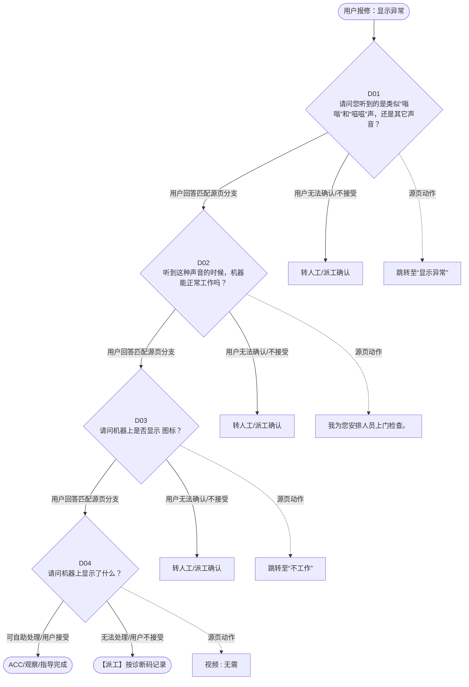

# BSH 燃气灶 — 显示异常 诊断手册

**故障编号**：F13 | **节点前缀**：DA5 | **来源**：PPT Slides 18-20
**适用诊断码**：`140000000000` / `17F000000000` / `130000000000` / `17E00000000E` / `17E0000000E2`
**转换状态**：自动批处理草案，需按源 PPT 视觉关系复核后生产使用

---

## 一、文档使用说明

### 三条执行铁律

1. **不越界**：只执行本文件定义的诊断步骤；遇到超出范围的问题，执行越界协议（见第三节），不得自行延伸
2. **不编造**：话术原文不得改写、补充或省略；不在本文件中的诊断码不得使用
3. **不跳步**：严格按 D 步骤顺序执行，不得跳过中间步骤直接给出结论

### 执行约定标记表

| 标记 | 含义 |
|------|------|
| `【话术】` | 逐字朗读给用户的诊断引导话术 |
| `【判断】` | 根据用户回答或系统数据触发的条件分支 |
| `【诊断码】` | BSH 标准诊断码 |
| `【派工】` | 安排工程师上门 |
| `【配件】` | 预判所需配件 |
| `【视频】` | 视频辅助标记 |
| `【引用】` | 跨故障树引用跳转 |
| `【解释】` | 向用户解释原理/现象 |
| `【操作指导】` | 指导用户自行操作 |
| `▶` | 无条件进入下一步 |

---

## 二、故障诊断导航树

### Mermaid 源码



### 诊断步骤 ↔ 节点速查表

| 步骤 | 节点 ID | 节点类型 | 简述 |
| --- | --- | --- | --- |
| 入口 | DA5_START | 起始 | 用户报修：显示异常 |
| D01 | DA5_D01 | 判断 | DA5_D02 / DA5_MANUAL01 |
| D02 | DA5_D02 | 判断 | DA5_D03 / DA5_MANUAL02 |
| D03 | DA5_D03 | 判断 | DA5_D04 / DA5_MANUAL03 |
| D04 | DA5_D04 | 判断 | DA5_ACC / DA5_DISPATCH |
| 结束-ACC | DA5_ACC | 结束 | 用户接受/观察/指导完成 |
| 结束-派工 | DA5_DISPATCH | 派工 | 无法处理或用户不接受 |

---

## 三、越界处理协议

### 触发条件（满足以下任意一条即触发越界）

| # | 触发场景 |
|---|---------|
| 1 | 用户故障描述无法映射到当前诊断树的任何入口分支 |
| 2 | 用户回答无法映射到当前 D 步骤的任何条件行 |
| 3 | 目标跳转节点在 Mermaid 图中无有效连线或仍需视觉确认 |
| 4 | 用户要求提供本文档未包含的信息，如价格、保修政策、投诉升级 |
| 5 | 用户描述涉及焦味、冒烟、漏电、跳闸、进水等安全风险 |
| 6 | 用户要求自行拆机、维修、改线或更换内部零部件 |

### 退出动作

- 若属于其他故障树：执行 `【引用】` 跳转或回到索引重新分流
- 若无法定位：转人工客服
- 若存在安全风险：停止在线指导并安排工程师或人工处理

### 严禁行为

- 严禁自行判断主板、电源板、电机、压缩机等内部零部件级故障
- 严禁改写源 PPT 话术作为确定结论
- 严禁在用户尚未回答当前问题时跳至下一步

### 覆盖范围

本故障树仅覆盖 `显示异常` 相关诊断。其他故障现象应回到 `HOB` 索引重新分流。

---

## 四、诊断入口

### 故障主诉确认

- 用户描述与 `显示异常` 相关。
- 命中索引关键词：显示异常, 声音问题, 系列通用, 噪音, 请问您听到的是类, 嗡嗡。
- 来源页：Slides 18-20。

### 入口分支判断

```
用户报修“显示异常”
│
├── 主诉匹配当前树 → 进入 D01
├── 主诉属于其他故障 → 回到索引执行跨树引用
└── 主诉不明确 → 先追问具体显示/部位/现象
```

---

## 五、诊断步骤详情

### D01 — 请问您听到的是类似“嗡嗡”和“嗞嗞”声，还是其它声音？

**[节点：DA5_D01]**

**【话术】**：
> "请问您听到的是类似“嗡嗡”和“嗞嗞”声，还是其它声音？"

**判断表**：

| 条件 | 下一步 | 出口类型 | Mermaid 边验证 |
| --- | --- | --- | --- |
| 用户回答匹配源页下一分支 | D02 | 继续诊断 | DA5_D01 → D02（自动草案，待视觉确认） |
| 用户接受解释/操作/观察 | 结束 | ACC | DA5_D01 → ACC（待视觉确认） |
| 用户不接受 / 无法操作 / 风险场景 | 派工或转人工 | 派工 | DA5_D01 → DISPATCH（待视觉确认） |
| **兜底越界**：其他无法识别的输入 | 越界协议 | 越界 | 无对应 Mermaid 边 |


### D02 — 听到这种声音的时候，机器能正常工作吗？

**[节点：DA5_D02]**

**【话术】**：
> "听到这种声音的时候，机器能正常工作吗？"

**判断表**：

| 条件 | 下一步 | 出口类型 | Mermaid 边验证 |
| --- | --- | --- | --- |
| 用户回答匹配源页下一分支 | D03 | 继续诊断 | DA5_D02 → D03（自动草案，待视觉确认） |
| 用户接受解释/操作/观察 | 结束 | ACC | DA5_D02 → ACC（待视觉确认） |
| 用户不接受 / 无法操作 / 风险场景 | 派工或转人工 | 派工 | DA5_D02 → DISPATCH（待视觉确认） |
| **兜底越界**：其他无法识别的输入 | 越界协议 | 越界 | 无对应 Mermaid 边 |


### D03 — 请问机器上是否显示 图标？

**[节点：DA5_D03]**

**【话术】**：
> "请问机器上是否显示 图标？"

**判断表**：

| 条件 | 下一步 | 出口类型 | Mermaid 边验证 |
| --- | --- | --- | --- |
| 用户回答匹配源页下一分支 | D04 | 继续诊断 | DA5_D03 → D04（自动草案，待视觉确认） |
| 用户接受解释/操作/观察 | 结束 | ACC | DA5_D03 → ACC（待视觉确认） |
| 用户不接受 / 无法操作 / 风险场景 | 派工或转人工 | 派工 | DA5_D03 → DISPATCH（待视觉确认） |
| **兜底越界**：其他无法识别的输入 | 越界协议 | 越界 | 无对应 Mermaid 边 |


### D04 — 请问机器上显示了什么？

**[节点：DA5_D04]**

**【话术】**：
> "请问机器上显示了什么？"

**判断表**：

| 条件 | 下一步 | 出口类型 | Mermaid 边验证 |
| --- | --- | --- | --- |
| 用户回答匹配源页下一分支 | ACC / 派工 | 继续诊断 | DA5_D04 → ACC / 派工（自动草案，待视觉确认） |
| 用户接受解释/操作/观察 | 结束 | ACC | DA5_D04 → ACC（待视觉确认） |
| 用户不接受 / 无法操作 / 风险场景 | 派工或转人工 | 派工 | DA5_D04 → DISPATCH（待视觉确认） |
| **兜底越界**：其他无法识别的输入 | 越界协议 | 越界 | 无对应 Mermaid 边 |


### 源页动作/结果摘录

- 跳转至“显示异常”
- 我为您安排人员上门检查。
- 跳转至“不工作”
- 视频 : 无需
- 请您观察使用，如继续出现联系我们。
- 这代表电源电压过高，请联系电力部门处理。。
- 跳转到“显示 E 开头的故障代码”

---

## 附录 A：诊断码汇总表

| 诊断码 | 描述 | 触发步骤 | 备注 |
| --- | --- | --- | --- |
| `140000000000` | 见源 PPT 相邻文本 | 源页派工/判断节点 | 自动抽取，待人工核对英文/中文描述 |
| `17F000000000` | 见源 PPT 相邻文本 | 源页派工/判断节点 | 自动抽取，待人工核对英文/中文描述 |
| `130000000000` | 见源 PPT 相邻文本 | 源页派工/判断节点 | 自动抽取，待人工核对英文/中文描述 |
| `17E00000000E` | 见源 PPT 相邻文本 | 源页派工/判断节点 | 自动抽取，待人工核对英文/中文描述 |
| `17E0000000E2` | 见源 PPT 相邻文本 | 源页派工/判断节点 | 自动抽取，待人工核对英文/中文描述 |

---

## 附录 B：配件建议汇总表

| 配件名称 | 关联步骤 | 说明 |
| --- | --- | --- |
| 源页未明确 | 派工出口 | 按源 PPT 派工节点记录，待视觉确认 |

---

## 附录 C：跨故障树引用清单

| 引用方向 | 触发条件 | 目标文件 | 目标诊断码 |
| --- | --- | --- | --- |
| 本树 → 至“显示异常 | 源页出现跳转提示 | 待索引映射 | — |
| 本树 → 至“不工作 | 源页出现跳转提示 | 待索引映射 | — |
| 本树 → 到“显示 | 源页出现跳转提示 | 待索引映射 | — |

---

## 附录 D：源页文本摘录（用于复核）

- 声音问题 200/400 系列通用
- 140000000000 Noise 噪音
- 请问您听到的是类似“嗡嗡”和“嗞嗞”声，还是其它声音？
- 不工作
- 显示异常
- 1 、类似“嗡嗡”声 2 、类似“嗞嗞”声
- 报警声
- 其他声音
- 跳转至“显示异常”
- 我为您安排人员上门检查。
- 听到这种声音的时候，机器能正常工作吗？
- 声音问题
- 按键不灵 / 锁定
- 机器在加热阶段，会有电流的声音，以及锅底震动与灶具表面碰撞发出的声音，加热停止后有散热阶段，风机会工作，发出“嗡嗡”声，程序结束后，声音才会消失。 锅具底部与灶面之间有水 ( 擦干水之后再试机 )
- 能正常工作
- 不正常工作
- 跳转至“不工作”
- 按键不灵 / 锁定 200/400 系列电磁灶 (CX,CI,CV)
- 17F000000000 No button function 没有按键功能
- 请问机器上是否显示 图标？
- CI,CV 显示童锁
- CX 显示童锁
- 不显示童锁图标
- 请您一直按住锁图标大约 4 秒，即可解除童锁。
- 请客户将旋钮放回旋钮区域后童锁消失，按键恢复。
- 按键位置是否有脏污
- 无
- 有
- 否
- 是
- 视频 : 无需
- 请您检查机器的操作面板上是否有水渍或者脏物，用干的软布擦拭干净，再重新使用。
- 请您观察使用，如继续出现联系我们。
- 显示异常 整理故障代码类型
- 显示 F
- 130000000000 Display, audible signal problem 显示屏 / 有声音的信号问题
- 17E00000000E Error: E
- 请问机器上显示了什么？
- 1 、 FXXX
- EXXX
- UXXX
- H/h
- 其他
- 这是机器过热保护，请等机器冷却后，再使用。
- 这是机器的余热警示，等表面冷却后，字母消失再使用。
- 这代表电源电压过高，请联系电力部门处理。。
- 见故障代码清单。
- 这是童锁功能，请您一直按住有钥匙图标或预约图标大约 4 秒或将旋钮放回，即可解除童锁。。
- 跳转到“显示 E 开头的故障代码”
- 17E0000000E2 Error: e2
