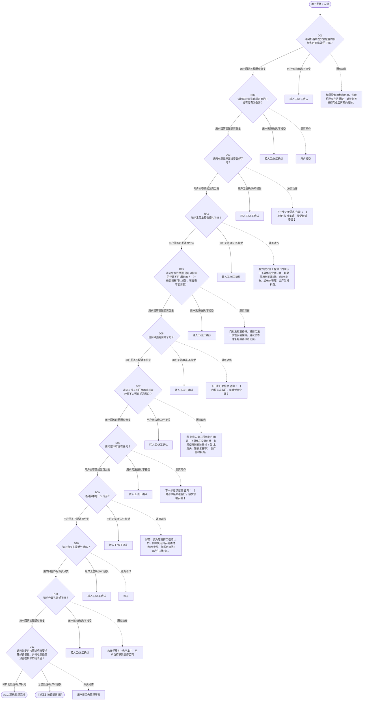

# BSH 安装操作指南 — 安装 诊断手册

**故障编号**：F04 | **节点前缀**：IN2 | **来源**：PPT Slides 4-15
**适用诊断码**：`源页未抽取到明确诊断码`
**转换状态**：自动批处理草案，需按源 PPT 视觉关系复核后生产使用

---

## 一、文档使用说明

### 三条执行铁律

1. **不越界**：只执行本文件定义的诊断步骤；遇到超出范围的问题，执行越界协议（见第三节），不得自行延伸
2. **不编造**：话术原文不得改写、补充或省略；不在本文件中的诊断码不得使用
3. **不跳步**：严格按 D 步骤顺序执行，不得跳过中间步骤直接给出结论

### 执行约定标记表

| 标记 | 含义 |
|------|------|
| `【话术】` | 逐字朗读给用户的诊断引导话术 |
| `【判断】` | 根据用户回答或系统数据触发的条件分支 |
| `【诊断码】` | BSH 标准诊断码 |
| `【派工】` | 安排工程师上门 |
| `【配件】` | 预判所需配件 |
| `【视频】` | 视频辅助标记 |
| `【引用】` | 跨故障树引用跳转 |
| `【解释】` | 向用户解释原理/现象 |
| `【操作指导】` | 指导用户自行操作 |
| `▶` | 无条件进入下一步 |

---

## 二、故障诊断导航树

### Mermaid 源码



### 诊断步骤 ↔ 节点速查表

| 步骤 | 节点 ID | 节点类型 | 简述 |
| --- | --- | --- | --- |
| 入口 | IN2_START | 起始 | 用户报修：安装 |
| D01 | IN2_D01 | 判断 | IN2_D02 / IN2_MANUAL01 |
| D02 | IN2_D02 | 判断 | IN2_D03 / IN2_MANUAL02 |
| D03 | IN2_D03 | 判断 | IN2_D04 / IN2_MANUAL03 |
| D04 | IN2_D04 | 判断 | IN2_D05 / IN2_MANUAL04 |
| D05 | IN2_D05 | 判断 | IN2_D06 / IN2_MANUAL05 |
| D06 | IN2_D06 | 判断 | IN2_D07 / IN2_MANUAL06 |
| D07 | IN2_D07 | 判断 | IN2_D08 / IN2_MANUAL07 |
| D08 | IN2_D08 | 判断 | IN2_D09 / IN2_MANUAL08 |
| D09 | IN2_D09 | 判断 | IN2_D10 / IN2_MANUAL09 |
| D10 | IN2_D10 | 判断 | IN2_D11 / IN2_MANUAL10 |
| D11 | IN2_D11 | 判断 | IN2_D12 / IN2_MANUAL11 |
| D12 | IN2_D12 | 判断 | IN2_ACC / IN2_DISPATCH |
| 结束-ACC | IN2_ACC | 结束 | 用户接受/观察/指导完成 |
| 结束-派工 | IN2_DISPATCH | 派工 | 无法处理或用户不接受 |

---

## 三、越界处理协议

### 触发条件（满足以下任意一条即触发越界）

| # | 触发场景 |
|---|---------|
| 1 | 用户故障描述无法映射到当前诊断树的任何入口分支 |
| 2 | 用户回答无法映射到当前 D 步骤的任何条件行 |
| 3 | 目标跳转节点在 Mermaid 图中无有效连线或仍需视觉确认 |
| 4 | 用户要求提供本文档未包含的信息，如价格、保修政策、投诉升级 |
| 5 | 用户描述涉及焦味、冒烟、漏电、跳闸、进水等安全风险 |
| 6 | 用户要求自行拆机、维修、改线或更换内部零部件 |

### 退出动作

- 若属于其他故障树：执行 `【引用】` 跳转或回到索引重新分流
- 若无法定位：转人工客服
- 若存在安全风险：停止在线指导并安排工程师或人工处理

### 严禁行为

- 严禁自行判断主板、电源板、电机、压缩机等内部零部件级故障
- 严禁改写源 PPT 话术作为确定结论
- 严禁在用户尚未回答当前问题时跳至下一步

### 覆盖范围

本故障树仅覆盖 `安装` 相关诊断。其他故障现象应回到 `INST` 索引重新分流。

---

## 四、诊断入口

### 故障主诉确认

- 用户描述与 `安装` 相关。
- 命中索引关键词：安装, 洗碗机安装, 指南, 更新, 如果没有橱柜和台, 洗碗机没有办法。
- 来源页：Slides 4-15。

### 入口分支判断

```
用户报修“安装”
│
├── 主诉匹配当前树 → 进入 D01
├── 主诉属于其他故障 → 回到索引执行跨树引用
└── 主诉不明确 → 先追问具体显示/部位/现象
```

---

## 五、诊断步骤详情

### D01 — 请问机器所在安装位置的橱柜和台面都做好 了吗？

**[节点：IN2_D01]**

**【话术】**：
> "请问机器所在安装位置的橱柜和台面都做好 了吗？"

**判断表**：

| 条件 | 下一步 | 出口类型 | Mermaid 边验证 |
| --- | --- | --- | --- |
| 用户回答匹配源页下一分支 | D02 | 继续诊断 | IN2_D01 → D02（自动草案，待视觉确认） |
| 用户接受解释/操作/观察 | 结束 | ACC | IN2_D01 → ACC（待视觉确认） |
| 用户不接受 / 无法操作 / 风险场景 | 派工或转人工 | 派工 | IN2_D01 → DISPATCH（待视觉确认） |
| **兜底越界**：其他无法识别的输入 | 越界协议 | 越界 | 无对应 Mermaid 边 |


### D02 — 请问安装在洗碗机正面的门板有没有准备好？

**[节点：IN2_D02]**

**【话术】**：
> "请问安装在洗碗机正面的门板有没有准备好？"

**判断表**：

| 条件 | 下一步 | 出口类型 | Mermaid 边验证 |
| --- | --- | --- | --- |
| 用户回答匹配源页下一分支 | D03 | 继续诊断 | IN2_D02 → D03（自动草案，待视觉确认） |
| 用户接受解释/操作/观察 | 结束 | ACC | IN2_D02 → ACC（待视觉确认） |
| 用户不接受 / 无法操作 / 风险场景 | 派工或转人工 | 派工 | IN2_D02 → DISPATCH（待视觉确认） |
| **兜底越界**：其他无法识别的输入 | 越界协议 | 越界 | 无对应 Mermaid 边 |


### D03 — 请问电源插座面板安装好了吗？

**[节点：IN2_D03]**

**【话术】**：
> "请问电源插座面板安装好了吗？"

**判断表**：

| 条件 | 下一步 | 出口类型 | Mermaid 边验证 |
| --- | --- | --- | --- |
| 用户回答匹配源页下一分支 | D04 | 继续诊断 | IN2_D03 → D04（自动草案，待视觉确认） |
| 用户接受解释/操作/观察 | 结束 | ACC | IN2_D03 → ACC（待视觉确认） |
| 用户不接受 / 无法操作 / 风险场景 | 派工或转人工 | 派工 | IN2_D03 → DISPATCH（待视觉确认） |
| **兜底越界**：其他无法识别的输入 | 越界协议 | 越界 | 无对应 Mermaid 边 |


### D04 — 请问吊顶上预留烟孔了吗？

**[节点：IN2_D04]**

**【话术】**：
> "请问吊顶上预留烟孔了吗？"

**判断表**：

| 条件 | 下一步 | 出口类型 | Mermaid 边验证 |
| --- | --- | --- | --- |
| 用户回答匹配源页下一分支 | D05 | 继续诊断 | IN2_D04 → D05（自动草案，待视觉确认） |
| 用户接受解释/操作/观察 | 结束 | ACC | IN2_D04 → ACC（待视觉确认） |
| 用户不接受 / 无法操作 / 风险场景 | 派工或转人工 | 派工 | IN2_D04 → DISPATCH（待视觉确认） |
| **兜底越界**：其他无法识别的输入 | 越界协议 | 越界 | 无对应 Mermaid 边 |


### D05 — 请问您家的吊顶 是可以拆卸的还是不可拆卸 的？ （一般铝扣板可以

**[节点：IN2_D05]**

**【话术】**：
> "请问您家的吊顶 是可以拆卸的还是不可拆卸 的？ （一般铝扣板可以拆卸，石膏板不能拆卸）"

**判断表**：

| 条件 | 下一步 | 出口类型 | Mermaid 边验证 |
| --- | --- | --- | --- |
| 用户回答匹配源页下一分支 | D06 | 继续诊断 | IN2_D05 → D06（自动草案，待视觉确认） |
| 用户接受解释/操作/观察 | 结束 | ACC | IN2_D05 → ACC（待视觉确认） |
| 用户不接受 / 无法操作 / 风险场景 | 派工或转人工 | 派工 | IN2_D05 → DISPATCH（待视觉确认） |
| **兜底越界**：其他无法识别的输入 | 越界协议 | 越界 | 无对应 Mermaid 边 |


### D06 — 请问吊顶封闭好了吗？

**[节点：IN2_D06]**

**【话术】**：
> "请问吊顶封闭好了吗？"

**判断表**：

| 条件 | 下一步 | 出口类型 | Mermaid 边验证 |
| --- | --- | --- | --- |
| 用户回答匹配源页下一分支 | D07 | 继续诊断 | IN2_D06 → D07（自动草案，待视觉确认） |
| 用户接受解释/操作/观察 | 结束 | ACC | IN2_D06 → ACC（待视觉确认） |
| 用户不接受 / 无法操作 / 风险场景 | 派工或转人工 | 派工 | IN2_D06 → DISPATCH（待视觉确认） |
| **兜底越界**：其他无法识别的输入 | 越界协议 | 越界 | 无对应 Mermaid 边 |


### D07 — 请问有没有开好台面孔并在灶具下方预留好通风口？

**[节点：IN2_D07]**

**【话术】**：
> "请问有没有开好台面孔并在灶具下方预留好通风口？"

**判断表**：

| 条件 | 下一步 | 出口类型 | Mermaid 边验证 |
| --- | --- | --- | --- |
| 用户回答匹配源页下一分支 | D08 | 继续诊断 | IN2_D07 → D08（自动草案，待视觉确认） |
| 用户接受解释/操作/观察 | 结束 | ACC | IN2_D07 → ACC（待视觉确认） |
| 用户不接受 / 无法操作 / 风险场景 | 派工或转人工 | 派工 | IN2_D07 → DISPATCH（待视觉确认） |
| **兜底越界**：其他无法识别的输入 | 越界协议 | 越界 | 无对应 Mermaid 边 |


### D08 — 请问家中有没有通气？

**[节点：IN2_D08]**

**【话术】**：
> "请问家中有没有通气？"

**判断表**：

| 条件 | 下一步 | 出口类型 | Mermaid 边验证 |
| --- | --- | --- | --- |
| 用户回答匹配源页下一分支 | D09 | 继续诊断 | IN2_D08 → D09（自动草案，待视觉确认） |
| 用户接受解释/操作/观察 | 结束 | ACC | IN2_D08 → ACC（待视觉确认） |
| 用户不接受 / 无法操作 / 风险场景 | 派工或转人工 | 派工 | IN2_D08 → DISPATCH（待视觉确认） |
| **兜底越界**：其他无法识别的输入 | 越界协议 | 越界 | 无对应 Mermaid 边 |


### D09 — 请问家中是什么气源？

**[节点：IN2_D09]**

**【话术】**：
> "请问家中是什么气源？"

**判断表**：

| 条件 | 下一步 | 出口类型 | Mermaid 边验证 |
| --- | --- | --- | --- |
| 用户回答匹配源页下一分支 | D10 | 继续诊断 | IN2_D09 → D10（自动草案，待视觉确认） |
| 用户接受解释/操作/观察 | 结束 | ACC | IN2_D09 → ACC（待视觉确认） |
| 用户不接受 / 无法操作 / 风险场景 | 派工或转人工 | 派工 | IN2_D09 → DISPATCH（待视觉确认） |
| **兜底越界**：其他无法识别的输入 | 越界协议 | 越界 | 无对应 Mermaid 边 |


### D10 — 请问您买的是燃气灶吗？

**[节点：IN2_D10]**

**【话术】**：
> "请问您买的是燃气灶吗？"

**判断表**：

| 条件 | 下一步 | 出口类型 | Mermaid 边验证 |
| --- | --- | --- | --- |
| 用户回答匹配源页下一分支 | D11 | 继续诊断 | IN2_D10 → D11（自动草案，待视觉确认） |
| 用户接受解释/操作/观察 | 结束 | ACC | IN2_D10 → ACC（待视觉确认） |
| 用户不接受 / 无法操作 / 风险场景 | 派工或转人工 | 派工 | IN2_D10 → DISPATCH（待视觉确认） |
| **兜底越界**：其他无法识别的输入 | 越界协议 | 越界 | 无对应 Mermaid 边 |


### D11 — 请问台面孔开好了吗？

**[节点：IN2_D11]**

**【话术】**：
> "请问台面孔开好了吗？"

**判断表**：

| 条件 | 下一步 | 出口类型 | Mermaid 边验证 |
| --- | --- | --- | --- |
| 用户回答匹配源页下一分支 | D12 | 继续诊断 | IN2_D11 → D12（自动草案，待视觉确认） |
| 用户接受解释/操作/观察 | 结束 | ACC | IN2_D11 → ACC（待视觉确认） |
| 用户不接受 / 无法操作 / 风险场景 | 派工或转人工 | 派工 | IN2_D11 → DISPATCH（待视觉确认） |
| **兜底越界**：其他无法识别的输入 | 越界协议 | 越界 | 无对应 Mermaid 边 |


### D12 — 请问您是否按照说明书要求开好橱柜孔，并把电源插座预留在相邻的柜子

**[节点：IN2_D12]**

**【话术】**：
> "请问您是否按照说明书要求开好橱柜孔，并把电源插座预留在相邻的柜子里？"

**判断表**：

| 条件 | 下一步 | 出口类型 | Mermaid 边验证 |
| --- | --- | --- | --- |
| 用户回答匹配源页下一分支 | ACC / 派工 | 继续诊断 | IN2_D12 → ACC / 派工（自动草案，待视觉确认） |
| 用户接受解释/操作/观察 | 结束 | ACC | IN2_D12 → ACC（待视觉确认） |
| 用户不接受 / 无法操作 / 风险场景 | 派工或转人工 | 派工 | IN2_D12 → DISPATCH（待视觉确认） |
| **兜底越界**：其他无法识别的输入 | 越界协议 | 越界 | 无对应 Mermaid 边 |


### 源页动作/结果摘录

- 如果没有橱柜和台面，洗碗机没有办法 固定，建议您等橱柜完成后再预约安装。
- 用户接受
- 下一步记录信息 咨询 ： 【 橱柜 未 准备好，接受暂缓安装 】
- 我为您安排工程师上门确认一下具体的安装环境，如果使用到安装辅材（如水龙头、加长水管等）会产生材料费。
- 门板没有准备好，机器无法一次性安装完成，建议您等准备好后再预约安装。
- 下一步记录信息 咨询 ： 【 门板未准备好，接受暂缓安装 】
- 我 为您安排工程师上门 确认一下具体的安装环境，如果使用到安装辅材（ 如 水龙头、加长水管等 ） 会产生材料费。
- 下一步记录信息 咨询 ： 【 电源插座未准备好，接受暂缓安装 】
- 好的，我为您安排工程师 上门，如果使用到安装辅材（如水龙头、加长水管等）会产生材料费 。
- 派工
- 未开好烟孔 / 先不上门，用户自行联系装修公司
- 用户接受先预埋烟管
- 我为您先安排预埋烟管服务，可能会用户防烟宝，用到收材料费。
- 用户不接受预埋烟管要求安装
- 建议您再确认一下 ，如果 是可以拆的吊顶，吊顶做好后，一次上门就能安装好，吸烟效果也是一样的，这样更节约您的时间。
- 用户不接受
- 天津用户：机器 配了 1 米长的金属波纹管，不够用的话，可以在上门的工程师处购买，品质有保证 。 其他城市用户：安装会用到金属波纹管，建议在工程师处购买原厂匹配的管件，品质有保证。
- 为了保证机器安装后能及时调试，建议您联系燃气公司将气源开通之后再来电预约安装。
- 您可以联系橱柜公司开孔，或者我们安排工程师上门确认是否可以提供开孔服务。
- 安装会用到进气管，建议在工程师处购买原厂匹配的管件，品质有保证。

---

## 附录 A：诊断码汇总表

| 诊断码 | 描述 | 触发步骤 | 备注 |
| --- | --- | --- | --- |
| 源页未抽取到明确诊断码 | — | — | 待人工补充 |

---

## 附录 B：配件建议汇总表

| 配件名称 | 关联步骤 | 说明 |
| --- | --- | --- |
| 源页未明确 | 派工出口 | 按源 PPT 派工节点记录，待视觉确认 |

---

## 附录 C：跨故障树引用清单

| 引用方向 | 触发条件 | 目标文件 | 目标诊断码 |
| --- | --- | --- | --- |
| 无明确跨树引用 | — | — | — |

---

## 附录 D：源页文本摘录（用于复核）

- 洗碗机安装 指南 2023.12.21 更新
- 如果没有橱柜和台面，洗碗机没有办法 固定，建议您等橱柜完成后再预约安装。
- 稍后我给您发送一条短信， 您可以点击链接查看洗碗机具体的安装环境。
- 请问机器所在安装位置的橱柜和台面都做好 了吗？
- 用户接受
- 橱柜未准备好
- 下一步记录信息 咨询 ： 【 橱柜 未 准备好，接受暂缓安装 】
- 我为您安排工程师上门确认一下具体的安装环境，如果使用到安装辅材（如水龙头、加长水管等）会产生材料费。
- 下一步派设计单
- 坚持要求上门
- 门板没有准备好，机器无法一次性安装完成，建议您等准备好后再预约安装。
- 稍后我给您发送一条短信， 您可以点击链接查看洗碗机具体的安装环境 。
- 橱柜已安装好
- 门板未准备好
- 下一步记录信息 咨询 ： 【 门板未准备好，接受暂缓安装 】
- 请问安装在洗碗机正面的门板有没有准备好？
- 我 为您安排工程师上门 确认一下具体的安装环境，如果使用到安装辅材（ 如 水龙头、加长水管等 ） 会产生材料费。
- 门板已准备好 / 无需门板
- 洗碗机安装需要通水通电，请您先安装 好插座后再预约安装。
- 电源插座未准备好
- 请问电源插座面板安装好了吗？
- 下一步记录信息 咨询 ： 【 电源插座未准备好，接受暂缓安装 】
- 安装好了
- 好的，我为您安排工程师 上门，如果使用到安装辅材（如水龙头、加长水管等）会产生材料费 。
- 独立安装
- 根据用户需要备注所需材料。
- 下一步派安装单
- 之前工程师已 上门整改或设计过 （ 系统有相关服务单）
- 油烟机 安装指南
- 吊顶孔已经留好 / 上门前能开好孔
- 派工
- 用户要求工程师上门开孔
- 1. 可以拆卸的吊顶
- 吊顶封闭好了 / 不清楚是否封闭好
- 请问吊顶上预留烟孔了吗？
- 未开好烟孔 / 先不上门，用户自行联系装修公司
- 等您开好烟孔，直接通过微信就可以预约上门了。
- 烟管已预埋好
- 用户接受先预埋烟管
- 请问您家的吊顶 是可以拆卸的还是不可拆卸 的？ （一般铝扣板可以拆卸，石膏板不能拆卸）
- 吊顶还未封闭好
- 我为您先安排预埋烟管服务，可能会用户防烟宝，用到收材料费。
- 2. 不可以拆卸的吊顶
- 用户不接受预埋烟管要求安装
- 请问吊顶封闭好了吗？
- 3. 烟管已经预埋好
- 4. 烟管直接排室外
- 建议您再确认一下 ，如果 是可以拆的吊顶，吊顶做好后，一次上门就能安装好，吸烟效果也是一样的，这样更节约您的时间。
- 用户不接受
- 5. 用户不清楚
- 灶具安装指南
- 天津用户：机器 配了 1 米长的金属波纹管，不够用的话，可以在上门的工程师处购买，品质有保证 。 其他城市用户：安装会用到金属波纹管，建议在工程师处购买原厂匹配的管件，品质有保证。
- 天然气（末尾 MP 、 MQ 、 MJ 、 ML 等）
- 请问有没有开好台面孔并在灶具下方预留好通风口？
- 燃气灶 / 电气 两用灶
- 已开好 / 上门前会开好
- 请问家中有没有通气？
- 请问家中是什么气源？
- 请问您买的是燃气灶吗？
- 气源已经开通
- 南京 、镇江、重庆、广东省，系统会自动跳过当前 问题 .
- 台面安装无需开孔，带炉脚
- 气源尚未开通
- 为了保证机器安装后能及时调试，建议您联系燃气公司将气源开通之后再来电预约安装。
- 要求先上门
- 液化石油气（末尾 MX 、 MY 等）
- 您可以联系橱柜公司开孔，或者我们安排工程师上门确认是否可以提供开孔服务。
- 安装会用到进气管，建议在工程师处购买原厂匹配的管件，品质有保证。
- 没有 / 不清楚有没有通风口
- 用户表示开通燃气需要“三联单”（仅限福州地区华润燃气用户） 正常派工。申请备注“三联单字样”。 深圳用户 表示开通燃气需要 “绿标”直接派工
- 末尾是其他字母 / 不清楚气源类型
- 安装会用到金属波纹管，建议在工程师处购买原厂匹配的管件，品质有保证。
- 没有 / 不确定台面孔 开的是否合适
- 当地需先安装后通气
- 长沙、南昌、青岛、沈阳、成都、萧山区（杭州）地区需要先安装后通气，请直接选择“当地需先安装后通气”；
- 型号与气源不符
- 灶具的气源与家中气源必须一样才能安装使用，为了保证新机的安全性，我们不对新购买的灶具进行气源置换，请您先与商场联系确认是否可以换机。
- 您可以联系橱柜公司扩孔，或者我们安排工程师上门确认是否可以提供扩孔服务。
- 孔开小了
- 电灶 / 电磁灶 / 电炸灶 / 电烤灶 / 蒸汽灶 / 电陶炉
- 请问台面孔开好了吗？
- 消毒柜安装指南
- 是的
- 请问您是否按照说明书要求开好橱柜孔，并把电源插座预留在相邻的柜子里？
- 要求上门橱柜改造
- 建议您先联系橱柜公司，做好橱柜之后，再来电预约安装。
- 没有
- 生成信息咨询
- 用户要求，且在提供改造的城市中的，可以安排橱柜改造服务 。请查 wiki ： 增值服务信息
- 独立式
- 烤箱 / 蒸汽炉安装指南
- 为防止装修粉尘落入机器导致机器受损，建议保洁之后再预约安装。
- 未做保洁
- 请问 已经做完保洁了吗？为防止装修粉尘落入机器导致机器受损，建议保洁之后再预约安装。
- 规格正确
- 在相邻橱柜中安装好了
- 由于有些烤箱需要 16 安的插座，有些需要 10 安的，请问您是按照机器规格做的吗？
- 请问有没有在相邻的橱柜里安装好电源插座。
- 开好了
- 请问橱柜 的散热孔 开好了吗？
- 未做保洁，要求上门
- 已做保洁
- 需要工程师上门开
- 什么是散热孔：机器工作时需要散热，需要在橱柜后方开一个至少 500*20mm 深的散热空间。 ( 配图 )
- 精装房或老房改造
- 如果用户不知道合适的规格，请询问型号帮助用户确认。 【 烤箱 】 目前在售的机器 HB233ABS1W 、 HB313ABS0W 为 10 安，其余都是 16 安。 【 蒸箱 】 目前在售的机器都是 10 安，部分进口机器使用的 16 安插座， WIKI 口径： 部分蒸箱电源标注 10 安，实际为 16 安插座 。 【 蒸烤一体机、微蒸烤 】 目前在售的机器都是 16 安。
- 安装时同时开孔
- 这个规格确实不能安装，请您先联系电工调整哦。 此外，为 防止装修粉尘落入机器导致机器受损，建议保洁之后再安装哦 。 备注：如果用户要求上门更换面板，可以安排上门设计服务。
- 规格不正确
- 没开好
- 用户不清楚
- 为了保证安全使用，橱柜后面一定要开好散热孔，您可以联系橱柜公司开孔， 工程师也可以提供有偿开孔服务 。
- 电源插座需要提前安装好才能通电试机。烤箱电源有 16 安和 10 安两种规格，您根据机器型号将插座装好。此外，为防止装修粉尘落入机器导致机器受损，建议家中做完保洁之后再预约安装。
- 电源插座没有安装
- 不清楚
- 用户接受，暂不报单
- 工程师开散热孔人工费100元。请点击 增值服务
- 建议您先确认一下，如果规格不合适的话，请您先联系电工调整一下再为您安装。 此外为 防止装修粉尘落入机器导致机器受损，建议保洁之后再安装哦 。 备注：如果用户要求上门更换面板，可以安排上门设计服务。
- 好的，也提醒您：电源的规格有 10 安和 16 安的，请按照机器规格将电源插座安装在相邻的橱柜中。要等插座安装好再预约安装。 另外，为防止装修粉尘 落入机器导致 机器受损，建议保洁之后再 安装哦。
- 电源预留在当前橱柜后面
