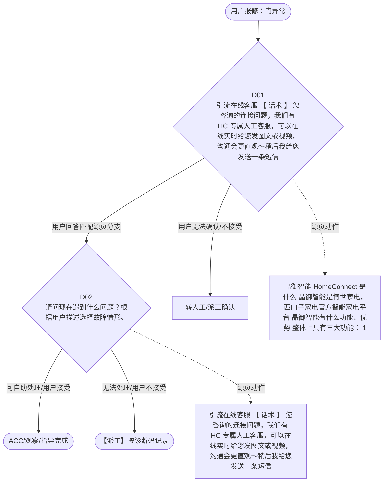

# BSH 晶御智能咨询 — 门异常 诊断手册

**故障编号**：F01 | **节点前缀**：DO | **来源**：PPT Slides 3-6
**适用诊断码**：`源页未抽取到明确诊断码`
**转换状态**：自动批处理草案，需按源 PPT 视觉关系复核后生产使用

---

## 一、文档使用说明

### 三条执行铁律

1. **不越界**：只执行本文件定义的诊断步骤；遇到超出范围的问题，执行越界协议（见第三节），不得自行延伸
2. **不编造**：话术原文不得改写、补充或省略；不在本文件中的诊断码不得使用
3. **不跳步**：严格按 D 步骤顺序执行，不得跳过中间步骤直接给出结论

### 执行约定标记表

| 标记 | 含义 |
|------|------|
| `【话术】` | 逐字朗读给用户的诊断引导话术 |
| `【判断】` | 根据用户回答或系统数据触发的条件分支 |
| `【诊断码】` | BSH 标准诊断码 |
| `【派工】` | 安排工程师上门 |
| `【配件】` | 预判所需配件 |
| `【视频】` | 视频辅助标记 |
| `【引用】` | 跨故障树引用跳转 |
| `【解释】` | 向用户解释原理/现象 |
| `【操作指导】` | 指导用户自行操作 |
| `▶` | 无条件进入下一步 |

---

## 二、故障诊断导航树

### Mermaid 源码



### 诊断步骤 ↔ 节点速查表

| 步骤 | 节点 ID | 节点类型 | 简述 |
| --- | --- | --- | --- |
| 入口 | DO_START | 起始 | 用户报修：门异常 |
| D01 | DO_D01 | 判断 | DO_D02 / DO_MANUAL01 |
| D02 | DO_D02 | 判断 | DO_ACC / DO_DISPATCH |
| 结束-ACC | DO_ACC | 结束 | 用户接受/观察/指导完成 |
| 结束-派工 | DO_DISPATCH | 派工 | 无法处理或用户不接受 |

---

## 三、越界处理协议

### 触发条件（满足以下任意一条即触发越界）

| # | 触发场景 |
|---|---------|
| 1 | 用户故障描述无法映射到当前诊断树的任何入口分支 |
| 2 | 用户回答无法映射到当前 D 步骤的任何条件行 |
| 3 | 目标跳转节点在 Mermaid 图中无有效连线或仍需视觉确认 |
| 4 | 用户要求提供本文档未包含的信息，如价格、保修政策、投诉升级 |
| 5 | 用户描述涉及焦味、冒烟、漏电、跳闸、进水等安全风险 |
| 6 | 用户要求自行拆机、维修、改线或更换内部零部件 |

### 退出动作

- 若属于其他故障树：执行 `【引用】` 跳转或回到索引重新分流
- 若无法定位：转人工客服
- 若存在安全风险：停止在线指导并安排工程师或人工处理

### 严禁行为

- 严禁自行判断主板、电源板、电机、压缩机等内部零部件级故障
- 严禁改写源 PPT 话术作为确定结论
- 严禁在用户尚未回答当前问题时跳至下一步

### 覆盖范围

本故障树仅覆盖 `门异常` 相关诊断。其他故障现象应回到 `JY` 索引重新分流。

---

## 四、诊断入口

### 故障主诉确认

- 用户描述与 `门异常` 相关。
- 命中索引关键词：门异常, 晶御智能的简介, 晶御智能, 是什么, 晶御智能是博世家, 西门子家电官方智。
- 来源页：Slides 3-6。

### 入口分支判断

```
用户报修“门异常”
│
├── 主诉匹配当前树 → 进入 D01
├── 主诉属于其他故障 → 回到索引执行跨树引用
└── 主诉不明确 → 先追问具体显示/部位/现象
```

---

## 五、诊断步骤详情

### D01 — 引流在线客服 【 话术 】 您咨询的连接问题，我们有 HC 专属

**[节点：DO_D01]**

**【话术】**：
> "引流在线客服 【 话术 】 您咨询的连接问题，我们有 HC 专属人工客服，可以在线实时给您发图文或视频，沟通会更直观～稍后我给您发送一条短信，您点击短信里的链接进入即可，你看可以吗？ 【 提醒 】 在线客服工作时间为： 8:00-24:00 ，非以上时间段请勿引导至在线，通道选择 【 其他 】 ，按正常流程接听电话，解答用户疑问。"

**判断表**：

| 条件 | 下一步 | 出口类型 | Mermaid 边验证 |
| --- | --- | --- | --- |
| 用户回答匹配源页下一分支 | D02 | 继续诊断 | DO_D01 → D02（自动草案，待视觉确认） |
| 用户接受解释/操作/观察 | 结束 | ACC | DO_D01 → ACC（待视觉确认） |
| 用户不接受 / 无法操作 / 风险场景 | 派工或转人工 | 派工 | DO_D01 → DISPATCH（待视觉确认） |
| **兜底越界**：其他无法识别的输入 | 越界协议 | 越界 | 无对应 Mermaid 边 |


### D02 — 请问现在遇到什么问题？根据用户描述选择故障情形。

**[节点：DO_D02]**

**【话术】**：
> "请问现在遇到什么问题？根据用户描述选择故障情形。"

**判断表**：

| 条件 | 下一步 | 出口类型 | Mermaid 边验证 |
| --- | --- | --- | --- |
| 用户回答匹配源页下一分支 | ACC / 派工 | 继续诊断 | DO_D02 → ACC / 派工（自动草案，待视觉确认） |
| 用户接受解释/操作/观察 | 结束 | ACC | DO_D02 → ACC（待视觉确认） |
| 用户不接受 / 无法操作 / 风险场景 | 派工或转人工 | 派工 | DO_D02 → DISPATCH（待视觉确认） |
| **兜底越界**：其他无法识别的输入 | 越界协议 | 越界 | 无对应 Mermaid 边 |


### 源页动作/结果摘录

- 晶御智能 HomeConnect 是什么 晶御智能是博世家电，西门子家电官方智能家电平台 晶御智能有什么功能、优势 整体上具有三大功能： 1. 远程监控和远程控制：所有程序和电器设置、室内和户外、推送通知 2. 菜谱世界：晶御智能菜谱、食材与佐料目录、健康饮食、烹饪建议、收藏夹 3. 客户服务：远程诊断、客服联系方式、多媒体提示与技巧、在线商店链接、数字化使用说明 晶御智能对外渠道 全球官网： http://www.home-connect.com/ 中国官网： https://www.home-connect.cn/cn/zh/ 服务热线： 4008289898 ，或拨打博世家电、西门子家电的品牌服务热线，按“ 3” 转家居互联 电子邮箱： Service.cn@home-connect.com 微信公众号： HomeConnect 晶御
- 引流在线客服 【 话术 】 您咨询的连接问题，我们有 HC 专属人工客服，可以在线实时给您发图文或视频，沟通会更直观～稍后我给您发送一条短信，您点击短信里的链接进入即可，你看可以吗？ 【 提醒 】 在线客服工作时间为： 8:00-24:00 ，非以上时间段请勿引导至在线，通道选择 【 其他 】 ，按正常流程接听电话，解答用户疑问。
- 用户不接受引流在线
- 接受小程序注册
- 接受下载 APP

---

## 附录 A：诊断码汇总表

| 诊断码 | 描述 | 触发步骤 | 备注 |
| --- | --- | --- | --- |
| 源页未抽取到明确诊断码 | — | — | 待人工补充 |

---

## 附录 B：配件建议汇总表

| 配件名称 | 关联步骤 | 说明 |
| --- | --- | --- |
| 源页未明确 | 派工出口 | 按源 PPT 派工节点记录，待视觉确认 |

---

## 附录 C：跨故障树引用清单

| 引用方向 | 触发条件 | 目标文件 | 目标诊断码 |
| --- | --- | --- | --- |
| 无明确跨树引用 | — | — | — |

---

## 附录 D：源页文本摘录（用于复核）

- 晶御智能的简介
- 晶御智能 HomeConnect 是什么 晶御智能是博世家电，西门子家电官方智能家电平台 晶御智能有什么功能、优势 整体上具有三大功能： 1. 远程监控和远程控制：所有程序和电器设置、室内和户外、推送通知 2. 菜谱世界：晶御智能菜谱、食材与佐料目录、健康饮食、烹饪建议、收藏夹 3. 客户服务：远程诊断、客服联系方式、多媒体提示与技巧、在线商店链接、数字化使用说明 晶御智能对外渠道 全球官网： http://www.home-connect.com/ 中国官网： https://www.home-connect.cn/cn/zh/ 服务热线： 4008289898 ，或拨打博世家电、西门子家电的品牌服务热线，按“ 3” 转家居互联 电子邮箱： Service.cn@home-connect.com 微信公众号： HomeConnect 晶御
- Internal
- 接听流程概览
- 引流在线客服 【 话术 】 您咨询的连接问题，我们有 HC 专属人工客服，可以在线实时给您发图文或视频，沟通会更直观～稍后我给您发送一条短信，您点击短信里的链接进入即可，你看可以吗？ 【 提醒 】 在线客服工作时间为： 8:00-24:00 ，非以上时间段请勿引导至在线，通道选择 【 其他 】 ，按正常流程接听电话，解答用户疑问。
- 是
- 用户不接受引流在线
- 请判断用户咨询内容是否为 HC 联网配对问题
- 【8:30-19:59】 请稍等，我把您的电话转给专线处理。后续若有联网相关的咨询您可以直接拨打晶御智能专线电话 4008289898 。 *若转接不成功，生成 HC 支持工单传递。 【20:00- 次日 8:29】 生成 HC 支持工单传递
- 发短信操作 【 西门子 】 搜：“ 341” ； 【 博世 】 搜：“ 342”
- 无 HC 技能 【T1/L1/L2/ L3 】
- 不是
- 是否有 HC 技能
- 提醒： 相关口径： 晶御智能电话接听流程
- 请问现在遇到什么问题？根据用户描述选择故障情形。
- 有 HC 技能 【L4/GL/GGN】
- APP 下载
- 诊断代码：
- 您可以直接在微信小程序晶御智能授权手机号一键注册登录，也可以下载 APP 注册登录。
- 相关 WIKI 链接： 晶御智能微信小程序的获取和 APP 的下载
- 账号注册登录
- 配对问题
- 接受小程序注册
- 无法远程控制
- 接受下载 APP
- 通知问题
- 您在应用市场中输入 【 晶御智能 】 就可以搜索到了。
- 电话结束，生成信息咨询
- 连接成功后，家电显示已离线、掉线问题
- 软件固件升级
- 博世锅炉、博世燃气热水器无法连接
- 如果没有搜到，或者版本比较老，可以通过如下连接下载： https://appdownload.home-connect.cn/apps/Home-Connect.apk
- 冰箱 wifi 图标一直处于蓝色快速闪烁状态无法退出
- 第三方生态合作
- CORN【 发短信操作 】 西门子搜“ 163” ；博世搜“ 164”
