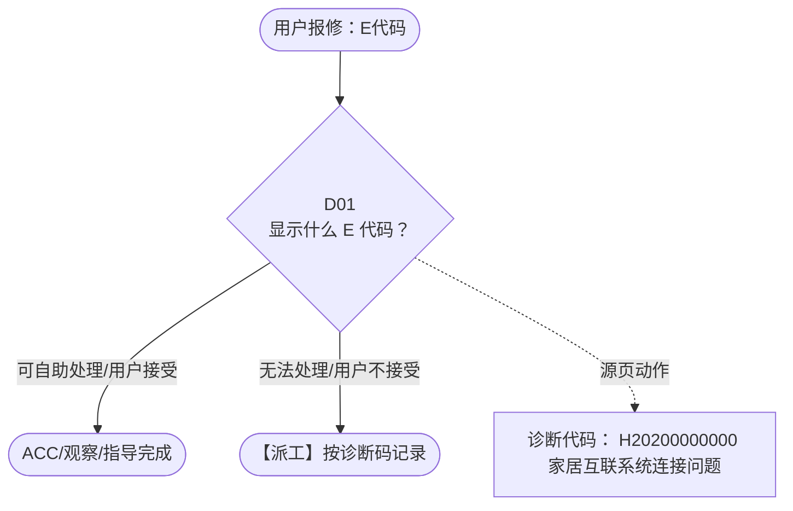

# BSH 晶御智能咨询 — E代码 诊断手册

**故障编号**：F03 | **节点前缀**：EC | **来源**：PPT Slides 8-9
**适用诊断码**：`H20200000000`
**转换状态**：自动批处理草案，需按源 PPT 视觉关系复核后生产使用

---

## 一、文档使用说明

### 三条执行铁律

1. **不越界**：只执行本文件定义的诊断步骤；遇到超出范围的问题，执行越界协议（见第三节），不得自行延伸
2. **不编造**：话术原文不得改写、补充或省略；不在本文件中的诊断码不得使用
3. **不跳步**：严格按 D 步骤顺序执行，不得跳过中间步骤直接给出结论

### 执行约定标记表

| 标记 | 含义 |
|------|------|
| `【话术】` | 逐字朗读给用户的诊断引导话术 |
| `【判断】` | 根据用户回答或系统数据触发的条件分支 |
| `【诊断码】` | BSH 标准诊断码 |
| `【派工】` | 安排工程师上门 |
| `【配件】` | 预判所需配件 |
| `【视频】` | 视频辅助标记 |
| `【引用】` | 跨故障树引用跳转 |
| `【解释】` | 向用户解释原理/现象 |
| `【操作指导】` | 指导用户自行操作 |
| `▶` | 无条件进入下一步 |

---

## 二、故障诊断导航树

### Mermaid 源码



### 诊断步骤 ↔ 节点速查表

| 步骤 | 节点 ID | 节点类型 | 简述 |
| --- | --- | --- | --- |
| 入口 | EC_START | 起始 | 用户报修：E代码 |
| D01 | EC_D01 | 判断 | EC_ACC / EC_DISPATCH |
| 结束-ACC | EC_ACC | 结束 | 用户接受/观察/指导完成 |
| 结束-派工 | EC_DISPATCH | 派工 | 无法处理或用户不接受 |

---

## 三、越界处理协议

### 触发条件（满足以下任意一条即触发越界）

| # | 触发场景 |
|---|---------|
| 1 | 用户故障描述无法映射到当前诊断树的任何入口分支 |
| 2 | 用户回答无法映射到当前 D 步骤的任何条件行 |
| 3 | 目标跳转节点在 Mermaid 图中无有效连线或仍需视觉确认 |
| 4 | 用户要求提供本文档未包含的信息，如价格、保修政策、投诉升级 |
| 5 | 用户描述涉及焦味、冒烟、漏电、跳闸、进水等安全风险 |
| 6 | 用户要求自行拆机、维修、改线或更换内部零部件 |

### 退出动作

- 若属于其他故障树：执行 `【引用】` 跳转或回到索引重新分流
- 若无法定位：转人工客服
- 若存在安全风险：停止在线指导并安排工程师或人工处理

### 严禁行为

- 严禁自行判断主板、电源板、电机、压缩机等内部零部件级故障
- 严禁改写源 PPT 话术作为确定结论
- 严禁在用户尚未回答当前问题时跳至下一步

### 覆盖范围

本故障树仅覆盖 `E代码` 相关诊断。其他故障现象应回到 `JY` 索引重新分流。

---

## 四、诊断入口

### 故障主诉确认

- 用户描述与 `E代码` 相关。
- 命中索引关键词：E代码, 配对问题, 首次连接, 使用小程序无法连, 使用, 无法连接。
- 来源页：Slides 8-9。

### 入口分支判断

```
用户报修“E代码”
│
├── 主诉匹配当前树 → 进入 D01
├── 主诉属于其他故障 → 回到索引执行跨树引用
└── 主诉不明确 → 先追问具体显示/部位/现象
```

---

## 五、诊断步骤详情

### D01 — 显示什么 E 代码？

**[节点：EC_D01]**

**【话术】**：
> "显示什么 E 代码？"

**判断表**：

| 条件 | 下一步 | 出口类型 | Mermaid 边验证 |
| --- | --- | --- | --- |
| 用户回答匹配源页下一分支 | ACC / 派工 | 继续诊断 | EC_D01 → ACC / 派工（自动草案，待视觉确认） |
| 用户接受解释/操作/观察 | 结束 | ACC | EC_D01 → ACC（待视觉确认） |
| 用户不接受 / 无法操作 / 风险场景 | 派工或转人工 | 派工 | EC_D01 → DISPATCH（待视觉确认） |
| **兜底越界**：其他无法识别的输入 | 越界协议 | 越界 | 无对应 Mermaid 边 |


### 源页动作/结果摘录

- 诊断代码： H20200000000 家居互联系统连接问题
- 建议您通过小程序连接试试，小程序页面提示相对更丰富，连接也更容易一些。我这里有一段操作视频，稍后通过短信的方式发送到您手机上，您点开链接就可以看到视频，很方便呢。
- 可能是家电距离网络太远或者网络不稳定，建议重置家电， 家电未能成功连接路由器 。 建议： 检查连接网络的频段（查询是否时 2.4G 网络） 用手机开热点重新配对试试，如果连接成功就是网络问题。 如果仍旧不能成功，我们将安排工程师上门。
- 安卓手机：请您先关闭手机设置中的 WLAN+/WLAN 助理，关闭安全检测，关闭移动数据之后再重新连接 。 IOS 手机：建议重启手机
- 跳转 E 代码故障树
- 可能是小程序上的操作过快或者过慢超时导致的，建议您重新连接，一定要注意等到家电上 wifi 长亮的时候再点击下一步，每操作完成一步，及时点击下一步。
- 洗衣机 / 洗干一体机 / 干衣机： SMM 的机器：请您在机器开机状态下长按电源键 5 秒钟，进行重置，结束后等待两分钟再配对试试。 COM 的机器：重置家电，重新进入配对。（可引导用户查看小程序端的重置 / 复位操作，点击底部的“帮助”，查看重置 / 复位方法） 洗碗机： 大部分洗碗机可建议：长按电源键 4 秒，对机器进行重启，然后再试试。 其他产品 ：可引导用户查看小程序端的重置 / 复位操作
- COM 冰箱：这一步是一直转圈 SMM 冰箱：这一步是一直在慢闪烁（一秒闪一次 ) SMM 冰箱（一秒闪烁 2 此）：这是冰箱进入重置状态，建议用户等待一段时间或断电重新上电
- 建议你重新登录账号后，重新配对试试。
- 建议您重置家电后重新配对试试
- 建议您重启家电，重新配对试试。
- 提示是密码错误，可能是会有两种原因： 1. 网络信号不好，这个建议把路由器移近一些再试一下 2. 真的密码错误了

---

## 附录 A：诊断码汇总表

| 诊断码 | 描述 | 触发步骤 | 备注 |
| --- | --- | --- | --- |
| `H20200000000` | 见源 PPT 相邻文本 | 源页派工/判断节点 | 自动抽取，待人工核对英文/中文描述 |

---

## 附录 B：配件建议汇总表

| 配件名称 | 关联步骤 | 说明 |
| --- | --- | --- |
| 源页未明确 | 派工出口 | 按源 PPT 派工节点记录，待视觉确认 |

---

## 附录 C：跨故障树引用清单

| 引用方向 | 触发条件 | 目标文件 | 目标诊断码 |
| --- | --- | --- | --- |
| 无明确跨树引用 | — | — | — |

---

## 附录 D：源页文本摘录（用于复核）

- Internal
- 配对问题（首次连接、使用小程序无法连接、使用 app 无法连接）
- 诊断代码： H20200000000 家居互联系统连接问题
- 建议您通过小程序连接试试，小程序页面提示相对更丰富，连接也更容易一些。我这里有一段操作视频，稍后通过短信的方式发送到您手机上，您点开链接就可以看到视频，很方便呢。
- APP 下载
- 账号注册登录
- 配对问题
- wifi 一直闪烁 （一般出现在洗衣机，干衣机，洗干一体机上）
- 已经连接了 Home Connect 网络，但是返回小程序，还是显示去连接
- 小程序配对
- APP 配对
- 配对卡在百分比
- 小程序页面无异常，但机器上提示 err （一般出现在洗衣机，干衣机，洗干一体机上））
- 显示 E 代码
- 无法远程控制
- 按 wifi 键无反应 （主要是洗碗机）
- 未搜索到家电
- 见下一张 PPT
- 通知问题
- 相关链接： 5 、晶御智能联网配对
- 可能是家电距离网络太远或者网络不稳定，建议重置家电， 家电未能成功连接路由器 。 建议： 检查连接网络的频段（查询是否时 2.4G 网络） 用手机开热点重新配对试试，如果连接成功就是网络问题。 如果仍旧不能成功，我们将安排工程师上门。
- 安卓手机：请您先关闭手机设置中的 WLAN+/WLAN 助理，关闭安全检测，关闭移动数据之后再重新连接 。 IOS 手机：建议重启手机
- 跳转 E 代码故障树
- 可能是小程序上的操作过快或者过慢超时导致的，建议您重新连接，一定要注意等到家电上 wifi 长亮的时候再点击下一步，每操作完成一步，及时点击下一步。
- 重置家电
- 连接成功后，家电显示已离线、掉线问题
- 结束通话，生成信息咨询
- 软件固件升级
- 洗衣机 / 洗干一体机 / 干衣机： SMM 的机器：请您在机器开机状态下长按电源键 5 秒钟，进行重置，结束后等待两分钟再配对试试。 COM 的机器：重置家电，重新进入配对。（可引导用户查看小程序端的重置 / 复位操作，点击底部的“帮助”，查看重置 / 复位方法） 洗碗机： 大部分洗碗机可建议：长按电源键 4 秒，对机器进行重启，然后再试试。 其他产品 ：可引导用户查看小程序端的重置 / 复位操作
- 博世锅炉、博世燃气热水器无法连接
- （这些功能在配对过程中会干扰手机和家电之间的通讯，所以要关闭，等配对成功之后重新打开，不会影响之后的使用）
- 冰箱 wifi 图标一直处于蓝色快速闪烁状态无法退出
- COM 冰箱：这一步是一直转圈 SMM 冰箱：这一步是一直在慢闪烁（一秒闪一次 ) SMM 冰箱（一秒闪烁 2 此）：这是冰箱进入重置状态，建议用户等待一段时间或断电重新上电
- 第三方生态合作
- 配对问题 - 小程序显示 E 代码
- 相关链接： Homeconnect 小程序错误代码表
- E1001/E1002/E1003/E1111/E1115/E1116/E1117/E1118/E1119/E1120/E1123/E2000/E2002/E2101/E2102/E2103/E2104/E2106/E2109/E2203
- 显示什么 E 代码？
- E1000/E1102/E2208/E2209
- E1200/E1204
- E1100/E1101/E1103/ E1106 /E1110/E1112/E2100
- E1206/E2200/E2212
- E1207/E2202
- E2107/E2201/E2003/E2204/E2205/E2206
- E1106
- 建议你重新登录账号后，重新配对试试。
- 请您在当前页面点击“去重试”按钮重试，如果还是失败，需要重置家电，重新配对试试。
- 建议您重置家电后重新配对试试
- 建议您重启家电，重新配对试试。
- 请您在当前页面点击”重试“
- 点击“去重试”，重新输入网络密码。
- 请点击“去重试”，重新配对试试。
- 提示是密码错误，可能是会有两种原因： 1. 网络信号不好，这个建议把路由器移近一些再试一下 2. 真的密码错误了
