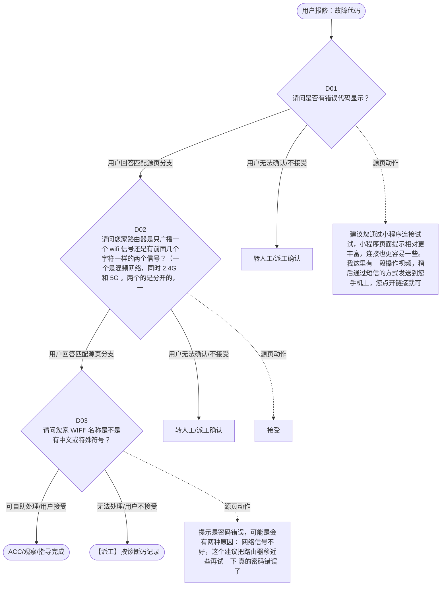

# BSH 晶御智能咨询 — 故障代码 诊断手册

**故障编号**：F04 | **节点前缀**：EC2 | **来源**：PPT Slide 10
**适用诊断码**：`源页未抽取到明确诊断码`
**转换状态**：自动批处理草案，需按源 PPT 视觉关系复核后生产使用

---

## 一、文档使用说明

### 三条执行铁律

1. **不越界**：只执行本文件定义的诊断步骤；遇到超出范围的问题，执行越界协议（见第三节），不得自行延伸
2. **不编造**：话术原文不得改写、补充或省略；不在本文件中的诊断码不得使用
3. **不跳步**：严格按 D 步骤顺序执行，不得跳过中间步骤直接给出结论

### 执行约定标记表

| 标记 | 含义 |
|------|------|
| `【话术】` | 逐字朗读给用户的诊断引导话术 |
| `【判断】` | 根据用户回答或系统数据触发的条件分支 |
| `【诊断码】` | BSH 标准诊断码 |
| `【派工】` | 安排工程师上门 |
| `【配件】` | 预判所需配件 |
| `【视频】` | 视频辅助标记 |
| `【引用】` | 跨故障树引用跳转 |
| `【解释】` | 向用户解释原理/现象 |
| `【操作指导】` | 指导用户自行操作 |
| `▶` | 无条件进入下一步 |

---

## 二、故障诊断导航树

### Mermaid 源码



### 诊断步骤 ↔ 节点速查表

| 步骤 | 节点 ID | 节点类型 | 简述 |
| --- | --- | --- | --- |
| 入口 | EC2_START | 起始 | 用户报修：故障代码 |
| D01 | EC2_D01 | 判断 | EC2_D02 / EC2_MANUAL01 |
| D02 | EC2_D02 | 判断 | EC2_D03 / EC2_MANUAL02 |
| D03 | EC2_D03 | 判断 | EC2_ACC / EC2_DISPATCH |
| 结束-ACC | EC2_ACC | 结束 | 用户接受/观察/指导完成 |
| 结束-派工 | EC2_DISPATCH | 派工 | 无法处理或用户不接受 |

---

## 三、越界处理协议

### 触发条件（满足以下任意一条即触发越界）

| # | 触发场景 |
|---|---------|
| 1 | 用户故障描述无法映射到当前诊断树的任何入口分支 |
| 2 | 用户回答无法映射到当前 D 步骤的任何条件行 |
| 3 | 目标跳转节点在 Mermaid 图中无有效连线或仍需视觉确认 |
| 4 | 用户要求提供本文档未包含的信息，如价格、保修政策、投诉升级 |
| 5 | 用户描述涉及焦味、冒烟、漏电、跳闸、进水等安全风险 |
| 6 | 用户要求自行拆机、维修、改线或更换内部零部件 |

### 退出动作

- 若属于其他故障树：执行 `【引用】` 跳转或回到索引重新分流
- 若无法定位：转人工客服
- 若存在安全风险：停止在线指导并安排工程师或人工处理

### 严禁行为

- 严禁自行判断主板、电源板、电机、压缩机等内部零部件级故障
- 严禁改写源 PPT 话术作为确定结论
- 严禁在用户尚未回答当前问题时跳至下一步

### 覆盖范围

本故障树仅覆盖 `故障代码` 相关诊断。其他故障现象应回到 `JY` 索引重新分流。

---

## 四、诊断入口

### 故障主诉确认

- 用户描述与 `故障代码` 相关。
- 命中索引关键词：故障代码, 配对问题, 无法连接, 建议您通过小程序, 连接试试, 小程序页面提示相。
- 来源页：Slide 10。

### 入口分支判断

```
用户报修“故障代码”
│
├── 主诉匹配当前树 → 进入 D01
├── 主诉属于其他故障 → 回到索引执行跨树引用
└── 主诉不明确 → 先追问具体显示/部位/现象
```

---

## 五、诊断步骤详情

### D01 — 请问是否有错误代码显示？

**[节点：EC2_D01]**

**【话术】**：
> "请问是否有错误代码显示？"

**判断表**：

| 条件 | 下一步 | 出口类型 | Mermaid 边验证 |
| --- | --- | --- | --- |
| 用户回答匹配源页下一分支 | D02 | 继续诊断 | EC2_D01 → D02（自动草案，待视觉确认） |
| 用户接受解释/操作/观察 | 结束 | ACC | EC2_D01 → ACC（待视觉确认） |
| 用户不接受 / 无法操作 / 风险场景 | 派工或转人工 | 派工 | EC2_D01 → DISPATCH（待视觉确认） |
| **兜底越界**：其他无法识别的输入 | 越界协议 | 越界 | 无对应 Mermaid 边 |


### D02 — 请问您家路由器是只广播一个 wifi 信号还是有前面几个字符一样

**[节点：EC2_D02]**

**【话术】**：
> "请问您家路由器是只广播一个 wifi 信号还是有前面几个字符一样的两个信号？（一个是混频网络，同时 2.4G 和 5G 。两个的是分开的，一个是 2.4G 的，一个是 5G 的）"

**判断表**：

| 条件 | 下一步 | 出口类型 | Mermaid 边验证 |
| --- | --- | --- | --- |
| 用户回答匹配源页下一分支 | D03 | 继续诊断 | EC2_D02 → D03（自动草案，待视觉确认） |
| 用户接受解释/操作/观察 | 结束 | ACC | EC2_D02 → ACC（待视觉确认） |
| 用户不接受 / 无法操作 / 风险场景 | 派工或转人工 | 派工 | EC2_D02 → DISPATCH（待视觉确认） |
| **兜底越界**：其他无法识别的输入 | 越界协议 | 越界 | 无对应 Mermaid 边 |


### D03 — 请问您家 WIFI” 名称是不是有中文或特殊符号？

**[节点：EC2_D03]**

**【话术】**：
> "请问您家 WIFI” 名称是不是有中文或特殊符号？"

**判断表**：

| 条件 | 下一步 | 出口类型 | Mermaid 边验证 |
| --- | --- | --- | --- |
| 用户回答匹配源页下一分支 | ACC / 派工 | 继续诊断 | EC2_D03 → ACC / 派工（自动草案，待视觉确认） |
| 用户接受解释/操作/观察 | 结束 | ACC | EC2_D03 → ACC（待视觉确认） |
| 用户不接受 / 无法操作 / 风险场景 | 派工或转人工 | 派工 | EC2_D03 → DISPATCH（待视觉确认） |
| **兜底越界**：其他无法识别的输入 | 越界协议 | 越界 | 无对应 Mermaid 边 |


### 源页动作/结果摘录

- 建议您通过小程序连接试试，小程序页面提示相对更丰富，连接也更容易一些。我这里有一段操作视频，稍后通过短信的方式发送到您手机上，您点开链接就可以看到视频，很方便呢。
- 接受
- 提示是密码错误，可能是会有两种原因： 网络信号不好，这个建议把路由器移近一些再试一下 真的密码错误了
- 家电网络要求：请通过 不同型号的网络要求及联网方式 确认。 【 支持 2.4G/5G/ 混频 】 ：大概率将家电恢复出厂设置后，重新连接即可。 【 仅支持 2.4G 频段 】 ：建议做分频处理（一般路由器里面设置）后选择 2.4G 网络重新连接。
- 家电网络要求：请通过 不同型号的网络要求及联网方式 确认。 【 支持 2.4G/5G/ 混频 】 ：大概率将家电恢复出厂设置后，重新连接即可。 【 仅支持 2.4G 频段 】 ：目前家电连接只支持 2.4G 信号，建议您在手机设置中先忽略 5G 网络，选择 2.4G 网络重新连接。
- • 对于蓝牙配对的家 电：支持字母、数字、中文及常见特殊字符（不支持 emoji ）。 • 对于非蓝牙配对的家电： 2019 年及以后生产的家电：支持字母、数字、中文及常见特殊字符（不支持 emoji ）。 2019 年以前生产的家电：由于生产的时候家电固件版本较低，不支持含有中文字符的 WiFi 名称。但小程序在配对过程中可检测到此问题，并给出相应提示。 优先派工
- 请您复位机器后重新连接即可。 优先派工
- 在主页”家居互联问题提报”，中填写详细情况。在收到回复后，给用户回电话。 优先派工

---

## 附录 A：诊断码汇总表

| 诊断码 | 描述 | 触发步骤 | 备注 |
| --- | --- | --- | --- |
| 源页未抽取到明确诊断码 | — | — | 待人工补充 |

---

## 附录 B：配件建议汇总表

| 配件名称 | 关联步骤 | 说明 |
| --- | --- | --- |
| 源页未明确 | 派工出口 | 按源 PPT 派工节点记录，待视觉确认 |

---

## 附录 C：跨故障树引用清单

| 引用方向 | 触发条件 | 目标文件 | 目标诊断码 |
| --- | --- | --- | --- |
| 无明确跨树引用 | — | — | — |

---

## 附录 D：源页文本摘录（用于复核）

- Internal
- 配对问题 -APP 无法连接
- 建议您通过小程序连接试试，小程序页面提示相对更丰富，连接也更容易一些。我这里有一段操作视频，稍后通过短信的方式发送到您手机上，您点开链接就可以看到视频，很方便呢。
- 提醒： 相关 wiki 链接： 晶御智能故障代码
- APP 下载
- 坚持使用 APP 连接
- 接受
- 账号注册登录
- 配对问题
- 结束通话，生成信息咨询
- 请问是否有错误代码显示？
- 无法远程控制
- 有
- 没有
- 通知问题
- H9005
- 请问您家路由器是只广播一个 wifi 信号还是有前面几个字符一样的两个信号？（一个是混频网络，同时 2.4G 和 5G 。两个的是分开的，一个是 2.4G 的，一个是 5G 的）
- 请根据表格内容指导。 或者错误码下方会有文案提示用户需要做什么操作
- 连接成功后，家电显示已离线、掉线问题
- 提示是密码错误，可能是会有两种原因： 网络信号不好，这个建议把路由器移近一些再试一下 真的密码错误了
- 软件固件升级
- 2.4G 先确定 wifi 名称情况
- 博世锅炉、博世燃气热水器无法连接
- 混频 / 不清楚
- 2.4 和 5G 双频信号
- 问题解决
- 问题未解决
- 冰箱 wifi 图标一直处于蓝色快速闪烁状态无法退出
- 家电网络要求：请通过 不同型号的网络要求及联网方式 确认。 【 支持 2.4G/5G/ 混频 】 ：大概率将家电恢复出厂设置后，重新连接即可。 【 仅支持 2.4G 频段 】 ：建议做分频处理（一般路由器里面设置）后选择 2.4G 网络重新连接。
- 家电网络要求：请通过 不同型号的网络要求及联网方式 确认。 【 支持 2.4G/5G/ 混频 】 ：大概率将家电恢复出厂设置后，重新连接即可。 【 仅支持 2.4G 频段 】 ：目前家电连接只支持 2.4G 信号，建议您在手机设置中先忽略 5G 网络，选择 2.4G 网络重新连接。
- 请问您家 WIFI” 名称是不是有中文或特殊符号？
- 生成 TC 二线支持工单
- 第三方生态合作
- • 对于蓝牙配对的家 电：支持字母、数字、中文及常见特殊字符（不支持 emoji ）。 • 对于非蓝牙配对的家电： 2019 年及以后生产的家电：支持字母、数字、中文及常见特殊字符（不支持 emoji ）。 2019 年以前生产的家电：由于生产的时候家电固件版本较低，不支持含有中文字符的 WiFi 名称。但小程序在配对过程中可检测到此问题，并给出相应提示。 优先派工
- 请您复位机器后重新连接即可。 优先派工
- 在主页”家居互联问题提报”，中填写详细情况。在收到回复后，给用户回电话。 优先派工
