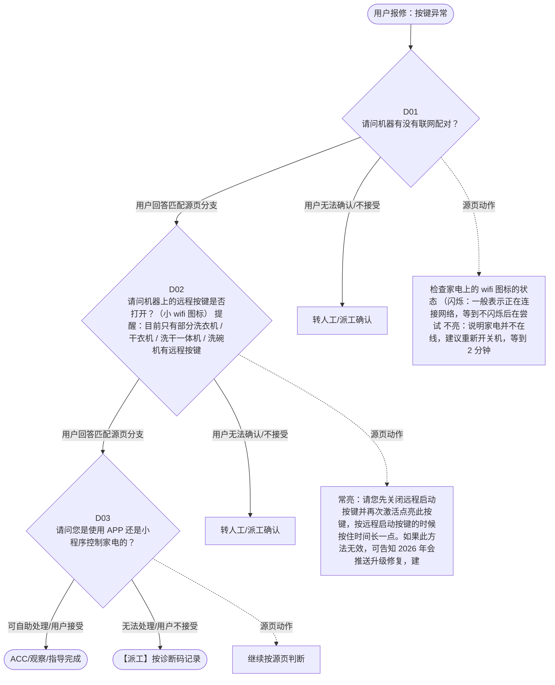

# BSH 晶御智能咨询 — 按键异常 诊断手册

**故障编号**：F05 | **节点前缀**：BT2 | **来源**：PPT Slides 11-12
**适用诊断码**：`H10100000000`
**转换状态**：自动批处理草案，需按源 PPT 视觉关系复核后生产使用

---

## 一、文档使用说明

### 三条执行铁律

1. **不越界**：只执行本文件定义的诊断步骤；遇到超出范围的问题，执行越界协议（见第三节），不得自行延伸
2. **不编造**：话术原文不得改写、补充或省略；不在本文件中的诊断码不得使用
3. **不跳步**：严格按 D 步骤顺序执行，不得跳过中间步骤直接给出结论

### 执行约定标记表

| 标记 | 含义 |
|------|------|
| `【话术】` | 逐字朗读给用户的诊断引导话术 |
| `【判断】` | 根据用户回答或系统数据触发的条件分支 |
| `【诊断码】` | BSH 标准诊断码 |
| `【派工】` | 安排工程师上门 |
| `【配件】` | 预判所需配件 |
| `【视频】` | 视频辅助标记 |
| `【引用】` | 跨故障树引用跳转 |
| `【解释】` | 向用户解释原理/现象 |
| `【操作指导】` | 指导用户自行操作 |
| `▶` | 无条件进入下一步 |

---

## 二、故障诊断导航树

### Mermaid 源码



### 诊断步骤 ↔ 节点速查表

| 步骤 | 节点 ID | 节点类型 | 简述 |
| --- | --- | --- | --- |
| 入口 | BT2_START | 起始 | 用户报修：按键异常 |
| D01 | BT2_D01 | 判断 | BT2_D02 / BT2_MANUAL01 |
| D02 | BT2_D02 | 判断 | BT2_D03 / BT2_MANUAL02 |
| D03 | BT2_D03 | 判断 | BT2_ACC / BT2_DISPATCH |
| 结束-ACC | BT2_ACC | 结束 | 用户接受/观察/指导完成 |
| 结束-派工 | BT2_DISPATCH | 派工 | 无法处理或用户不接受 |

---

## 三、越界处理协议

### 触发条件（满足以下任意一条即触发越界）

| # | 触发场景 |
|---|---------|
| 1 | 用户故障描述无法映射到当前诊断树的任何入口分支 |
| 2 | 用户回答无法映射到当前 D 步骤的任何条件行 |
| 3 | 目标跳转节点在 Mermaid 图中无有效连线或仍需视觉确认 |
| 4 | 用户要求提供本文档未包含的信息，如价格、保修政策、投诉升级 |
| 5 | 用户描述涉及焦味、冒烟、漏电、跳闸、进水等安全风险 |
| 6 | 用户要求自行拆机、维修、改线或更换内部零部件 |

### 退出动作

- 若属于其他故障树：执行 `【引用】` 跳转或回到索引重新分流
- 若无法定位：转人工客服
- 若存在安全风险：停止在线指导并安排工程师或人工处理

### 严禁行为

- 严禁自行判断主板、电源板、电机、压缩机等内部零部件级故障
- 严禁改写源 PPT 话术作为确定结论
- 严禁在用户尚未回答当前问题时跳至下一步

### 覆盖范围

本故障树仅覆盖 `按键异常` 相关诊断。其他故障现象应回到 `JY` 索引重新分流。

---

## 四、诊断入口

### 故障主诉确认

- 用户描述与 `按键异常` 相关。
- 命中索引关键词：按键异常, 无法远程控制, 诊断代码, H1010, 应用程序无法运行, 下载。
- 来源页：Slides 11-12。

### 入口分支判断

```
用户报修“按键异常”
│
├── 主诉匹配当前树 → 进入 D01
├── 主诉属于其他故障 → 回到索引执行跨树引用
└── 主诉不明确 → 先追问具体显示/部位/现象
```

---

## 五、诊断步骤详情

### D01 — 请问机器有没有联网配对？

**[节点：BT2_D01]**

**【话术】**：
> "请问机器有没有联网配对？"

**判断表**：

| 条件 | 下一步 | 出口类型 | Mermaid 边验证 |
| --- | --- | --- | --- |
| 用户回答匹配源页下一分支 | D02 | 继续诊断 | BT2_D01 → D02（自动草案，待视觉确认） |
| 用户接受解释/操作/观察 | 结束 | ACC | BT2_D01 → ACC（待视觉确认） |
| 用户不接受 / 无法操作 / 风险场景 | 派工或转人工 | 派工 | BT2_D01 → DISPATCH（待视觉确认） |
| **兜底越界**：其他无法识别的输入 | 越界协议 | 越界 | 无对应 Mermaid 边 |


### D02 — 请问机器上的远程按键是否打开？（小 wifi 图标） 提醒：目前

**[节点：BT2_D02]**

**【话术】**：
> "请问机器上的远程按键是否打开？（小 wifi 图标） 提醒：目前只有部分洗衣机 / 干衣机 / 洗干一体机 / 洗碗机有远程按键"

**判断表**：

| 条件 | 下一步 | 出口类型 | Mermaid 边验证 |
| --- | --- | --- | --- |
| 用户回答匹配源页下一分支 | D03 | 继续诊断 | BT2_D02 → D03（自动草案，待视觉确认） |
| 用户接受解释/操作/观察 | 结束 | ACC | BT2_D02 → ACC（待视觉确认） |
| 用户不接受 / 无法操作 / 风险场景 | 派工或转人工 | 派工 | BT2_D02 → DISPATCH（待视觉确认） |
| **兜底越界**：其他无法识别的输入 | 越界协议 | 越界 | 无对应 Mermaid 边 |


### D03 — 请问您是使用 APP 还是小程序控制家电的？

**[节点：BT2_D03]**

**【话术】**：
> "请问您是使用 APP 还是小程序控制家电的？"

**判断表**：

| 条件 | 下一步 | 出口类型 | Mermaid 边验证 |
| --- | --- | --- | --- |
| 用户回答匹配源页下一分支 | ACC / 派工 | 继续诊断 | BT2_D03 → ACC / 派工（自动草案，待视觉确认） |
| 用户接受解释/操作/观察 | 结束 | ACC | BT2_D03 → ACC（待视觉确认） |
| 用户不接受 / 无法操作 / 风险场景 | 派工或转人工 | 派工 | BT2_D03 → DISPATCH（待视觉确认） |
| **兜底越界**：其他无法识别的输入 | 越界协议 | 越界 | 无对应 Mermaid 边 |


### 源页动作/结果摘录

- 检查家电上的 wifi 图标的状态 （闪烁：一般表示正在连接网络，等到不闪烁后在尝试 不亮：说明家电并不在线，建议重新开关机，等到 2 分钟后，看 wifi 图标常亮了没有）
- 常亮：请您先关闭远程启动按键并再次激活点亮此按键，按远程启动按键的时候按住时间长一点。如果此方法无效，可告知 2026 年会推送升级修复，建议用户等待。

---

## 附录 A：诊断码汇总表

| 诊断码 | 描述 | 触发步骤 | 备注 |
| --- | --- | --- | --- |
| `H10100000000` | 见源 PPT 相邻文本 | 源页派工/判断节点 | 自动抽取，待人工核对英文/中文描述 |

---

## 附录 B：配件建议汇总表

| 配件名称 | 关联步骤 | 说明 |
| --- | --- | --- |
| 源页未明确 | 派工出口 | 按源 PPT 派工节点记录，待视觉确认 |

---

## 附录 C：跨故障树引用清单

| 引用方向 | 触发条件 | 目标文件 | 目标诊断码 |
| --- | --- | --- | --- |
| 无明确跨树引用 | — | — | — |

---

## 附录 D：源页文本摘录（用于复核）

- Internal
- 无法远程控制
- 诊断代码： H10100000000 App 应用程序无法运行
- APP 下载
- 提醒： 相关 wiki 链接： 如何复位机器、复位 APP
- 请问机器有没有联网配对？
- 账号注册登录
- 未连接
- 离开同一 WiFi 就不能控制家电
- 已连接
- 配对问题
- 请问机器上的远程按键是否打开？（小 wifi 图标） 提醒：目前只有部分洗衣机 / 干衣机 / 洗干一体机 / 洗碗机有远程按键
- 请您先将家电连接，然后再试试。
- 请问您是使用 APP 还是小程序控制家电的？
- 如果远程控制未开启的话，从小程序首页进入到家电详情页的时候，顶部会有提示远程启动未开启 APP ：启动程序的时候会提示远程启动未开启
- 通知问题
- APP
- 小程序
- 连接成功后，家电显示已离线、掉线问题
- 软件固件升级
- 未打开
- 打开
- 家电不在线，请您刷新下小程序页面看看状态有没有变化。（刷新方法：按住页面往下拖拽）
- 点击家电卡片，选择“设置”，向下滑动，查看“网络”选项
- 博世锅炉、博世燃气热水器无法连接
- 检查家电上的 wifi 图标的状态 （闪烁：一般表示正在连接网络，等到不闪烁后在尝试 不亮：说明家电并不在线，建议重新开关机，等到 2 分钟后，看 wifi 图标常亮了没有）
- 请您开启机器上的远程启动按键，然后再打开小程序（ APP ）进行远程操作。
- 冰箱 wifi 图标一直处于蓝色快速闪烁状态无法退出
- 家电跟云端为红线
- 手机跟云端为红线
- 检查家电网络情况，一般是由于网络不稳定导致的家电离线
- 蓝牙配对的家电（洗碗机和烤箱）： 是可以开启永久远程启动的。通过小程序上的提示操作小程序和家电即可 非蓝牙配对的家电： 洗衣机，干衣机，洗干一体机是需要点亮远程启动按钮。通过小程序提示操作
- 第三方生态合作
- 家电跟服务器的连接断开了 检查网络情况 开关机，等 30 秒左右看看是否可以恢复 重置家电重新配对
- 手机跟云端服务断开 1. 检查手机网络情况
- 常亮：请您先关闭远程启动按键并再次激活点亮此按键，按远程启动按键的时候按住时间长一点。如果此方法无效，可告知 2026 年会推送升级修复，建议用户等待。
- 收不到通知
- 通知和实际不符
- 先确认家电类型
- 洗碗机
- 通知开关
- 洗衣机
- 洗衣机会在洗衣完成后一小时再次提醒“衣物忘取”提醒。 会再次提醒用户从洗衣机中取出衣物
- 由于您的机器支持存储功能，目前程序结束通知是按照储存停止为准，这个问题我们会在后续通过软件在线升级方式解决
- 点击“设置”，“通知设置”检查家电连接下的所有开关是否开启。 检查手机设置中晶御智能 APP 的通知权限是否打开
- 1. 打开小程序，点击右上角三个点，选择“设置”，点击“订阅消息” 检查期望接收到的信息是否处于“接收状态” 2. 检查手机设置中微信 APP 的通知权限是否打开
- 升级 APP 版本至最新
- 需要打开才能收到
- 重新开关一下，再次触发查看是否可以收到
- 还是收不到
- 生成 TC 二线支持工单。 需要提供：用户手机号码，应该触发什么通知，此通知大概的时间点
- 生成 TC 二线支持工单 需要提供：用户手机号码，应该触发什么通知，此通知大概的时间点
