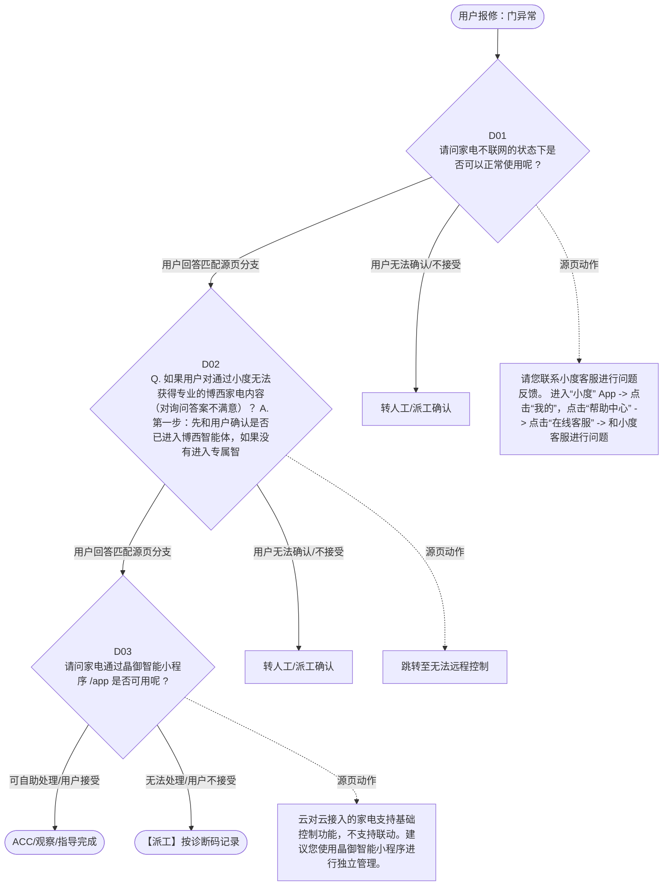

# BSH 晶御智能咨询 — 门异常 诊断手册

**故障编号**：F10 | **节点前缀**：DO3 | **来源**：PPT Slides 17-18
**适用诊断码**：`源页未抽取到明确诊断码`
**转换状态**：自动批处理草案，需按源 PPT 视觉关系复核后生产使用

---

## 一、文档使用说明

### 三条执行铁律

1. **不越界**：只执行本文件定义的诊断步骤；遇到超出范围的问题，执行越界协议（见第三节），不得自行延伸
2. **不编造**：话术原文不得改写、补充或省略；不在本文件中的诊断码不得使用
3. **不跳步**：严格按 D 步骤顺序执行，不得跳过中间步骤直接给出结论

### 执行约定标记表

| 标记 | 含义 |
|------|------|
| `【话术】` | 逐字朗读给用户的诊断引导话术 |
| `【判断】` | 根据用户回答或系统数据触发的条件分支 |
| `【诊断码】` | BSH 标准诊断码 |
| `【派工】` | 安排工程师上门 |
| `【配件】` | 预判所需配件 |
| `【视频】` | 视频辅助标记 |
| `【引用】` | 跨故障树引用跳转 |
| `【解释】` | 向用户解释原理/现象 |
| `【操作指导】` | 指导用户自行操作 |
| `▶` | 无条件进入下一步 |

---

## 二、故障诊断导航树

### Mermaid 源码



### 诊断步骤 ↔ 节点速查表

| 步骤 | 节点 ID | 节点类型 | 简述 |
| --- | --- | --- | --- |
| 入口 | DO3_START | 起始 | 用户报修：门异常 |
| D01 | DO3_D01 | 判断 | DO3_D02 / DO3_MANUAL01 |
| D02 | DO3_D02 | 判断 | DO3_D03 / DO3_MANUAL02 |
| D03 | DO3_D03 | 判断 | DO3_ACC / DO3_DISPATCH |
| 结束-ACC | DO3_ACC | 结束 | 用户接受/观察/指导完成 |
| 结束-派工 | DO3_DISPATCH | 派工 | 无法处理或用户不接受 |

---

## 三、越界处理协议

### 触发条件（满足以下任意一条即触发越界）

| # | 触发场景 |
|---|---------|
| 1 | 用户故障描述无法映射到当前诊断树的任何入口分支 |
| 2 | 用户回答无法映射到当前 D 步骤的任何条件行 |
| 3 | 目标跳转节点在 Mermaid 图中无有效连线或仍需视觉确认 |
| 4 | 用户要求提供本文档未包含的信息，如价格、保修政策、投诉升级 |
| 5 | 用户描述涉及焦味、冒烟、漏电、跳闸、进水等安全风险 |
| 6 | 用户要求自行拆机、维修、改线或更换内部零部件 |

### 退出动作

- 若属于其他故障树：执行 `【引用】` 跳转或回到索引重新分流
- 若无法定位：转人工客服
- 若存在安全风险：停止在线指导并安排工程师或人工处理

### 严禁行为

- 严禁自行判断主板、电源板、电机、压缩机等内部零部件级故障
- 严禁改写源 PPT 话术作为确定结论
- 严禁在用户尚未回答当前问题时跳至下一步

### 覆盖范围

本故障树仅覆盖 `门异常` 相关诊断。其他故障现象应回到 `JY` 索引重新分流。

---

## 四、诊断入口

### 故障主诉确认

- 用户描述与 `门异常` 相关。
- 命中索引关键词：门异常, 第三方生态合作, 小度音响, 确认问题, 其他问题, 小度。
- 来源页：Slides 17-18。

### 入口分支判断

```
用户报修“门异常”
│
├── 主诉匹配当前树 → 进入 D01
├── 主诉属于其他故障 → 回到索引执行跨树引用
└── 主诉不明确 → 先追问具体显示/部位/现象
```

---

## 五、诊断步骤详情

### D01 — 请问家电不联网的状态下是否可以正常使用呢 ?

**[节点：DO3_D01]**

**【话术】**：
> "请问家电不联网的状态下是否可以正常使用呢 ?"

**判断表**：

| 条件 | 下一步 | 出口类型 | Mermaid 边验证 |
| --- | --- | --- | --- |
| 用户回答匹配源页下一分支 | D02 | 继续诊断 | DO3_D01 → D02（自动草案，待视觉确认） |
| 用户接受解释/操作/观察 | 结束 | ACC | DO3_D01 → ACC（待视觉确认） |
| 用户不接受 / 无法操作 / 风险场景 | 派工或转人工 | 派工 | DO3_D01 → DISPATCH（待视觉确认） |
| **兜底越界**：其他无法识别的输入 | 越界协议 | 越界 | 无对应 Mermaid 边 |


### D02 — Q. 如果用户对通过小度无法获得专业的博西家电内容（对询问答案不

**[节点：DO3_D02]**

**【话术】**：
> "Q. 如果用户对通过小度无法获得专业的博西家电内容（对询问答案不满意）？ A. 第一步：先和用户确认是否已进入博西智能体，如果没有进入专属智能体，那么小度提供的答案则是来自百度百科，而非博西专属内容。（进入智能体的方式，对小度说：小度小度，打开西门子 / 博世助手） 第二步：如果用户进入了智能体，但表示智能体“答非所问”。可以尝试安抚用户，影响问答质量的原因有多方面，如语音识别问题、语义理解问题、问题超出知识库范围等。遇到用户反馈时，请收集如下几个信息后与在主页进行提报反馈。需要收集的信息：用户登录小度的手机号；用户提问的大致时间；用户提问的问题；用户对语音对答的体验反馈。"

**判断表**：

| 条件 | 下一步 | 出口类型 | Mermaid 边验证 |
| --- | --- | --- | --- |
| 用户回答匹配源页下一分支 | D03 | 继续诊断 | DO3_D02 → D03（自动草案，待视觉确认） |
| 用户接受解释/操作/观察 | 结束 | ACC | DO3_D02 → ACC（待视觉确认） |
| 用户不接受 / 无法操作 / 风险场景 | 派工或转人工 | 派工 | DO3_D02 → DISPATCH（待视觉确认） |
| **兜底越界**：其他无法识别的输入 | 越界协议 | 越界 | 无对应 Mermaid 边 |


### D03 — 请问家电通过晶御智能小程序 /app 是否可用呢 ?

**[节点：DO3_D03]**

**【话术】**：
> "请问家电通过晶御智能小程序 /app 是否可用呢 ?"

**判断表**：

| 条件 | 下一步 | 出口类型 | Mermaid 边验证 |
| --- | --- | --- | --- |
| 用户回答匹配源页下一分支 | ACC / 派工 | 继续诊断 | DO3_D03 → ACC / 派工（自动草案，待视觉确认） |
| 用户接受解释/操作/观察 | 结束 | ACC | DO3_D03 → ACC（待视觉确认） |
| 用户不接受 / 无法操作 / 风险场景 | 派工或转人工 | 派工 | DO3_D03 → DISPATCH（待视觉确认） |
| **兜底越界**：其他无法识别的输入 | 越界协议 | 越界 | 无对应 Mermaid 边 |


### 源页动作/结果摘录

- 请您联系小度客服进行问题反馈。 进入“小度” App -> 点击“我的”，点击“帮助中心” -> 点击“在线客服” -> 和小度客服进行问题反馈。
- 跳转至无法远程控制
- 云对云接入的家电支持基础控制功能，不支持联动。建议您使用晶御智能小程序进行独立管理。
- 响应速度可能受以下因素影响：网络状况（请确保家庭 Wi-Fi 信号稳定）；云对云连接（晶御智能小程序与米家平台通过云对云接入，数据同步可能会有轻微延迟） 如果问题持续存在，建议尝试直接使用晶御智能小程序进行控制
- 可能是云对云同步出现问题。建议重新绑定家电或稍后尝试。

---

## 附录 A：诊断码汇总表

| 诊断码 | 描述 | 触发步骤 | 备注 |
| --- | --- | --- | --- |
| 源页未抽取到明确诊断码 | — | — | 待人工补充 |

---

## 附录 B：配件建议汇总表

| 配件名称 | 关联步骤 | 说明 |
| --- | --- | --- |
| 源页未明确 | 派工出口 | 按源 PPT 派工节点记录，待视觉确认 |

---

## 附录 C：跨故障树引用清单

| 引用方向 | 触发条件 | 目标文件 | 目标诊断码 |
| --- | --- | --- | --- |
| 本树 → 至无法远程控制 | 源页出现跳转提示 | 待索引映射 | — |

---

## 附录 D：源页文本摘录（用于复核）

- 第三方生态合作 - 小度音响
- 确认问题
- 其他问题
- 小度 APP 如何登录
- 小度音响相关的功能问题
- 和家电相关的功能问题（无法远程控制、无法进行状态查询、无语音提醒）
- 小度 APP 如何添加设备、如何在“小度” APP 中同步晶御账号
- 打开小度 APP 后，勾选“同意签署用户协议”，点击“使用百度账号登录” • 如果无百度账号，可以点击页面最下方的“注册”先注册一个百度账号 • 如果已有百度账号，可以使用手机号 / 用户名 / 邮箱进行登录即可
- 在小度 App 中点击右上角添加设备，点击 【 品牌 】 选择 【 西门子 】 或 【 博世 】 ，随后输入晶御账户并登录，之后支持语音交互功能的家电便会自动同步到小度 App 中。
- 请您联系小度客服进行问题反馈。 进入“小度” App -> 点击“我的”，点击“帮助中心” -> 点击“在线客服” -> 和小度客服进行问题反馈。
- 请问家电不联网的状态下是否可以正常使用呢 ?
- 请参考知识库口径尝试解答。
- Q. 如果用户对通过小度无法获得专业的博西家电内容（对询问答案不满意）？ A. 第一步：先和用户确认是否已进入博西智能体，如果没有进入专属智能体，那么小度提供的答案则是来自百度百科，而非博西专属内容。（进入智能体的方式，对小度说：小度小度，打开西门子 / 博世助手） 第二步：如果用户进入了智能体，但表示智能体“答非所问”。可以尝试安抚用户，影响问答质量的原因有多方面，如语音识别问题、语义理解问题、问题超出知识库范围等。遇到用户反馈时，请收集如下几个信息后与在主页进行提报反馈。需要收集的信息：用户登录小度的手机号；用户提问的大致时间；用户提问的问题；用户对语音对答的体验反馈。
- 不可以
- 可以
- 【 说明 】 若未解决， 生成 TC 二线支持工单 。 记录要求：用户配对手机号；家电品类；操作时间（语音交互的时间）
- 请问家电通过晶御智能小程序 /app 是否可用呢 ?
- 请搜索对应产品组维修 SOP 进行故障分析。
- 【 提醒 】 已注销的账号无法恢复，如果您是退出登录，按照以上步骤重新登录即可。
- 可以用
- 不可以用
- 跳转至无法远程控制
- 生成 TC 二线支持工单 。 记录要求：用户配对手机号；家电品类；操作时间（语音交互的时间）
- 第三方生态合作 - 米家 APP
- 如何在米家 APP 中同步家电 在米家 APP 中无法同步家电
- 使用米家 App 时，家电的响应速度较慢
- 无法与其他米家家电联动
- 无法通过小米小爱音箱实现语音控制家电
- 家电在晶御小程序/APP中显示正常，但在米家APP中显示离线
- 云对云接入的家电支持基础控制功能，不支持联动。建议您使用晶御智能小程序进行独立管理。
- 1. 目前仅支持的产品和型号如下：冰箱 KF82VA420C ，洗衣机 WG54K7D00W ，干衣机 WQ55K7U00W ，洗碗机 SJ43HB88KC ，蒸烤箱 CS1T5MAG4W ，嵌饮机 WS5054BC1C ，咖啡机 TQ705C03 ， Cookit:MCC9555CWC 。 2. 如果确认为以上型号：请确认您的家电已通过晶御智能小程序绑定并同步到米家平台。 3. 如果家电未绑定，请按照以下步骤操作： - 打开晶御智能小程序，绑定配置家电。 - 确保完成绑定后，打开米家 App 登录米家账号。 - 选择我的 > 连接其他平台 > 搜索博世或者西门子 > 选择“博世 & 西门子智能家电”。 - 输入“晶御智能”账号登录，并同步家电。 - 完成同步后即可在米家 App 中查看控制博西家电。
- 1. 请确认家电已成功同步到米家 App ，并显示在家电列表中。 2. 确保小爱音箱已连接至米家账号。 3. 如果家电仍无法语音控制，可能是家电暂时不支持米家语音。我们会将您的反馈提交至产品团队，以评估未来支持的可能性。
- 响应速度可能受以下因素影响：网络状况（请确保家庭 Wi-Fi 信号稳定）；云对云连接（晶御智能小程序与米家平台通过云对云接入，数据同步可能会有轻微延迟） 如果问题持续存在，建议尝试直接使用晶御智能小程序进行控制
- 可能是云对云同步出现问题。建议重新绑定家电或稍后尝试。
