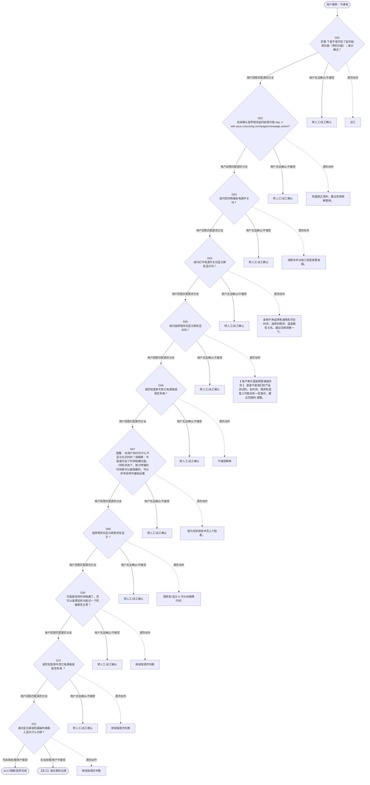

# BSH 烤箱 — 不通电 诊断手册

**故障编号**：F02 | **节点前缀**：NP | **来源**：PPT Slides 3-8
**适用诊断码**：`A11000000000` / `111100000000` / `C31000000000` / `17F000000000` / `130000000000` / `17E000000000`
**转换状态**：自动批处理草案，需按源 PPT 视觉关系复核后生产使用

---

## 一、文档使用说明

### 三条执行铁律

1. **不越界**：只执行本文件定义的诊断步骤；遇到超出范围的问题，执行越界协议（见第三节），不得自行延伸
2. **不编造**：话术原文不得改写、补充或省略；不在本文件中的诊断码不得使用
3. **不跳步**：严格按 D 步骤顺序执行，不得跳过中间步骤直接给出结论

### 执行约定标记表

| 标记 | 含义 |
|------|------|
| `【话术】` | 逐字朗读给用户的诊断引导话术 |
| `【判断】` | 根据用户回答或系统数据触发的条件分支 |
| `【诊断码】` | BSH 标准诊断码 |
| `【派工】` | 安排工程师上门 |
| `【配件】` | 预判所需配件 |
| `【视频】` | 视频辅助标记 |
| `【引用】` | 跨故障树引用跳转 |
| `【解释】` | 向用户解释原理/现象 |
| `【操作指导】` | 指导用户自行操作 |
| `▶` | 无条件进入下一步 |

---

## 二、故障诊断导航树

### Mermaid 源码



### 诊断步骤 ↔ 节点速查表

| 步骤 | 节点 ID | 节点类型 | 简述 |
| --- | --- | --- | --- |
| 入口 | NP_START | 起始 | 用户报修：不通电 |
| D01 | NP_D01 | 判断 | NP_D02 / NP_MANUAL01 |
| D02 | NP_D02 | 判断 | NP_D03 / NP_MANUAL02 |
| D03 | NP_D03 | 判断 | NP_D04 / NP_MANUAL03 |
| D04 | NP_D04 | 判断 | NP_D05 / NP_MANUAL04 |
| D05 | NP_D05 | 判断 | NP_D06 / NP_MANUAL05 |
| D06 | NP_D06 | 判断 | NP_D07 / NP_MANUAL06 |
| D07 | NP_D07 | 判断 | NP_D08 / NP_MANUAL07 |
| D08 | NP_D08 | 判断 | NP_D09 / NP_MANUAL08 |
| D09 | NP_D09 | 判断 | NP_D10 / NP_MANUAL09 |
| D10 | NP_D10 | 判断 | NP_D11 / NP_MANUAL10 |
| D11 | NP_D11 | 判断 | NP_ACC / NP_DISPATCH |
| 结束-ACC | NP_ACC | 结束 | 用户接受/观察/指导完成 |
| 结束-派工 | NP_DISPATCH | 派工 | 无法处理或用户不接受 |

---

## 三、越界处理协议

### 触发条件（满足以下任意一条即触发越界）

| # | 触发场景 |
|---|---------|
| 1 | 用户故障描述无法映射到当前诊断树的任何入口分支 |
| 2 | 用户回答无法映射到当前 D 步骤的任何条件行 |
| 3 | 目标跳转节点在 Mermaid 图中无有效连线或仍需视觉确认 |
| 4 | 用户要求提供本文档未包含的信息，如价格、保修政策、投诉升级 |
| 5 | 用户描述涉及焦味、冒烟、漏电、跳闸、进水等安全风险 |
| 6 | 用户要求自行拆机、维修、改线或更换内部零部件 |

### 退出动作

- 若属于其他故障树：执行 `【引用】` 跳转或回到索引重新分流
- 若无法定位：转人工客服
- 若存在安全风险：停止在线指导并安排工程师或人工处理

### 严禁行为

- 严禁自行判断主板、电源板、电机、压缩机等内部零部件级故障
- 严禁改写源 PPT 话术作为确定结论
- 严禁在用户尚未回答当前问题时跳至下一步

### 覆盖范围

本故障树仅覆盖 `不通电` 相关诊断。其他故障现象应回到 `OVEN2` 索引重新分流。

---

## 四、诊断入口

### 故障主诉确认

- 用户描述与 `不通电` 相关。
- 命中索引关键词：不通电, 通电, 不加热, A1100, 加热, 通电不加热。
- 来源页：Slides 3-8。

### 入口分支判断

```
用户报修“不通电”
│
├── 主诉匹配当前树 → 进入 D01
├── 主诉属于其他故障 → 回到索引执行跨树引用
└── 主诉不明确 → 先追问具体显示/部位/现象
```

---

## 五、诊断步骤详情

### D01 — 您看 下是不是开启了延时结束功能（预约功能） / 演示模式？

**[节点：NP_D01]**

**【话术】**：
> "您看 下是不是开启了延时结束功能（预约功能） / 演示模式？"

**判断表**：

| 条件 | 下一步 | 出口类型 | Mermaid 边验证 |
| --- | --- | --- | --- |
| 用户回答匹配源页下一分支 | D02 | 继续诊断 | NP_D01 → D02（自动草案，待视觉确认） |
| 用户接受解释/操作/观察 | 结束 | ACC | NP_D01 → ACC（待视觉确认） |
| 用户不接受 / 无法操作 / 风险场景 | 派工或转人工 | 派工 | NP_D01 → DISPATCH（待视觉确认） |
| **兜底越界**：其他无法识别的输入 | 越界协议 | 越界 | 无对应 Mermaid 边 |


### D02 — 在线确认指导取消延时结束功能 http :// wiki.asc

**[节点：NP_D02]**

**【话术】**：
> "在线确认指导取消延时结束功能 http :// wiki.asce.corp.bshg.com/pages/viewpage.action?pageId=118030825"

**判断表**：

| 条件 | 下一步 | 出口类型 | Mermaid 边验证 |
| --- | --- | --- | --- |
| 用户回答匹配源页下一分支 | D03 | 继续诊断 | NP_D02 → D03（自动草案，待视觉确认） |
| 用户接受解释/操作/观察 | 结束 | ACC | NP_D02 → ACC（待视觉确认） |
| 用户不接受 / 无法操作 / 风险场景 | 派工或转人工 | 派工 | NP_D02 → DISPATCH（待视觉确认） |
| **兜底越界**：其他无法识别的输入 | 越界协议 | 越界 | 无对应 Mermaid 边 |


### D03 — 请问您的烤箱有电源开关吗？

**[节点：NP_D03]**

**【话术】**：
> "请问您的烤箱有电源开关吗？"

**判断表**：

| 条件 | 下一步 | 出口类型 | Mermaid 边验证 |
| --- | --- | --- | --- |
| 用户回答匹配源页下一分支 | D04 | 继续诊断 | NP_D03 → D04（自动草案，待视觉确认） |
| 用户接受解释/操作/观察 | 结束 | ACC | NP_D03 → ACC（待视觉确认） |
| 用户不接受 / 无法操作 / 风险场景 | 派工或转人工 | 派工 | NP_D03 → DISPATCH（待视觉确认） |
| **兜底越界**：其他无法识别的输入 | 越界协议 | 越界 | 无对应 Mermaid 边 |


### D04 — 请问打开电源开关后显示屏有显示吗？

**[节点：NP_D04]**

**【话术】**：
> "请问打开电源开关后显示屏有显示吗？"

**判断表**：

| 条件 | 下一步 | 出口类型 | Mermaid 边验证 |
| --- | --- | --- | --- |
| 用户回答匹配源页下一分支 | D05 | 继续诊断 | NP_D04 → D05（自动草案，待视觉确认） |
| 用户接受解释/操作/观察 | 结束 | ACC | NP_D04 → ACC（待视觉确认） |
| 用户不接受 / 无法操作 / 风险场景 | 派工或转人工 | 派工 | NP_D04 → DISPATCH（待视觉确认） |
| **兜底越界**：其他无法识别的输入 | 越界协议 | 越界 | 无对应 Mermaid 边 |


### D05 — 请问选择程序后显示屏有显示吗？

**[节点：NP_D05]**

**【话术】**：
> "请问选择程序后显示屏有显示吗？"

**判断表**：

| 条件 | 下一步 | 出口类型 | Mermaid 边验证 |
| --- | --- | --- | --- |
| 用户回答匹配源页下一分支 | D06 | 继续诊断 | NP_D05 → D06（自动草案，待视觉确认） |
| 用户接受解释/操作/观察 | 结束 | ACC | NP_D05 → ACC（待视觉确认） |
| 用户不接受 / 无法操作 / 风险场景 | 派工或转人工 | 派工 | NP_D05 → DISPATCH（待视觉确认） |
| **兜底越界**：其他无法识别的输入 | 越界协议 | 越界 | 无对应 Mermaid 边 |


### D06 — 请您检查家中其它电源插座是否有电？

**[节点：NP_D06]**

**【话术】**：
> "请您检查家中其它电源插座是否有电？"

**判断表**：

| 条件 | 下一步 | 出口类型 | Mermaid 边验证 |
| --- | --- | --- | --- |
| 用户回答匹配源页下一分支 | D07 | 继续诊断 | NP_D06 → D07（自动草案，待视觉确认） |
| 用户接受解释/操作/观察 | 结束 | ACC | NP_D06 → ACC（待视觉确认） |
| 用户不接受 / 无法操作 / 风险场景 | 派工或转人工 | 派工 | NP_D06 → DISPATCH（待视觉确认） |
| **兜底越界**：其他无法识别的输入 | 越界协议 | 越界 | 无对应 Mermaid 边 |


### D07 — 提醒： 如用户询问为什么不显示北京时间？请解释：可能是开启了时钟

**[节点：NP_D07]**

**【话术】**：
> "提醒： 如用户询问为什么不显示北京时间？请解释：可能是开启了时钟隐藏功能。（待机状态下，部分烤箱的时钟是可以被隐藏的，可以参考说明书基础设置章节进行设置。 ）"

**判断表**：

| 条件 | 下一步 | 出口类型 | Mermaid 边验证 |
| --- | --- | --- | --- |
| 用户回答匹配源页下一分支 | D08 | 继续诊断 | NP_D07 → D08（自动草案，待视觉确认） |
| 用户接受解释/操作/观察 | 结束 | ACC | NP_D07 → ACC（待视觉确认） |
| 用户不接受 / 无法操作 / 风险场景 | 派工或转人工 | 派工 | NP_D07 → DISPATCH（待视觉确认） |
| **兜底越界**：其他无法识别的输入 | 越界协议 | 越界 | 无对应 Mermaid 边 |


### D08 — 选择程序后显示屏是否有显示？

**[节点：NP_D08]**

**【话术】**：
> "选择程序后显示屏是否有显示？"

**判断表**：

| 条件 | 下一步 | 出口类型 | Mermaid 边验证 |
| --- | --- | --- | --- |
| 用户回答匹配源页下一分支 | D09 | 继续诊断 | NP_D08 → D09（自动草案，待视觉确认） |
| 用户接受解释/操作/观察 | 结束 | ACC | NP_D08 → ACC（待视觉确认） |
| 用户不接受 / 无法操作 / 风险场景 | 派工或转人工 | 派工 | NP_D08 → DISPATCH（待视觉确认） |
| **兜底越界**：其他无法识别的输入 | 越界协议 | 越界 | 无对应 Mermaid 边 |


### D09 — 可能是您将时钟隐藏了，您可以选择加热功能试一下机器是否正常？

**[节点：NP_D09]**

**【话术】**：
> "可能是您将时钟隐藏了，您可以选择加热功能试一下机器是否正常？"

**判断表**：

| 条件 | 下一步 | 出口类型 | Mermaid 边验证 |
| --- | --- | --- | --- |
| 用户回答匹配源页下一分支 | D10 | 继续诊断 | NP_D09 → D10（自动草案，待视觉确认） |
| 用户接受解释/操作/观察 | 结束 | ACC | NP_D09 → ACC（待视觉确认） |
| 用户不接受 / 无法操作 / 风险场景 | 派工或转人工 | 派工 | NP_D09 → DISPATCH（待视觉确认） |
| **兜底越界**：其他无法识别的输入 | 越界协议 | 越界 | 无对应 Mermaid 边 |


### D10 — 请您检查家中其它电源插座是否有电 ？

**[节点：NP_D10]**

**【话术】**：
> "请您检查家中其它电源插座是否有电 ？"

**判断表**：

| 条件 | 下一步 | 出口类型 | Mermaid 边验证 |
| --- | --- | --- | --- |
| 用户回答匹配源页下一分支 | D11 | 继续诊断 | NP_D10 → D11（自动草案，待视觉确认） |
| 用户接受解释/操作/观察 | 结束 | ACC | NP_D10 → ACC（待视觉确认） |
| 用户不接受 / 无法操作 / 风险场景 | 派工或转人工 | 派工 | NP_D10 → DISPATCH（待视觉确认） |
| **兜底越界**：其他无法识别的输入 | 越界协议 | 越界 | 无对应 Mermaid 边 |


### D11 — 请问显示屏或机器操作面板上显示什么内容？

**[节点：NP_D11]**

**【话术】**：
> "请问显示屏或机器操作面板上显示什么内容？"

**判断表**：

| 条件 | 下一步 | 出口类型 | Mermaid 边验证 |
| --- | --- | --- | --- |
| 用户回答匹配源页下一分支 | ACC / 派工 | 继续诊断 | NP_D11 → ACC / 派工（自动草案，待视觉确认） |
| 用户接受解释/操作/观察 | 结束 | ACC | NP_D11 → ACC（待视觉确认） |
| 用户不接受 / 无法操作 / 风险场景 | 派工或转人工 | 派工 | NP_D11 → DISPATCH（待视觉确认） |
| **兜底越界**：其他无法识别的输入 | 越界协议 | 越界 | 无对应 Mermaid 边 |


### 源页动作/结果摘录

- 派工
- 机器是正常的，建议您再观察使用。
- 请联系专业电工检查家里电路。
- 食物不熟或烤焦通常和烹饪时间、选择的程序、温度都有关系。建议您再观察一下。
- 【 用户表示是按照菜谱操作的 】 菜谱不是我们的产品测试的，在时间、程序和温度上可能会有一些差异，建议您随时 调整。
- 不接受解释
- 我为您安排技术员上门检查。
- 跳转到“显示 E 开头的故障代码”

---

## 附录 A：诊断码汇总表

| 诊断码 | 描述 | 触发步骤 | 备注 |
| --- | --- | --- | --- |
| `A11000000000` | 见源 PPT 相邻文本 | 源页派工/判断节点 | 自动抽取，待人工核对英文/中文描述 |
| `111100000000` | 见源 PPT 相邻文本 | 源页派工/判断节点 | 自动抽取，待人工核对英文/中文描述 |
| `C31000000000` | 见源 PPT 相邻文本 | 源页派工/判断节点 | 自动抽取，待人工核对英文/中文描述 |
| `17F000000000` | 见源 PPT 相邻文本 | 源页派工/判断节点 | 自动抽取，待人工核对英文/中文描述 |
| `130000000000` | 见源 PPT 相邻文本 | 源页派工/判断节点 | 自动抽取，待人工核对英文/中文描述 |
| `17E000000000` | 见源 PPT 相邻文本 | 源页派工/判断节点 | 自动抽取，待人工核对英文/中文描述 |

---

## 附录 B：配件建议汇总表

| 配件名称 | 关联步骤 | 说明 |
| --- | --- | --- |
| 源页未明确 | 派工出口 | 按源 PPT 派工节点记录，待视觉确认 |

---

## 附录 C：跨故障树引用清单

| 引用方向 | 触发条件 | 目标文件 | 目标诊断码 |
| --- | --- | --- | --- |
| 本树 → 到“显示 | 源页出现跳转提示 | 待索引映射 | — |

---

## 附录 D：源页文本摘录（用于复核）

- Internal
- 通电 不加热
- A11000000000 No heating / Water too cold 不 加热
- 通电不加热
- 您看 下是不是开启了延时结束功能（预约功能） / 演示模式？
- 不通电
- 显示代码 / 图标
- 未开启延时结束 / 演示模式
- 开启了延时结束 /
- 时钟 / 北京时间无 显示
- 取消延时结束功能即可工作。
- 演示模式
- 取消演示模式。
- 食物不熟 / 过火 / 烤焦
- 派工
- C14000X 99000 No heating on any heating zone 任何 加热区都不加热
- 按键无反应
- 在线确认指导取消延时结束功能 http :// wiki.asce.corp.bshg.com/pages/viewpage.action?pageId=118030825
- 在线确认指导 取消演示模式 新型 蒸、烤箱 ( IC6) 演示模式操作指南 - 呼叫中心知识库 - Confluence (bshg.com)
- Page 2
- 烤箱故障树
- 111100000000 No Power (display or illumination does not work) 不通电
- 请问您的烤箱有电源开关吗？
- 没有电源开关
- 有电源开关
- 请问打开电源开关后显示屏有显示吗？
- 请问选择程序后显示屏有显示吗？
- 显示屏 没有 显示
- 显示屏没有显示
- 显示屏有 显示
- 显示屏有显示
- 请您检查家中其它电源插座是否有电？
- 机器是正常的，建议您再观察使用。
- 提醒： 如用户询问为什么不显示北京时间？请解释：可能是开启了时钟隐藏功能。（待机状态下，部分烤箱的时钟是可以被隐藏的，可以参考说明书基础设置章节进行设置。 ）
- 插座没有电
- 插座有电
- 请联系专业电工检查家里电路。
- C1X 300000000 Oven power supply available/no start function 烤箱 电源可用/无启动功能
- Page 3
- 时钟 / 北京时间无显示
- 选择程序后显示屏是否有显示？
- 可能是您将时钟隐藏了，您可以选择加热功能试一下机器是否正常？
- 请您检查家中其它电源插座是否有电 ？
- 加热功能不正常
- 插座有 电
- 加热功能正常
- 插座没有 电
- 待机状态下，部分烤箱的时钟是可以被隐藏的，您可以参考说明书基础设置章节进行设置。
- Page 5
- C31000000000 Uneven heating / baking result inadequate 加热 / 烘烤不均匀导致不充分
- 食物不熟或烤焦通常和烹饪时间、选择的程序、温度都有关系。建议您再观察一下。
- 【 用户表示是按照菜谱操作的 】 菜谱不是我们的产品测试的，在时间、程序和温度上可能会有一些差异，建议您随时 调整。
- 不接受解释
- 我为您安排技术员上门检查。
- Page 6
- 17F000000000 No button function 无 按钮功能
- 口径：您看面板上 的 钥匙 图标 是不是亮着的，如果是的话， 我指导您 解除童锁就可以了。
- 提醒： 部分型号，关机时童锁不亮，可以按下电源键确认是否开启了童锁 。 提醒： 烤箱解除童锁
- 不是童锁问题
- Page 7
- 130000000000 Display, audible signal problem 显示屏 / 有声音的信号问题
- 请问显示屏或机器操作面板上显示什么内容？
- 时钟图标和 4 个零点亮
- E011
- CXX
- 其它显示
- 这是童锁功能被打开了，您可以长按童锁键解锁。
- 这是高温自清洁锁，高温自清洁运行时显示，自清洁结束且温度降到安全范围后熄灭。
- 可能是您长时间按住按键或按键被卡住导致。
- 断电后重新通电，需要设置北京时间。
- 可能是您误操作进入了“基本设置”模式 ( 如图 ) 。
- 跳转到“显示 E 开头的故障代码”
- 17E000000000 错误代码 / 错误显示 / 信号
- 操作： 断电后重新通电使用。
- 提醒： 不同型号进入 / 退出基本设置的操作方法不同，请参考说明书。
- Page 4
