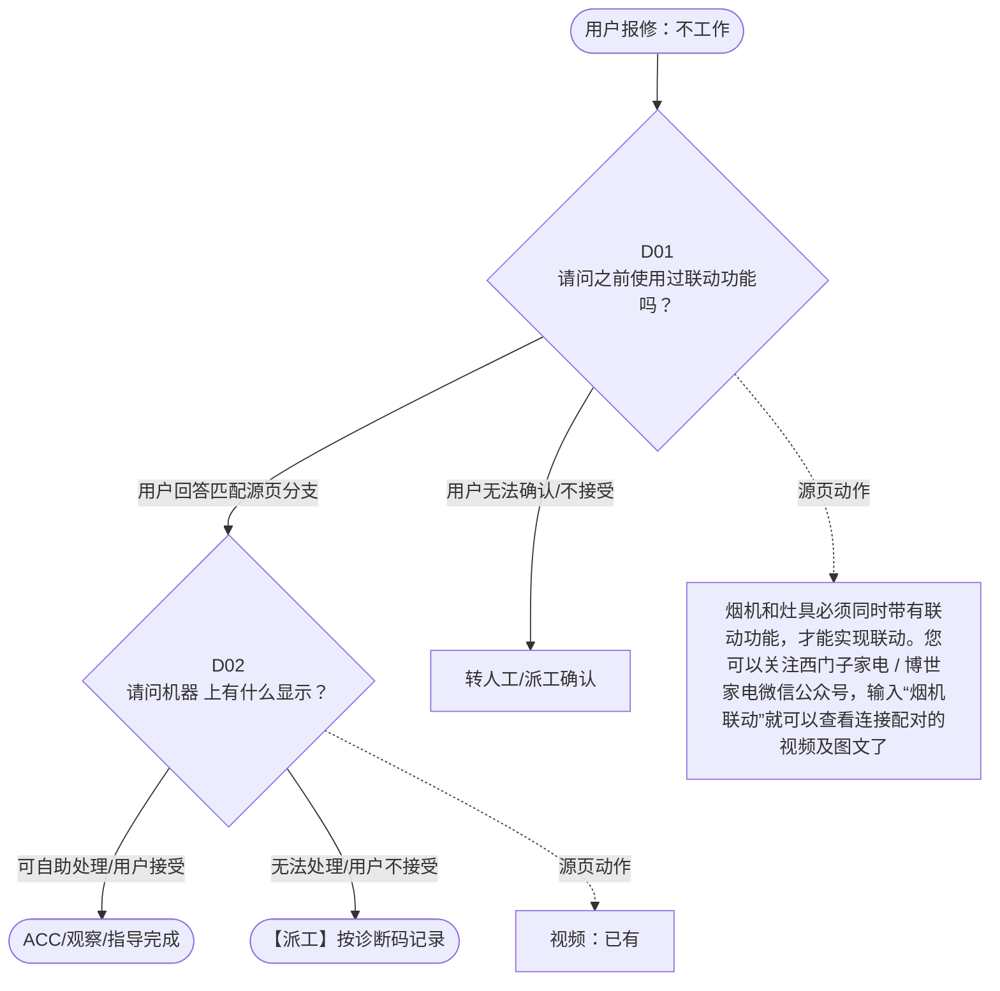

# BSH 吸油烟机 — 不工作 诊断手册

**故障编号**：F07 | **节点前缀**：NWK3 | **来源**：PPT Slides 11-14
**适用诊断码**：`11A2Z4000000`
**转换状态**：自动批处理草案，需按源 PPT 视觉关系复核后生产使用

---

## 一、文档使用说明

### 三条执行铁律

1. **不越界**：只执行本文件定义的诊断步骤；遇到超出范围的问题，执行越界协议（见第三节），不得自行延伸
2. **不编造**：话术原文不得改写、补充或省略；不在本文件中的诊断码不得使用
3. **不跳步**：严格按 D 步骤顺序执行，不得跳过中间步骤直接给出结论

### 执行约定标记表

| 标记 | 含义 |
|------|------|
| `【话术】` | 逐字朗读给用户的诊断引导话术 |
| `【判断】` | 根据用户回答或系统数据触发的条件分支 |
| `【诊断码】` | BSH 标准诊断码 |
| `【派工】` | 安排工程师上门 |
| `【配件】` | 预判所需配件 |
| `【视频】` | 视频辅助标记 |
| `【引用】` | 跨故障树引用跳转 |
| `【解释】` | 向用户解释原理/现象 |
| `【操作指导】` | 指导用户自行操作 |
| `▶` | 无条件进入下一步 |

---

## 二、故障诊断导航树

### Mermaid 源码



### 诊断步骤 ↔ 节点速查表

| 步骤 | 节点 ID | 节点类型 | 简述 |
| --- | --- | --- | --- |
| 入口 | NWK3_START | 起始 | 用户报修：不工作 |
| D01 | NWK3_D01 | 判断 | NWK3_D02 / NWK3_MANUAL01 |
| D02 | NWK3_D02 | 判断 | NWK3_ACC / NWK3_DISPATCH |
| 结束-ACC | NWK3_ACC | 结束 | 用户接受/观察/指导完成 |
| 结束-派工 | NWK3_DISPATCH | 派工 | 无法处理或用户不接受 |

---

## 三、越界处理协议

### 触发条件（满足以下任意一条即触发越界）

| # | 触发场景 |
|---|---------|
| 1 | 用户故障描述无法映射到当前诊断树的任何入口分支 |
| 2 | 用户回答无法映射到当前 D 步骤的任何条件行 |
| 3 | 目标跳转节点在 Mermaid 图中无有效连线或仍需视觉确认 |
| 4 | 用户要求提供本文档未包含的信息，如价格、保修政策、投诉升级 |
| 5 | 用户描述涉及焦味、冒烟、漏电、跳闸、进水等安全风险 |
| 6 | 用户要求自行拆机、维修、改线或更换内部零部件 |

### 退出动作

- 若属于其他故障树：执行 `【引用】` 跳转或回到索引重新分流
- 若无法定位：转人工客服
- 若存在安全风险：停止在线指导并安排工程师或人工处理

### 严禁行为

- 严禁自行判断主板、电源板、电机、压缩机等内部零部件级故障
- 严禁改写源 PPT 话术作为确定结论
- 严禁在用户尚未回答当前问题时跳至下一步

### 覆盖范围

本故障树仅覆盖 `不工作` 相关诊断。其他故障现象应回到 `RH2` 索引重新分流。

---

## 四、诊断入口

### 故障主诉确认

- 用户描述与 `不工作` 相关。
- 命中索引关键词：不工作, A2, Z4000, 不联动, 无法联动, 联动异常。
- 来源页：Slides 11-14。

### 入口分支判断

```
用户报修“不工作”
│
├── 主诉匹配当前树 → 进入 D01
├── 主诉属于其他故障 → 回到索引执行跨树引用
└── 主诉不明确 → 先追问具体显示/部位/现象
```

---

## 五、诊断步骤详情

### D01 — 请问之前使用过联动功能吗？

**[节点：NWK3_D01]**

**【话术】**：
> "请问之前使用过联动功能吗？"

**判断表**：

| 条件 | 下一步 | 出口类型 | Mermaid 边验证 |
| --- | --- | --- | --- |
| 用户回答匹配源页下一分支 | D02 | 继续诊断 | NWK3_D01 → D02（自动草案，待视觉确认） |
| 用户接受解释/操作/观察 | 结束 | ACC | NWK3_D01 → ACC（待视觉确认） |
| 用户不接受 / 无法操作 / 风险场景 | 派工或转人工 | 派工 | NWK3_D01 → DISPATCH（待视觉确认） |
| **兜底越界**：其他无法识别的输入 | 越界协议 | 越界 | 无对应 Mermaid 边 |


### D02 — 请问机器 上有什么显示？

**[节点：NWK3_D02]**

**【话术】**：
> "请问机器 上有什么显示？"

**判断表**：

| 条件 | 下一步 | 出口类型 | Mermaid 边验证 |
| --- | --- | --- | --- |
| 用户回答匹配源页下一分支 | ACC / 派工 | 继续诊断 | NWK3_D02 → ACC / 派工（自动草案，待视觉确认） |
| 用户接受解释/操作/观察 | 结束 | ACC | NWK3_D02 → ACC（待视觉确认） |
| 用户不接受 / 无法操作 / 风险场景 | 派工或转人工 | 派工 | NWK3_D02 → DISPATCH（待视觉确认） |
| **兜底越界**：其他无法识别的输入 | 越界协议 | 越界 | 无对应 Mermaid 边 |


### 源页动作/结果摘录

- 烟机和灶具必须同时带有联动功能，才能实现联动。您可以关注西门子家电 / 博世家电微信公众号，输入“烟机联动”就可以查看连接配对的视频及图文了。
- 视频：已有
- 我为您安排技术人员上门检查。
- 视频：无需
- 请您不用担心，烟机刚刚开启就立刻关机的情况下，会导致导烟板不能完全关闭，建议您重新开机使用使用 3 分钟以上再关闭，观察效果。

---

## 附录 A：诊断码汇总表

| 诊断码 | 描述 | 触发步骤 | 备注 |
| --- | --- | --- | --- |
| `11A2Z4000000` | 见源 PPT 相邻文本 | 源页派工/判断节点 | 自动抽取，待人工核对英文/中文描述 |

---

## 附录 B：配件建议汇总表

| 配件名称 | 关联步骤 | 说明 |
| --- | --- | --- |
| 源页未明确 | 派工出口 | 按源 PPT 派工节点记录，待视觉确认 |

---

## 附录 C：跨故障树引用清单

| 引用方向 | 触发条件 | 目标文件 | 目标诊断码 |
| --- | --- | --- | --- |
| 无明确跨树引用 | — | — | — |

---

## 附录 D：源页文本摘录（用于复核）

- 11A2Z4000000 Does not start via remote control, manually start possible 不联动
- 无法联动 / 联动异常
- 吸力不足
- 请问之前使用过联动功能吗？
- 声音问题
- 使用过
- 未使用过
- 不工作
- 请 您重新建立联动后再尝试。 我可以在线为您提供指导，您也可以参考灶具说明书建立联动。
- 烟机和灶具必须同时带有联动功能，才能实现联动。您可以关注西门子家电 / 博世家电微信公众号，输入“烟机联动”就可以查看连接配对的视频及图文了。
- 油烟倒灌
- 漏油
- 显示异常
- 用户要求在线指导
- 视频：已有
- 照明灯异常
- 按键无反应
- 无法联动
- 自动开启
- 其他问题
- A 28800000000 Program starts automatically 程序 自动启动
- 请问机器 上有什么显示？
- 2024.11.5 删除
- 显示自清洁图标
- 未显示自清洁图标或或自动通风图标
- 请您按下关机键或者自动通风键可以取消自动通风。
- 请您长按自清洁图标 3 秒可以退出，如果无法退出，请再次长按 3 秒，即可退出。
- 我为您安排技术人员上门检查。
- 视频：无需
- 【 自清洁功能 】 机器内部加热元件的工作，最后几分钟风机启动将油脂甩到油杯中。
- 【 自动通风 】 机器以小档位的风速每小时运行 5 分钟，停止 55 分钟，然后继续工作 5 分钟，再停止，以此循环工作。
- 显示自动通风图标
- 清洁玻璃面板内外侧 排查零地线是否有大于 10V 的电压 用风枪烘干水分
- 智能模式无反应、不能自动调节风量
- 出厂时烟雾感应装置敏感度设置在 1 档，您可以调节到 4 档再试一下。 调节方法：烟机关闭时，长按“智能模式”按键，此时屏幕中出现数字，然后按风量键调整即可。
- 导烟板不能完全闭合
- 导烟板不能完全闭合、不能关闭到初始位置
- 请您不用担心，烟机刚刚开启就立刻关机的情况下，会导致导烟板不能完全关闭，建议您重新开机使用使用 3 分钟以上再关闭，观察效果。
