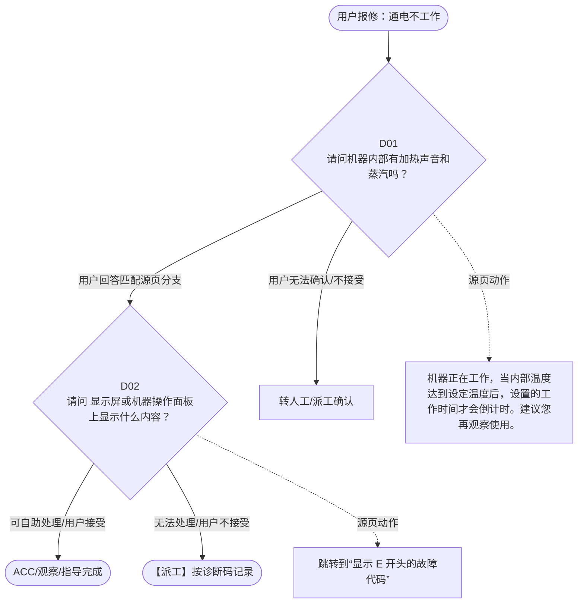

# BSH 蒸箱 — 通电不工作 诊断手册

**故障编号**：F02 | **节点前缀**：NS | **来源**：PPT Slides 3-4
**适用诊断码**：`130000000000` / `17E000000Y06` / `17E00000000C` / `17E000000Y39` / `17E000000Y29` / `17E000000000` / `17E0000000F8` / `17E000000E11`
**转换状态**：自动批处理草案，需按源 PPT 视觉关系复核后生产使用

---

## 一、文档使用说明

### 三条执行铁律

1. **不越界**：只执行本文件定义的诊断步骤；遇到超出范围的问题，执行越界协议（见第三节），不得自行延伸
2. **不编造**：话术原文不得改写、补充或省略；不在本文件中的诊断码不得使用
3. **不跳步**：严格按 D 步骤顺序执行，不得跳过中间步骤直接给出结论

### 执行约定标记表

| 标记 | 含义 |
|------|------|
| `【话术】` | 逐字朗读给用户的诊断引导话术 |
| `【判断】` | 根据用户回答或系统数据触发的条件分支 |
| `【诊断码】` | BSH 标准诊断码 |
| `【派工】` | 安排工程师上门 |
| `【配件】` | 预判所需配件 |
| `【视频】` | 视频辅助标记 |
| `【引用】` | 跨故障树引用跳转 |
| `【解释】` | 向用户解释原理/现象 |
| `【操作指导】` | 指导用户自行操作 |
| `▶` | 无条件进入下一步 |

---

## 二、故障诊断导航树

### Mermaid 源码



### 诊断步骤 ↔ 节点速查表

| 步骤 | 节点 ID | 节点类型 | 简述 |
| --- | --- | --- | --- |
| 入口 | NS_START | 起始 | 用户报修：通电不工作 |
| D01 | NS_D01 | 判断 | NS_D02 / NS_MANUAL01 |
| D02 | NS_D02 | 判断 | NS_ACC / NS_DISPATCH |
| 结束-ACC | NS_ACC | 结束 | 用户接受/观察/指导完成 |
| 结束-派工 | NS_DISPATCH | 派工 | 无法处理或用户不接受 |

---

## 三、越界处理协议

### 触发条件（满足以下任意一条即触发越界）

| # | 触发场景 |
|---|---------|
| 1 | 用户故障描述无法映射到当前诊断树的任何入口分支 |
| 2 | 用户回答无法映射到当前 D 步骤的任何条件行 |
| 3 | 目标跳转节点在 Mermaid 图中无有效连线或仍需视觉确认 |
| 4 | 用户要求提供本文档未包含的信息，如价格、保修政策、投诉升级 |
| 5 | 用户描述涉及焦味、冒烟、漏电、跳闸、进水等安全风险 |
| 6 | 用户要求自行拆机、维修、改线或更换内部零部件 |

### 退出动作

- 若属于其他故障树：执行 `【引用】` 跳转或回到索引重新分流
- 若无法定位：转人工客服
- 若存在安全风险：停止在线指导并安排工程师或人工处理

### 严禁行为

- 严禁自行判断主板、电源板、电机、压缩机等内部零部件级故障
- 严禁改写源 PPT 话术作为确定结论
- 严禁在用户尚未回答当前问题时跳至下一步

### 覆盖范围

本故障树仅覆盖 `通电不工作` 相关诊断。其他故障现象应回到 `STM2` 索引重新分流。

---

## 四、诊断入口

### 故障主诉确认

- 用户描述与 `通电不工作` 相关。
- 命中索引关键词：通电不工作, 通电但不启动, 不通电, 请问机器内部有加, 热声音和蒸汽吗, 显示代码。
- 来源页：Slides 3-4。

### 入口分支判断

```
用户报修“通电不工作”
│
├── 主诉匹配当前树 → 进入 D01
├── 主诉属于其他故障 → 回到索引执行跨树引用
└── 主诉不明确 → 先追问具体显示/部位/现象
```

---

## 五、诊断步骤详情

### D01 — 请问机器内部有加热声音和蒸汽吗？

**[节点：NS_D01]**

**【话术】**：
> "请问机器内部有加热声音和蒸汽吗？"

**判断表**：

| 条件 | 下一步 | 出口类型 | Mermaid 边验证 |
| --- | --- | --- | --- |
| 用户回答匹配源页下一分支 | D02 | 继续诊断 | NS_D01 → D02（自动草案，待视觉确认） |
| 用户接受解释/操作/观察 | 结束 | ACC | NS_D01 → ACC（待视觉确认） |
| 用户不接受 / 无法操作 / 风险场景 | 派工或转人工 | 派工 | NS_D01 → DISPATCH（待视觉确认） |
| **兜底越界**：其他无法识别的输入 | 越界协议 | 越界 | 无对应 Mermaid 边 |


### D02 — 请问 显示屏或机器操作面板上显示什么内容？

**[节点：NS_D02]**

**【话术】**：
> "请问 显示屏或机器操作面板上显示什么内容？"

**判断表**：

| 条件 | 下一步 | 出口类型 | Mermaid 边验证 |
| --- | --- | --- | --- |
| 用户回答匹配源页下一分支 | ACC / 派工 | 继续诊断 | NS_D02 → ACC / 派工（自动草案，待视觉确认） |
| 用户接受解释/操作/观察 | 结束 | ACC | NS_D02 → ACC（待视觉确认） |
| 用户不接受 / 无法操作 / 风险场景 | 派工或转人工 | 派工 | NS_D02 → DISPATCH（待视觉确认） |
| **兜底越界**：其他无法识别的输入 | 越界协议 | 越界 | 无对应 Mermaid 边 |


### 源页动作/结果摘录

- 机器正在工作，当内部温度达到设定温度后，设置的工作时间才会倒计时。建议您再观察使用。
- 跳转到“显示 E 开头的故障代码”
- 视频 : 无需
- 机器需要设置北京时间后才能工作。建议您设置后再观察。
- 可能是长时间按住按键或按键被卡住，建议您断电后重新通电。
- 视频：无需
- 视频 : 视频 1- 无
- 提醒： 如 提醒除垢或除垢未完 成，机器无法工作。建议 完成除垢程序 。

---

## 附录 A：诊断码汇总表

| 诊断码 | 描述 | 触发步骤 | 备注 |
| --- | --- | --- | --- |
| `130000000000` | 见源 PPT 相邻文本 | 源页派工/判断节点 | 自动抽取，待人工核对英文/中文描述 |
| `17E000000Y06` | 见源 PPT 相邻文本 | 源页派工/判断节点 | 自动抽取，待人工核对英文/中文描述 |
| `17E00000000C` | 见源 PPT 相邻文本 | 源页派工/判断节点 | 自动抽取，待人工核对英文/中文描述 |
| `17E000000Y39` | 见源 PPT 相邻文本 | 源页派工/判断节点 | 自动抽取，待人工核对英文/中文描述 |
| `17E000000Y29` | 见源 PPT 相邻文本 | 源页派工/判断节点 | 自动抽取，待人工核对英文/中文描述 |
| `17E000000000` | 见源 PPT 相邻文本 | 源页派工/判断节点 | 自动抽取，待人工核对英文/中文描述 |
| `17E0000000F8` | 见源 PPT 相邻文本 | 源页派工/判断节点 | 自动抽取，待人工核对英文/中文描述 |
| `17E000000E11` | 见源 PPT 相邻文本 | 源页派工/判断节点 | 自动抽取，待人工核对英文/中文描述 |

---

## 附录 B：配件建议汇总表

| 配件名称 | 关联步骤 | 说明 |
| --- | --- | --- |
| 源页未明确 | 派工出口 | 按源 PPT 派工节点记录，待视觉确认 |

---

## 附录 C：跨故障树引用清单

| 引用方向 | 触发条件 | 目标文件 | 目标诊断码 |
| --- | --- | --- | --- |
| 本树 → 到“显示 | 源页出现跳转提示 | 待索引映射 | — |

---

## 附录 D：源页文本摘录（用于复核）

- Confidential
- 通电不工作
- 11A 200000000 Power supply available but no start function 通电但不启动
- 不通电
- 请问机器内部有加热声音和蒸汽吗？
- 显示代码 / 图标
- 底部有水 / 漏水
- 有
- 没有
- 时钟 / 北京时间 无显示
- 机器正在工作，当内部温度达到设定温度后，设置的工作时间才会倒计时。建议您再观察使用。
- 跳转到“显示 E 开头的故障代码”
- 食物不熟
- 蒸汽问题
- 按键无反应
- 视频 : 无需
- 耗 水快、蒸制时进水不止
- Page 3
- 蒸箱故障树
- Internal
- 130000000000 Display, audible signal problem 显示屏 / 有声音的信号问题
- 请问 显示屏或机器操作面板上显示什么内容？
- 除垢、 Calc 或
- E5121
- 时钟和 3 个 零点亮
- E011
- CXX
- F8
- 其它显示
- 17E000000Y06
- 17E00000000C
- 17E000000Y39
- 17E000000Y29
- 17E000000000
- 见下一页
- 这 表示开启了童锁功能，您可以长按童锁键解锁 。
- 这是指积水盒满了 , 需要清空。
- 这是机器启动了自动关断功能，按下任意按键即可取消。
- 这是提示需要进行除垢操作了，请尽快使用 BSH 的除垢片运行除垢程序。您可以按照说明书中的方法运行除垢程序
- 机器需要设置北京时间后才能工作。建议您设置后再观察。
- 可能是长时间按住按键或按键被卡住，建议您断电后重新通电。
- 可能是误操作进入了“基本设置”模式 。
- 视频：无需
- 视频 : 视频 1- 无
- 提醒 ： 不同 型号进入 / 退出基本设置的操作方法不同，请参考说明书。
- 17E0000000F8 Error: F8 / F08
- 17E000000E11 Error: E11 / F11
- 提醒： 如 提醒除垢或除垢未完 成，机器无法工作。建议 完成除垢程序 。
- Page 4
