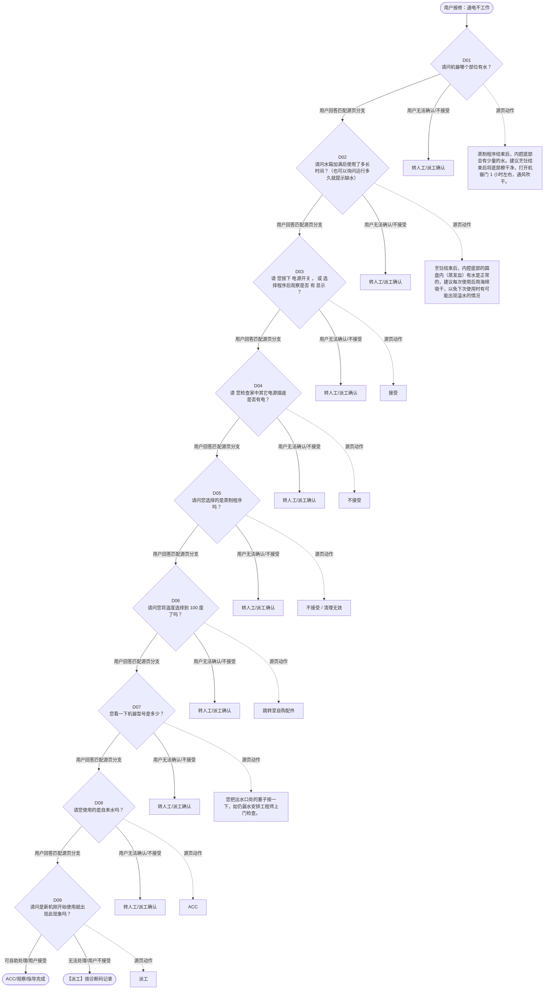

# BSH 蒸箱 — 通电不工作 诊断手册

**故障编号**：F06 | **节点前缀**：NS2 | **来源**：PPT Slides 8-13
**适用诊断码**：`A50100163000` / `A12200000000` / `A50100000000` / `1500Q4000000` / `131500000320` / `160100X01000` / `111100000000` / `13X600000000` / `C31000000000` / `A30A00000000`
**转换状态**：自动批处理草案，需按源 PPT 视觉关系复核后生产使用

---

## 一、文档使用说明

### 三条执行铁律

1. **不越界**：只执行本文件定义的诊断步骤；遇到超出范围的问题，执行越界协议（见第三节），不得自行延伸
2. **不编造**：话术原文不得改写、补充或省略；不在本文件中的诊断码不得使用
3. **不跳步**：严格按 D 步骤顺序执行，不得跳过中间步骤直接给出结论

### 执行约定标记表

| 标记 | 含义 |
|------|------|
| `【话术】` | 逐字朗读给用户的诊断引导话术 |
| `【判断】` | 根据用户回答或系统数据触发的条件分支 |
| `【诊断码】` | BSH 标准诊断码 |
| `【派工】` | 安排工程师上门 |
| `【配件】` | 预判所需配件 |
| `【视频】` | 视频辅助标记 |
| `【引用】` | 跨故障树引用跳转 |
| `【解释】` | 向用户解释原理/现象 |
| `【操作指导】` | 指导用户自行操作 |
| `▶` | 无条件进入下一步 |

---

## 二、故障诊断导航树

### Mermaid 源码



### 诊断步骤 ↔ 节点速查表

| 步骤 | 节点 ID | 节点类型 | 简述 |
| --- | --- | --- | --- |
| 入口 | NS2_START | 起始 | 用户报修：通电不工作 |
| D01 | NS2_D01 | 判断 | NS2_D02 / NS2_MANUAL01 |
| D02 | NS2_D02 | 判断 | NS2_D03 / NS2_MANUAL02 |
| D03 | NS2_D03 | 判断 | NS2_D04 / NS2_MANUAL03 |
| D04 | NS2_D04 | 判断 | NS2_D05 / NS2_MANUAL04 |
| D05 | NS2_D05 | 判断 | NS2_D06 / NS2_MANUAL05 |
| D06 | NS2_D06 | 判断 | NS2_D07 / NS2_MANUAL06 |
| D07 | NS2_D07 | 判断 | NS2_D08 / NS2_MANUAL07 |
| D08 | NS2_D08 | 判断 | NS2_D09 / NS2_MANUAL08 |
| D09 | NS2_D09 | 判断 | NS2_ACC / NS2_DISPATCH |
| 结束-ACC | NS2_ACC | 结束 | 用户接受/观察/指导完成 |
| 结束-派工 | NS2_DISPATCH | 派工 | 无法处理或用户不接受 |

---

## 三、越界处理协议

### 触发条件（满足以下任意一条即触发越界）

| # | 触发场景 |
|---|---------|
| 1 | 用户故障描述无法映射到当前诊断树的任何入口分支 |
| 2 | 用户回答无法映射到当前 D 步骤的任何条件行 |
| 3 | 目标跳转节点在 Mermaid 图中无有效连线或仍需视觉确认 |
| 4 | 用户要求提供本文档未包含的信息，如价格、保修政策、投诉升级 |
| 5 | 用户描述涉及焦味、冒烟、漏电、跳闸、进水等安全风险 |
| 6 | 用户要求自行拆机、维修、改线或更换内部零部件 |

### 退出动作

- 若属于其他故障树：执行 `【引用】` 跳转或回到索引重新分流
- 若无法定位：转人工客服
- 若存在安全风险：停止在线指导并安排工程师或人工处理

### 严禁行为

- 严禁自行判断主板、电源板、电机、压缩机等内部零部件级故障
- 严禁改写源 PPT 话术作为确定结论
- 严禁在用户尚未回答当前问题时跳至下一步

### 覆盖范围

本故障树仅覆盖 `通电不工作` 相关诊断。其他故障现象应回到 `STM2` 索引重新分流。

---

## 四、诊断入口

### 故障主诉确认

- 用户描述与 `通电不工作` 相关。
- 命中索引关键词：通电不工作, 底部有水, 漏水, A5010, 不通电, 请问机器哪个部位。
- 来源页：Slides 8-13。

### 入口分支判断

```
用户报修“通电不工作”
│
├── 主诉匹配当前树 → 进入 D01
├── 主诉属于其他故障 → 回到索引执行跨树引用
└── 主诉不明确 → 先追问具体显示/部位/现象
```

---

## 五、诊断步骤详情

### D01 — 请问机器哪个部位有水？

**[节点：NS2_D01]**

**【话术】**：
> "请问机器哪个部位有水？"

**判断表**：

| 条件 | 下一步 | 出口类型 | Mermaid 边验证 |
| --- | --- | --- | --- |
| 用户回答匹配源页下一分支 | D02 | 继续诊断 | NS2_D01 → D02（自动草案，待视觉确认） |
| 用户接受解释/操作/观察 | 结束 | ACC | NS2_D01 → ACC（待视觉确认） |
| 用户不接受 / 无法操作 / 风险场景 | 派工或转人工 | 派工 | NS2_D01 → DISPATCH（待视觉确认） |
| **兜底越界**：其他无法识别的输入 | 越界协议 | 越界 | 无对应 Mermaid 边 |


### D02 — 请问水箱加满后使用了多长时间？（也可以询问运行多久就提示缺水）

**[节点：NS2_D02]**

**【话术】**：
> "请问水箱加满后使用了多长时间？（也可以询问运行多久就提示缺水）"

**判断表**：

| 条件 | 下一步 | 出口类型 | Mermaid 边验证 |
| --- | --- | --- | --- |
| 用户回答匹配源页下一分支 | D03 | 继续诊断 | NS2_D02 → D03（自动草案，待视觉确认） |
| 用户接受解释/操作/观察 | 结束 | ACC | NS2_D02 → ACC（待视觉确认） |
| 用户不接受 / 无法操作 / 风险场景 | 派工或转人工 | 派工 | NS2_D02 → DISPATCH（待视觉确认） |
| **兜底越界**：其他无法识别的输入 | 越界协议 | 越界 | 无对应 Mermaid 边 |


### D03 — 请 您按下 电源开关 ， 或 选择程序后观察是否 有 显示 ？

**[节点：NS2_D03]**

**【话术】**：
> "请 您按下 电源开关 ， 或 选择程序后观察是否 有 显示 ？"

**判断表**：

| 条件 | 下一步 | 出口类型 | Mermaid 边验证 |
| --- | --- | --- | --- |
| 用户回答匹配源页下一分支 | D04 | 继续诊断 | NS2_D03 → D04（自动草案，待视觉确认） |
| 用户接受解释/操作/观察 | 结束 | ACC | NS2_D03 → ACC（待视觉确认） |
| 用户不接受 / 无法操作 / 风险场景 | 派工或转人工 | 派工 | NS2_D03 → DISPATCH（待视觉确认） |
| **兜底越界**：其他无法识别的输入 | 越界协议 | 越界 | 无对应 Mermaid 边 |


### D04 — 请 您检查家中其它电源插座是否有电？

**[节点：NS2_D04]**

**【话术】**：
> "请 您检查家中其它电源插座是否有电？"

**判断表**：

| 条件 | 下一步 | 出口类型 | Mermaid 边验证 |
| --- | --- | --- | --- |
| 用户回答匹配源页下一分支 | D05 | 继续诊断 | NS2_D04 → D05（自动草案，待视觉确认） |
| 用户接受解释/操作/观察 | 结束 | ACC | NS2_D04 → ACC（待视觉确认） |
| 用户不接受 / 无法操作 / 风险场景 | 派工或转人工 | 派工 | NS2_D04 → DISPATCH（待视觉确认） |
| **兜底越界**：其他无法识别的输入 | 越界协议 | 越界 | 无对应 Mermaid 边 |


### D05 — 请问您选择的是蒸制程序吗？

**[节点：NS2_D05]**

**【话术】**：
> "请问您选择的是蒸制程序吗？"

**判断表**：

| 条件 | 下一步 | 出口类型 | Mermaid 边验证 |
| --- | --- | --- | --- |
| 用户回答匹配源页下一分支 | D06 | 继续诊断 | NS2_D05 → D06（自动草案，待视觉确认） |
| 用户接受解释/操作/观察 | 结束 | ACC | NS2_D05 → ACC（待视觉确认） |
| 用户不接受 / 无法操作 / 风险场景 | 派工或转人工 | 派工 | NS2_D05 → DISPATCH（待视觉确认） |
| **兜底越界**：其他无法识别的输入 | 越界协议 | 越界 | 无对应 Mermaid 边 |


### D06 — 请问您将温度选择到 100 度了吗？

**[节点：NS2_D06]**

**【话术】**：
> "请问您将温度选择到 100 度了吗？"

**判断表**：

| 条件 | 下一步 | 出口类型 | Mermaid 边验证 |
| --- | --- | --- | --- |
| 用户回答匹配源页下一分支 | D07 | 继续诊断 | NS2_D06 → D07（自动草案，待视觉确认） |
| 用户接受解释/操作/观察 | 结束 | ACC | NS2_D06 → ACC（待视觉确认） |
| 用户不接受 / 无法操作 / 风险场景 | 派工或转人工 | 派工 | NS2_D06 → DISPATCH（待视觉确认） |
| **兜底越界**：其他无法识别的输入 | 越界协议 | 越界 | 无对应 Mermaid 边 |


### D07 — 您看一下机器型号是多少？

**[节点：NS2_D07]**

**【话术】**：
> "您看一下机器型号是多少？"

**判断表**：

| 条件 | 下一步 | 出口类型 | Mermaid 边验证 |
| --- | --- | --- | --- |
| 用户回答匹配源页下一分支 | D08 | 继续诊断 | NS2_D07 → D08（自动草案，待视觉确认） |
| 用户接受解释/操作/观察 | 结束 | ACC | NS2_D07 → ACC（待视觉确认） |
| 用户不接受 / 无法操作 / 风险场景 | 派工或转人工 | 派工 | NS2_D07 → DISPATCH（待视觉确认） |
| **兜底越界**：其他无法识别的输入 | 越界协议 | 越界 | 无对应 Mermaid 边 |


### D08 — 请您使用的是自来水吗？

**[节点：NS2_D08]**

**【话术】**：
> "请您使用的是自来水吗？"

**判断表**：

| 条件 | 下一步 | 出口类型 | Mermaid 边验证 |
| --- | --- | --- | --- |
| 用户回答匹配源页下一分支 | D09 | 继续诊断 | NS2_D08 → D09（自动草案，待视觉确认） |
| 用户接受解释/操作/观察 | 结束 | ACC | NS2_D08 → ACC（待视觉确认） |
| 用户不接受 / 无法操作 / 风险场景 | 派工或转人工 | 派工 | NS2_D08 → DISPATCH（待视觉确认） |
| **兜底越界**：其他无法识别的输入 | 越界协议 | 越界 | 无对应 Mermaid 边 |


### D09 — 请问是新机刚开始使用就出现此现象吗？

**[节点：NS2_D09]**

**【话术】**：
> "请问是新机刚开始使用就出现此现象吗？"

**判断表**：

| 条件 | 下一步 | 出口类型 | Mermaid 边验证 |
| --- | --- | --- | --- |
| 用户回答匹配源页下一分支 | ACC / 派工 | 继续诊断 | NS2_D09 → ACC / 派工（自动草案，待视觉确认） |
| 用户接受解释/操作/观察 | 结束 | ACC | NS2_D09 → ACC（待视觉确认） |
| 用户不接受 / 无法操作 / 风险场景 | 派工或转人工 | 派工 | NS2_D09 → DISPATCH（待视觉确认） |
| **兜底越界**：其他无法识别的输入 | 越界协议 | 越界 | 无对应 Mermaid 边 |


### 源页动作/结果摘录

- 蒸制程序结束后，内腔底部会有少量的水。建议烹饪结束后将底部擦干净，打开机器门 1 小时左右，通风吹干。
- 烹饪结束后，内腔底部的圆盘内（蒸发皿）有水是正常的，建议每次使用后用海绵吸干，以免下次使用时有可能出现溢水的情况
- 接受
- 不接受
- 不接受 / 清理无效
- 跳转至自购配件
- 您把出水口处的塞子按一下，如仍漏水安排工程师上门检查。
- ACC
- 派工
- 跳转 耗水快
- 您可以检查一下蒸发皿处有没有水垢，如果有的话建议先使用除垢片清除水垢，然后在使用蒸制模式试一下。
- 请 您按下 电源开关 ， 或 选择程序后观察是否 有 显示 ？
- 视频 : 无需
- 请联系专业电工检查家里电路
- 我为您安排工程师上门检查
- 食物不熟通常和蒸制的时间、选择的程序、温度都 有关系。建议 您增加蒸制时间，再观察一下。
- 【 用户表示按菜谱操作的 】 建议您按说明书中的菜谱进行操作，如仍不熟我们为您安排工程师上门。
- 用户不接受
- 我为您安排工程师上门检查。
- 建议您选择蒸制程序并将温度选到 100 度再使用观察

---

## 附录 A：诊断码汇总表

| 诊断码 | 描述 | 触发步骤 | 备注 |
| --- | --- | --- | --- |
| `A50100163000` | 见源 PPT 相邻文本 | 源页派工/判断节点 | 自动抽取，待人工核对英文/中文描述 |
| `A12200000000` | 见源 PPT 相邻文本 | 源页派工/判断节点 | 自动抽取，待人工核对英文/中文描述 |
| `A50100000000` | 见源 PPT 相邻文本 | 源页派工/判断节点 | 自动抽取，待人工核对英文/中文描述 |
| `1500Q4000000` | 见源 PPT 相邻文本 | 源页派工/判断节点 | 自动抽取，待人工核对英文/中文描述 |
| `131500000320` | 见源 PPT 相邻文本 | 源页派工/判断节点 | 自动抽取，待人工核对英文/中文描述 |
| `160100X01000` | 见源 PPT 相邻文本 | 源页派工/判断节点 | 自动抽取，待人工核对英文/中文描述 |
| `111100000000` | 见源 PPT 相邻文本 | 源页派工/判断节点 | 自动抽取，待人工核对英文/中文描述 |
| `13X600000000` | 见源 PPT 相邻文本 | 源页派工/判断节点 | 自动抽取，待人工核对英文/中文描述 |
| `C31000000000` | 见源 PPT 相邻文本 | 源页派工/判断节点 | 自动抽取，待人工核对英文/中文描述 |
| `A30A00000000` | 见源 PPT 相邻文本 | 源页派工/判断节点 | 自动抽取，待人工核对英文/中文描述 |

---

## 附录 B：配件建议汇总表

| 配件名称 | 关联步骤 | 说明 |
| --- | --- | --- |
| 源页未明确 | 派工出口 | 按源 PPT 派工节点记录，待视觉确认 |

---

## 附录 C：跨故障树引用清单

| 引用方向 | 触发条件 | 目标文件 | 目标诊断码 |
| --- | --- | --- | --- |
| 本树 → 至自购配件 | 源页出现跳转提示 | 待索引映射 | — |

---

## 附录 D：源页文本摘录（用于复核）

- 底部有水、 漏水
- A50100163000 Leak / water drops at water dispenser 漏水
- 不通电
- 通电不工作
- 请问机器哪个部位有水？
- A12200000000
- 显示代码 / 图标
- A50100000000
- 底部的圆盘内（蒸发皿内）
- 内腔 底部积水 多 （ 或开门后水溢出）
- 内腔 底部少量积水
- 水箱漏水
- 底部有水 / 漏水
- 时钟 / 北京时间 无显示
- 蒸制程序结束后，内腔底部会有少量的水。建议烹饪结束后将底部擦干净，打开机器门 1 小时左右，通风吹干。
- 烹饪结束后，内腔底部的圆盘内（蒸发皿）有水是正常的，建议每次使用后用海绵吸干，以免下次使用时有可能出现溢水的情况
- 请问水箱加满后使用了多长时间？（也可以询问运行多久就提示缺水）
- 您看一下水箱哪个位置漏水
- 食物不熟
- 水箱损坏
- 20 分钟及以上
- 出水口处
- 几分钟或十多分种
- 蒸汽问题
- 接受
- 不接受
- 不接受 / 清理无效
- 跳转至自购配件
- 您把出水口处的塞子按一下，如仍漏水安排工程师上门检查。
- 按键无反应
- ACC
- 派工
- 跳转 耗水快
- 您可以检查一下蒸发皿处有没有水垢，如果有的话建议先使用除垢片清除水垢，然后在使用蒸制模式试一下。
- A12200000000 Not draining / water in the appliance 积水
- 耗 水快、蒸制时进水不止
- 1500Q4000000 Water tank problem 水箱问题
- Internal
- 131500000320 Display dark 无显示
- 请 您按下 电源开关 ， 或 选择程序后观察是否 有 显示 ？
- 按下电源开关或选择程序后没有显示
- 按下电源开关或选择程序后有 显示
- 160100X01000
- 111100000000
- 可能是您将时钟隐藏了，您可以试一下机器是否正常
- 请 您检查家中其它电源插座是否有电？
- 视频 : 无需
- 提醒： 待机状态下，部分蒸汽炉的时钟是可以被隐藏的，您可以参考说明书基础设置章节进行设置。
- 插座有电
- 插座没有电
- 请联系专业电工检查家里电路
- 我为您安排工程师上门检查
- 13X600000000 Light / display problems 显示问题
- Page 6
- 蒸箱故障树
- C31000000000 Uneven heating / baking result inadequate 加热不均 / 烘烤效果差
- 食物不熟通常和蒸制的时间、选择的程序、温度都 有关系。建议 您增加蒸制时间，再观察一下。
- 【 用户表示按菜谱操作的 】 建议您按说明书中的菜谱进行操作，如仍不熟我们为您安排工程师上门。
- C31000000000
- 用户不接受
- 我为您安排工程师上门检查。
- Page 7
- 请问您选择的是蒸制程序吗？
- A30A00000000 Not enough steam 蒸汽不充分
- 已选择蒸制程序
- 未选择蒸制程序
- 建议您选择蒸制程序并将温度选到 100 度再使用观察
- 请问您将温度选择到 100 度了吗？
- 温度没有选择到 100 度
- 温度已选择到 100 度
- 选择蒸制程序，温度已设置为 100 度还是不产生蒸汽
- 建议您将温度选到 100 度再使用观察
- 温度已设置为 100 度还是不产生蒸汽
- 清洁，除垢
- 国产型号（含二合一蒸烤箱和纯蒸箱）： CS289ABS0W 、 CS389ABS0W 、 CS589ABS0H 、 CSA589BS0W 、 CS0AN2AS1W 、 CS289ABS6W 、 CS589ABS6W 、 CS0T5MAB2W 、 CS2R5E5W2W 、 CSA589BS6W 、 CSA589BB6W 、 CSK5R46R2W 、 CD289ABS0W 、 CD589ABS0W 、 CDA589BS6W 、 CD578GBS0W 、 CD543KBT1W 、 CD143KBT0W 、 CD143KBT1W 、 CD573GBS0W 、 CD373GBS0W 、 CD273GBS0W 、 CDG573BR0W 、 CDG578BS0W 、 CSR5E68G2W 、 CS6K5R7B2W 、 CS8J4DNB1W Wiki 链接： 国产微波炉、蒸汽炉、蒸烤、微烤、微蒸烤一体机的产地信息
- 打开 机器门，在门的侧面可以看到型号。
- 您看一下机器型号是多少？
- 进口
- 国产
- 请您使用的是自来水吗？
- 蒸馏水、过滤水
- 自来水、矿泉水等
- 蒸馏水 / 过滤水不易产生大量蒸汽，建议您使用自来水
- Page 8
- 17F 000000000 No button function 无按键功能
- 您 看面板上 的 钥匙 图标 是不是亮着的，如果是 的，我指导您 解除童锁就可以了。
- 提醒： 部分型号，关机时童锁不亮，可以按下电源键确认是否开启了童锁。 提醒： 蒸箱解除童锁
- 不是童锁问题
- 我为您安排技术员上门检查。
- Page 9
- 耗水快、蒸制时进水不止
- 11A2Y 1000000 Does not start, water is running in 进水不止
- 用户反馈耗水快、蒸制时进水不止、蒸一道菜需要多次中途加水、使用时间很短比如几分钟或十多分钟就提示水箱加水的问题，
- 请问是新机刚开始使用就出现此现象吗？
- 已使用一段时间
- 新机刚开始使用
- 建议您尽快运行除垢程序 ，运行除垢前先运行两到三次冲洗 程序 ， 将水管路的水垢残留清理干净。（使用 BSH 的除垢片 , 不加除垢片运行是不起作用的）
- 提示用户：尽量使用净水器净化过的水（不要使用矿泉水、自来水），定期使用除垢片运行除垢程序，可以延长机器使用寿命。
- 无论是否派工，都发送除垢短信
- 【 发短信操作 】 蒸 箱：西门子搜“ 71” ；博世搜“ 72” ； 蒸烤 一体机：西门子搜“ 85” ；博世搜“ 86”
