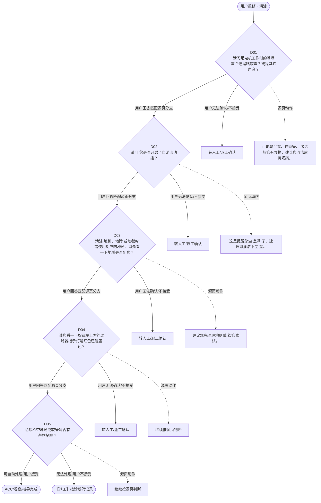

# BSH 吸尘器 — 清洁 诊断手册

**故障编号**：F08 | **节点前缀**：CL | **来源**：PPT Slides 12-13
**适用诊断码**：`源页未抽取到明确诊断码`
**转换状态**：自动批处理草案，需按源 PPT 视觉关系复核后生产使用

---

## 一、文档使用说明

### 三条执行铁律

1. **不越界**：只执行本文件定义的诊断步骤；遇到超出范围的问题，执行越界协议（见第三节），不得自行延伸
2. **不编造**：话术原文不得改写、补充或省略；不在本文件中的诊断码不得使用
3. **不跳步**：严格按 D 步骤顺序执行，不得跳过中间步骤直接给出结论

### 执行约定标记表

| 标记 | 含义 |
|------|------|
| `【话术】` | 逐字朗读给用户的诊断引导话术 |
| `【判断】` | 根据用户回答或系统数据触发的条件分支 |
| `【诊断码】` | BSH 标准诊断码 |
| `【派工】` | 安排工程师上门 |
| `【配件】` | 预判所需配件 |
| `【视频】` | 视频辅助标记 |
| `【引用】` | 跨故障树引用跳转 |
| `【解释】` | 向用户解释原理/现象 |
| `【操作指导】` | 指导用户自行操作 |
| `▶` | 无条件进入下一步 |

---

## 二、故障诊断导航树

### Mermaid 源码



### 诊断步骤 ↔ 节点速查表

| 步骤 | 节点 ID | 节点类型 | 简述 |
| --- | --- | --- | --- |
| 入口 | CL_START | 起始 | 用户报修：清洁 |
| D01 | CL_D01 | 判断 | CL_D02 / CL_MANUAL01 |
| D02 | CL_D02 | 判断 | CL_D03 / CL_MANUAL02 |
| D03 | CL_D03 | 判断 | CL_D04 / CL_MANUAL03 |
| D04 | CL_D04 | 判断 | CL_D05 / CL_MANUAL04 |
| D05 | CL_D05 | 判断 | CL_ACC / CL_DISPATCH |
| 结束-ACC | CL_ACC | 结束 | 用户接受/观察/指导完成 |
| 结束-派工 | CL_DISPATCH | 派工 | 无法处理或用户不接受 |

---

## 三、越界处理协议

### 触发条件（满足以下任意一条即触发越界）

| # | 触发场景 |
|---|---------|
| 1 | 用户故障描述无法映射到当前诊断树的任何入口分支 |
| 2 | 用户回答无法映射到当前 D 步骤的任何条件行 |
| 3 | 目标跳转节点在 Mermaid 图中无有效连线或仍需视觉确认 |
| 4 | 用户要求提供本文档未包含的信息，如价格、保修政策、投诉升级 |
| 5 | 用户描述涉及焦味、冒烟、漏电、跳闸、进水等安全风险 |
| 6 | 用户要求自行拆机、维修、改线或更换内部零部件 |

### 退出动作

- 若属于其他故障树：执行 `【引用】` 跳转或回到索引重新分流
- 若无法定位：转人工客服
- 若存在安全风险：停止在线指导并安排工程师或人工处理

### 严禁行为

- 严禁自行判断主板、电源板、电机、压缩机等内部零部件级故障
- 严禁改写源 PPT 话术作为确定结论
- 严禁在用户尚未回答当前问题时跳至下一步

### 覆盖范围

本故障树仅覆盖 `清洁` 相关诊断。其他故障现象应回到 `VC` 索引重新分流。

---

## 四、诊断入口

### 故障主诉确认

- 用户描述与 `清洁` 相关。
- 命中索引关键词：清洁, 吸尘器故障树, 卧式吸尘器, 不工作, 请问是电机工作时, 的嗡嗡声。
- 来源页：Slides 12-13。

### 入口分支判断

```
用户报修“清洁”
│
├── 主诉匹配当前树 → 进入 D01
├── 主诉属于其他故障 → 回到索引执行跨树引用
└── 主诉不明确 → 先追问具体显示/部位/现象
```

---

## 五、诊断步骤详情

### D01 — 请问是电机工作时的嗡嗡声？还是咯嗒声？或是其它声音？

**[节点：CL_D01]**

**【话术】**：
> "请问是电机工作时的嗡嗡声？还是咯嗒声？或是其它声音？"

**判断表**：

| 条件 | 下一步 | 出口类型 | Mermaid 边验证 |
| --- | --- | --- | --- |
| 用户回答匹配源页下一分支 | D02 | 继续诊断 | CL_D01 → D02（自动草案，待视觉确认） |
| 用户接受解释/操作/观察 | 结束 | ACC | CL_D01 → ACC（待视觉确认） |
| 用户不接受 / 无法操作 / 风险场景 | 派工或转人工 | 派工 | CL_D01 → DISPATCH（待视觉确认） |
| **兜底越界**：其他无法识别的输入 | 越界协议 | 越界 | 无对应 Mermaid 边 |


### D02 — 请问 您是否开启了自清洁功能？

**[节点：CL_D02]**

**【话术】**：
> "请问 您是否开启了自清洁功能？"

**判断表**：

| 条件 | 下一步 | 出口类型 | Mermaid 边验证 |
| --- | --- | --- | --- |
| 用户回答匹配源页下一分支 | D03 | 继续诊断 | CL_D02 → D03（自动草案，待视觉确认） |
| 用户接受解释/操作/观察 | 结束 | ACC | CL_D02 → ACC（待视觉确认） |
| 用户不接受 / 无法操作 / 风险场景 | 派工或转人工 | 派工 | CL_D02 → DISPATCH（待视觉确认） |
| **兜底越界**：其他无法识别的输入 | 越界协议 | 越界 | 无对应 Mermaid 边 |


### D03 — 清洁 地板、地砖 或地毯时需使用对应的地刷。您先看一下地刷是否配

**[节点：CL_D03]**

**【话术】**：
> "清洁 地板、地砖 或地毯时需使用对应的地刷。您先看一下地刷是否配套？"

**判断表**：

| 条件 | 下一步 | 出口类型 | Mermaid 边验证 |
| --- | --- | --- | --- |
| 用户回答匹配源页下一分支 | D04 | 继续诊断 | CL_D03 → D04（自动草案，待视觉确认） |
| 用户接受解释/操作/观察 | 结束 | ACC | CL_D03 → ACC（待视觉确认） |
| 用户不接受 / 无法操作 / 风险场景 | 派工或转人工 | 派工 | CL_D03 → DISPATCH（待视觉确认） |
| **兜底越界**：其他无法识别的输入 | 越界协议 | 越界 | 无对应 Mermaid 边 |


### D04 — 请您看一下旋钮左上方的过滤器指示灯是红色还是蓝色？

**[节点：CL_D04]**

**【话术】**：
> "请您看一下旋钮左上方的过滤器指示灯是红色还是蓝色？"

**判断表**：

| 条件 | 下一步 | 出口类型 | Mermaid 边验证 |
| --- | --- | --- | --- |
| 用户回答匹配源页下一分支 | D05 | 继续诊断 | CL_D04 → D05（自动草案，待视觉确认） |
| 用户接受解释/操作/观察 | 结束 | ACC | CL_D04 → ACC（待视觉确认） |
| 用户不接受 / 无法操作 / 风险场景 | 派工或转人工 | 派工 | CL_D04 → DISPATCH（待视觉确认） |
| **兜底越界**：其他无法识别的输入 | 越界协议 | 越界 | 无对应 Mermaid 边 |


### D05 — 请您检查地刷或软管是否有杂物堵塞？

**[节点：CL_D05]**

**【话术】**：
> "请您检查地刷或软管是否有杂物堵塞？"

**判断表**：

| 条件 | 下一步 | 出口类型 | Mermaid 边验证 |
| --- | --- | --- | --- |
| 用户回答匹配源页下一分支 | ACC / 派工 | 继续诊断 | CL_D05 → ACC / 派工（自动草案，待视觉确认） |
| 用户接受解释/操作/观察 | 结束 | ACC | CL_D05 → ACC（待视觉确认） |
| 用户不接受 / 无法操作 / 风险场景 | 派工或转人工 | 派工 | CL_D05 → DISPATCH（待视觉确认） |
| **兜底越界**：其他无法识别的输入 | 越界协议 | 越界 | 无对应 Mermaid 边 |


### 源页动作/结果摘录

- 可能是尘盒、伸缩管、 吸力软管有异物，建议您清洁后再观察。
- 这是提醒您尘 盒满 了，建议您清洁下尘 盒。
- 建议您先清理地刷或 软管试试。

---

## 附录 A：诊断码汇总表

| 诊断码 | 描述 | 触发步骤 | 备注 |
| --- | --- | --- | --- |
| 源页未抽取到明确诊断码 | — | — | 待人工补充 |

---

## 附录 B：配件建议汇总表

| 配件名称 | 关联步骤 | 说明 |
| --- | --- | --- |
| 源页未明确 | 派工出口 | 按源 PPT 派工节点记录，待视觉确认 |

---

## 附录 C：跨故障树引用清单

| 引用方向 | 触发条件 | 目标文件 | 目标诊断码 |
| --- | --- | --- | --- |
| 无明确跨树引用 | — | — | — |

---

## 附录 D：源页文本摘录（用于复核）

- 吸尘器故障树 _ 卧式吸尘器
- 不工作
- 请问是电机工作时的嗡嗡声？还是咯嗒声？或是其它声音？
- 声音问题
- 吸力不好
- 嗡嗡声
- 咯哒声
- 其他声音
- 电源线收不进去
- 可能是尘盒、伸缩管、 吸力软管有异物，建议您清洁后再观察。
- 您不用担心，电机工作时会产生嗡嗡声，档速不同，声音大小也会不同。
- 请问 您是否开启了自清洁功能？
- 地刷推不动
- 已开启自清洁
- 未开启自清洁
- 您不用担心， 开启自 清洁功能时， 机器 会抖动过滤网使 杂物进入尘盒， 所以 会发出咯嗒声。
- 我 为 您登记服务。
- - 寄整机
- 清洁 地板、地砖 或地毯时需使用对应的地刷。您先看一下地刷是否配套？
- 地刷不配套
- 地刷配套
- 请您看一下旋钮左上方的过滤器指示灯是红色还是蓝色？
- 请更换配套或适合的地刷。
- 参考 WIKI 口径解释。
- 过滤器指示灯工作状态下为蓝色，尘盒需要清洁时为红色。
- 卧式吸尘器的附件
- 红色
- 蓝色
- 这是提醒您尘 盒满 了，建议您清洁下尘 盒。
- 请您检查地刷或软管是否有杂物堵塞？
- 有异物堵塞
- 无异物堵塞
- 建议您先清理地刷或 软管试试。
