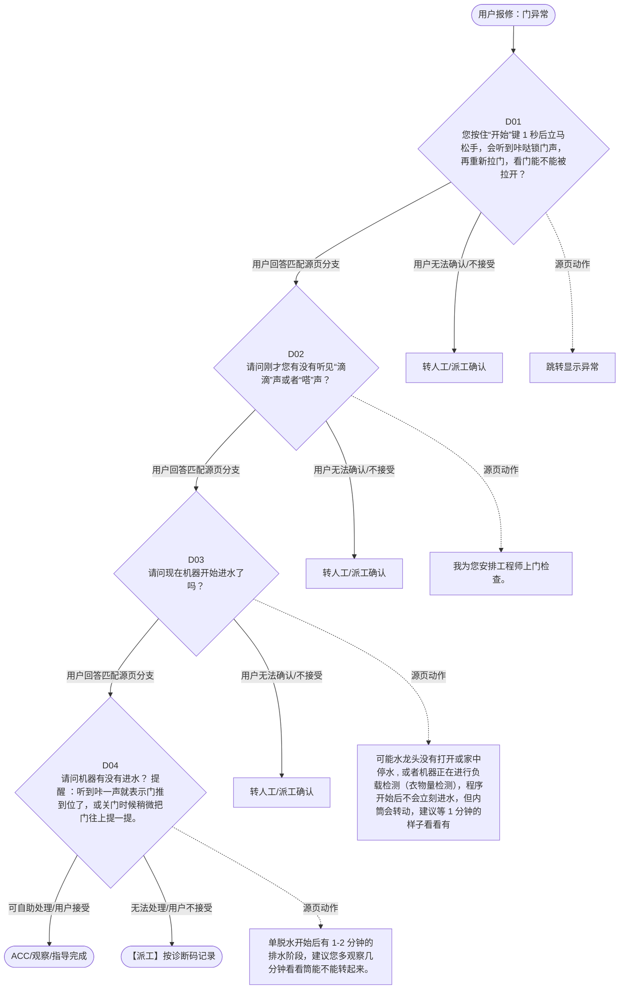

# BSH 洗衣机、洗干一体机 — 门异常 诊断手册

**故障编号**：F02 | **节点前缀**：DO | **来源**：PPT Slides 3-4
**适用诊断码**：`6902Y5000000` / `A180X4000000` / `A1X1Y1000000` / `A1X100000000`
**转换状态**：自动批处理草案，需按源 PPT 视觉关系复核后生产使用

---

## 一、文档使用说明

### 三条执行铁律

1. **不越界**：只执行本文件定义的诊断步骤；遇到超出范围的问题，执行越界协议（见第三节），不得自行延伸
2. **不编造**：话术原文不得改写、补充或省略；不在本文件中的诊断码不得使用
3. **不跳步**：严格按 D 步骤顺序执行，不得跳过中间步骤直接给出结论

### 执行约定标记表

| 标记 | 含义 |
|------|------|
| `【话术】` | 逐字朗读给用户的诊断引导话术 |
| `【判断】` | 根据用户回答或系统数据触发的条件分支 |
| `【诊断码】` | BSH 标准诊断码 |
| `【派工】` | 安排工程师上门 |
| `【配件】` | 预判所需配件 |
| `【视频】` | 视频辅助标记 |
| `【引用】` | 跨故障树引用跳转 |
| `【解释】` | 向用户解释原理/现象 |
| `【操作指导】` | 指导用户自行操作 |
| `▶` | 无条件进入下一步 |

---

## 二、故障诊断导航树

### Mermaid 源码



### 诊断步骤 ↔ 节点速查表

| 步骤 | 节点 ID | 节点类型 | 简述 |
| --- | --- | --- | --- |
| 入口 | DO_START | 起始 | 用户报修：门异常 |
| D01 | DO_D01 | 判断 | DO_D02 / DO_MANUAL01 |
| D02 | DO_D02 | 判断 | DO_D03 / DO_MANUAL02 |
| D03 | DO_D03 | 判断 | DO_D04 / DO_MANUAL03 |
| D04 | DO_D04 | 判断 | DO_ACC / DO_DISPATCH |
| 结束-ACC | DO_ACC | 结束 | 用户接受/观察/指导完成 |
| 结束-派工 | DO_DISPATCH | 派工 | 无法处理或用户不接受 |

---

## 三、越界处理协议

### 触发条件（满足以下任意一条即触发越界）

| # | 触发场景 |
|---|---------|
| 1 | 用户故障描述无法映射到当前诊断树的任何入口分支 |
| 2 | 用户回答无法映射到当前 D 步骤的任何条件行 |
| 3 | 目标跳转节点在 Mermaid 图中无有效连线或仍需视觉确认 |
| 4 | 用户要求提供本文档未包含的信息，如价格、保修政策、投诉升级 |
| 5 | 用户描述涉及焦味、冒烟、漏电、跳闸、进水等安全风险 |
| 6 | 用户要求自行拆机、维修、改线或更换内部零部件 |

### 退出动作

- 若属于其他故障树：执行 `【引用】` 跳转或回到索引重新分流
- 若无法定位：转人工客服
- 若存在安全风险：停止在线指导并安排工程师或人工处理

### 严禁行为

- 严禁自行判断主板、电源板、电机、压缩机等内部零部件级故障
- 严禁改写源 PPT 话术作为确定结论
- 严禁在用户尚未回答当前问题时跳至下一步

### 覆盖范围

本故障树仅覆盖 `门异常` 相关诊断。其他故障现象应回到 `WD` 索引重新分流。

---

## 四、诊断入口

### 故障主诉确认

- 用户描述与 `门异常` 相关。
- 命中索引关键词：门异常, 不工作, 通电不工作, 含不进水, Y5000, 门不上锁。
- 来源页：Slides 3-4。

### 入口分支判断

```
用户报修“门异常”
│
├── 主诉匹配当前树 → 进入 D01
├── 主诉属于其他故障 → 回到索引执行跨树引用
└── 主诉不明确 → 先追问具体显示/部位/现象
```

---

## 五、诊断步骤详情

### D01 — 您按住“开始”键 1 秒后立马松手，会听到咔哒锁门声，再重新拉门

**[节点：DO_D01]**

**【话术】**：
> "您按住“开始”键 1 秒后立马松手，会听到咔哒锁门声，再重新拉门，看门能不能被拉开？"

**判断表**：

| 条件 | 下一步 | 出口类型 | Mermaid 边验证 |
| --- | --- | --- | --- |
| 用户回答匹配源页下一分支 | D02 | 继续诊断 | DO_D01 → D02（自动草案，待视觉确认） |
| 用户接受解释/操作/观察 | 结束 | ACC | DO_D01 → ACC（待视觉确认） |
| 用户不接受 / 无法操作 / 风险场景 | 派工或转人工 | 派工 | DO_D01 → DISPATCH（待视觉确认） |
| **兜底越界**：其他无法识别的输入 | 越界协议 | 越界 | 无对应 Mermaid 边 |


### D02 — 请问刚才您有没有听见“滴滴”声或者“嗒”声？

**[节点：DO_D02]**

**【话术】**：
> "请问刚才您有没有听见“滴滴”声或者“嗒”声？"

**判断表**：

| 条件 | 下一步 | 出口类型 | Mermaid 边验证 |
| --- | --- | --- | --- |
| 用户回答匹配源页下一分支 | D03 | 继续诊断 | DO_D02 → D03（自动草案，待视觉确认） |
| 用户接受解释/操作/观察 | 结束 | ACC | DO_D02 → ACC（待视觉确认） |
| 用户不接受 / 无法操作 / 风险场景 | 派工或转人工 | 派工 | DO_D02 → DISPATCH（待视觉确认） |
| **兜底越界**：其他无法识别的输入 | 越界协议 | 越界 | 无对应 Mermaid 边 |


### D03 — 请问现在机器开始进水了吗？

**[节点：DO_D03]**

**【话术】**：
> "请问现在机器开始进水了吗？"

**判断表**：

| 条件 | 下一步 | 出口类型 | Mermaid 边验证 |
| --- | --- | --- | --- |
| 用户回答匹配源页下一分支 | D04 | 继续诊断 | DO_D03 → D04（自动草案，待视觉确认） |
| 用户接受解释/操作/观察 | 结束 | ACC | DO_D03 → ACC（待视觉确认） |
| 用户不接受 / 无法操作 / 风险场景 | 派工或转人工 | 派工 | DO_D03 → DISPATCH（待视觉确认） |
| **兜底越界**：其他无法识别的输入 | 越界协议 | 越界 | 无对应 Mermaid 边 |


### D04 — 请问机器有没有进水？ 提醒 ：听到咔一声就表示门推到位了，或关门

**[节点：DO_D04]**

**【话术】**：
> "请问机器有没有进水？ 提醒 ：听到咔一声就表示门推到位了，或关门时候稍微把门往上提一提。"

**判断表**：

| 条件 | 下一步 | 出口类型 | Mermaid 边验证 |
| --- | --- | --- | --- |
| 用户回答匹配源页下一分支 | ACC / 派工 | 继续诊断 | DO_D04 → ACC / 派工（自动草案，待视觉确认） |
| 用户接受解释/操作/观察 | 结束 | ACC | DO_D04 → ACC（待视觉确认） |
| 用户不接受 / 无法操作 / 风险场景 | 派工或转人工 | 派工 | DO_D04 → DISPATCH（待视觉确认） |
| **兜底越界**：其他无法识别的输入 | 越界协议 | 越界 | 无对应 Mermaid 边 |


### 源页动作/结果摘录

- 跳转显示异常
- 我为您安排工程师上门检查。
- 可能水龙头没有打开或家中停水 , 或者机器正在进行负载检测（衣物量检测），程序开始后不会立刻进水，但内筒会转动，建议等 1 分钟的样子看看有没有进水。
- 单脱水开始后有 1-2 分钟的排水阶段，建议您多观察几分钟看看筒能不能转起来。
- 我为您安排工程师上门检查。 需要配件解决
- 跳转：不工作：通电不进水

---

## 附录 A：诊断码汇总表

| 诊断码 | 描述 | 触发步骤 | 备注 |
| --- | --- | --- | --- |
| `6902Y5000000` | 见源 PPT 相邻文本 | 源页派工/判断节点 | 自动抽取，待人工核对英文/中文描述 |
| `A180X4000000` | 见源 PPT 相邻文本 | 源页派工/判断节点 | 自动抽取，待人工核对英文/中文描述 |
| `A1X1Y1000000` | 见源 PPT 相邻文本 | 源页派工/判断节点 | 自动抽取，待人工核对英文/中文描述 |
| `A1X100000000` | 见源 PPT 相邻文本 | 源页派工/判断节点 | 自动抽取，待人工核对英文/中文描述 |

---

## 附录 B：配件建议汇总表

| 配件名称 | 关联步骤 | 说明 |
| --- | --- | --- |
| 待工程师上门判断 | 派工出口 | 按源 PPT 派工节点记录，待视觉确认 |

---

## 附录 C：跨故障树引用清单

| 引用方向 | 触发条件 | 目标文件 | 目标诊断码 |
| --- | --- | --- | --- |
| 本树 → 显示异常 | 源页出现跳转提示 | 待索引映射 | — |
| 本树 → ：不工作：通电不进水 | 源页出现跳转提示 | 待索引映射 | — |

---

## 附录 D：源页文本摘录（用于复核）

- 不工作：通电不工作（含不进水）
- 6902Y5000000-Door does not lock ，门不上锁
- 请您将机器门稍微往上提一提，再往里推一下，选择棉织物（或任意程序）看一下开始图标是否闪烁。
- 开始键不闪烁
- 开始键闪烁
- 您按住“开始”键 1 秒后立马松手，会听到咔哒锁门声，再重新拉门，看门能不能被拉开？
- 请您看下显示屏上有没有童锁图标亮起，或者 E 代码显示。
- 门能被拉开
- 门不能被拉开
- 没有异常显示
- 有异常显示
- 请问刚才您有没有听见“滴滴”声或者“嗒”声？
- 跳转显示异常
- 我为您安排工程师上门检查。
- 请问现在机器开始进水了吗？
- 1 、咔哒咔哒两声 2 、没有滴滴声 / 嗒 声
- 进水
- 不进水
- 滴滴声
- 1. 拉完紧急门栓后，开门，关门，通电看能否上锁 2. 调整电源板和门锁的线束连接 3. 更换门锁 4. 更换电脑板
- 可能水龙头没有打开或家中停水 , 或者机器正在进行负载检测（衣物量检测），程序开始后不会立刻进水，但内筒会转动，建议等 1 分钟的样子看看有没有进水。
- 电话解决
- 由于机器不支持多点触控，请您单指操作，按住“开始”键 1 秒，在听到嗒一声后松手（如图示）
- 6902Y5000000
- 开始工作
- 无法工作
- A180X4000000-Water not running in, water inlet checked, door locked ，水龙头进水正常，门已上锁但不进水
- 返回目录
- 不工作：通电筒不转
- A1X1Y1000000 -Drum not turning, water is running in ，进水筒不转
- 请问机器有没有进水？ 提醒 ：听到咔一声就表示门推到位了，或关门时候稍微把门往上提一提。
- 没有进水
- 已进水
- 单脱水筒不转
- 单脱水开始后有 1-2 分钟的排水阶段，建议您多观察几分钟看看筒能不能转起来。
- 我为您安排工程师上门检查。 需要配件解决
- 跳转：不工作：通电不进水
- A1X100000000 -Drum not turning ，筒不转
- 提醒： 如果用户提及以下两种程序，请解释： 羊毛洗程序 是根据羊毛织物的特性，为保护织物而设计的羊毛织物专用且以浸泡为主的洗涤方式，所以滚筒的运转频率很低。 浸泡洗程序 主要以浸泡为主，滚筒转动频率低，不会进行洗涤，且无排水和脱水功能。
