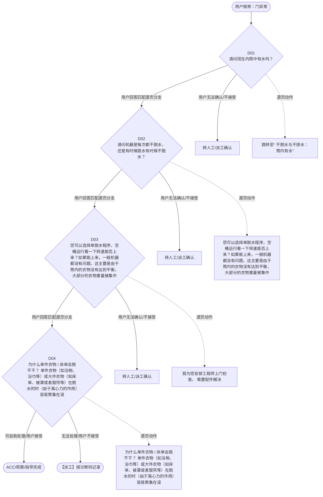

# BSH 洗衣机、洗干一体机 — 门异常 诊断手册

**故障编号**：F07 | **节点前缀**：DO2 | **来源**：PPT Slide 9
**适用诊断码**：`A23200000000` / `A1B000000000`
**转换状态**：自动批处理草案，需按源 PPT 视觉关系复核后生产使用

---

## 一、文档使用说明

### 三条执行铁律

1. **不越界**：只执行本文件定义的诊断步骤；遇到超出范围的问题，执行越界协议（见第三节），不得自行延伸
2. **不编造**：话术原文不得改写、补充或省略；不在本文件中的诊断码不得使用
3. **不跳步**：严格按 D 步骤顺序执行，不得跳过中间步骤直接给出结论

### 执行约定标记表

| 标记 | 含义 |
|------|------|
| `【话术】` | 逐字朗读给用户的诊断引导话术 |
| `【判断】` | 根据用户回答或系统数据触发的条件分支 |
| `【诊断码】` | BSH 标准诊断码 |
| `【派工】` | 安排工程师上门 |
| `【配件】` | 预判所需配件 |
| `【视频】` | 视频辅助标记 |
| `【引用】` | 跨故障树引用跳转 |
| `【解释】` | 向用户解释原理/现象 |
| `【操作指导】` | 指导用户自行操作 |
| `▶` | 无条件进入下一步 |

---

## 二、故障诊断导航树

### Mermaid 源码



### 诊断步骤 ↔ 节点速查表

| 步骤 | 节点 ID | 节点类型 | 简述 |
| --- | --- | --- | --- |
| 入口 | DO2_START | 起始 | 用户报修：门异常 |
| D01 | DO2_D01 | 判断 | DO2_D02 / DO2_MANUAL01 |
| D02 | DO2_D02 | 判断 | DO2_D03 / DO2_MANUAL02 |
| D03 | DO2_D03 | 判断 | DO2_D04 / DO2_MANUAL03 |
| D04 | DO2_D04 | 判断 | DO2_ACC / DO2_DISPATCH |
| 结束-ACC | DO2_ACC | 结束 | 用户接受/观察/指导完成 |
| 结束-派工 | DO2_DISPATCH | 派工 | 无法处理或用户不接受 |

---

## 三、越界处理协议

### 触发条件（满足以下任意一条即触发越界）

| # | 触发场景 |
|---|---------|
| 1 | 用户故障描述无法映射到当前诊断树的任何入口分支 |
| 2 | 用户回答无法映射到当前 D 步骤的任何条件行 |
| 3 | 目标跳转节点在 Mermaid 图中无有效连线或仍需视觉确认 |
| 4 | 用户要求提供本文档未包含的信息，如价格、保修政策、投诉升级 |
| 5 | 用户描述涉及焦味、冒烟、漏电、跳闸、进水等安全风险 |
| 6 | 用户要求自行拆机、维修、改线或更换内部零部件 |

### 退出动作

- 若属于其他故障树：执行 `【引用】` 跳转或回到索引重新分流
- 若无法定位：转人工客服
- 若存在安全风险：停止在线指导并安排工程师或人工处理

### 严禁行为

- 严禁自行判断主板、电源板、电机、压缩机等内部零部件级故障
- 严禁改写源 PPT 话术作为确定结论
- 严禁在用户尚未回答当前问题时跳至下一步

### 覆盖范围

本故障树仅覆盖 `门异常` 相关诊断。其他故障现象应回到 `WD` 索引重新分流。

---

## 四、诊断入口

### 故障主诉确认

- 用户描述与 `门异常` 相关。
- 命中索引关键词：门异常, 不脱水与不排水, A2320, 脱水不干, 请问现在内筒中有, 水吗。
- 来源页：Slide 9。

### 入口分支判断

```
用户报修“门异常”
│
├── 主诉匹配当前树 → 进入 D01
├── 主诉属于其他故障 → 回到索引执行跨树引用
└── 主诉不明确 → 先追问具体显示/部位/现象
```

---

## 五、诊断步骤详情

### D01 — 请问现在内筒中有水吗？

**[节点：DO2_D01]**

**【话术】**：
> "请问现在内筒中有水吗？"

**判断表**：

| 条件 | 下一步 | 出口类型 | Mermaid 边验证 |
| --- | --- | --- | --- |
| 用户回答匹配源页下一分支 | D02 | 继续诊断 | DO2_D01 → D02（自动草案，待视觉确认） |
| 用户接受解释/操作/观察 | 结束 | ACC | DO2_D01 → ACC（待视觉确认） |
| 用户不接受 / 无法操作 / 风险场景 | 派工或转人工 | 派工 | DO2_D01 → DISPATCH（待视觉确认） |
| **兜底越界**：其他无法识别的输入 | 越界协议 | 越界 | 无对应 Mermaid 边 |


### D02 — 请问机器是每次都不脱水，还是有时候脱水有时候不脱水？

**[节点：DO2_D02]**

**【话术】**：
> "请问机器是每次都不脱水，还是有时候脱水有时候不脱水？"

**判断表**：

| 条件 | 下一步 | 出口类型 | Mermaid 边验证 |
| --- | --- | --- | --- |
| 用户回答匹配源页下一分支 | D03 | 继续诊断 | DO2_D02 → D03（自动草案，待视觉确认） |
| 用户接受解释/操作/观察 | 结束 | ACC | DO2_D02 → ACC（待视觉确认） |
| 用户不接受 / 无法操作 / 风险场景 | 派工或转人工 | 派工 | DO2_D02 → DISPATCH（待视觉确认） |
| **兜底越界**：其他无法识别的输入 | 越界协议 | 越界 | 无对应 Mermaid 边 |


### D03 — 您可以选择单脱水程序，空桶运行看一下转速能否上来？如果能上来，一

**[节点：DO2_D03]**

**【话术】**：
> "您可以选择单脱水程序，空桶运行看一下转速能否上来？如果能上来，一般机器都没有问题。这主要是由于筒内的衣物没有达到平衡，大部分的衣物重量被集中到某一侧，触发机器的平衡保护，引起的转速上不来。虽然整个脱水过程中机器会多次调整衣物的分部状态，但是对于一些吸水能力特别强的衣物（比如居家服里的法兰绒这种材质，吸水后比较重）或者衣物量太少（ 1-2 件），更容易出现不脱水的情况，建议多搭配两件衣物一起洗或者当出现不脱水时，可以将衣物抖散，吸水强的衣物稍微拧一下，重新运行单脱水一般都能解决。 【 提醒 】 FD 0601 之后机型的“快洗 15 分钟程序”或 HC 手机端可选的“超轻量”附加功能，均可以降低不脱水的概率。如果客户苦恼于不脱水，可推荐这两种操作。 1 、 机器 FD 0601 及以后的，少量衣物时，可以建议使用“快洗 15 分钟”程序。 2 、 机器型号命名如下，且 FD 0407 及以后的机器，用户在 HC 小程序中操作，选择主程序后，开启“超轻量”附加功能。"

**判断表**：

| 条件 | 下一步 | 出口类型 | Mermaid 边验证 |
| --- | --- | --- | --- |
| 用户回答匹配源页下一分支 | D04 | 继续诊断 | DO2_D03 → D04（自动草案，待视觉确认） |
| 用户接受解释/操作/观察 | 结束 | ACC | DO2_D03 → ACC（待视觉确认） |
| 用户不接受 / 无法操作 / 风险场景 | 派工或转人工 | 派工 | DO2_D03 → DISPATCH（待视觉确认） |
| **兜底越界**：其他无法识别的输入 | 越界协议 | 越界 | 无对应 Mermaid 边 |


### D04 — 为什么单件衣物 / 床单会脱不干？ 单件衣物（如浴袍、浴巾等）或

**[节点：DO2_D04]**

**【话术】**：
> "为什么单件衣物 / 床单会脱不干？ 单件衣物（如浴袍、浴巾等）或大件衣物（如床单、被罩或者窗帘等）在脱水的时（由于离心力的作用）容易聚集在滚筒一侧或缠绕在一起，造成的偏心会触发机器的平衡系统，自动降低脱水转速，这个设计是为了保护机器和衣物：如果桶内发生了偏心，但还在高速的转动，机器不但运行声音比较大，可能还会受到损伤；衣物也容易发生褶皱、变形。建议您稍后抖散衣物重新摆放，再选择单脱水试一下。 建议： 单件衣物 ：您可以多放几件衣物； 大件衣物： 您先暂停机器，打开机器门，松散一下衣物重新放入即可。"

**判断表**：

| 条件 | 下一步 | 出口类型 | Mermaid 边验证 |
| --- | --- | --- | --- |
| 用户回答匹配源页下一分支 | ACC / 派工 | 继续诊断 | DO2_D04 → ACC / 派工（自动草案，待视觉确认） |
| 用户接受解释/操作/观察 | 结束 | ACC | DO2_D04 → ACC（待视觉确认） |
| 用户不接受 / 无法操作 / 风险场景 | 派工或转人工 | 派工 | DO2_D04 → DISPATCH（待视觉确认） |
| **兜底越界**：其他无法识别的输入 | 越界协议 | 越界 | 无对应 Mermaid 边 |


### 源页动作/结果摘录

- 跳转至“ 不脱水与不排水：筒内有水”
- 您可以选择单脱水程序，空桶运行看一下转速能否上来？如果能上来，一般机器都没有问题。这主要是由于筒内的衣物没有达到平衡，大部分的衣物重量被集中到某一侧，触发机器的平衡保护，引起的转速上不来。虽然整个脱水过程中机器会多次调整衣物的分部状态，但是对于一些吸水能力特别强的衣物（比如居家服里的法兰绒这种材质，吸水后比较重）或者衣物量太少（ 1-2 件），更容易出现不脱水的情况，建议多搭配两件衣物一起洗或者当出现不脱水时，可以将衣物抖散，吸水强的衣物稍微拧一下，重新运行单脱水一般都能解决。 【 提醒 】 FD 0601 之后机型的“快洗 15 分钟程序”或 HC 手机端可选的“超轻量”附加功能，均可以降低不脱水的概率。如果客户苦恼于不脱水，可推荐这两种操作。 1 、 机器 FD 0601 及以后的，少量衣物时，可以建议使用“快洗 15 分钟”程序。 2 、 机器型号命名如下，且 FD 0407 及以后的机器，用户在 HC 小程序中操作，选择主程序后，开启“超轻量”附加功能。
- 我为您安排工程师上门检查。 需要配件解决
- 为什么单件衣物 / 床单会脱不干？ 单件衣物（如浴袍、浴巾等）或大件衣物（如床单、被罩或者窗帘等）在脱水的时（由于离心力的作用）容易聚集在滚筒一侧或缠绕在一起，造成的偏心会触发机器的平衡系统，自动降低脱水转速，这个设计是为了保护机器和衣物：如果桶内发生了偏心，但还在高速的转动，机器不但运行声音比较大，可能还会受到损伤；衣物也容易发生褶皱、变形。建议您稍后抖散衣物重新摆放，再选择单脱水试一下。 建议： 单件衣物 ：您可以多放几件衣物； 大件衣物： 您先暂停机器，打开机器门，松散一下衣物重新放入即可。
- 客户不接受
- 客户接受
- 派工
- ACC

---

## 附录 A：诊断码汇总表

| 诊断码 | 描述 | 触发步骤 | 备注 |
| --- | --- | --- | --- |
| `A23200000000` | 见源 PPT 相邻文本 | 源页派工/判断节点 | 自动抽取，待人工核对英文/中文描述 |
| `A1B000000000` | 见源 PPT 相邻文本 | 源页派工/判断节点 | 自动抽取，待人工核对英文/中文描述 |

---

## 附录 B：配件建议汇总表

| 配件名称 | 关联步骤 | 说明 |
| --- | --- | --- |
| 待工程师上门判断 | 派工出口 | 按源 PPT 派工节点记录，待视觉确认 |

---

## 附录 C：跨故障树引用清单

| 引用方向 | 触发条件 | 目标文件 | 目标诊断码 |
| --- | --- | --- | --- |
| 本树 → 至“ | 源页出现跳转提示 | 待索引映射 | — |

---

## 附录 D：源页文本摘录（用于复核）

- 不脱水与不排水
- A23200000000-Inadequate spinning performance, washing too damp, 脱水不干
- 请问现在内筒中有水吗？
- 1 、内筒没水 2 、单脱水程序不脱水
- 内筒有水
- 跳转至“ 不脱水与不排水：筒内有水”
- 请问机器是每次都不脱水，还是有时候脱水有时候不脱水？
- 每一次都不脱水
- 有时候能脱水，有时脱不干
- 您可以选择单脱水程序，空桶运行看一下转速能否上来？如果能上来，一般机器都没有问题。这主要是由于筒内的衣物没有达到平衡，大部分的衣物重量被集中到某一侧，触发机器的平衡保护，引起的转速上不来。虽然整个脱水过程中机器会多次调整衣物的分部状态，但是对于一些吸水能力特别强的衣物（比如居家服里的法兰绒这种材质，吸水后比较重）或者衣物量太少（ 1-2 件），更容易出现不脱水的情况，建议多搭配两件衣物一起洗或者当出现不脱水时，可以将衣物抖散，吸水强的衣物稍微拧一下，重新运行单脱水一般都能解决。 【 提醒 】 FD 0601 之后机型的“快洗 15 分钟程序”或 HC 手机端可选的“超轻量”附加功能，均可以降低不脱水的概率。如果客户苦恼于不脱水，可推荐这两种操作。 1 、 机器 FD 0601 及以后的，少量衣物时，可以建议使用“快洗 15 分钟”程序。 2 、 机器型号命名如下，且 FD 0407 及以后的机器，用户在 HC 小程序中操作，选择主程序后，开启“超轻量”附加功能。
- 我为您安排工程师上门检查。 需要配件解决
- A1B000000000-Drum turns / No spin cycle, 筒转 / 不脱水
- 为什么单件衣物 / 床单会脱不干？ 单件衣物（如浴袍、浴巾等）或大件衣物（如床单、被罩或者窗帘等）在脱水的时（由于离心力的作用）容易聚集在滚筒一侧或缠绕在一起，造成的偏心会触发机器的平衡系统，自动降低脱水转速，这个设计是为了保护机器和衣物：如果桶内发生了偏心，但还在高速的转动，机器不但运行声音比较大，可能还会受到损伤；衣物也容易发生褶皱、变形。建议您稍后抖散衣物重新摆放，再选择单脱水试一下。 建议： 单件衣物 ：您可以多放几件衣物； 大件衣物： 您先暂停机器，打开机器门，松散一下衣物重新放入即可。
- 客户不接受
- 客户接受
- 机器大概率是没有问题的，我们也有其他用户遇到类似情况，工程师上门，发现机器大都没有问题。您也可以选择单脱水空桶运行验证一下，如果转速能上来，证明软硬件都是正常的。
- 派工
- ACC
- 返回目录
