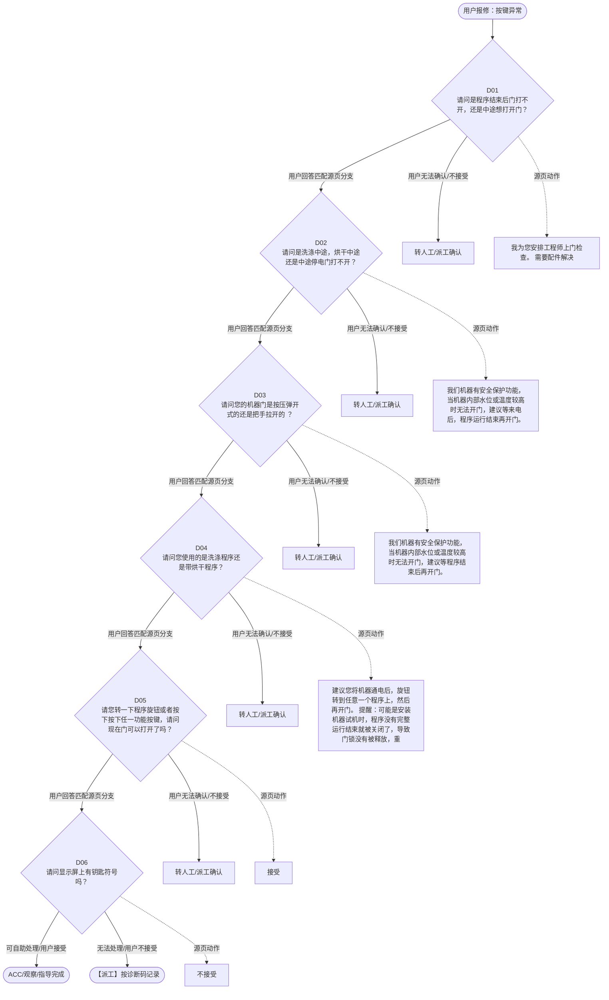

# BSH 洗衣机、洗干一体机 — 按键异常 诊断手册

**故障编号**：F10 | **节点前缀**：BT | **来源**：PPT Slide 13
**适用诊断码**：`6902Y4000000` / `160100X16000` / `17E000000Y31` / `160100X36000`
**转换状态**：自动批处理草案，需按源 PPT 视觉关系复核后生产使用

---

## 一、文档使用说明

### 三条执行铁律

1. **不越界**：只执行本文件定义的诊断步骤；遇到超出范围的问题，执行越界协议（见第三节），不得自行延伸
2. **不编造**：话术原文不得改写、补充或省略；不在本文件中的诊断码不得使用
3. **不跳步**：严格按 D 步骤顺序执行，不得跳过中间步骤直接给出结论

### 执行约定标记表

| 标记 | 含义 |
|------|------|
| `【话术】` | 逐字朗读给用户的诊断引导话术 |
| `【判断】` | 根据用户回答或系统数据触发的条件分支 |
| `【诊断码】` | BSH 标准诊断码 |
| `【派工】` | 安排工程师上门 |
| `【配件】` | 预判所需配件 |
| `【视频】` | 视频辅助标记 |
| `【引用】` | 跨故障树引用跳转 |
| `【解释】` | 向用户解释原理/现象 |
| `【操作指导】` | 指导用户自行操作 |
| `▶` | 无条件进入下一步 |

---

## 二、故障诊断导航树

### Mermaid 源码



### 诊断步骤 ↔ 节点速查表

| 步骤 | 节点 ID | 节点类型 | 简述 |
| --- | --- | --- | --- |
| 入口 | BT_START | 起始 | 用户报修：按键异常 |
| D01 | BT_D01 | 判断 | BT_D02 / BT_MANUAL01 |
| D02 | BT_D02 | 判断 | BT_D03 / BT_MANUAL02 |
| D03 | BT_D03 | 判断 | BT_D04 / BT_MANUAL03 |
| D04 | BT_D04 | 判断 | BT_D05 / BT_MANUAL04 |
| D05 | BT_D05 | 判断 | BT_D06 / BT_MANUAL05 |
| D06 | BT_D06 | 判断 | BT_ACC / BT_DISPATCH |
| 结束-ACC | BT_ACC | 结束 | 用户接受/观察/指导完成 |
| 结束-派工 | BT_DISPATCH | 派工 | 无法处理或用户不接受 |

---

## 三、越界处理协议

### 触发条件（满足以下任意一条即触发越界）

| # | 触发场景 |
|---|---------|
| 1 | 用户故障描述无法映射到当前诊断树的任何入口分支 |
| 2 | 用户回答无法映射到当前 D 步骤的任何条件行 |
| 3 | 目标跳转节点在 Mermaid 图中无有效连线或仍需视觉确认 |
| 4 | 用户要求提供本文档未包含的信息，如价格、保修政策、投诉升级 |
| 5 | 用户描述涉及焦味、冒烟、漏电、跳闸、进水等安全风险 |
| 6 | 用户要求自行拆机、维修、改线或更换内部零部件 |

### 退出动作

- 若属于其他故障树：执行 `【引用】` 跳转或回到索引重新分流
- 若无法定位：转人工客服
- 若存在安全风险：停止在线指导并安排工程师或人工处理

### 严禁行为

- 严禁自行判断主板、电源板、电机、压缩机等内部零部件级故障
- 严禁改写源 PPT 话术作为确定结论
- 严禁在用户尚未回答当前问题时跳至下一步

### 覆盖范围

本故障树仅覆盖 `按键异常` 相关诊断。其他故障现象应回到 `WD` 索引重新分流。

---

## 四、诊断入口

### 故障主诉确认

- 用户描述与 `按键异常` 相关。
- 命中索引关键词：按键异常, 门打不开, Y4000, 请问是程序结束后, 还是中途想打开门, X1600。
- 来源页：Slide 13。

### 入口分支判断

```
用户报修“按键异常”
│
├── 主诉匹配当前树 → 进入 D01
├── 主诉属于其他故障 → 回到索引执行跨树引用
└── 主诉不明确 → 先追问具体显示/部位/现象
```

---

## 五、诊断步骤详情

### D01 — 请问是程序结束后门打不开，还是中途想打开门？

**[节点：BT_D01]**

**【话术】**：
> "请问是程序结束后门打不开，还是中途想打开门？"

**判断表**：

| 条件 | 下一步 | 出口类型 | Mermaid 边验证 |
| --- | --- | --- | --- |
| 用户回答匹配源页下一分支 | D02 | 继续诊断 | BT_D01 → D02（自动草案，待视觉确认） |
| 用户接受解释/操作/观察 | 结束 | ACC | BT_D01 → ACC（待视觉确认） |
| 用户不接受 / 无法操作 / 风险场景 | 派工或转人工 | 派工 | BT_D01 → DISPATCH（待视觉确认） |
| **兜底越界**：其他无法识别的输入 | 越界协议 | 越界 | 无对应 Mermaid 边 |


### D02 — 请问是洗涤中途，烘干中途还是中途停电门打不开？

**[节点：BT_D02]**

**【话术】**：
> "请问是洗涤中途，烘干中途还是中途停电门打不开？"

**判断表**：

| 条件 | 下一步 | 出口类型 | Mermaid 边验证 |
| --- | --- | --- | --- |
| 用户回答匹配源页下一分支 | D03 | 继续诊断 | BT_D02 → D03（自动草案，待视觉确认） |
| 用户接受解释/操作/观察 | 结束 | ACC | BT_D02 → ACC（待视觉确认） |
| 用户不接受 / 无法操作 / 风险场景 | 派工或转人工 | 派工 | BT_D02 → DISPATCH（待视觉确认） |
| **兜底越界**：其他无法识别的输入 | 越界协议 | 越界 | 无对应 Mermaid 边 |


### D03 — 请问您的机器门是按压弹开式的还是把手拉开的 ？

**[节点：BT_D03]**

**【话术】**：
> "请问您的机器门是按压弹开式的还是把手拉开的 ？"

**判断表**：

| 条件 | 下一步 | 出口类型 | Mermaid 边验证 |
| --- | --- | --- | --- |
| 用户回答匹配源页下一分支 | D04 | 继续诊断 | BT_D03 → D04（自动草案，待视觉确认） |
| 用户接受解释/操作/观察 | 结束 | ACC | BT_D03 → ACC（待视觉确认） |
| 用户不接受 / 无法操作 / 风险场景 | 派工或转人工 | 派工 | BT_D03 → DISPATCH（待视觉确认） |
| **兜底越界**：其他无法识别的输入 | 越界协议 | 越界 | 无对应 Mermaid 边 |


### D04 — 请问您使用的是洗涤程序还是带烘干程序？

**[节点：BT_D04]**

**【话术】**：
> "请问您使用的是洗涤程序还是带烘干程序？"

**判断表**：

| 条件 | 下一步 | 出口类型 | Mermaid 边验证 |
| --- | --- | --- | --- |
| 用户回答匹配源页下一分支 | D05 | 继续诊断 | BT_D04 → D05（自动草案，待视觉确认） |
| 用户接受解释/操作/观察 | 结束 | ACC | BT_D04 → ACC（待视觉确认） |
| 用户不接受 / 无法操作 / 风险场景 | 派工或转人工 | 派工 | BT_D04 → DISPATCH（待视觉确认） |
| **兜底越界**：其他无法识别的输入 | 越界协议 | 越界 | 无对应 Mermaid 边 |


### D05 — 请您转一下程序旋钮或者按下按下任一功能按键，请问现在门可以打开了

**[节点：BT_D05]**

**【话术】**：
> "请您转一下程序旋钮或者按下按下任一功能按键，请问现在门可以打开了吗？"

**判断表**：

| 条件 | 下一步 | 出口类型 | Mermaid 边验证 |
| --- | --- | --- | --- |
| 用户回答匹配源页下一分支 | D06 | 继续诊断 | BT_D05 → D06（自动草案，待视觉确认） |
| 用户接受解释/操作/观察 | 结束 | ACC | BT_D05 → ACC（待视觉确认） |
| 用户不接受 / 无法操作 / 风险场景 | 派工或转人工 | 派工 | BT_D05 → DISPATCH（待视觉确认） |
| **兜底越界**：其他无法识别的输入 | 越界协议 | 越界 | 无对应 Mermaid 边 |


### D06 — 请问显示屏上有钥匙符号吗？

**[节点：BT_D06]**

**【话术】**：
> "请问显示屏上有钥匙符号吗？"

**判断表**：

| 条件 | 下一步 | 出口类型 | Mermaid 边验证 |
| --- | --- | --- | --- |
| 用户回答匹配源页下一分支 | ACC / 派工 | 继续诊断 | BT_D06 → ACC / 派工（自动草案，待视觉确认） |
| 用户接受解释/操作/观察 | 结束 | ACC | BT_D06 → ACC（待视觉确认） |
| 用户不接受 / 无法操作 / 风险场景 | 派工或转人工 | 派工 | BT_D06 → DISPATCH（待视觉确认） |
| **兜底越界**：其他无法识别的输入 | 越界协议 | 越界 | 无对应 Mermaid 边 |


### 源页动作/结果摘录

- 我为您安排工程师上门检查。 需要配件解决
- 我们机器有安全保护功能，当机器内部水位或温度较高时无法开门，建议等来电后，程序运行结束再开门。
- 我们机器有安全保护功能，当机器内部水位或温度较高时无法开门，建议等程序结束后再开门。
- 建议您将机器通电后，旋钮转到任意一个程序上，然后再开门。 提醒：可能是安装机器试机时，程序没有完整运行结束就被关闭了，导致门锁没有被释放，重新选择程序释放门锁后就能打开门。
- 接受
- 不接受
- ACC
- 派工
- 请您断电五分钟重新通电，选择任意程序再去开门，如问题没有解决，我们将安排工程师上门检查。 需要配件解决
- 我们在网上有一个指导紧急开门的视频，您关注微信公众号，输入“紧急开门”即可查看。

---

## 附录 A：诊断码汇总表

| 诊断码 | 描述 | 触发步骤 | 备注 |
| --- | --- | --- | --- |
| `6902Y4000000` | 见源 PPT 相邻文本 | 源页派工/判断节点 | 自动抽取，待人工核对英文/中文描述 |
| `160100X16000` | 见源 PPT 相邻文本 | 源页派工/判断节点 | 自动抽取，待人工核对英文/中文描述 |
| `17E000000Y31` | 见源 PPT 相邻文本 | 源页派工/判断节点 | 自动抽取，待人工核对英文/中文描述 |
| `160100X36000` | 见源 PPT 相邻文本 | 源页派工/判断节点 | 自动抽取，待人工核对英文/中文描述 |

---

## 附录 B：配件建议汇总表

| 配件名称 | 关联步骤 | 说明 |
| --- | --- | --- |
| 待工程师上门判断 | 派工出口 | 按源 PPT 派工节点记录，待视觉确认 |

---

## 附录 C：跨故障树引用清单

| 引用方向 | 触发条件 | 目标文件 | 目标诊断码 |
| --- | --- | --- | --- |
| 无明确跨树引用 | — | — | — |

---

## 附录 D：源页文本摘录（用于复核）

- 门打不开
- 6902Y4000000 Door blocked (cannot be opened) 门打不开
- 请问是程序结束后门打不开，还是中途想打开门？
- 160100X16000 / /Mechanical damage/ Window / Door ，门结构损坏
- 门把手松动
- 新机首次使用门打不开
- 中途想开门
- 程序结束后
- 请问是洗涤中途，烘干中途还是中途停电门打不开？
- 请问您的机器门是按压弹开式的还是把手拉开的 ？
- 我为您安排工程师上门检查。 需要配件解决
- 请问您使用的是洗涤程序还是带烘干程序？
- 带烘干程序
- 洗涤程序结束后
- 停电之后
- 烘干中途
- 洗涤中途
- 门把手拉开
- 按压式弹开
- 请您转一下程序旋钮或者按下按下任一功能按键，请问现在门可以打开了吗？
- 请问显示屏上有钥匙符号吗？
- 请您选择 15 分钟定时烘干程序，结束后就可以开门了。 提醒：部分型号没有 15 分钟烘干程序，可以选择随心控时 - 单烘 -20 分钟。
- 我们机器有安全保护功能，当机器内部水位或温度较高时无法开门，建议等来电后，程序运行结束再开门。
- 我们机器有安全保护功能，当机器内部水位或温度较高时无法开门，建议等程序结束后再开门。
- 建议您将机器通电后，旋钮转到任意一个程序上，然后再开门。 提醒：可能是安装机器试机时，程序没有完整运行结束就被关闭了，导致门锁没有被释放，重新选择程序释放门锁后就能打开门。
- 机器门的下沿有一张防撞泡沫贴，与门圈周围可能产生摩擦，从而阻挡了门的打开，您可以先撕掉，再试试看 。
- 无法打开
- 临时替代 DC ： 6902Y4000000-Door blocked (cannot be opened) ，门打不开
- 无钥匙符号
- 有钥匙符号
- 6902Y4000000-Door blocked (cannot be opened) ，门打不开
- 如果系统中有或用户能提供机器型号，请通过型号判断是否有紧急开门装置。
- 如果您有机器型号，我可以在线指导解锁。您也可以参考说明书进行解锁。
- 接受
- 不接受
- ACC
- 派工
- 17E000000Y31- Error: “Childproof lock” symbol ，显示童锁符号
- 有
- 没有
- 请您断电五分钟重新通电，选择任意程序再去开门，如问题没有解决，我们将安排工程师上门检查。 需要配件解决
- 我们在网上有一个指导紧急开门的视频，您关注微信公众号，输入“紧急开门”即可查看。
- 160100X36000-Mechanical damage, door ，门结构损坏 ： 160100X36000-Mechanical damage, door ，门结构损坏
- 160100X36000-Mechanical damage, door ，门结构损坏
- 返回目录
