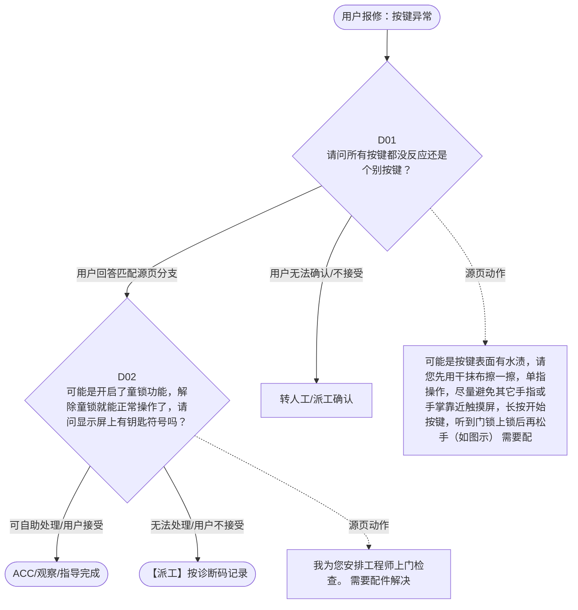

# BSH 洗衣机、洗干一体机 — 按键异常 诊断手册

**故障编号**：F13 | **节点前缀**：BT2 | **来源**：PPT Slide 16
**适用诊断码**：`1500H8000000` / `160100X13000` / `17E000000Y31` / `17F000000000`
**转换状态**：自动批处理草案，需按源 PPT 视觉关系复核后生产使用

---

## 一、文档使用说明

### 三条执行铁律

1. **不越界**：只执行本文件定义的诊断步骤；遇到超出范围的问题，执行越界协议（见第三节），不得自行延伸
2. **不编造**：话术原文不得改写、补充或省略；不在本文件中的诊断码不得使用
3. **不跳步**：严格按 D 步骤顺序执行，不得跳过中间步骤直接给出结论

### 执行约定标记表

| 标记 | 含义 |
|------|------|
| `【话术】` | 逐字朗读给用户的诊断引导话术 |
| `【判断】` | 根据用户回答或系统数据触发的条件分支 |
| `【诊断码】` | BSH 标准诊断码 |
| `【派工】` | 安排工程师上门 |
| `【配件】` | 预判所需配件 |
| `【视频】` | 视频辅助标记 |
| `【引用】` | 跨故障树引用跳转 |
| `【解释】` | 向用户解释原理/现象 |
| `【操作指导】` | 指导用户自行操作 |
| `▶` | 无条件进入下一步 |

---

## 二、故障诊断导航树

### Mermaid 源码



### 诊断步骤 ↔ 节点速查表

| 步骤 | 节点 ID | 节点类型 | 简述 |
| --- | --- | --- | --- |
| 入口 | BT2_START | 起始 | 用户报修：按键异常 |
| D01 | BT2_D01 | 判断 | BT2_D02 / BT2_MANUAL01 |
| D02 | BT2_D02 | 判断 | BT2_ACC / BT2_DISPATCH |
| 结束-ACC | BT2_ACC | 结束 | 用户接受/观察/指导完成 |
| 结束-派工 | BT2_DISPATCH | 派工 | 无法处理或用户不接受 |

---

## 三、越界处理协议

### 触发条件（满足以下任意一条即触发越界）

| # | 触发场景 |
|---|---------|
| 1 | 用户故障描述无法映射到当前诊断树的任何入口分支 |
| 2 | 用户回答无法映射到当前 D 步骤的任何条件行 |
| 3 | 目标跳转节点在 Mermaid 图中无有效连线或仍需视觉确认 |
| 4 | 用户要求提供本文档未包含的信息，如价格、保修政策、投诉升级 |
| 5 | 用户描述涉及焦味、冒烟、漏电、跳闸、进水等安全风险 |
| 6 | 用户要求自行拆机、维修、改线或更换内部零部件 |

### 退出动作

- 若属于其他故障树：执行 `【引用】` 跳转或回到索引重新分流
- 若无法定位：转人工客服
- 若存在安全风险：停止在线指导并安排工程师或人工处理

### 严禁行为

- 严禁自行判断主板、电源板、电机、压缩机等内部零部件级故障
- 严禁改写源 PPT 话术作为确定结论
- 严禁在用户尚未回答当前问题时跳至下一步

### 覆盖范围

本故障树仅覆盖 `按键异常` 相关诊断。其他故障现象应回到 `WD` 索引重新分流。

---

## 四、诊断入口

### 故障主诉确认

- 用户描述与 `按键异常` 相关。
- 命中索引关键词：按键异常, H8000, 按键不灵, 请问所有按键都没, 反应还是个别按键, 个别按键无反应。
- 来源页：Slide 16。

### 入口分支判断

```
用户报修“按键异常”
│
├── 主诉匹配当前树 → 进入 D01
├── 主诉属于其他故障 → 回到索引执行跨树引用
└── 主诉不明确 → 先追问具体显示/部位/现象
```

---

## 五、诊断步骤详情

### D01 — 请问所有按键都没反应还是个别按键？

**[节点：BT2_D01]**

**【话术】**：
> "请问所有按键都没反应还是个别按键？"

**判断表**：

| 条件 | 下一步 | 出口类型 | Mermaid 边验证 |
| --- | --- | --- | --- |
| 用户回答匹配源页下一分支 | D02 | 继续诊断 | BT2_D01 → D02（自动草案，待视觉确认） |
| 用户接受解释/操作/观察 | 结束 | ACC | BT2_D01 → ACC（待视觉确认） |
| 用户不接受 / 无法操作 / 风险场景 | 派工或转人工 | 派工 | BT2_D01 → DISPATCH（待视觉确认） |
| **兜底越界**：其他无法识别的输入 | 越界协议 | 越界 | 无对应 Mermaid 边 |


### D02 — 可能是开启了童锁功能，解除童锁就能正常操作了，请问显示屏上有钥匙

**[节点：BT2_D02]**

**【话术】**：
> "可能是开启了童锁功能，解除童锁就能正常操作了，请问显示屏上有钥匙符号吗？"

**判断表**：

| 条件 | 下一步 | 出口类型 | Mermaid 边验证 |
| --- | --- | --- | --- |
| 用户回答匹配源页下一分支 | ACC / 派工 | 继续诊断 | BT2_D02 → ACC / 派工（自动草案，待视觉确认） |
| 用户接受解释/操作/观察 | 结束 | ACC | BT2_D02 → ACC（待视觉确认） |
| 用户不接受 / 无法操作 / 风险场景 | 派工或转人工 | 派工 | BT2_D02 → DISPATCH（待视觉确认） |
| **兜底越界**：其他无法识别的输入 | 越界协议 | 越界 | 无对应 Mermaid 边 |


### 源页动作/结果摘录

- 可能是按键表面有水渍，请您先用干抹布擦一擦，单指操作，尽量避免其它手指或手掌靠近触摸屏，长按开始按键，听到门锁上锁后再松手（如图示） 需要配件解决
- 我为您安排工程师上门检查。 需要配件解决
- 我为您安排工程师上门维修。 需要配件解决
- 提醒：无法解除童锁或无法提供型号请告知：解锁方法很简单，我们在网上有指导解锁的视频，您关注微信公众号，输入“解除童锁”就能看到。

---

## 附录 A：诊断码汇总表

| 诊断码 | 描述 | 触发步骤 | 备注 |
| --- | --- | --- | --- |
| `1500H8000000` | 见源 PPT 相邻文本 | 源页派工/判断节点 | 自动抽取，待人工核对英文/中文描述 |
| `160100X13000` | 见源 PPT 相邻文本 | 源页派工/判断节点 | 自动抽取，待人工核对英文/中文描述 |
| `17E000000Y31` | 见源 PPT 相邻文本 | 源页派工/判断节点 | 自动抽取，待人工核对英文/中文描述 |
| `17F000000000` | 见源 PPT 相邻文本 | 源页派工/判断节点 | 自动抽取，待人工核对英文/中文描述 |

---

## 附录 B：配件建议汇总表

| 配件名称 | 关联步骤 | 说明 |
| --- | --- | --- |
| 待工程师上门判断 | 派工出口 | 按源 PPT 派工节点记录，待视觉确认 |

---

## 附录 C：跨故障树引用清单

| 引用方向 | 触发条件 | 目标文件 | 目标诊断码 |
| --- | --- | --- | --- |
| 无明确跨树引用 | — | — | — |

---

## 附录 D：源页文本摘录（用于复核）

- 按键异常
- 1500H8000000-Operation problem: sensitivity of button / sensor ，按键不灵
- 请问所有按键都没反应还是个别按键？
- 1 、个别按键无反应 2 、有时有反应，有时没反应
- 所有按键无反应
- 不能复位 / 卡住 / 损坏
- 可能是开启了童锁功能，解除童锁就能正常操作了，请问显示屏上有钥匙符号吗？
- 可能是按键表面有水渍，请您先用干抹布擦一擦，单指操作，尽量避免其它手指或手掌靠近触摸屏，长按开始按键，听到门锁上锁后再松手（如图示） 需要配件解决
- 我为您安排工程师上门检查。 需要配件解决
- 160100X13000-Mechanical damage, button ，按键结构损坏
- 没有钥匙符号
- 有钥匙符号
- 我为您安排工程师上门维修。 需要配件解决
- 请您提供机器型号，我可以在线指导解锁。您也可以参考说明书进行解锁。
- 17E000000Y31- Error: “Childproof lock” symbol ，显示童锁符号
- 17F000000000 No button function ，按键失效
- 操作：参考洗衣机童锁及控制面板汇总
- 提醒：无法解除童锁或无法提供型号请告知：解锁方法很简单，我们在网上有指导解锁的视频，您关注微信公众号，输入“解除童锁”就能看到。
- 返回目录
