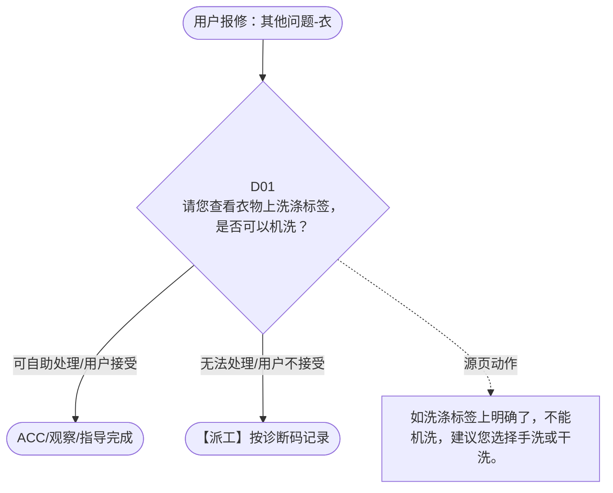

# BSH 洗衣机、洗干一体机 — 其他问题-衣 诊断手册

**故障编号**：F19 | **节点前缀**：FX2 | **来源**：PPT Slide 23
**适用诊断码**：`A3D000000000`
**转换状态**：自动批处理草案，需按源 PPT 视觉关系复核后生产使用

---

## 一、文档使用说明

### 三条执行铁律

1. **不越界**：只执行本文件定义的诊断步骤；遇到超出范围的问题，执行越界协议（见第三节），不得自行延伸
2. **不编造**：话术原文不得改写、补充或省略；不在本文件中的诊断码不得使用
3. **不跳步**：严格按 D 步骤顺序执行，不得跳过中间步骤直接给出结论

### 执行约定标记表

| 标记 | 含义 |
|------|------|
| `【话术】` | 逐字朗读给用户的诊断引导话术 |
| `【判断】` | 根据用户回答或系统数据触发的条件分支 |
| `【诊断码】` | BSH 标准诊断码 |
| `【派工】` | 安排工程师上门 |
| `【配件】` | 预判所需配件 |
| `【视频】` | 视频辅助标记 |
| `【引用】` | 跨故障树引用跳转 |
| `【解释】` | 向用户解释原理/现象 |
| `【操作指导】` | 指导用户自行操作 |
| `▶` | 无条件进入下一步 |

---

## 二、故障诊断导航树

### Mermaid 源码



### 诊断步骤 ↔ 节点速查表

| 步骤 | 节点 ID | 节点类型 | 简述 |
| --- | --- | --- | --- |
| 入口 | FX2_START | 起始 | 用户报修：其他问题-衣 |
| D01 | FX2_D01 | 判断 | FX2_ACC / FX2_DISPATCH |
| 结束-ACC | FX2_ACC | 结束 | 用户接受/观察/指导完成 |
| 结束-派工 | FX2_DISPATCH | 派工 | 无法处理或用户不接受 |

---

## 三、越界处理协议

### 触发条件（满足以下任意一条即触发越界）

| # | 触发场景 |
|---|---------|
| 1 | 用户故障描述无法映射到当前诊断树的任何入口分支 |
| 2 | 用户回答无法映射到当前 D 步骤的任何条件行 |
| 3 | 目标跳转节点在 Mermaid 图中无有效连线或仍需视觉确认 |
| 4 | 用户要求提供本文档未包含的信息，如价格、保修政策、投诉升级 |
| 5 | 用户描述涉及焦味、冒烟、漏电、跳闸、进水等安全风险 |
| 6 | 用户要求自行拆机、维修、改线或更换内部零部件 |

### 退出动作

- 若属于其他故障树：执行 `【引用】` 跳转或回到索引重新分流
- 若无法定位：转人工客服
- 若存在安全风险：停止在线指导并安排工程师或人工处理

### 严禁行为

- 严禁自行判断主板、电源板、电机、压缩机等内部零部件级故障
- 严禁改写源 PPT 话术作为确定结论
- 严禁在用户尚未回答当前问题时跳至下一步

### 覆盖范围

本故障树仅覆盖 `其他问题-衣` 相关诊断。其他故障现象应回到 `WD` 索引重新分流。

---

## 四、诊断入口

### 故障主诉确认

- 用户描述与 `其他问题-衣` 相关。
- 命中索引关键词：其他问题-衣, 其他问题, 衣物变形, A3, D0000, 衣物损坏。
- 来源页：Slide 23。

### 入口分支判断

```
用户报修“其他问题-衣”
│
├── 主诉匹配当前树 → 进入 D01
├── 主诉属于其他故障 → 回到索引执行跨树引用
└── 主诉不明确 → 先追问具体显示/部位/现象
```

---

## 五、诊断步骤详情

### D01 — 请您查看衣物上洗涤标签，是否可以机洗？

**[节点：FX2_D01]**

**【话术】**：
> "请您查看衣物上洗涤标签，是否可以机洗？"

**判断表**：

| 条件 | 下一步 | 出口类型 | Mermaid 边验证 |
| --- | --- | --- | --- |
| 用户回答匹配源页下一分支 | ACC / 派工 | 继续诊断 | FX2_D01 → ACC / 派工（自动草案，待视觉确认） |
| 用户接受解释/操作/观察 | 结束 | ACC | FX2_D01 → ACC（待视觉确认） |
| 用户不接受 / 无法操作 / 风险场景 | 派工或转人工 | 派工 | FX2_D01 → DISPATCH（待视觉确认） |
| **兜底越界**：其他无法识别的输入 | 越界协议 | 越界 | 无对应 Mermaid 边 |


### 源页动作/结果摘录

- 如洗涤标签上明确了，不能机洗，建议您选择手洗或干洗。
- 建议您严格按照衣物的洗涤标签，选择对应的洗涤程序、温度、脱水转速，否则容易导致衣物变形。 提醒： 一般衣物标签上都会标识适宜机洗的温度。

---

## 附录 A：诊断码汇总表

| 诊断码 | 描述 | 触发步骤 | 备注 |
| --- | --- | --- | --- |
| `A3D000000000` | 见源 PPT 相邻文本 | 源页派工/判断节点 | 自动抽取，待人工核对英文/中文描述 |

---

## 附录 B：配件建议汇总表

| 配件名称 | 关联步骤 | 说明 |
| --- | --- | --- |
| 源页未明确 | 派工出口 | 按源 PPT 派工节点记录，待视觉确认 |

---

## 附录 C：跨故障树引用清单

| 引用方向 | 触发条件 | 目标文件 | 目标诊断码 |
| --- | --- | --- | --- |
| 无明确跨树引用 | — | — | — |

---

## 附录 D：源页文本摘录（用于复核）

- 其他问题-衣物变形
- A3D000000000-Washing damaged ，衣物损坏
- 请您查看衣物上洗涤标签，是否可以机洗？
- 不清楚
- 衣物不能机洗
- 衣物适合机洗
- 如洗涤标签上明确了，不能机洗，建议您选择手洗或干洗。
- 一般衣物上都带有洗涤标签，您可以看一下对应的洗涤说明。
- 建议您严格按照衣物的洗涤标签，选择对应的洗涤程序、温度、脱水转速，否则容易导致衣物变形。 提醒： 一般衣物标签上都会标识适宜机洗的温度。
- 提醒：如用户抱怨较大或要求赔偿，应按紧急投诉流程操作生成投诉。
- 返回目录
