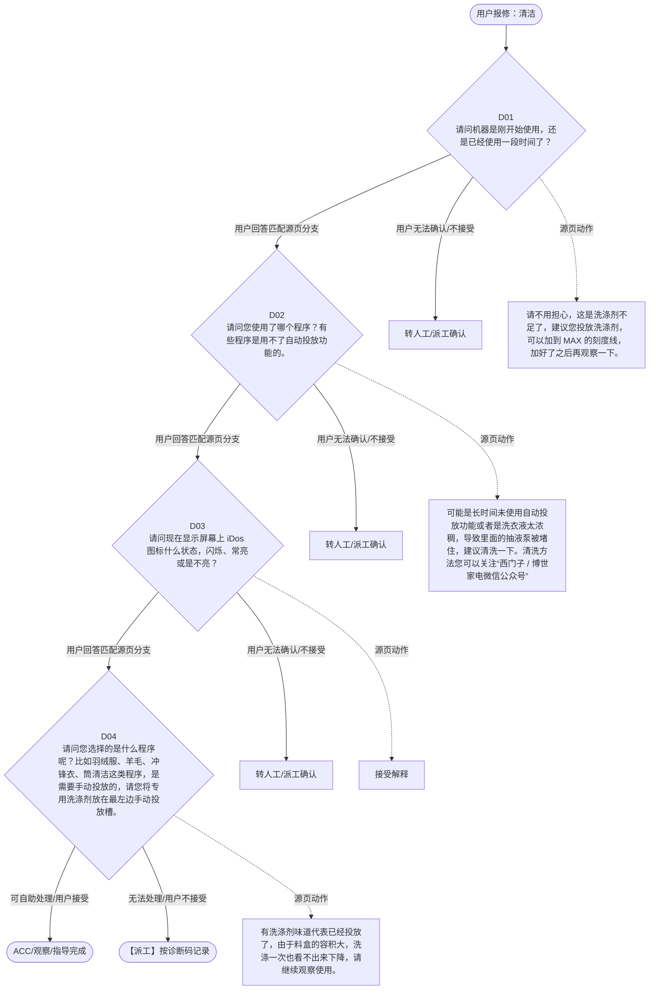

# BSH 洗衣机、洗干一体机 — 清洁 诊断手册

**故障编号**：F25 | **节点前缀**：CL3 | **来源**：PPT Slide 30
**适用诊断码**：`A2C300000000`
**转换状态**：自动批处理草案，需按源 PPT 视觉关系复核后生产使用

---

## 一、文档使用说明

### 三条执行铁律

1. **不越界**：只执行本文件定义的诊断步骤；遇到超出范围的问题，执行越界协议（见第三节），不得自行延伸
2. **不编造**：话术原文不得改写、补充或省略；不在本文件中的诊断码不得使用
3. **不跳步**：严格按 D 步骤顺序执行，不得跳过中间步骤直接给出结论

### 执行约定标记表

| 标记 | 含义 |
|------|------|
| `【话术】` | 逐字朗读给用户的诊断引导话术 |
| `【判断】` | 根据用户回答或系统数据触发的条件分支 |
| `【诊断码】` | BSH 标准诊断码 |
| `【派工】` | 安排工程师上门 |
| `【配件】` | 预判所需配件 |
| `【视频】` | 视频辅助标记 |
| `【引用】` | 跨故障树引用跳转 |
| `【解释】` | 向用户解释原理/现象 |
| `【操作指导】` | 指导用户自行操作 |
| `▶` | 无条件进入下一步 |

---

## 二、故障诊断导航树

### Mermaid 源码



### 诊断步骤 ↔ 节点速查表

| 步骤 | 节点 ID | 节点类型 | 简述 |
| --- | --- | --- | --- |
| 入口 | CL3_START | 起始 | 用户报修：清洁 |
| D01 | CL3_D01 | 判断 | CL3_D02 / CL3_MANUAL01 |
| D02 | CL3_D02 | 判断 | CL3_D03 / CL3_MANUAL02 |
| D03 | CL3_D03 | 判断 | CL3_D04 / CL3_MANUAL03 |
| D04 | CL3_D04 | 判断 | CL3_ACC / CL3_DISPATCH |
| 结束-ACC | CL3_ACC | 结束 | 用户接受/观察/指导完成 |
| 结束-派工 | CL3_DISPATCH | 派工 | 无法处理或用户不接受 |

---

## 三、越界处理协议

### 触发条件（满足以下任意一条即触发越界）

| # | 触发场景 |
|---|---------|
| 1 | 用户故障描述无法映射到当前诊断树的任何入口分支 |
| 2 | 用户回答无法映射到当前 D 步骤的任何条件行 |
| 3 | 目标跳转节点在 Mermaid 图中无有效连线或仍需视觉确认 |
| 4 | 用户要求提供本文档未包含的信息，如价格、保修政策、投诉升级 |
| 5 | 用户描述涉及焦味、冒烟、漏电、跳闸、进水等安全风险 |
| 6 | 用户要求自行拆机、维修、改线或更换内部零部件 |

### 退出动作

- 若属于其他故障树：执行 `【引用】` 跳转或回到索引重新分流
- 若无法定位：转人工客服
- 若存在安全风险：停止在线指导并安排工程师或人工处理

### 严禁行为

- 严禁自行判断主板、电源板、电机、压缩机等内部零部件级故障
- 严禁改写源 PPT 话术作为确定结论
- 严禁在用户尚未回答当前问题时跳至下一步

### 覆盖范围

本故障树仅覆盖 `清洁` 相关诊断。其他故障现象应回到 `WD` 索引重新分流。

---

## 四、诊断入口

### 故障主诉确认

- 用户描述与 `清洁` 相关。
- 命中索引关键词：清洁, 其他问题, 不能自动投放, A2, C3000, 洗涤剂投放问题。
- 来源页：Slide 30。

### 入口分支判断

```
用户报修“清洁”
│
├── 主诉匹配当前树 → 进入 D01
├── 主诉属于其他故障 → 回到索引执行跨树引用
└── 主诉不明确 → 先追问具体显示/部位/现象
```

---

## 五、诊断步骤详情

### D01 — 请问机器是刚开始使用，还是已经使用一段时间了？

**[节点：CL3_D01]**

**【话术】**：
> "请问机器是刚开始使用，还是已经使用一段时间了？"

**判断表**：

| 条件 | 下一步 | 出口类型 | Mermaid 边验证 |
| --- | --- | --- | --- |
| 用户回答匹配源页下一分支 | D02 | 继续诊断 | CL3_D01 → D02（自动草案，待视觉确认） |
| 用户接受解释/操作/观察 | 结束 | ACC | CL3_D01 → ACC（待视觉确认） |
| 用户不接受 / 无法操作 / 风险场景 | 派工或转人工 | 派工 | CL3_D01 → DISPATCH（待视觉确认） |
| **兜底越界**：其他无法识别的输入 | 越界协议 | 越界 | 无对应 Mermaid 边 |


### D02 — 请问您使用了哪个程序？有些程序是用不了自动投放功能的。

**[节点：CL3_D02]**

**【话术】**：
> "请问您使用了哪个程序？有些程序是用不了自动投放功能的。"

**判断表**：

| 条件 | 下一步 | 出口类型 | Mermaid 边验证 |
| --- | --- | --- | --- |
| 用户回答匹配源页下一分支 | D03 | 继续诊断 | CL3_D02 → D03（自动草案，待视觉确认） |
| 用户接受解释/操作/观察 | 结束 | ACC | CL3_D02 → ACC（待视觉确认） |
| 用户不接受 / 无法操作 / 风险场景 | 派工或转人工 | 派工 | CL3_D02 → DISPATCH（待视觉确认） |
| **兜底越界**：其他无法识别的输入 | 越界协议 | 越界 | 无对应 Mermaid 边 |


### D03 — 请问现在显示屏幕上 iDos 图标什么状态，闪烁、常亮或是不亮？

**[节点：CL3_D03]**

**【话术】**：
> "请问现在显示屏幕上 iDos 图标什么状态，闪烁、常亮或是不亮？"

**判断表**：

| 条件 | 下一步 | 出口类型 | Mermaid 边验证 |
| --- | --- | --- | --- |
| 用户回答匹配源页下一分支 | D04 | 继续诊断 | CL3_D03 → D04（自动草案，待视觉确认） |
| 用户接受解释/操作/观察 | 结束 | ACC | CL3_D03 → ACC（待视觉确认） |
| 用户不接受 / 无法操作 / 风险场景 | 派工或转人工 | 派工 | CL3_D03 → DISPATCH（待视觉确认） |
| **兜底越界**：其他无法识别的输入 | 越界协议 | 越界 | 无对应 Mermaid 边 |


### D04 — 请问您选择的是什么程序呢？比如羽绒服、羊毛、冲锋衣、筒清洁这类程

**[节点：CL3_D04]**

**【话术】**：
> "请问您选择的是什么程序呢？比如羽绒服、羊毛、冲锋衣、筒清洁这类程序，是需要手动投放的，请您将专用洗涤剂放在最左边手动投放槽。"

**判断表**：

| 条件 | 下一步 | 出口类型 | Mermaid 边验证 |
| --- | --- | --- | --- |
| 用户回答匹配源页下一分支 | ACC / 派工 | 继续诊断 | CL3_D04 → ACC / 派工（自动草案，待视觉确认） |
| 用户接受解释/操作/观察 | 结束 | ACC | CL3_D04 → ACC（待视觉确认） |
| 用户不接受 / 无法操作 / 风险场景 | 派工或转人工 | 派工 | CL3_D04 → DISPATCH（待视觉确认） |
| **兜底越界**：其他无法识别的输入 | 越界协议 | 越界 | 无对应 Mermaid 边 |


### 源页动作/结果摘录

- 请不用担心，这是洗涤剂不足了，建议您投放洗涤剂，可以加到 MAX 的刻度线，加好了之后再观察一下。
- 可能是长时间未使用自动投放功能或者是洗衣液太浓稠，导致里面的抽液泵被堵住，建议清洗一下。清洗方法您可以关注“西门子 / 博世家电微信公众号”输入“洗衣机清洁”查看，配有详细图文。
- 接受解释
- 有洗涤剂味道代表已经投放了，由于料盒的容积大，洗涤一次也看不出来下降，请继续观察使用。
- 我为您安排工程师上门检查。

---

## 附录 A：诊断码汇总表

| 诊断码 | 描述 | 触发步骤 | 备注 |
| --- | --- | --- | --- |
| `A2C300000000` | 见源 PPT 相邻文本 | 源页派工/判断节点 | 自动抽取，待人工核对英文/中文描述 |

---

## 附录 B：配件建议汇总表

| 配件名称 | 关联步骤 | 说明 |
| --- | --- | --- |
| 源页未明确 | 派工出口 | 按源 PPT 派工节点记录，待视觉确认 |

---

## 附录 C：跨故障树引用清单

| 引用方向 | 触发条件 | 目标文件 | 目标诊断码 |
| --- | --- | --- | --- |
| 无明确跨树引用 | — | — | — |

---

## 附录 D：源页文本摘录（用于复核）

- 其他问题-iDos不能自动投放
- A2C300000000 -Detergent /softener /rinse aid dispenser problem ，洗涤剂投放问题
- 请问机器是刚开始使用，还是已经使用一段时间了？
- 刚开始使用
- 使用一段时间
- 请问您使用了哪个程序？有些程序是用不了自动投放功能的。
- 请问现在显示屏幕上 iDos 图标什么状态，闪烁、常亮或是不亮？
- 空气洗类 / 清新类 / 微蒸护理 / 热风净衣 / 干衣除菌烘 / 蚕丝被精烘
- 羊毛 / 羽绒服 / 冲锋衣 / 运动装 / 内衣 / 单漂洗 / 筒清洁 / 筒洗烘
- 其他程序
- 闪烁
- 长亮
- 不亮
- 这个程序不能使用自动投放功能，因为会使用到专用洗涤剂（比如羊毛护理剂），您直接放在料盒左侧的手动添加槽里。
- 这个程序不是洗涤程序，主要是利用湿热空气除菌去味，无需投放洗涤产品。
- 请不用担心，这是洗涤剂不足了，建议您投放洗涤剂，可以加到 MAX 的刻度线，加好了之后再观察一下。
- 请问您选择的是什么程序呢？比如羽绒服、羊毛、冲锋衣、筒清洁这类程序，是需要手动投放的，请您将专用洗涤剂放在最左边手动投放槽。
- 这个程序是可以使用自动投放功能的，您可以闻下刚刚洗好的衣物有没有洗涤剂味道。
- 可能是长时间未使用自动投放功能或者是洗衣液太浓稠，导致里面的抽液泵被堵住，建议清洗一下。清洗方法您可以关注“西门子 / 博世家电微信公众号”输入“洗衣机清洁”查看，配有详细图文。
- 有
- 没有
- 接受解释
- 非以上程序
- 有洗涤剂味道代表已经投放了，由于料盒的容积大，洗涤一次也看不出来下降，请继续观察使用。
- 我为您安排工程师上门检查。
- 您可以检查一下是否关闭了自动投放功能。比如按一下 i -dos 对应的图标，看一下图标能不能点亮 （部分机型请参考说明书设置）
- 好的
- 相关 Wiki 链接： 智能添加系统（ i -Dos） 的清洁
- 返回目录
- NEW ：*** - 洗衣液不自动投放
